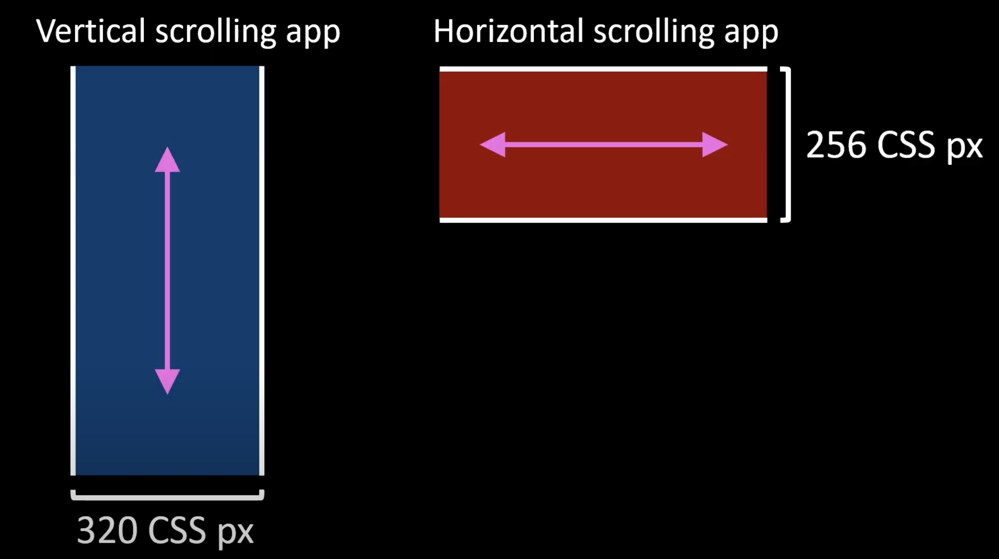

It's essential to know the key principles and requirements that ensure digital products are accessible to all users, including those with disabilities. The Web Content Accessibility Guidelines (WCAGs) provide a comprehensive framework for creating accessible web content and user interface (UI) components. This section will outline their primary accessibility principles and requirements related to resize and reflow.

## Overview of Accessibility Guidelines

The WCAG standards provide specific guidelines to ensure websites and apps are [adaptable (Guideline 1.3)](https://www.w3.org/WAI/WCAG21/Understanding/adaptable), [distinguishable (Guideline 1.4)](https://www.w3.org/WAI/WCAG21/Understanding/distinguishable), [navigable (Guideline 2.4)](https://www.w3.org/WAI/WCAG21/Understanding/navigable), and [compatible (Guideline 4.1)](https://www.w3.org/WAI/WCAG21/Understanding/compatible). These success criteria focus on making web content and apps easier to navigate, predictable and consistent for users, and compatible with assistive technologies. To meet these guidelines, designers and developers should take into consideration the following:

### [Adaptable](https://www.w3.org/WAI/WCAG21/Understanding/adaptable)

This guideline focuses on ensuring that information is structured in a way that allows it to be presented in different formats without losing meaning or functionality. It requires ensuring that content remains accessible when users change the size of text or the layout adapts to different screen sizes and orientations ([SC 1.3.4](https://www.w3.org/WAI/WCAG21/Understanding/orientation)). It also requires presenting content in a meaningful order that preserves the intended meaning and relationships ([SC 1.3.1](https://www.w3.org/WAI/WCAG21/Understanding/info-and-relationships)) when the presentation format changes. Additionally, reading and navigation order of content should remain logical and meaningful ([SC 1.3.2](https://www.w3.org/WAI/WCAG21/Understanding/meaningful-sequence)), regardless of layout changes due to resize or reflow.

### [Distinguishable](https://www.w3.org/WAI/WCAG21/Understanding/distinguishable)

This guideline focuses on making content perceivable by ensuring that it's distinguishable and accessible to all users. It includes several key requirements, such as ensuring that:

- Text can be resized up to 200% without loss of content or functionality ([SC 1.4.4](https://www.w3.org/WAI/WCAG21/Understanding/resize-text)).
- Text can be resized up to 200% without assistive technology, allowing users to read a full line of text on a full-screen window without needing to scroll horizontally ([SC 1.4.8](https://www.w3.org/WAI/WCAG21/Understanding/visual-presentation)).
- Text is presented as actual text rather than images of text, allowing for resizing and styling without loss of clarity ([SC 1.4.5](https://www.w3.org/WAI/WCAG21/Understanding/images-of-text)). When text is in an image, its size, spacing, and color can't be adjusted, nor can it be read aloud or reflowed.
- Content can reflow within a viewport when zoomed up to 400% without loss of information or functionality and without the need for horizontal scrolling ([SC 1.4.10](https://www.w3.org/WAI/WCAG21/Understanding/reflow)). Vertically scrolling apps must reflow down to a width of **320 CSS pixels**, which is the size of the content before zoom is applied. Similarly, horizontally scrolling apps must reflow down to a height of **256 CSS pixels**. When testing reflow, we often apply both the **320 CSS pixel wide** and the **256 CSS pixel high** criteria.
    >[!div class="mx-imgBorder"]
    >
- Users can adjust text spacing, line height, and letter spacing, which helps maintain readability when text is resized ([SC 1.4.8](https://www.w3.org/WAI/WCAG21/Understanding/visual-presentation); see examples). The image displays examples of a paragraph with single-spacing, one-and-a-half spacing, and double-spacin  g.
- Users can modify the spacing between letters, words, and lines without losing content or functionality ([SC 1.4.12](https://www.w3.org/WAI/WCAG21/Understanding/text-spacing)). Horizontally truncated text, vertically truncated text, and overlapping text are all examples of failures to meet this criterion.
- Content that appears on hover or focus remains accessible when the content is resized or reflowed ([SC 1.4.13](https://www.w3.org/WAI/WCAG21/Understanding/content-on-hover-or-focus)).

### [Navigable](https://www.w3.org/WAI/WCAG21/Understanding/navigable)

This guideline focuses on providing clear navigation mechanisms in websites and apps. It includes several key requirements:

- Provide a way for users to skip repetitive content and go directly to the main content of the page. As content reflows to smaller viewports or after zooming, users should still be able to bypass blocks efficiently without being forced to scroll unnecessarily through repeated sections ([SC 2.4.1](https://www.w3.org/WAI/WCAG21/Understanding/bypass-blocks)).
- Ensure that pages have descriptive and informative titles that help users understand the topic or purpose of the page. When the page content resizes or reflows, this title remains essential for users to understand the page’s purpose. Users relying on zoom or a reflowed layout need to quickly identify the page even as the visual design changes ([SC 2.4.2](https://www.w3.org/WAI/WCAG21/Understanding/page-titled)).
- Ensure that the purpose of each link is clear from the link text alone or from the link text together with its surrounding context. When content is resized and reflowed, it's essential to make sure the text stays readable and links remain easily recognizable without being cut off or visually altered ([SC 2.4.4](https://www.w3.org/WAI/WCAG21/Understanding/link-purpose-in-context), [SC 2.4.9](https://www.w3.org/WAI/WCAG21/Understanding/link-purpose-link-only)).
- Provide multiple ways for users to locate a page within a set of pages, such as a search function, site map, or table of contents. When resizing and reflowing content, it's essential to ensure that these alternative navigation options stay accessible and functional, even as the content adjusts to smaller screens or increased zoom levels ([SC 2.4.5](https://www.w3.org/WAI/WCAG21/Understanding/multiple-ways)).
- Use clear and descriptive headings and labels to help users understand the structure and purpose of the content. As text is resized or reflowed, headings and labels should remain clear and maintain their hierarchy to help users navigate the content easily. If headings become distorted, misaligned, or visually obscure during reflow, it can confuse users and disrupt navigation ([SC 2.4.6](https://www.w3.org/WAI/WCAG21/Understanding/headings-and-labels), [SC 2.4.10](https://www.w3.org/WAI/WCAG21/Understanding/section-headings)).
- Ensure that the keyboard focus indicator is visible so that users understand which element currently has focus, even when the layout shifts ([SC 2.4.7](https://www.w3.org/WAI/WCAG21/Understanding/focus-visible)).
- Ensure that the navigation order of interactive elements is logical and intuitive.

### [Compatible](https://www.w3.org/WAI/WCAG21/Understanding/compatible)

This guideline aims to maximize compatibility with both current and future user agents, including assistive technologies. It states that content created using markup languages must have elements with complete start and end tags, properly nested elements, no duplicate attributes, and unique IDs. This guarantees that user agents can accurately interpret and parse the content. Additionally, all user interface components must have names and roles that can be programmatically determined, and any states, properties, or values that users can modify must also be programmatically adjustable.

Any changes to states, properties, or values must be communicated to user agents, allowing assistive technologies to interact with and provide information about these components. Finally, this guideline mandates that status messages be programmatically determined through roles or properties so that they can be presented to the user by assistive technologies without receiving focus. This ensures that users who rely on screen readers or other assistive technologies are informed of important changes in content without disrupting them.
