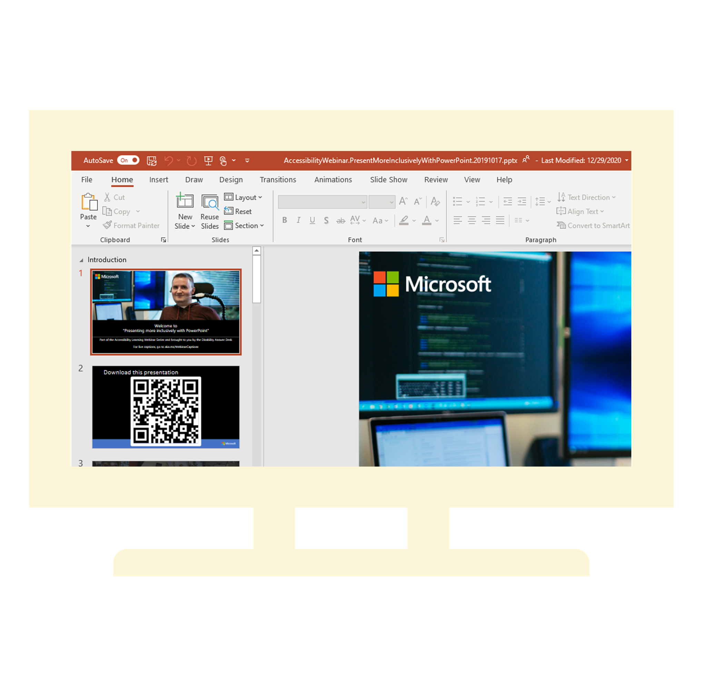
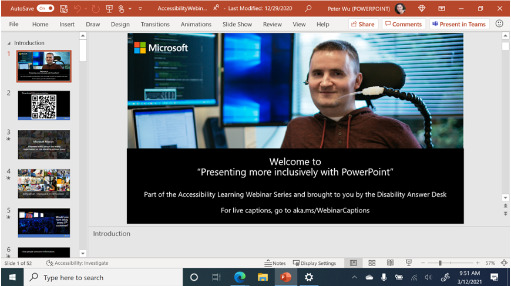
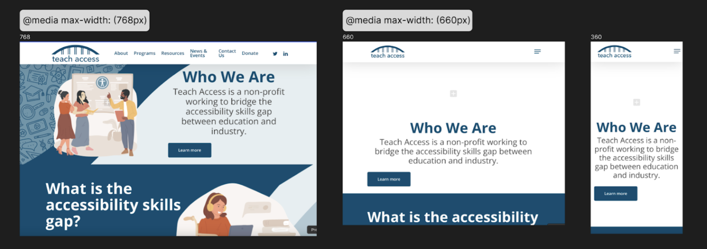

Considering accessibility throughout the product development cycle is crucial because it ensures that inclusivity is integrated into every stage of design and development. By addressing accessibility from the beginning, you can identify and resolve potential barriers early, creating a more seamless and user-friendly experience for all users, including those with disabilities. This proactive approach not only enhances usability but also helps meet legal and ethical standards, ultimately leading to a more equitable digital landscape. By the end of this unit, you will be equipped with the knowledge to navigate the product development process effectively, ensuring that your designs are innovative and accessible.

## Approaches to Enlarging the Screen

There are two main methods to enlarge the screen, each with its own set of advantages and disadvantages. The first approach **optically enlarges** the content while keeping the same resolution, allowing for high zoom factors but requiring panning in two dimensions. This approach doesn’t require design changes but can result in pixelation and blurriness. The second approach changes the **system's scale settings** and reduces the effective resolution, allowing the app to adapt and enabling users to scroll in one direction. Optical enlargement, such as using magnifying glasses, is a simple solution but may not be practical for all users. System scale settings, which are available on platforms like Windows, Mac, iOS, and Android, offer more integrated solutions. These settings allow users to adjust the size of text and other elements, making them easier to see and interact with. This approach requires design adaptation but provides a sharper and more efficient user experience. We’ll explore these approaches in detail, comparing their pros and cons across different platforms. Supporting both methods ensures that your website or app is accessible and user-friendly for people with low vision. The following table summarizes the pros and cons of each approach:

| Optical Enlargement | System Scale Settings |
| --- | --- |
| Summary: Maintains same effective resolution  | Summary: Reduces effective resolution to fit the screen  |
| **Pros** ✓ <ul><li>Doesn’t require the app to change its design</li><li>Can zoom to very high factor</li></ul> | **Pros** ✓ <ul><li>User is more efficient scrolling in one dimension</li><li>Looks sharp</li></ul> |
| **Cons** X <ul><li>Requires user to pan in two dimensions</li><li>Looks pixelated or blurry</li></ul> | **Cons** X <ul><li>Requires the app to adapt its design to lower resolutions</li><li>Zoom factor is limited due to app layout</li></ul> |

Remember, these settings can be used together and are multiplicative. For example, setting 150% dots per inch (DPI) and 110% browser zoom results in a total scale factor of 165%. Windows text scaling and browser text scaling are also compounded with DPI and browser zoom, but only for certain elements.

## Break Point Designs for Reflow Support

Finally, we will add break point designs to ensure the design supports reflow, making sure the content and user interface adjust properly on different screen sizes and for users with varying needs.

### Reflow and Zoom

One of the most effective ways to assist users with low vision is by developing a responsive design with functional breakpoints across all devices. This involves creating style sets tailored to various viewport sizes and using media queries to apply the right styles to the corresponding device dimensions.

Firstly, when testing your design drawings, please reduce your artboard size to 320x256. Utilizing auto layout will be tremendously beneficial in this process. It's crucial to avoid using groups and unstructured frames, as they can complicate things. Additionally, consider implementing a responsive relay out if feasible. The translation between larger screens and this smaller size should be straightforward, without rearranging the order of elements or shifting them to the opposite side of the layout.
>[!div class="mx-imgBorder"]
>

### Other Annotations

- Indicate which areas are scrollable. For example, in a paragraph dialog, the entire body might be scrollable, including the title, to maximize vertical space for controls. Alternatively, the title could be outside the scrollable area, but this reduces vertical space for controls.
- Make sure to clearly state the app's minimum supported resolution and explain how scale settings affect it. Also, make sure your app reflows properly up to the stated minimum supported resolution.
