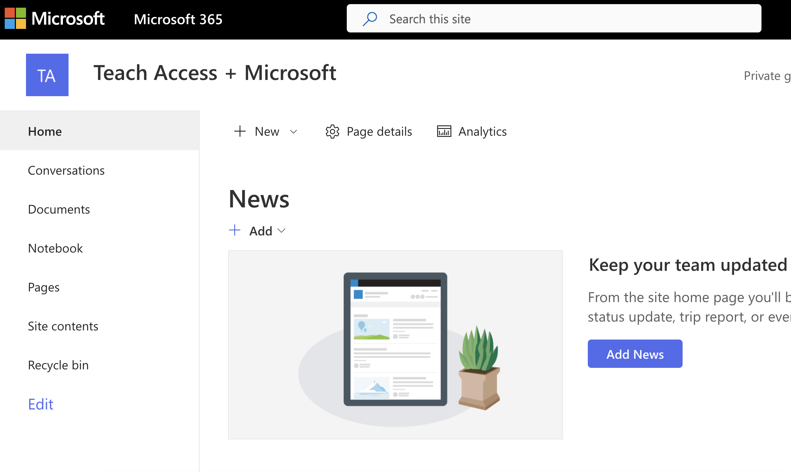
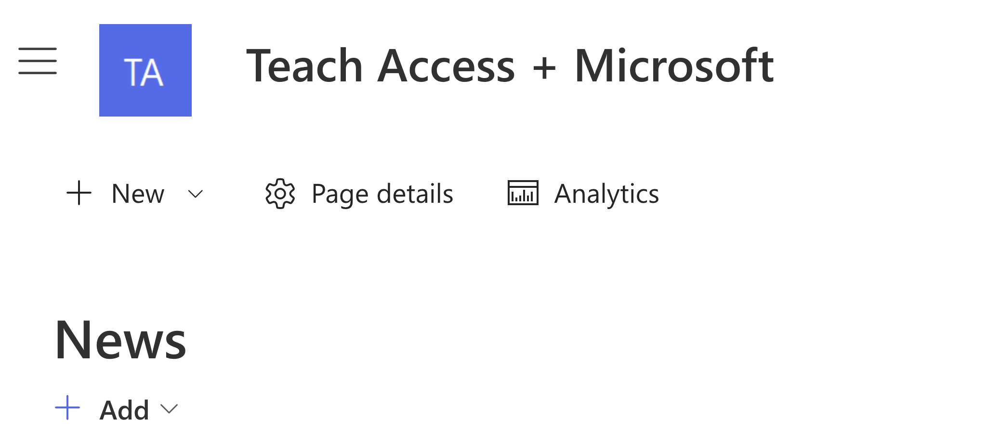
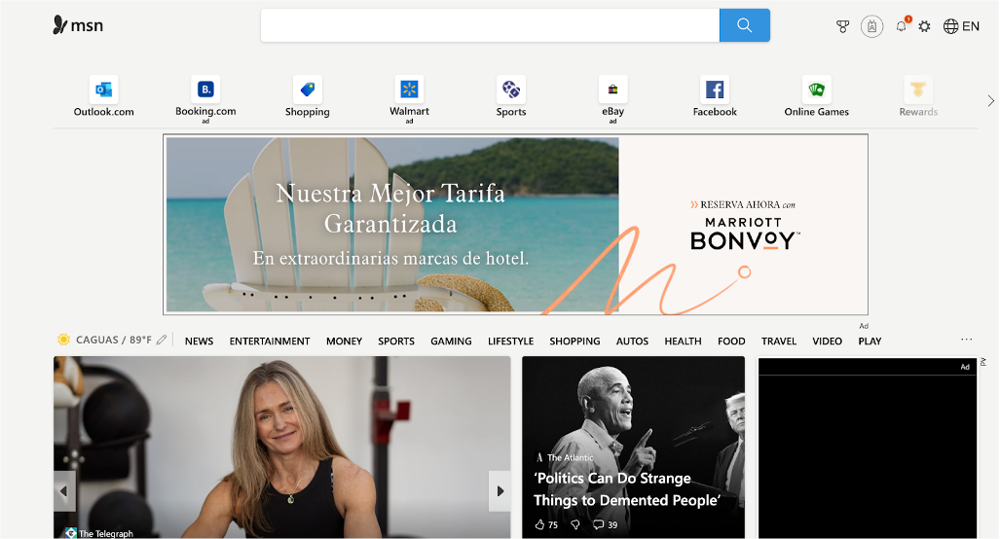
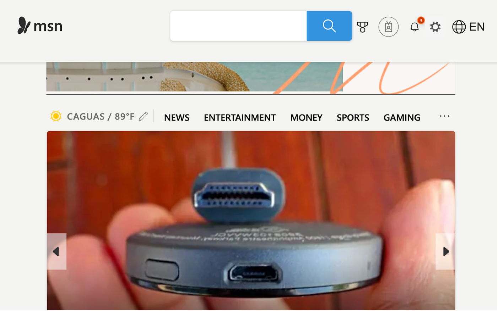
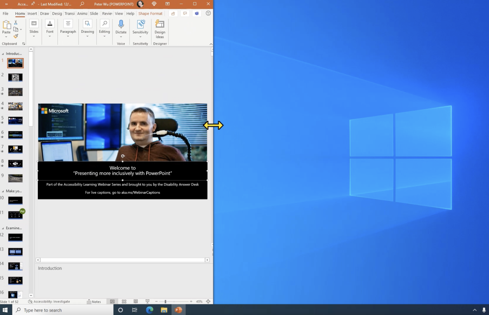
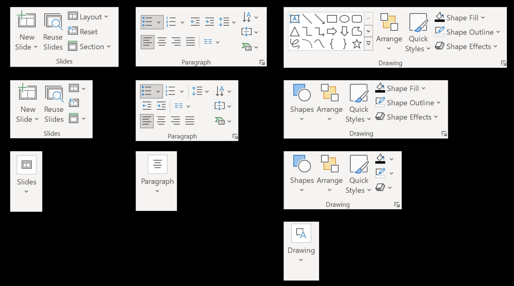
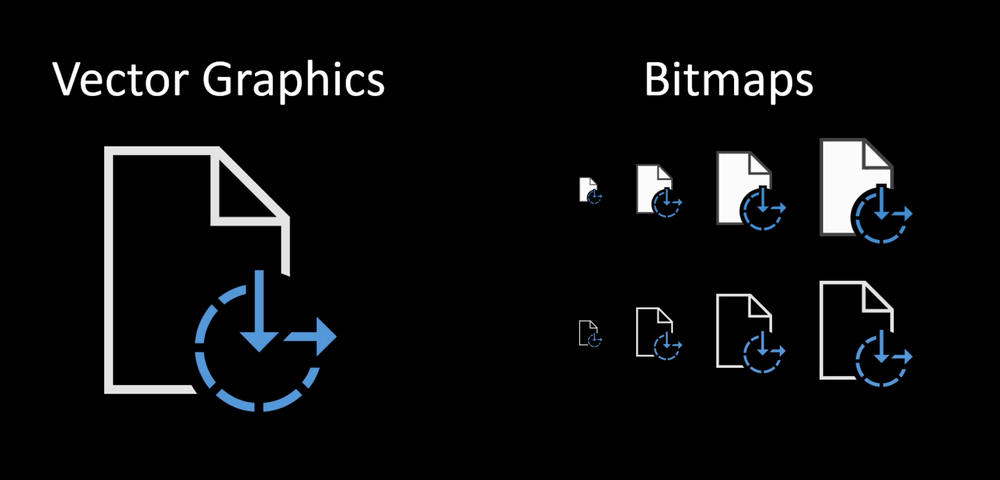
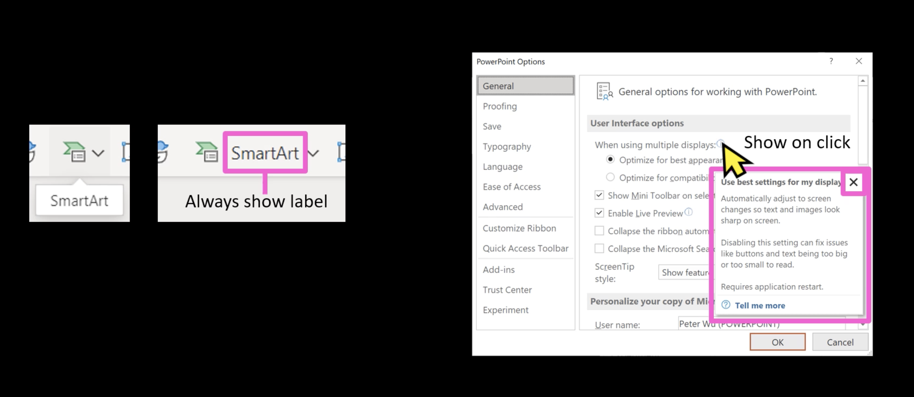

The same techniques that make a web page work on different-size screens also work for different scale settings. In this section, we discuss those techniques.

## Collapsing Non-important Elements

A common technique is to collapse less important elements. For example, on the SharePoint page, links to other pages are shown in the pane on the left, but as you zoom in and there is less available screen space, the pane collapses. You can still click the hamburger button to expand it.

>[!div class="mx-imgBorder"]
>

>[!div class="mx-imgBorder"]
>

## Multiple Columns

Another technique is to use multiple columns. Using multiple columns helps organize content effectively on wider screens. However, as the screen size or zoom level changes, the layout needs to adjust so that columns may combine into a single column to avoid horizontal scrolling. This ensures that users can still access the content easily, even on smaller screens or when zoomed in, without sacrificing readability or usability. The column layout should be adaptable to different devices and user preferences.

>[!div class="mx-imgBorder"]
>

>[!div class="mx-imgBorder"]
>

## Adaptive Layouts

Adaptive layouts dynamically adjust content based on screen size or zoom level to maintain usability and accessibility. Unlike fixed layouts, elements shift or resize to fit various device dimensions or zoom preferences. For example, on a large screen, an adaptive layout might display multiple columns, while on smaller screens or at higher zoom levels, those columns might stack vertically to prevent horizontal scrolling. This approach ensures content remains readable and navigable across a range of devices and screen sizes, enhancing accessibility for users with diverse needs. In Office applications, the ribbon adapts to different widths by replacing large icons with smaller ones, removing labels, shifting from two rows to three, and collapsing entire sections into dropdowns as the window narrows.

>[!div class="mx-imgBorder"]
>

>[!div class="mx-imgBorder"]
>

Specify alternate layouts in priority order, and the app will use each layout until the ribbon fits the available space. This technique can be applied to other areas as well.
>[!div class="mx-imgBorder"]
>

## Transposing Elements

Transposing elements refers to rearranging the layout of content dynamically as the screen size changes or the user zooms in. This ensures that content remains usable and visually coherent without needing horizontal scrolling. For example, on a wider screen, items might be displayed side by side, but when the screen size is reduced, these same elements could stack vertically. Transposing elements help maintain accessibility and readability across various devices and screen sizes.

## Vector Graphics

For graphical content, prioritize using vector graphics to maintain sharpness when scaled and allow for easy recoloring to match different themes and states. If bitmaps are required, create them in multiple scales, themes, and states to prevent jagged or blurry images when they're enlarged.
>[!div class="mx-imgBorder"]
>

## Alternatives to Content on Hover or Focus

Content that appears on hover or focus, such as tooltips, dropdowns, or pop-ups, must remain accessible and functional when the layout adjusts to different screen sizes or zoom levels. As content resizes or reflows, these elements shouldn't become hidden, cut off, or improperly positioned. They must also remain visible long enough for users to interact with them, allowing enough time to read or use the information. This is especially crucial for users relying on assistive tools like screen magnifiers. Strongly consider alternatives to using hover for displaying content. For example, make the content always visible without requiring hover or focus, or use a button click to show and hide the content. Including a close button can also be helpful. If you still choose to use hover or focus to display content, ensure it's dismissible, hoverable, and persistent. The Control key is often used to dismiss such content, as it's one of the few keys that won't affect the element in focus.
>[!div class="mx-imgBorder"]
>