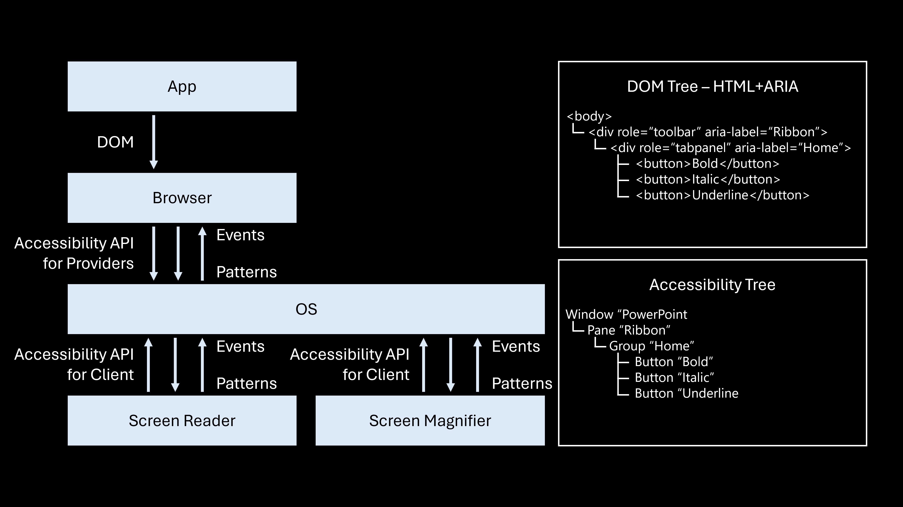

If you have considered screen reader support when creating your digital product, much of the work for supporting screen magnifiers is already complete. Screen magnifiers also rely on the same Accessibility API to interact with apps, meaning apps and web apps can take advantage of the accessibility features they've already implemented.
>[!div class="mx-imgBorder"]
>[](../media/resize-reflow-implementation-accessibility-dom-trees.png#lightbox)

## Supporting Resize

### Set Focus on Element and Provide Element Bounds

Make sure that the focus is set on the correct element to help users navigate the interface smoothly, especially for those using assistive technologies like screen readers or screen magnifiers. "Focus" refers to the active element on the screen that a user can interact with, and it must be clearly defined so that users can easily identify where they're in the app or webpage. Client applications need to determine the balance and include it in the accessibility tree. Balance in this context refers to how elements are arranged or highlighted to ensure smooth navigation, ensuring users can interact with content effectively. This information is then added to the accessibility tree. In web applications, the browser automatically calculates and manages the focus and balance of elements, using the accessibility tree to help screen readers and magnifiers track user interactions. Developers must ensure the accessibility tree is built correctly and the focus is managed properly for optimal user experience across different devices and screen sizes.

### Implement Text Pattern

To improve accessibility for users relying on screen magnifiers, it's crucial to correctly implement the text pattern feature. This feature enables screen magnifiers to accurately track and read selected text within the application. By integrating the text cursor indicator with the same accessibility API utilized by screen readers, you create a smooth experience for users who require both text magnification and spoken feedback. When integrating the text pattern, it's important to specify the proper bounds for all text ranges. Each piece of text should have clearly defined start and end points, enabling the screen magnifier to accurately identify which text is highlighted or read. This clarity is crucial for enhancing navigation within the text and facilitating user interactions, such as selecting, copying, or moving through text. Additionally, it's important to provide detailed information about the text's attributes, such as its style, size, and formatting, so users can receive auditory feedback about the text they're interacting with. This information helps them understand the context and navigate through the content without confusion.

### DPI Scaling

Dots per inch (DPI) measures the number of dots or pixels that can fit in a single inch of a display. A higher DPI indicates greater detail and sharper images. DPI scaling adjusts the size of user interface elements based on the display's DPI settings, which is especially important for high-DPI screens found on modern smartphones, tablets, and high-resolution monitors. DPI scaling modifications are typically integrated into responsive design strategies. When users zoom in or modify their display settings, DPI scaling ensures that all UI elements, such as text, buttons, and images, resize correctly. This functionality helps prevent horizontal scrolling and maintains a fluid layout as content adapts to different screen sizes and resolutions. When implementing DPI scaling, it's essential to consider platforms such as the Universal Windows Platform (UWP) and Office Win32 applications.

### Text Scaling

To support text scaling in web apps, it's important to choose your CSS units carefully, as some units will scale while others won't. The default font size is usually set to 16 pixels, and the text scale factor is applied to this base size. Relative units like **em**, **ex**, **ch**, or **percentages** are based on the font size of the parent element, so they will scale accordingly. This means that any child elements using these units will also resize. In contrast, absolute units or those relative to the viewport won't scale, meaning child elements using these units will remain unchanged, even if they use **em**, **ex**, **ch**, or **percentages**. However, child elements using **rem** will scale properly because **rem** is based on the font size of the root element rather than the parent element. For objects and containers that should scale with the font size, it's best to use **rem**, **em**, **ex**, or **ch** for their width and height. Percent-based widths and heights are relative to the dimensions of the parent element, so they will only scale if the dimensions of the parent element change.

### Resource

- [Deque University: Text Styles, Resize, Reflow, and Zoom](https://dequeuniversity.com/checklists/web/text)

## Supporting Reflow

To design for various screen sizes and aspect ratios, work closely with your designers and product managers. Use responsive web design techniques to facilitate content reflow across devices. For example, a responsive website might transition from a four-column layout on a desktop to three columns on a smaller tablet. However, many modern websites still maintain separate versions for smartphones. To ensure full support for reflow, the primary website should be capable of adapting to viewport sizes as small as those of smartphones. Mobile apps sometimes run the same code on both tablets and smartphones. Therefore, these apps should also adjust to larger viewports when opened on a tablet.

To make your web apps reflow, use the rich layout capabilities of your presentation engine. Use declarative properties where possible and write code to customize behavior only when necessary. Additionally, follow best practices for implementing content on hover or focus, ensuring it's dismissible, hoverable, and persistent.

For web apps, ensure the page renders at the correct scale initially by adding **`<meta name="viewport" content="width=device-width, initial-scale=1">`** to the head. Note that the WCAG reflow documentation doesn't set the viewport width, causing it to render at a small scale by default on an iPhone.

```html
<meta name="viewport" 
      content="width=device-width, initial-scale=1">
```

If your web app has its own pinch-zoom functionality, specify **`user-scalable=no`** to disable the browser's pinch-zoom. Otherwise, leave it enabled.

```html
<meta name="viewport" 
      content="width=device-width, initial-scale=1, user-scalable=no">
```

To make a web UX (user experience) adapt to narrower viewports, avoid setting fixed widths for images. Instead, use **`max-width: 100%`** to allow images to shrink within narrow containers without expanding in wide ones. Set the height to auto or omit it to maintain proportionality. This ensures images stay within the viewport and remain proportional.

| Fixed widths for images | 100% width for images |
| --- | --- |
| `.image {`<br>`width: 556px;`<br>`height: 278px;`<br>`}` | `.image {`<br>`max-width: 100%;`<br>`}` |

To ensure buttons respond well to text scaling, follow these steps:

1. **Set Font Size**: Increase the font size to a very large value to check for truncation issues.
1. **Remove Overflow Hidden**: Remove the **`overflow: hidden`** property to prevent truncation. However, this may cause the text to extend beyond the button's boundaries. This issue arises because the button's width and height are set in pixels, which don't adjust with text scaling.
1. **Switch** to **REM Units**: Replace pixel-based **(px)** width and height with **rem** units to support text scaling. This allows the button to resize along with the text.
1. **Adjust Positioning**: Change position values from pixels **(px)** to **rem** units to avoid overlap.
1. **Handle Localization**: When checking localized versions, such as Russian, you might find the text wraps and spills out of the button. This is because the button height is fixed, assuming only one line of text. Set the height to auto or remove it entirely to allow the button to grow to fit the text.
1. **Assess Responsiveness**: When testing the design in a narrower viewport, the buttons may extend beyond the viewport width. This is caused by the use of **`position: absolute`**, which assumes there is enough horizontal space for buttons to sit side by side. Remove it to allow buttons to stack and wrap naturally in narrow viewpoints.

    | Before | After |
    | --- | --- |
    | `button {`<br>`width: 120px;`<br>`height: 30px;`<br>`overflow: hidden;`<br> `}`<br><br>`.button1 {`<br>`position: absolute;`<br> `margin-left: 0px;`<br>`margin-top: 0px;`<br>`}`<br><br>`.button2 {`<br>`position: absolute;`<br>`margin-left: 130px;`<br>`margin-top: 0px;`<br>`}` | <div style="vertical-align: top;">`button {`<br>`width: 7.5rem;`<br>`height: 1.875rem;`<br>`}`<br><br>`.button1 {`<br>`margin-left: 0rem;`<br>`margin-top: 0rem;`<br>`}`<br><br>`.button2 {`<br>`margin-left: 8.125rem;`<br>`margin-top: 0rem;`<br>`}` |

1. **Add Margins**: Finally, add margins between the buttons to ensure there is adequate spacing when they stack. This will help the buttons wrap correctly in a narrow viewport.

    ```css
    .button {
        width: 44%;
        margin: 2%;
    }
    
    @media all and 
    (max-width: 18rem) {
        .button {
            width: 95%;
        }
    }
    ```

To layout buttons that fill the width of the pane and switch from one row to two rows, you can use different CSS techniques. Start by using **`display: flex`** on the container, which provides various options for sizing, spacing, aligning, and wrapping a linear list of items. **`Add display: flex`** to the container and set additional properties on both the container and items.

```css
.buttoncontainer {
    display: flex;
    flex-direction: row;
    align-content: stretch;
}

.button {
    width: 100%;
    margin: 2%;
}

@media all and (max-width: 18rem) {
    .buttoncontainer {
        flex-wrap: wrap;
    }
}
```

Alternatively, you can use **`display: grid`** for table-like layout capabilities without using an actual table. Specify the sizing and spacing of rows and columns on the container, and then define the row and column locations for each item. Use media queries to reconfigure the grid as needed. The advantage of these techniques is that they're declarative, using only CSS and no JavaScript.

| Before | After |
| --- | --- |
| `.buttoncontainer {`<br>`display: grid;`<br>`grid-template-columns: 1fr 1fr;`<br>`grid-template-rows: 1fr;`<br>`column-gap: 10px;`<br>`}`<br><br>`.button {`<br>`grid-row-start: 1;`<br>`grid-row-end: 2;`<br>`justify-self: stretch;`<br>`}`<br><br>`.button1 {`<br>`grid-column-start: 1;`<br>`grid-column-end: 2;`<br>`}`<br><br>`.button2 {`<br>`grid-column-start: 2;`<br>`grid-column-end: 3;`<br>`}` | `@media all and (max-width: 18rem) {`<br>` .buttoncontainer {`<br>` grid-template-columns: 1fr;`<br>` grid-template-rows: 1fr 1fr;`<br>` row-gap: 10px;`<br>` }`<br><br>` .button {`<br>` grid-column-start: 1;`<br>` grid-column-end: 2;`<br>` }`<br><br>` .button1 {`<br>` grid-row-start: 1;`<br>` grid-row-end: 2;`<br>` }`<br><br>` .button2 {`<br>` grid-row-start: 2;`<br>` grid-row-end: 3;`<br>` }`<br>`}` |

### Dos and Don'ts for Reflow

Here are some dos and don'ts for reflow:

- Do use **max-width** to make elements shrink to fit the container's width.
- Do use **auto** to make containers grow to fit their content, scale images proportionally, and center elements with equal margins.
- Do use **rem**, **ex**, **ch**, or **percentages** for font sizes and other elements to support text scaling.
- Do use media queries to specify different layouts for different widths, adding one for each breakpoint.
- Do use **display: inline** or **display: inline-block** with **position: static** to allow elements to stack and wrap like text
- Do use **display: flex** for advanced layout options for linear lists of items, but check compatibility if you need to support Internet Explorer.
- Do use **display: grid** for table-like layouts without using tables.
- Do use vector graphics whenever possible to ensure fast downloads and sharp images at higher scales. Inline SVG is a great option.
- Do use **img srcset** to specify different resolution versions of the same image, allowing the browser to select the appropriate one based on scale settings, bandwidth, and cache status.
- Don't use **position: absolute** unless necessary, such as for creating overlays, and only use it on the container, not the elements within it.
- Don't use units like **cm, mm, in, px, pt**, or **pc** for font sizes, as they don't support text scaling.
- Don't use tables for layout; only use them for tabular data to maintain correct semantics and accessibility in the accessibility tree.

In sum,

| Do ✓ | Don't X |
| --- | --- |
| <div style="vertical-align: top;"><ul><li>max-width</li><li>auto</li><li>rem, ex, ch, %</li><li>@media all and (max-width: 18rem)</li><li>display: inline</li><li>display: inline-block</li><li>display: flex (check Internet Explorer compatibility)</li><li>display: grid (check Internet Explorer compatibility)</li><li>&lt;svg&gt;</li><li>&lt;img srcset=" "&gt;</li></ul> | <div style="vertical-align: top;"><ul><li>position: absolute (except overlays)</li><li>cm, mm, in, px, pt, pc (except margins, padding, border, large blocks)</li><li>&lt;table&gt; (except for tabular data)</li></ul> |

## Content on Hover or Focus

To implement content on hover or focus in a web app, avoid using browser intrinsic tooltips, as they have many accessibility issues. For example, a tooltip created with the title attribute isn't hoverable and doesn't scale with browser zoom. Instead, use custom tooltips. A custom tooltip can be made hoverable, scalable with browser zoom, and dismissable using the control key.

Key elements for a functional custom tooltip include:

1. **Event Handlers**: Allow users to invoke and dismiss tooltips using event handlers and keys. Event handlers like **mouseEnter** and **focus** would invoke showing the tooltip, and **onMouseOut** and **onBlur** would hide the tooltip along with key events when the user taps the escape key.

    ```javascript
    tooltip1.onmouseenter = showTooltip;
    tooltip1.onmouseleave = hideTooltipAfterDelay;
    ```

1. **Hiding Tooltips**: Allow users to dismiss tooltips using keys or event handlers like **onBlur** or **onMouseOut**.

    ```javascript
    triggerElement.addEventListener('mouseenter', showTooltip);
    
    triggerElement.addEventListener('focus', showTooltip);
    
    triggerElement.addEventListener('mouseleave', hideTooltip);
    
    triggerElement.addEventListener('blur', hideTooltip);
    
    document.addEventListener('keydown', (e) => {
    if (e.key === 'Escape') hideTooltip();
    });
    ```

1. **Key Down Event Handler**: Add a key down event handler on the document to handle the control key, ensuring it works regardless of where the keyboard focus is.

    ```javascript
    function documentKeyHandler(e) 
    {
        e = e || window.event;
        if(e.ctrlKey) 
            hideTooltip();
    }
    ```

Be cautious of potential bugs, such as the tooltip not disappearing when the control key is pressed if the keydown handler on the button calls **stopPropagation**. Removing the **stopPropagation** call will fix this issue.
