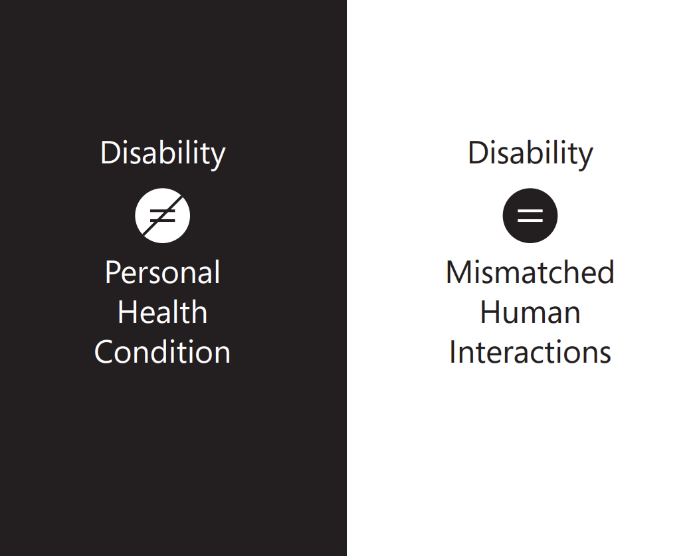

In the past, disability was defined as a personal attribute or lack of ability. Now, we look at disability as context dependent, a mismatch between the person and the environment. The disability spectrum is vast, and everyone's preferences and needs are different. 

And at some point, we all may experience some form of disability. Disability can include and intersect across the following segments: vision, hearing, mobility, mental health, neurodiversity, and speech and can be categorized as either permanent, temporary, or situational. 

