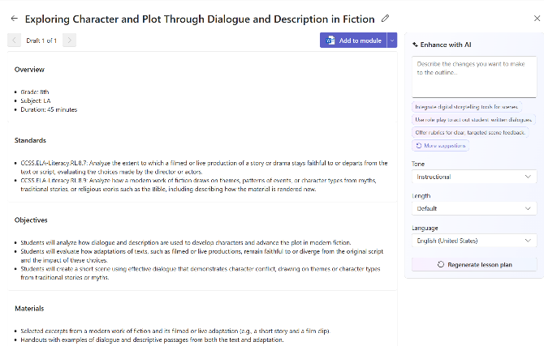
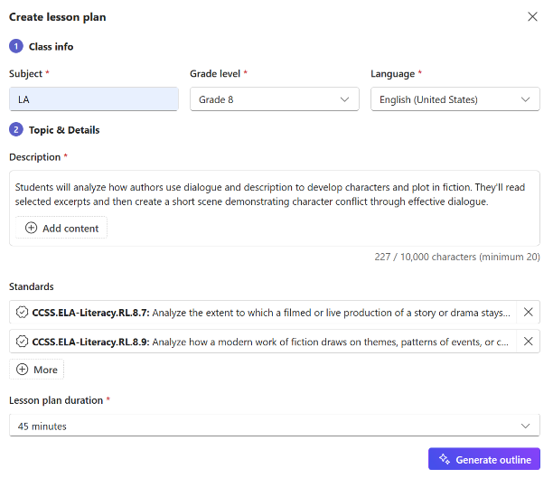

Teach is the right tool when the task follows a consistent, repeatable structure—lesson plans, rubrics, data collection templates, weekly updates, accommodation check-ins, and other predictable workflows. Teach provides guided interfaces grounded in educational standards for creating materials such as lesson plans, rubrics, and flashcards, with more tools like quizzes, reading level adjustments, and differentiated activities coming soon. Because Teach prompts you step-by-step, it is especially useful for administrative tasks that benefit from consistent structure and a clear framework.

To complete a structured task in Teach, open the Teach workspace and select the workflow you want to build. The tool guides you through each component—for example, when creating a lesson plan, it asks for objectives, tasks, materials, timing, and alignment to standards. Once Teach generates the output, export it to Word or Teams. If parts of the content need individualized refinement, for example, adapting instructions for a specific student group, you can bring Copilot in at that point to rewrite or adjust language. This approach ensures the process is efficient while maintaining accuracy and instructional relevance.

> [!TIP]
> For more information on using Teach in the Microsoft 365 Copilot App visit [Teach in the Microsoft 365 Copilot App - Microsoft Support](https://support.microsoft.com/topic/teach-in-the-microsoft-365-copilot-app-c4b05fdd-527f-4f85-9775-afb0781a9178).