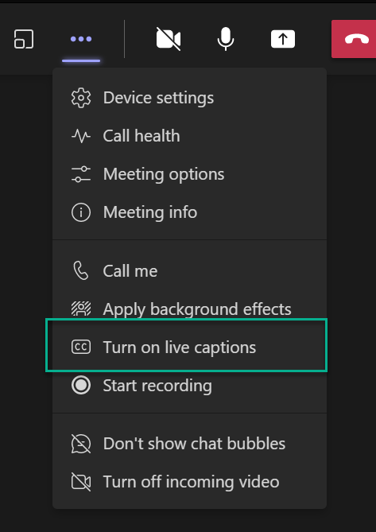

Real-time conversations can exclude families who speak different languages or parents with disabilities, leading to misunderstandings and disengagement. Inclusive meetings foster collaboration and confidence. Educators should guide families on enabling Live Captions in Microsoft Teams, which must be turned on individually by each participant. 

## Steps for families during a meeting:

During the meeting:
1. Select More actions > Language and speech > Show live captions.
2. Confirm spoken language is correct.
1. If Teams Premium is available, select Translate to and choose the preferred language for captions.
1. Families can adjust caption style (font size, color, position) via Caption settings.

## Meeting transcripts

Captions are not saved automatically. Educators should enable Transcription during the meeting for a written record. If district privacy policies allow, record the meeting and share translated transcripts afterward.

> [!TIP]
> Check in with your district about best practices regarding multilingual parent engagement.

## Accessibility features for parents with disabilities

Provide additional supports such as accessible transcripts for screen reader users, high-contrast caption settings, and clear instructions in plain language. Offer alternative formats (audio summaries or accessible documents) for parents who may have vision or learning disabilities. These steps ensure that all families can fully engage and process meeting content.

## Follow-up communication

Use Copilot in Outlook or Word to write friendly follow-up emails or messages for families. You can summarize key points in multiple languages and accessible formats. Example prompt: "Create a meeting summary in English and Spanish with bullet points suitable for our parental communication app."

> [!TIP]
> For more information on accessibility tools for Teams, visit [*Accessibility tools for Microsoft Teams*](https://support.microsoft.com/en-us/office/accessibility-tools-for-microsoft-teams-2d4009e7-1300-4766-87e8-7a217496c3d5)