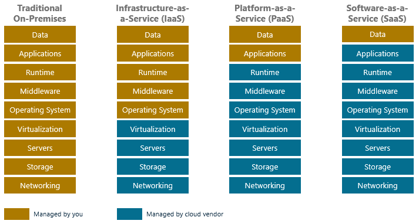

Cloud computing offers the use of computing resources as a service over the network. Of course, not all service requirements are identical. Some cloud users may only desire access to raw infrastructure on which to build applications. Others may wish to not deal with the infrastructure at all, but simply develop and deploy applications on a platform -- for example, a web server -- provided by the service provider. Still others use the cloud as a vehicle for deploying applications that users access through a browser without installing anything on their PCs -- so-called "zero-footprint installs." Each of these scenarios constitutes a cloud service model. And as you will see, each service model has a name that is well-known in the lexicon of cloud computing.

Before we discuss service models, let us think about the layers of hardware and software that form the foundation for delivering cloud services utilizing the various service models.

# Cloud Building Blocks

Figure 1.5 provides a useful abstraction of cloud computing by dividing it into four layers: application software, development platforms, resource sharing, and infrastructure. The infrastructure layer includes the physical resources in a data center. The resource-sharing layer uses a combination of hardware and software to facilitate the sharing of the physical resources while offering a certain level of isolation. The development-platform layer provides functional support for cloud applications. Finally, the application-software layer hosts the applications themselves.

_Figure 1.5: Cloud computing building blocks._

The four layers can be further quantified this way:

**Application software**: The top layer in the stack is the application software, which normally is the system component that the end user utilizes.

**Development platforms**: The next layer, development platforms, allows application developers to write application software utilizing the cloud provider's application programming interface (API). Each cloud platform provides callable APIs that developers can use to access cloud storage, authenticate users, and perform other necessary tasks.

**Resource sharing**: Resource-sharing mechanisms, the third layer, embody some key cloud ideas:

- Provide software, computation, network, and storage services.
- Allow a shared environment whereby multiple hardware images (for example, virtual machines) and system images (e.g., operating systems) can run side by side on a single server along with security, resource, and failure isolations.
- Consolidate physical servers into virtual servers that run on fewer physical servers.
- Deliver agility and elasticity to rapidly respond to users\' resource and service demands.

These ideas usually are delivered through *virtualization*, which relies on a combination of software and firmware to create virtual machines that operate as if they were independent physical machines, even in cases where several virtual machines are hosted on a single physical server.

**Infrastructure**: Physical resources comprise the bottom layer and, in cloud computing, are primarily deployed on the cloud provider\'s side. The broad resource classes include the following:

- Compute resources, typically servers, which are computers designed for enterprise computing (as opposed to user workstations). They usually are rack-mounted to utilize space efficiently.
- Storage resources maintain the cloud\'s data, and use of these resources is usually charged in terms of volume -- for example, charging per gigabyte or terabyte of storage consumed.
- Network resources enable communication between servers as well as servers and clients.
- Software that manages the compute, network and storage infrastructure.

Next, let's discuss popular cloud service models and how the abstractions pictured above facilitate their delivery.

# Cloud Service Models

Services offered by cloud providers fall into three categories known as *service models*:

- IaaS, which is short for *Infrastructure-as-a-Service*
- PaaS, which is short for *Platform-as-a-Service*
- SaaS, which is short for *Software-as-a-Service*

Figure 1.6 illustrates the differences. In a traditional (non-cloud) computing environment, you own the hardware and the software and are responsible for deploying and maintaining them. If a server needs more RAM, you are responsible for installing it; if an operating system requires patching, you're responsible for that, too. With IaaS, by contrast, the cloud service provider provides virtualized hardware in the form of virtual machines. With a few commands or button clicks, you can create a virtual machine complete with an operating system. You are responsible for keeping the operating system patched and installing and maintaining any software that runs in the virtual machine. But you are no longer responsible for maintaining hardware.

_Figure 1.6: Cloud service models._

PaaS goes a step further and provides a platform for developing and running applications that you install and maintain. Significantly, the cloud provider takes responsibility for maintaining the platform itself. A great example of a PaaS cloud service is Azure App Service, which provides one or more virtual machines complete with an operating system (Windows or Linux), a web server such as Internet Information Services (IIS), and a runtime stack such as Node.js, PHP, or ASP.NET Core for hosting web sites and web apps. It also offers automatic scaling and built-in load balancing. In short, it provides a complete platform for hosting web apps and allows you to focus on writing apps rather than installing and maintaining hardware and software.

SaaS provides a fully managed platform for accomplishing specific tasks. Web mail apps are examples of SaaS; you connect with a browser and perform e-mail tasks without installing anything on your PC. You typically neither know nor care what type of server, real or virtual, is being used or what's installed on it. Tasks such as updating and patching the software are performed by the cloud provider -- hence the term *fully managed*.

Let us explore these terms in more detail, see how they apply to the services available in modern cloud platforms, and understand the criteria for choosing a service model.

# The Infrastructure-as-a-Service Model

> [!div class="alert is-tip"]
> ### Infrastructure-as-a-service
>
> _(definition)_ Infrastructure-as-a-service (IaaS) is a cloud-computing model in which cloud providers make computing resources available to clients, usually in the form of virtual machines

In the IaaS model, providers rent out compute resources in the form of virtual machines (also known as "instances") and let you choose from a wide variety of configurations -- for example, CPU, memory, disk, and network bandwidth. Once a VM is provisioned, an IaaS user can remotely connect to it and install platforms and applications. This model offers the most amount of flexibility to the IaaS users in terms of software development and deployment. Rather than purchasing servers, software, data center space, or network equipment, users rent these resources as a fully outsourced service on demand.

IaaS has the following characteristics:

- Computing resources are provided to users as a service.
- IaaS providers provide tools that enable IaaS users to scale the resources that they deploy.
- IaaS providers usually have different resource offerings at different costs and follow a utility pricing model (typically calculated by the hour).
- The same physical resources are shared among multiple users.

## Examples of IaaS

Amazon Web Services, Microsoft Azure, Google, and Rackspace are examples of cloud platforms that offer IaaS products. AWS\'s Elastic Compute Cloud (EC2) was one of the first commercially successful IaaS products. AWS EC2 rents out instances from various data centers scattered around the world. Users can choose from various instance types, from low-memory, single-CPU virtual machines that cost a few US dollars per month, all the way up to multicore, high-performance, GPU-accelerated instances that cost several hundred dollars per month. Azure's Virtual Machine service is similar and supports Linux as well as Windows. As of September 2018, roughly half of the virtual machines extant in Azure were Linux virtual machines[1][^1].

## Pricing Models

IaaS usually is priced on an hourly basis. For example, EC2 offers a spectrum of compute resources as virtualized OS instances, which vary in compute, memory, storage, and bandwidth. At the time of this writing, an Amazon EC2 t2.micro instance, which features one virtual CPU and 1 GB of memory, costs about 1.2 cents an hour when running Linux. A roughly equivalent B1S virtual machine in Azure costs about 0.8 cents per hour. Within limits, both can be used for free for up to 12 months.

Cloud providers can also choose to bill on a prorated or non-prorated basis. On a prorated basis, each partial hour is billed partially, while on a non-prorated basis, each partial hour is billed as a full hour. This difference becomes significant when IaaS users need a large number of instances for a short period of time for burst processing. Today, popular cloud providers bill for most virtual machines on a per-second basis.

## Use Cases for IaaS

IaaS makes sense in a number of situations:

- For new organizations that do not have the capital to invest in infrastructure on site.
- When organizations need to grow their IT resources rapidly, such as Internet startup companies.
- For temporary projects or temporary infrastructural needs (when organizations require a large amount of compute power for a limited amount of time).
- When organizations move on-premises workloads to the cloud by performing a "lift-and-shift" of existing physical or virtualized servers

IaaS may not be the best option when:

- Regulatory compliance does not allow workloads to be run off-premises.
- Applications have strict quality-of-service (QoS) requirements.
- Organizations have existing in-house customized infrastructure to meet their IT needs.

# The Platform-as-a-Service Model

> [!div class="alert is-tip"]
> ### Platform-as-a-Service
>
> _(definition)_ Platform-as-a-service (PaaS) is a model that provides a software platform such as a database server or web server without the complexity of purchasing, installing, and maintaining the underlying hardware and software

PaaS shifts more of the burden of installation and maintenance from the user to the cloud provider. Azure SQL Database, which is essentially a PaaS version of Microsoft SQL Server in the cloud, provides a handy reference point for contrasting IaaS and PaaS. To run SQL Server in an IaaS scenario, you would deploy a virtual machine, and then connect to it remotely and install SQL Server. Of course, you would be responsible for acquiring a SQL Server license and keeping SQL Server patched and up to date. With Azure SQL Database, you simply create an instance of the service; licensing and maintenance is built in.

PaaS offerings vary among providers but usually feature some basic functionality, which includes:

- A web-based user interface for using and configuring the platform.
- Multitenant architecture in which multiple concurrent users utilize the same tools.
- Built-in mechanisms enabling the platform to scale dynamically to meet demand.

## Examples of PaaS

Google App Engine is an example of a PaaS. Using Google\'s APIs, developers can create Web and mobile applications that run on Google\'s infrastructure. Azure App Service is another example, as is AWS Elastic Beanstalk, which provides a managed platform for hosting applications developed with Go, Java, .NET, Node.js, PHP, Python, and Ruby. Cloud providers frequently offer popular databases such as MySQL, Oracle, and SQL Server as PaaS services, too.

One of the more recent innovations in PaaS is that of *serverless computing*, in which the cloud provider provides a fully managed platform for executing your code. Azure Functions, for example, let you upload code written in C\#, JavaScript, Java, or Python to Azure and execute it in response to predefined triggers. Amazon offers a similar service in the form of AWS Lambda, as does Google in Google Cloud Functions.

Yet another example of PaaS that is rapidly gaining in popularity is one that runs Docker containers in the cloud. The platform in this case is a prebuilt Docker stack. Running containerized applications in this manner prevents you from having to deploy servers and install and maintain the Docker runtime. You simply point the container service to a container image in a container registry and let the cloud provider do the rest. Modern cloud platforms support Docker-compatible container registries of their own, which enables containers to start faster by co-locating container images and the containers that run them in the same data center.

## Pricing Models

Unlike the IaaS pricing model, which is typically billed on an hourly basis, PaaS usually is priced based on usage. To simplify billing and make costs more predictable, cloud providers frequently offer *service tiers* that include specific features and amounts of resource utilization for a specified hourly or monthly price.

As PaaS evolves, pricing models evolve, too. For example, Azure Functions, Amazon Lambda, and Google Cloud Functions offer a consumption-based pricing model in which you only pay for the time a function executes, and not for time spent waiting for the function to be triggered again. This is extremely beneficial from a cost perspective for operations that occur relatively infrequently and execute for relatively short periods of time, such as nightly backups or weekly billing runs.

## Use Cases for PaaS

PaaS is a compelling model for certain types of applications, such as:

- Rapid application development scenarios.
- Applications that require Web-based infrastructure to handle varying loads from users.
- Applications that may not need redeployment or migration to other platforms in the future.

There are certain scenarios in which PaaS may not be ideal, such as:

- When the application needs to be highly portable in terms of where it is hosted because PaaS APIs can vary from one PaaS provider to another.
- When proprietary languages or APIs could impact the development process or cause trouble in the future due to vendor lock-in.
- When application performance requires customization of the underlying hardware and software.

# The Software-as-a-Service Model

> [!div class="alert is-tip"]
> ### Software-as-a-Service
>
> _(definition)_ Software-as-a-service (SaaS) is a software delivery model in which software is hosted in the cloud. The infrastructure, the platform, and the software itself are managed by the cloud provider, and the software is consumed as a service.

SaaS is the model in which the cloud provider delivers software as an Internet service, requiring no software installs or maintenance on the part of the user. In cases in which SaaS applications are end-user applications, users access the software through their browsers. The browser loads the latest version of the SaaS application dynamically and transparently.

SaaS has become a common software delivery model for many business applications, including accounting, collaboration, customer relationship management (CRM), management information systems (MIS), enterprise resource planning (ERP), invoicing, human resource management (HRM), content management (CM), as well as service desk management.

With SaaS, the provider maintains the software and infrastructure to run it. The provider routinely develops the software, and enhancements are automatically made available to all users each time they log in to the service. In addition, any application data that results from the use of the service resides in the cloud and is available to the user from any location.

A vast majority of SaaS solutions are based on what is referred to as multitenant architecture. In this architecture, a single version of the application, with a single configuration, is used for every customer (referred to as a *tenant*). To enable the service to scale well, it might be installed on several servers on the provider\'s side. Dynamic scaling is utilized to allow more users to use the service as it becomes more popular.

Typical characteristics of SaaS include:

- Web-based access to the software service.
- Software is managed from a central location by the cloud provider.
- Software is delivered in a one-to-many model in which \"one\" is the cloud provider and \"many\" are the cloud users.
- The cloud provider handles software upgrades and patches.

## Examples of SaaS

Web mail is one of the early examples of SaaS. Web mail enables users with a browser and an Internet connection to access their e-mail anywhere at any time. Offerings from Hotmail, Yahoo!, and Gmail are extremely popular. These services are based on the \"freemium\" model, wherein basic services are free, and more advanced features are available with a subscription. Furthermore, providers earn revenue mainly from advertisements that are displayed to the users as they use the service.

Another popular example of SaaS is online office suites such as Google Drive and Microsoft 365, which allow users to create, edit, and share documents online. Google utilizes the freemium model for individual users. Microsoft has a charge model based on the features required and the number of users per month.

SaaS services aren't always built to serve end users directly by offering Web UIs. For example, Azure Stream Analytics and its AWS analog, Amazon Kinesis Analytics, ingest data streaming from apps or IoT devices and permit developers to extract information from the data streams using SQL queries. They are frequently used to compose larger, more sophisticated end-to-end solutions by joining them to other SaaS services.

Increasingly, cloud providers are offering APIs -- functions that are called over the Internet using the HTTP(S) protocol and that serve as building blocks for applications -- as SaaS services. One example is Azure's Computer Vision API, which lets developers write code that identifies objects in photos, generates captions and search metadata for photos, finds faces in photos, and more using artificial intelligence (AI). Amazon offers a similar API called Rekognition, while Google calls its offering the Vision API. Intelligence APIs offered in the form of SaaS services enable software developers to infuse AI into their apps without becoming AI experts themselves and exemplify the continuing evolution of cloud computing.

## Pricing Models

Unlike traditional software, which is sold under the software licensing model (with an up-front license cost and an optional ongoing support fee), SaaS providers generally price applications using a monthly or annual subscription fee. This model enables SaaS to fulfill one of the main purported advantages of cloud computing: reducing the capital expenditure or the up-front cost of software. SaaS providers typically charge based on usage parameters, such as the number of users using the application.

In the case of APIs delivered using the SaaS model, billing is usually performed on a per-call basis. Cloud providers frequently offer a certain number of calls or transactions per month for a flat rate and charge a slightly discounted rate for activity exceeding that threshold.

## Use Cases for SaaS

SaaS is the right model for certain types of applications, such as:

- Applications that are fairly standardized and do not require custom solutions. E-mail is a good example of a fairly standardized application.
- Applications that have a significant need for remote/web/mobile access, such as mobile sales management software.
- Applications that have a short-term need, such as collaborative software for a particular project.
- Applications in which demand spikes significantly, such as tax or billing software that is used once a month.

However, there are situations where SaaS may not be the right choice, such as:

- Applications that require offline access to data.
- Applications that require significant customization.
- Applications for which policies or regulations prevent data from being hosted externally.
- Applications for which existing in-house solutions satisfy all of the organization\'s needs.

### References

[^1]: <https://www.zdnet.com/article/linux-now-dominates-azure/>  "ZDNet (2018). ​*Linux now dominates Azure*"

1. _ZDNet (2018). ​*Linux now dominates Azure*. <https://www.zdnet.com/article/linux-now-dominates-azure/>_
