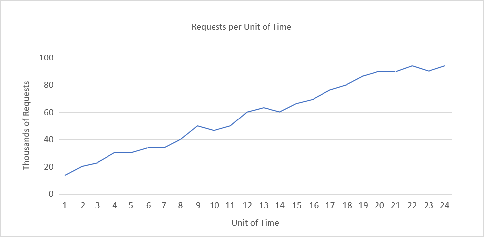
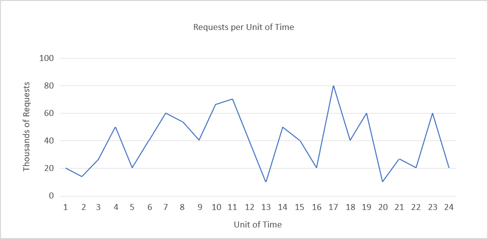
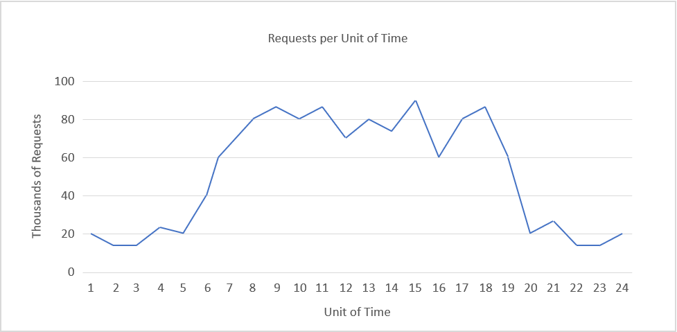

If traffic to a cloud resource such as a VM (or set of VMs) or a web app were constant and unchanging, there would be no need to scale. A cloud administrator could simply provision the number of instances needed to handle the load and be done with it. But traffic patterns *do* change over time -- sometimes predictably, and sometimes not. In the real world, an administrator must diagnose the load on the resources she manages and use scaling to ensure that the system can keep up with demand.

Before we discuss how to scale, let's discuss *why* we scale by breaking down some of the common load patterns that VMs and other cloud resources experience.

## Consistent growth

One of the most common drivers for the need to scale is consistent growth in demand. Figure 1 shows the traffic to a company's web site over a period of 24 months. The company is growing rapidly, and the traffic to its web site reflects that. If we assume that one web server can handle 5,000 requests per unit of time, the company starts with perhaps three or four web servers but needs roughly 20 two years later in order to keep up with increasing demand and continue serving its customers well.

_Figure 1: Consistent growth._

Consistent growth is among the easiest load patterns to compensate for because change is steady and gradual. We could probably scale using physical servers since we can anticipate when the next server (or set of servers) will be needed and have weeks if not months to prepare, but cloud computing allows us to bring new virtual servers online in a matter of minutes. And while the 24-month trend shows steady and predictable growth, loads might fluctuate substantially within shorter time periods. Cloud computing is much more adaptive to micro-trends than scaling with physical servers.

## Constantly fluctuating loads

The rapid elasticity offered by cloud computing is essential when loads fluctuate in an unpredictable manner over relatively short periods of time. Figure 2 shows the load on a web site over a 24-hour period. Once more assuming that one server can handle 5,000 requests per unit of time, the number of servers needed varies from two to 16 over the course of the day. We could accommodate this traffic by keeping 16 virtual web servers online at all times, but recall that cloud service providers charge for VMs even when idle. The excess capacity would not only waste energy, but roughly double the cost.

_Figure 2: Constantly fluctuating load._

## Cyclical loads

Figure 3 shows a load that increases and decreases in a regular and somewhat predictable pattern -- for example, demand goes up during working hours and falls back during evening and nighttime hours. At its peak, this load requires about 20 servers to handle demand, once more assuming 5,000 requests per unit of time per server. It's unreasonable to rotate physical servers in and out 24 hours a day, but virtual servers can easily be provisioned and deprovisioned on a schedule to make sure that server capacity roughly equals demand. Physical servers sitting idle or lightly utilized 12 hours a day represent unwanted CapEx and unnecessary energy consumption. Virtual servers come at a cost as well, but they can be deprovisioned when they're not needed and quickly created again when demand requires it.

_Figure 3: Cyclical load that repeats every 24 hours._

## Unpredictable bursts

One of the most difficult patterns to deal with from a cost and maintenance standpoint is one that incurs unpredictable bursts (Figure 4). If peaks are predictable -- for example, if the web site serves a pizza-delivery service that experiences higher loads on weekends and holidays -- then extra capacity can be planned for. But if they're not predictable, we must be prepared to deal with them at any time.

_Figure 4: Unpredictable bursts._

We may envision excess cost (the cost of servers provisioned to handle peak loads but that are relatively idle during times of lower traffic) as the area between the top of the curve and a horizontal line drawn through the highest point. In that case, the cost of providing capacity for 100,000 requests per unit of time for the load in Figure 4 is substantially higher than the cost of providing equivalent capacity in Figure 3.

If we can anticipate the magnitude of peak demand (not necessarily the timing of it) and don't care about cost, we can provide adequate capacity at all times by provisioning enough servers to handle the highest loads. Cloud computing lets us bring resources online when they're needed and take them offline (and stop incurring charges for them) when they're not. Elasticity is enacted by *scaling* cloud resources. Let's examine the concept of scaling more closely and see why it is a key factor in the economics of cloud computing.
