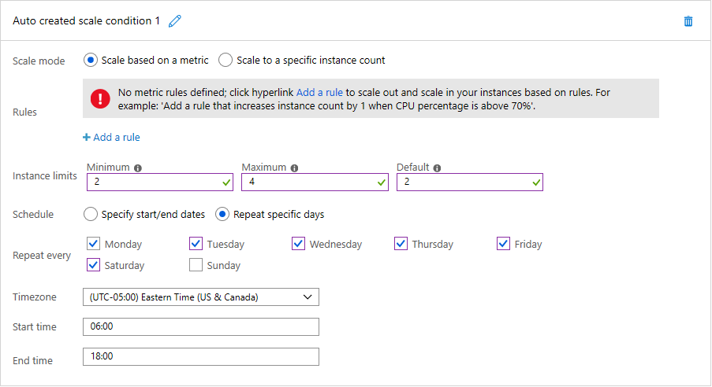
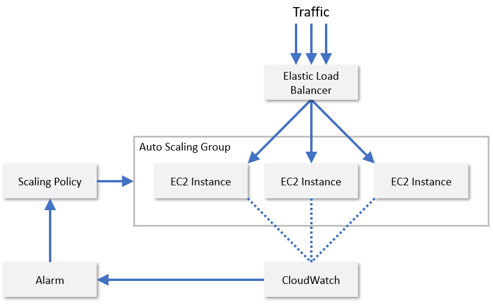

Scaling up or out to handle increased demand and in or down to reduce costs when demand lessens can be performed manually by cloud administrators. For example, a watchful administrator can detect that demand is increasing and use tools provided by cloud service providers to bring additional VMs online (scale out) or replace existing VMs with larger ones -- ones with more CPU and more memory (scale up). The key word is "watchful." If demand peaks and no one is aware, the system as a whole may become slow, even unresponsive, to end users. Conversely, if you scale up or out to handle heavier loads and fail to scale back when the load decreases, you end up paying for resources that you don't need.

That's why popular cloud platforms offer *autoscaling* mechanisms to scale resources in response to fluctuating demand without human intervention. There are two primary approaches to autoscaling:

- **Time-based** -- Scale resources on a predetermined schedule. For example, if your organization's web site experiences the highest loads during working hours, configure autoscaling so that resources scale up or out at 8:00 a.m. every morning, and scale down or in at 5:00 p.m. each afternoon. Time-based scaling is sometimes referred to as *scheduled scaling*.

- **Metrics-based** -- If loads are less predictable, scale resources based on predefined metrics such as CPU utilization, memory pressure, or average request wait time. For example, if average CPU utilization reaches 70%, automatically bring additional VMs online, and when it goes back down to 30%, deprovision the extra VMs.

Whether you choose to scale based on time or metrics or both, autoscaling relies on *scaling rules* or *scaling policies* configured by a cloud administrator. Modern cloud platforms support scaling rules that range from simple, such as expand from two instances to four every day at 8:00 a.m. and revert to two instances at 5:00 p.m., to complex -- for example, increase the VM count by one if maximum CPU utilization exceeds 70% or the average request wait time reaches 5 seconds. Finding the right mix of rules typically involves some experimentation on the part of the cloud administrator.

All major cloud service providers, including Amazon, Microsoft, and Google, support autoscaling. AWS Auto Scaling can be applied to EC2 instances, DynamoDB tables, and selected other AWS cloud services. Azure provides autoscaling options for key services including App Service and Virtual Machines. Google does the same for Google Compute Engine and Google App Engine.

Generally speaking, autoscaling services scale in and out rather than up and down, in part because scaling up and down entails replacing one instance with another and inevitably involves a period of down-time as new instances are created and brought online.

## Time-based autoscaling

Time-based autoscaling is appropriate when loads fluctuate in a predictable manner. For example, many organizations' IT systems experience the highest load during working hours and may experience little to no load in the wee hours of the morning. Domino's Pizza's web site may experience loads at all hours of the day since it operates more than 16,000 stores in nearly 100 countries. But it predictably experiences higher-than-normal loads during certain times of year.

Either scenario is a candidate for time-based autoscaling. Figure 7 shows how scheduled autoscaling is enacted in Azure. In this example, a cloud administrator configures an Azure App Service that hosts the organization's web site to run two instances by default, but scale up to four instances between 6:00 a.m. and 6:00 p.m. six days a week excluding Sunday. By selecting the "Specify start/end dates" option instead, the administrator could just as easily configure the App Service to scale out to 10 instances on Super Bowl Sunday. And she could define multiple scale conditions to scale out on other dates, too.

_Figure 7: Scheduled autoscaling in Azure._

## Metrics-based autoscaling

Scaling based on metrics such as CPU utilization and average request wait time is appropriate when loads are less predictable. Monitoring is a crucial element for effectively autoscaling resources based on performance metrics because it enables the auto-scaler to know when to scale. Monitoring enables the analysis of traffic patterns or resource utilization in order to make an educated assessment about when and how much to scale resources in order to maximize Quality of Service while minimizing cost.

There are several aspects of resources that are monitored in order to trigger scaling of resources. The most common metric is resource utilization. For example, a monitoring service can track the CPU utilization of each resource node and scale resources if the usage is excessive or too low. If for instance, the usage for each resource is higher than 90%, then it is probably a good idea to add more resources since the system is under a heavy load. Service providers usually decide these trigger points by analyzing the breaking point of resource nodes, when they will start to fail, and mapping out their behavior under various levels of load. Though for cost reasons, it is important to maximally utilize each resource, it is advisable to leave some room for the operating system to allow for overhead activities. Similarly, if the utilization is below, say, 30%, then it is possible that not all the resource nodes are required and some can be unprovisioned.

In practice, service providers usually monitor a combination of several different metrics of a resource node to evaluate when to scale resources. Some of these include CPU utilization, memory consumption, throughput, and latency. AWS uses CloudWatch to monitor EC2 resources and provide scaling metrics (Figure 8). CloudWatch tracks metrics for all the EC2 instances in a scaling group and raises an alarm when a specified metric crosses a threshold -- for example, when CPU utilization exceeds 70%. AWS then increases or decreases the EC2 instance count based on scaling policies configured by an administrator.

_Figure 8: autoscaling EC2 instances in AWS._

AWS also supports *predictive scaling*, which uses machine learning to anticipate traffic patterns and manage instance counts accordingly. The goal is to intelligently scale cloud resources without requiring a cloud administrator to configure autoscaling rules. Major cloud service providers are continually finding new ways to improve their platforms with machine learning. Microsoft, for example, now uses machine learning to improve the resiliency of Azure Virtual Machines by proactively predicting and mitigating VM failures[1][^1].

### References

1. _Microsoft (2018). *Improving Azure Virtual Machine resiliency with predictive ML and live migration*. <https://azure.microsoft.com/blog/improving-azure-virtual-machine-resiliency-with-predictive-ml-and-live-migration/>._

[^1]:  <https://azure.microsoft.com/blog/improving-azure-virtual-machine-resiliency-with-predictive-ml-and-live-migration/>  "Microsoft (2018). *Improving Azure Virtual Machine resiliency with predictive ML and live migration*."
