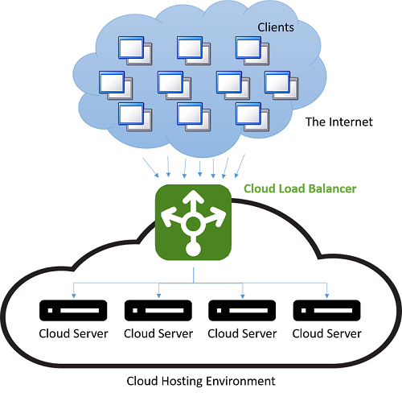
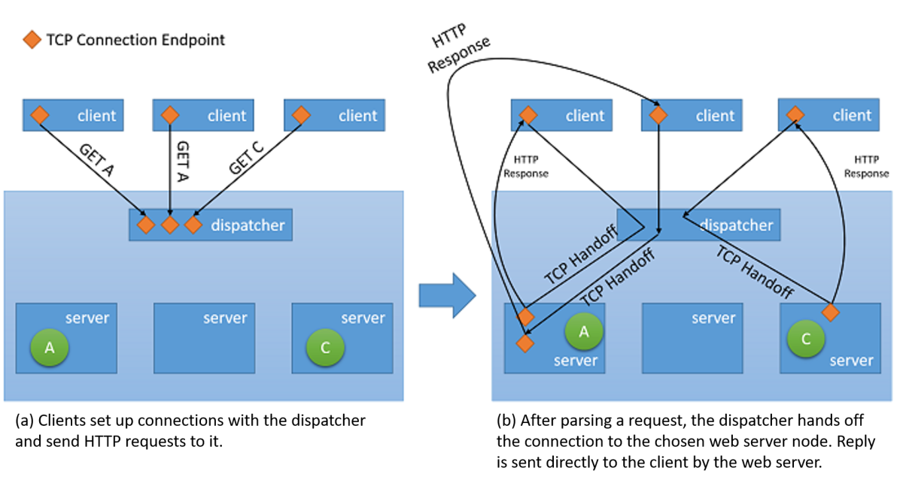

Scaling out by bringing new VMs online when traffic increases is an effective strategy for scaling to meet demand. The fact that VMs can be provisioned quickly is essential to achieving elasticity. But bringing additional servers online isn't "helpful" unless traffic is distributed between those servers. Overall, this helps the system handle the increased load. That's why load balancing is as critical to elasticity as it can dynamically adjust the number of resources devoted to a task.

The need for load balancing stems from two basic requirements. First, throughput is improved by parallel processing. If a single server can handle 5,000 requests per unit of time, then 10 perfectly load-balanced servers can handle 50,000 requests per unit of time. Second, load-balanced resources yield higher availability. Instead of forwarding a request to a server that is already struggling to keep up, a load balancer can direct the request to a server with a lighter load. Also, if a server goes offline and the load balancer recognizes it, it can direct requests to other servers.

## What is load balancing?

A well-known form of load balancing is *round-robin DNS*, which many large web services use to distribute requests among several servers. Specifically, multiple front-end servers, each with a unique IP address, share a DNS name. To balance the number of requests on each web server, large companies such as Google maintain and curate a pool of IP addresses for each DNS entry. When a client makes a request (for example, to www.google.com), Google's DNS selects one of the available addresses from the pool and sends it to the client. The simplest strategy employed to dispatch IP addresses is to use a round-robin queue, where after each DNS response, the list of addresses is permuted.

Before the advent of the cloud, DNS load balancing was a simple way to reduce the latency of long-distance connections. The dispatcher at the DNS server was programmed to respond with the IP address of the server geographically nearest to the client. The easiest way to do this  was to respond with the IP address from the pool that was numerically the closest to the IP address of the client. This method was unreliable, as IP addresses aren't distributed in a global hierarchy. Current techniques are more sophisticated and rely on a software mapping of IP addresses to locations based on physical maps of Internet Service Providers (ISPs). Since this mapping is implemented as a costly software lookup, this method yields better results, but is expensive to compute. However, the cost of a slow lookup is amortized since the DNS lookup occurs only when the first connection to a server is made by the client. All subsequent communications happen directly between the client and the server that owns the dispatched IP address. An example of a DNS load-balancing scheme is shown in Figure 9.

_Figure 9: Load balancing in a cloud environment._

The downside of this method is in a server failure, the switchover to a different IP address is dependent on the Time-To-Live (TTL) configuration of the DNS cache. DNS entries are known to be long-living and updates are known to take over a week to propagate. This means it's difficult to quickly "hide" a server failure from the client. Reducing the validity (TTL) of an IP address in the cache improves this at the cost of performance and increasing the number of lookups.

Modern load balancing often refers to the use of a dedicated instance (or a pair of instances) to dispatch incoming requests to back-end servers. For each incoming request on a specified port, the load balancer redirects the traffic to one of the back-end servers based on a distribution strategy. In so doing, the load balancer maintains the request metadata including information such as application protocol headers (for example, HTTP headers). In this situation, stale information isn't a concern as every request passes through the load balancer.

Though all types of network load balancers will forward requests along with any context to the back-end servers, when it comes to serving the response back to the client they may employ one of two basic strategies1:

- Proxying - In this approach, the load balancer receives the response from the back end and relays it back to the client. The load balancer behaves as a standard web proxy and is involved in both halves of a network transaction, namely forwarding the request to the client and sending back the response.

- TCP Handoff - In this approach, the TCP connection with the client is handed off to the back-end server and the server sends the response directly to the client, without going through the load balancer.

The latter of these strategies is illustrated in Figure 10.

_Figure 10: TCP Handoff mechanism from the dispatcher to the back-end server._

## Benefits of load balancing

One of the benefits of load balancing is that it helps mask failures in a system. As long as the client is exposed to a single endpoint that represents several resources, failures in individual resources are hidden from the client by serving requests using other resources. Now, however, the load balancer itself becomes a single point of failure. If it fails for any reason, even if all back-end servers are still functioning, no client requests will be processed. Consequently, to achieve high availability, load balancers are often implemented in pairs.

More importantly, load balancing improves responsiveness by distributing workloads across several compute resources in the cloud. Having a single compute instance in the cloud has several limitations. Earlier modules discussed physical limitation on performance, where more resources are required for increasing workloads. By using load balancing, larger workloads are distributed across multiple resources so each resource can fulfill its requests independently and in parallel, improving the throughput of the application. Load balancing also improves average response times since there are more servers to handle the workload.

Health checks are key to implementing successful load-balancing strategies. A load balancer needs to know when a resource becomes unavailable so it can avoid forwarding traffic to that resource. Ping-echo monitoring, in which the load balancer "pings" servers with Internet Control Message Protocol (ICMP) requests, is one of the most popular tactics used to check the health of specific resources. In addition to considering the health of a resource when forwarding traffic to it, some load-balancing strategies factor in other metrics such as throughput, latency, and CPU utilization.

Load balancers must often guarantee high availability. The simplest way to do this is to create multiple load-balancing instances (each with a unique IP address) and link it to a single DNS address. Whenever a load balancer fails for any reason, it's replaced with a new one, and all traffic is passed on to the failover instance with minimal performance impact. Simultaneously, a new load-balancer instance can be configured to replace the failed one, and DNS records must be immediately updated.

In addition to distributing requests among back-end servers, load balancers often employ mechanisms to reduce the load on the servers and improve overall throughput. Some of those mechanisms include:

- **SSL offload** -- HTTPS connections incur added performance cost since traffic over them is encrypted. Instead of serving all requests via Secure Sockets Layer (SSL), the client connection to the load balancer can be made via SSL, while redirect requests to each server are made via unencrypted HTTP. This technique reduces the load on the servers considerably. Additionally, security is maintained as long as the redirect requests aren't made over an open network.

- **TCP buffering** -- A strategy to offload clients with slow connections to the load balancer to relieve servers that are serving responses to these clients.

- **Caching** -- In certain scenarios, the load balancer can maintain a cache for the most popular requests (or requests that can be handled without going to the servers, like static content) to reduce the load on the servers.

- **Traffic shaping** -- A load balancer can use this technique to delay or reprioritize the flow of packets to optimize traffic for the server configuration. This does affect the QoS for some requests but makes sure the incoming load can be served.

It's important to remember load balancing only works if the load balancer itself isn't under insurmountable load. Otherwise, the load balancer becomes the bottleneck. Fortunately, load balancers tend to do little processing on the requests they receive, instead relying on back-end servers to do the actual work of turning requests into responses.

## Equitable dispatching

There are several load-balancing strategies used in the cloud. One of the most common is *equitable dispatching*, which uses a simple round-robin algorithm to distribute traffic evenly between all nodes. It does not take into consideration the utilization of individual resources in the system, nor does it factor in request execution time. This approach tries to keep every node in the system busy and is one of the simplest to implement.

AWS uses this approach in its Elastic Load Balancer (ELB) offering. ELB provisions load balancers that balance traffic across attached EC2 instances. Load balancers are essentially EC2 instances themselves with a service to specifically route traffic. As the resources behind the load balancer are scaled out, the IP addresses of the new resources are updated on the DNS record of the load balancer. This process takes several minutes to complete as it requires both monitoring and provisioning time. This period of scaling -- the wait time until the load balancer is ready to handle the higher load -- is referred to as "warming up" the load balancer.

AWS load balancers also monitor the resources attached to them for workload distribution to maintain a health check. A ping-echo mechanism is used to ensure all resources are healthy. ELB users can configure the parameters of the health check by specifying the delays and the number of retries.

## Hash-based distribution

This approach tries to ensure requests from the same client for the duration of a session are directed to the same server every time by hashing metadata defining each request and using the hash to pick a server. If hashing is done properly, requests are distributed relatively evenly among servers. One benefit of this approach is that it lends itself to session-aware applications, which can store session data in memory rather than write it out to a shared data store such as a database or Redis cache. A drawback is every request must be hashed, which introduces a small amount of latency.

Azure Load Balancer uses a hash-based mechanism to distribute loads. This mechanism creates a hash for every request based on source IP, source port, destination IP, destination port, and protocol type to ensure that under ordinary circumstances, every packet from the same session hits the same back-end server. The hash function is chosen so the distribution of connections to servers is random.

## Other load-balancing strategies

If a particular server is bogged down processing a request (or a set of requests), load balancers that utilize round-robin or hashed-based dispatching algorithms will forward requests to it anyway. There are other, more sophisticated strategies for balancing loads across multiple resources that take capacity into account. Two of the most commonly used metrics for gauging capacity are:

- **Request execution time** - Strategies based on this metric use a priority scheduling algorithm, whereby request execution times are used to pick the destination for individual requests. The main challenge in using this approach is to accurately gauge execution times. A load balancer can guess execution times by using (and constantly updating) an in-memory table which stores the differences between the time a request is forwarded to each server and the time it returns.

- **Resource utilization** -- Strategies based on this metric use CPU utilization to balance utilization across nodes. The load balancer maintains an ordered list of resources based on their utilization and directs each request it receives to the resource experiencing the least load.

Load balancing is crucial to implementing scalable cloud services. Without an effective means for distributing traffic among back-end resources, the elasticity achieved by creating resources when they're needed and deprovisioning them when they're not is severely limited.

### References

1. _Aron, Mohit and Sanders, Darren and Druschel, Peter and Zwaenepoel, Willy (2000). \"Scalable content-aware request distribution in cluster-based network servers.\" Proceedings of the 2000 Annual USENIX technical Conference._
