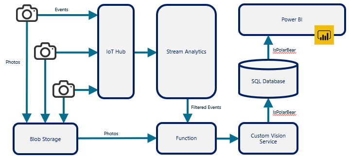

In the early days of cloud computing, cloud service providers such as Amazon and Microsoft focused on offering a rich assortment of IaaS services to their customers. This fueled the growth of public clouds by allowing customers to rather easily shift workloads that ran on-premises on physical servers or in virtual machines to virtual machines in the cloud. But with IaaS comes responsibility. An organization that spins up a VM in the cloud also assumes responsibility for maintaining what's inside the VM -- the operating system, any runtimes that are required, applications that utilize those runtimes, etc.

PaaS shifts some of that responsibility to the cloud service provider and has further fueled investments in the cloud. With services such AWS Elastic Beanstalk and Azure App Service, customers can provision virtual web servers outfitted with popular runtimes such as Java, Node.js, and Microsoft .NET and have software running on them in minutes. While virtual machines do the heavy lifting under the hood, the presence of these virtual machines is largely abstracted away. PaaS allows customers to focus on the applications that they write to solve business problems rather than spend cycles managing VMs and keeping platforms patched and up to date.

*Serverless computing* is a relatively recent innovation in cloud computing that takes such abstractions even further. Suppose your organization writes and maintains code that performs nightly backups of mission-critical data, executes weekly billing runs, or transmits an electronic payment whenever an invoice is uploaded to cloud storage. In this case, the overarching goal is to execute this code and execute it at the appropriate time. Everything else is secondary, including where the code is stored and how and where it's executed.

You *could* take an IaaS approach by creating one or more VMs to run your code and installing the requisite platforms and libraries. You could provision an Elastic Beanstalk or App Service instance and host the code there. Or you could use a function runtime such as AWS Lambda or Azure Functions to execute your code whenever you want without regard to where or how it's hosted. AWS Lambda and Azure Functions are both examples of serverless computing (specifically, of *serverless functions*), as are Google Cloud Functions. All three represent the next step in the natural evolution of cloud computing from IaaS, where you have responsibility for everything, to serverless, where you focus on the actions you want to perform (the code you want to execute) in the cloud and let the cloud service provider manage everything else.

Serverless functions executed by function runtimes in the cloud are the most common form of serverless computing, but they're not the only form. Amazon, Microsoft, and Google offer serverless versions of some of their other PaaS services, including serverless databases. Some providers offer support for *serverless workflows*, which let you define business workflows in the cloud and execute them in response to external events such as invoices being uploaded to cloud storage, timers that fire at specified intervals, or e-mails hitting an inbox -- often without writing a single line of code. Finally, many of the container services that cloud service providers offer, including Azure Container Instances and the AWS Elastic Container Service, qualify as examples of serverless computing because they let you run containers in the cloud while abstracting away the underlying infrastructure.

## Benefits of serverless computing

Serverless computing offers three primary benefits to organizations that leverage cloud computing:

**Lower computing costs**: Customers typically pay monthly charges for IaaS virtual machines and PaaS services such as Elastic Beanstalk and Azure App Service. Billing continues even if the services are idle. Most serverless-computing services, however, support *consumption pricing*, in which you are only billed for the time your code is executing. Imagine that you dedicate a 100-dollar-per-month VM to running code that performs a nightly backup of mission-critical data, and that the code runs for 30 minutes each night. You are paying 100 dollars per month to execute code for 1/48^th^ of a month, or less than one day. Deploying the same code as a serverless function could cost you as little as a few dollars per month. With consumption pricing, you don't pay for idle time.

**Automatic scalability**: Cloud providers offer mechanisms for scaling IaaS services in products such as AWS Auto Scaling and virtual machine scale sets in Azure. They also provide manual and automatic scaling options for PaaS services. But even if scaling is performed automatically, a cloud administrator has to enable auto-scaling and configure it so that the cloud provider knows how and when scaling should occur. One of the underlying considerations administrators must take into account is that since you pay for individual instances of IaaS and PaaS services, you want to configure the service to scale *enough* while not scaling *too much*. Serverless computing offers the option of transparently and automatically scaling out to meet increased demand and scaling in when demand subsides. A cloud administrator typically performs no configuration other than enabling this option in the service. If you get hit with 100 requests at once to execute a serverless function, the cloud service provider makes sure the requests can be executed in parallel (or mostly in parallel). Cost isn't impacted because with consumption pricing, it costs the same to execute a function 100 times, regardless of whether execution is serial or parallel.

**Reduced administrative costs**: Serverless lets you focus on executing code and workflows while transferring responsibility for everything else, including maintaining the underlying platform, to the cloud service provider.

Serverless computing has drawbacks as well. Some of the limitations to consider include:

- Some function runtimes impose a limit on the amount of time that a function is allowed to execute.

- Some function runtimes don't guarantee that a function will execute immediately unless you are willing to pay more for that to happen. With Azure Functions configured to utilize consumption-based pricing, for example, a function might not execute for up to 10 minutes after it is triggered. This might not be a problem for a nightly backup; you probably don't care whether the backup runs at 1:00 a.m. or 1:10 a.m. But it could be a deal-breaker for functions that are time-critical -- functions that *must* execute in real time (or near real-time).

- Serverless functions are generally stateless -- that is, they can't internally store data and expect it to persist from one function invocation to the next. They *can* use external cloud-storage services such as Amazon S3 and Azure Storage to persist data between calls, but this makes the function's code more complex.

Some cloud service providers offer support for stateful functions (Azure calls them "durable functions"), but functions that retain state are a relatively recent addition to serverless computing and are not universally supported.

## Serverless functions

The most common example of serverless computing is serverless functions. You upload code to the cloud and tell it when to execute. The code can be written in a variety of languages, including Java and C\#. 

Figure 11 lists the programming languages supported by serverless functions in Azure, AWS, and GCP at the time of this writing:

| Language             | Azure Functions | AWS Lambda | Google Cloud Functions |
|----------------------|-----------------|------------|------------------------|
| C#                   | x               | x          |                        |
| F#                   | x               |            |                        |
| Go                   |                 | x          | x                      |
| Java                 | x               | x          |                        |
| JavaScript (Node.js) | x               | x          | x                      |
| PowerShell           | x               | x          |                        |
| Python               | x               | x          | x                      |
| Ruby                 |                 | x          |                        |
| TypeScript           | x               |            |                        |

_Figure 11: Programming languages supported by popular serverless-function runtimes._

When you create a function and provide the code that it will execute, you also identify the external event that causes the function to run. Popular cloud platforms support *triggers* of various types, including timers, events happening in other cloud services (such as a document being uploaded to cloud storage), and HTTP calls. It's a simple matter to upload billing code to a function runtime and configure it to run once a day, once a week, or once a month. It's equally simple to activate a function each time an invoice is uploaded to cloud storage (for example, Amazon S3 or Azure Storage) or whenever a call is placed to a REST endpoint associated with the function.

Serverless functions are frequently used to carry out stand-alone tasks such as nightly backups and billing. They are also used to connect other cloud services and compose rich solutions by using cloud services as building blocks. Figure 12 introduces one such solution that is used to combine several Azure services to monitor polar-bear activity in the Arctic. An Azure Function plays a key role in the architecture by taking the output from Azure Stream Analytics (triggered by an HTTP call), retrieving a photo from Azure Blob Storage, and submitting the photo to a model trained with the Azure Custom Vision Service, which uses artificial intelligence (AI) to determine whether the photo contains a polar bear. The function is the glue that binds Stream Analytics, Blob Storage, and the Custom Vision Service together.

_Figure 12: Using an Azure Function to connect other Azure services._

## Serverless workflows

Some serverless-computing services let customers automate business workflows without writing code to do it. Azure Logic Apps, for example, provide more than 100 built-in *connectors* for interfacing with data sources ranging from Oracle databases to social-media services such as Twitter. They provide *triggers* for defining when workflows should execute -- for example, when a file is uploaded to Box.com or something is tweeted with a specified hashtag. They also provide hundreds of predefined *actions* that define what happens when a trigger fires and that can be chained together to form complex workflows, and *conditions* that allow actions to be performed conditionally. And they are infinitely extensible because one of the actions that Azure Logic Apps support is one that calls an Azure Function. If a workflow involves custom logic that isn't encapsulated in an action, you can provide the code that implements that logic and include it in the workflow as if it were a predefined action.

Figure 13 shows one such workflow in the Azure Logic Apps designer[1][^1]. When an e-mail arrives, the Logic App springs into action and checks for a key phrase in the email's subject line and the presence of an attachment. If both conditions are satisfied, the Logic App invokes an Azure Function to strip any HTML from the body of the e-mail. It then deposits the sanitized email and any attachments that accompanied it in Azure Blob Storage and sends an email with links to the relevant documents in Blob Storage notifying interested parties that the information is available and awaiting review. This example combines two serverless paradigms -- a Logic App that executes actions without any code (at least not code that you or anyone in your organization wrote) and an Azure Function containing code that you provided to the customize the workflow -- and is representative of the shift that is taking place in cloud computing from do-it-yourself virtual machines to higher-level abstractions that allow organizations to focus their energies on solving business problems rather than managing virtual machines and installing and maintaining runtimes.

_Figure 13: Defining a workflow in Azure Logic Apps._

Amazon offers a similar service in the form of AWS Step Functions. With Step Functions, you can compose visual workflows that combine other services such as AWS Lambda and AWS ECS. Workflows comprise a series of steps, with the output from one step serving as input to the next. Like Azure Logic Apps, AWS Step Functions provide primitives for branching and parallel execution, preventing you from having to write code to do the same. In effect, a business workflow becomes a state-machine diagram that is easy to understand, easy to explain to others, and easy to modify.

## Serverless databases

In the early days of cloud computing, hosting a database in the cloud meant provisioning a virtual machine and installing a database product such as MySQL, PostgreSQL, or SQL Server. PaaS changed this by offering databases as a service. With Azure SQL Database or the Amazon Relational Database Service (RDS), for example, you simply provision an instance and in minutes you have a cloud-hosted database ready to serve clients. Moreover, the cloud service provider keeps the database platform up to date by applying software updates and patches.

A more recent innovation in cloud computing is serverless databases, which offer an optimized price-performance model that is ideal for single databases with irregular usage patterns. Azure, for example, offers a serverless version of Azure SQL Database. With the mainstream version of Azure SQL Database, you choose a price-performance tier based on the maximum load you expect the database to handle. If loads are "spiky" or intermittent, you frequently end up paying as if the database experienced high loads all the time.

The serverless version of Azure SQL Database mitigates this by scaling the database as needed to handle the loads it encounters, with costs based on the sum of the compute costs and storage costs. As with serverless functions using a consumption model, you only pay for what you use. Amazon offers a similar service in the form of AWS Aurora Serverless, which is a serverless version of Amazon's Aurora database service, while Google offers its customers a serverless NoSQL database service known as Google Cloud Firestore.

### References

1. _Microsoft (2019). *Automate handling emails and attachments with Azure Logic Apps*. <https://docs.microsoft.com/azure/logic-apps/tutorial-process-email-attachments-workflow>._

[^1]: <https://docs.microsoft.com/azure/logic-apps/tutorial-process-email-attachments-workflow>  "Microsoft (2019). *Automate handling emails and attachments with Azure Logic Apps*."
