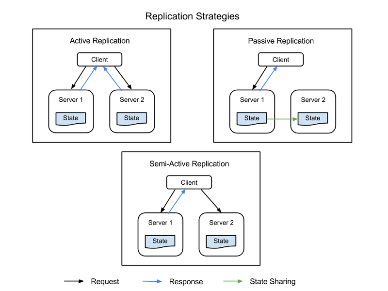

In everyday discourse, we tend to speak loosely about the reasons systems fail. An error, a fault, a failure, a bug, a defect - these terms tend to be used interchangeably. In the data center, professionals should never confuse these words or use one in place of another. Here is a precise definition of terms relevant to discussions of fault tolerance:

- **A bug** is an anomaly in the design of a system that causes its behavior to differ consistently from its requirements or expectations. It may be, in one sense, the system's or software's failure to meet expectations, but a bug is not a failure of the system. Indeed, many bugs are the product of systems performing exactly as they have been designed, contrary to what was intended. The key word here is "consistently." A bug's behavior may be reproduced in all instances of the system. *Debugging* is the act of re-engineering the system so that bugs are eliminated.

- **A fault** is an anomaly in a system that causes it to behave contrary to its design, or to stop behaving altogether. Here, the system's design may have no flaws, but in one implementation or instance of that design, it may not function properly. A fault leads to behavior that cannot be expected to be reproduced in any other instance of the system. The act of eliminating a fault is known as *repair*. A system fault may manifest itself in one of three ways:
  
  - A **permanent fault** is a disruption of a system whose cause is irreparable without complete replacement of the responsible component
  
  - A **transient fault** is a temporary, though typically unrepeated, system disruption whose cause may be repaired or remedied in-place, or that may conceivably clear itself up without intervention
  
  - An **intermittent fault** is a temporary, usually repeating, system disruption often caused by the degradation or improper design of a component, and which may lead to a permanent fault is not corrected.

- **A failure** is the complete collapse of all or part of a system, often triggered by an unaddressed fault. Here, the fault is the cause and failure is the result. A *fault-tolerant* (FT) system is one that behaves as expected, or in accordance with service level agreement (SLA) expectations, under adverse circumstances and therefore avoids failure in the presence of faults.

- **A defect** is an anomaly in the manufacture of a hardware component or the instantiation of a software component, that leads to a fault in its operation and, likely, the failure of a system implementing that component. Such an anomaly may only be remediated through replacement.

- **An error** is the product of an operation that produces an undesired or incorrect result. In a computing device, an error may be symptomatic of a bug in its design or a fault in its implementation, and may be an effective indicator of an impending failure.

The maintenance of fault-tolerant systems requires an IT specialist, administrator, or operator to comprehend these concepts and understand the differences between them. A cloud computing platform is, by definition, a fault-tolerant system. It is designed and built in anticipation of faults, and works to avoid service failure. From an engineering standpoint, this resiliency is what the "cloud" concept means. When telephone engineers first used a cloud shape in their system diagrams, it represented components of the network that did not have to be seen or understood, but whose service levels were dependable enough that they didn't need to be part of the diagram - they could be obscured by a cloud.

When an information system such as an enterprise IT network makes contact with a public cloud platform, that platform has an obligation to behave as an FT system. However, it does not and cannot make the system communicating with it more fault tolerant than it already is. Fault tolerance is not an immunity, nor is it a guarantee against the existence of faults in a system. More to the point, an FT system is not necessarily faultless. Rather, fault tolerance is an ability of a system to maintain expected service levels when faults are present.

The purpose of any information system is to automate the functions that utilize information. Fault tolerance can itself only be automated to a limited degree. The Internet itself, in its original incarnation as ARPANET, had fault tolerance as one of its principal objectives. In a disaster, digital communications could be rerouted to bypass a system whose address was no longer reachable. Yet the Internet is not a self-maintaining machine - indeed, no information system is.

Human effort is continually necessary for any information system to achieve and maintain its service objectives. The best systems make human intervention and remediation simple, immediate, and according to plan.

## Fault tolerance in cloud platforms

Early cloud service platforms were, to be kind, less fault tolerant than their architects intended. For example, the ability for a customer to over-provision resources for services, such as multiple database instances or duplicate memory caches, proved ineffective in the face of insufficient monitoring, which sometimes led to backups or replicas being unavailable in disaster situations. What's more, over-provisioning goes against one of the basic tenets of the cloud business model: paying only for the resources one needs. An organization can't save operating expenses if it's leasing extra virtual-machine instances in case the primary VM goes down.

An FT system does allow for redundancy, but in a judicious and dynamic way, adjusting for the needs and resource availability limits of the current moment in time. In the client/server era, entire servers were backed up, including both their local data storage and the network storage volumes to which they were attached, at periodic intervals. "Back up everything" became a corporate ethic unto itself. Once public cloud services became both affordable and practical, organizations began putting them to use to "back up everything." In time, they came to realize that the cloud could do more than perpetuate the old methods. Cloud platforms could be designed for fault tolerance to begin with, rather than being made fault tolerant once they're implemented.

## Reactive techniques

No matter how thoughtfully a system is designed, most of its fault tolerance will depend upon how well the system and the people who manage it respond to the first evidence of a fault. Following are some of the reactive techniques that organizations use to mitigate faults when they occur.

### Non-pre-emptive job migration

Non-pre-emptive job migration technique makes certain that the host for a workload that has apparently suffered a fault is not reassigned to host that same workload. This benefit protects the "job," although it could obscure the system from being able to collect repeated instances of an error as evidence of a fault, which could be easier to track down through a well-logged path.

### Task replication

Many distributed information systems run multiple instances (or for Kubernetes orchestration, *replicas*) of a task simultaneously. Policy-based management systems can be geared to replicate a task if there is an apparent or suspected system fault.

### Checkpoints and restoration points

In their simplest form, checkpoints and restoration points involve taking snapshots of a system at various points in time and allowing administrators to "roll back" to a specified point in time should restoration become necessary. This strategy becomes more complicated when transactions are involved - for example, when an application performs two or more actions on a database that must succeed or fail as a unit (a "transaction"). A common example is an application that credits money from one account while debiting it from another. These operations must succeed or fail as a unit in order to avoid creating or destroying financial assets.

In a transacted checkpoint-recovery system, recallable records of transactions are stored in memory in a *process tree*. At certain points during a transaction, the memory resources it uses are replicated and deposited in a restoration pool. In the event that log analysis indicates a fault possibly due to software, the process tree is forked, the transaction state moves back to an earlier point, and a new transaction is tried. If the new transaction yields better success than the faulty one (for example, if an error correction test turns up clean), then the old process branch is pruned and the new branch is followed from that point forward in the tree, for what engineers call a *context switch*.[1][^1]

One sophisticated version of this methodology implements a tracing system within the process tree, so that when an error reoccurs, the system can work the process backwards and trace the error's cause. It can then select an appropriate restoration point, or "rescue point," prior to the error being triggered.[2][^2]

Another implementation, called SGuard, was created by researchers at the University of Washington and Microsoft Research for fault-tolerant processing of large data streams. SGuard leverages the Hadoop Distributed File System (HDFS) to schedule the simultaneous writing of several snapshots of data streams during processing. These snapshots are divided into smaller portions as necessary, in turn subdividing stream processing into smaller segments. Checkpoints are stored in HDFS. This system has the virtue of maintaining a record of streaming data transactions, as well as multiple viable replicas of streaming data in highly distributed locations. Although there is considerable preparatory work required to implement SGuard, it is still considered a reactive fault-tolerance technique since its main operation is triggered in response to a fault event.[3][^3]

## Proactive techniques

A *proactive FT technique* is undertaken prior to the revelation of any fault's existence. Its intent is to be preventative, but in modern implementation it becomes more of a methodology than a mantra. Here are some of the techniques presently used by modern cloud platforms.

### Resource replication

The key to an effective resource replication strategy may not be to just "back up everything." A systems analyst should be capable of ascertaining which resources in a system (for example, a database engine, Web server, or virtual network router) can restore themselves following a failure event, and which ones may be irrecoverable. Smart replication may be the first line of defense in a fault-tolerant system.

There are four common strategies used to implement resource replication, all of which are depicted in Figure 1:

- **Active replication** - All replicated resources are active concurrently, each independently maintaining its own *state* - its own local data that makes it functional. This property means that a client's request is received by all replicated resources in a class, and all resources process a response. However, it is the designated primary resource in that class whose response is delivered to the client. If one resource fails, including the primary node, another node is designated its successor. This system requires processing between the primary and replica nodes to be *deterministic* - to take place in tandem, and on a set itinerary.

- **Semi-active replication** - Semi-active replication is similar to active replication, the difference being that replica nodes may process requests non-deterministically, or not in tandem with the primary node. The outputs of the secondary resources are suppressed and logged and are ready to switch over as soon as a failure of the primary resource occurs.

- **Passive replication** - Only the primary resource node processes requests, while the others (the *replicas*) maintain state and wait to be designated the primary if a failure occurs. The primary resource with which the client is in contact relays any state change to all replicas. All originals and replicas that belong to a class are considered "members" of a group, and a member may be booted out of the group if it seems like it failed (even if it actually has not failed). The possibility does exist for latencies or quality of service (QoS) degradation during a failure event, although passive replication does consume fewer resources while in normal operation.

- **Semi-passive replication** - This methodology has the same relationship pattern as for passive replication, except that there is no permanent primary resource. Instead, the role of *coordinator* is designated to each resource in turn, with the coordination of turns determined by a token-passing model called the *rotating coordinator paradigm*.

_Figure 1: Client nodes, primary nodes, and replica nodes in a replicated information system._

### Load balancing

Load balancers distribute requests from various clients among multiple servers running the same application, thereby distributing the workload and reducing stress on system components. A positive side effect of using a load balancer is that some will automatically direct traffic away from unresponsive servers, consequently reducing the chances of all-out failures. In more modern derivatives where the software was designed to be distributed throughout a cloud platform (for example, microservices), workloads are subdivided among separate functions, which themselves are distributed among server-side processors with an aim toward equal distribution and moderate utilization levels.

Virtualization (the key ingredient of cloud computing) enables more equally distributed workloads among processors by making them portable, so that they may be moved to the physical processor that can make optimum use of them. Containerization improves this technique by separating virtualized workloads from virtual processors, so that they reside in the server node whose operating system is best prepared for them. This principle is key to *workload orchestration* demonstrated by systems such as Kubernetes.

### Rejuvenation and reconfiguration

In information systems where instances of software are deployed for extended periods of time, it may become necessary for that software to be rebooted. While some earlier cloud platforms attempted sampling service levels of software instances over time to determine when rebooting becomes necessary, later incarnations have resorted to the simpler method of scheduling periodic reboots. During these reboot phases, start up configuration files may be automatically adjusted to account for changing system circumstances, or to preempt a potential failure after startup.

### Preemptive migration

When virtualization first became a staple in data centers, pre‑emptive migration was suggested as a method for equalizing the stress placed upon server hardware by rotating the assignments of workloads to processors, perhaps in a round-robin fashion. Cloud platforms redistribute workloads across virtual infrastructure frequently enough that this method has become largely unnecessary. However, the topic has cropped up again in recent discussions in conjunction with artificially intelligent methods for predicting workload stress in diverse information systems. Such systems could craft their own rules for diverting more critical workloads away from server nodes predicted to have a higher likelihood of failure.

### Self-healing

In a widely distributed information system such as a content delivery network (CDN) or a social-media platform, the functions of individual servers may be dispersed over multiple addresses, typically in different locations or data centers. A self-healing network polls the various connections at regular intervals (like a performance-management platform) for traffic flow and responsiveness. Whenever there's a performance mismatch, routers may steer requests away from suspect components, eventually stopping traffic flow through those components. Then the operating status of that component may be tested for signs of error. The component may then be restarted to see if the behavior persists, and is only returned to active status if diagnostics do not reveal the likelihood of a fault. This type of automated transactional responsiveness is a modern example of self-healing in highly distributed data centers.[4][^4]

### Barter-based process scheduling

A cloud platform (which includes public cloud-based services, but also may include on-premises infrastructure) is uniquely capable of reporting its own status. When Amazon began implementing a revised SaaS model in 2009, its engineers devised a concept called *spot instance scheduling*. In this system, a silent proxy acting on the customer's behalf advertises the resource requirements for a given job and broadcasts a kind of request for bids, specifically from server nodes throughout the cloud platform. Each node reports on its own capability to meet the bid's requirements in terms of time and expended resources. The least expensive bidder wins the contract, and is designated the spot instance (SI) for the job. This manner of scheduling is currently an option for Amazon Elastic Compute Cloud.[5][^5]

### References

1. _Ioana, Cristescu. *A Record-and-Replay Fault Tolerant System for Multithreading Applications*. Technical University of Cluj Napoca. <http://scholar.harvard.edu/files/cristescu/files/paper.pdf>._

2. _Sidiroglou, Stelios, *et al.* *ASSURE: Automatic Software Self-healing Using Rescue Points.* Columbia University, 2009._

3. _Kwon Yong-Chul, *et al*. *Fault-tolerant Stream Processing Using a Distributed, Replicated File System*. Association for Computing Machinery, 2008. <https://db.cs.washington.edu/projects/moirae/moirae-vldb08.pdf>._

4. _Yang, Chen. *Checkpoint and Restoration of Micro-service in Docker Containers.* School of Information Security Engineering, Shanghai Jiao Tong University, China, 2015. <https://download.atlantis-press.com/article/25844460.pdf>._

5. _Amazon Web Services, Inc. *Spot Instance Requests* Amazon, 2020. <https://docs.aws.amazon.com/AWSEC2/latest/UserGuide/spot-requests.html>._

[^1]:  <http://scholar.harvard.edu/files/cristescu/files/paper.pdf>  "Ioana, Cristescu. *A Record-and-Replay Fault Tolerant System for Multithreading Applications*. Technical University of Cluj Napoca."

[^3]:  <https://db.cs.washington.edu/projects/moirae/moirae-vldb08.pdf>  "Kwon Yong-Chul, *et al*. *Fault-tolerant Stream Processing Using a Distributed, Replicated File System*. Association for Computing Machinery, 2008."

[^4]:  <https://download.atlantis-press.com/article/25844460.pdf>  "Yang, Chen. *Checkpoint and Restoration of Micro-service in Docker Containers*. School of Information Security Engineering, Shanghai Jiao Tong University, China, 2015."

[^5]: <https://docs.aws.amazon.com/AWSEC2/latest/UserGuide/spot-requests.html>  "Amazon Web Services, Inc. *Spot Instance Requests* Amazon, 2020."
