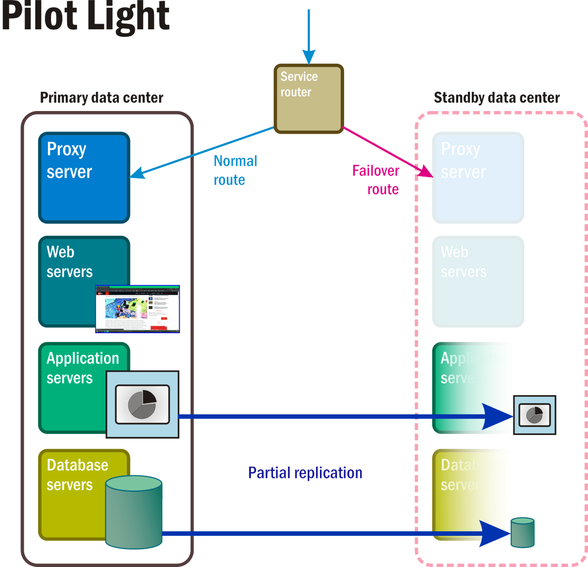
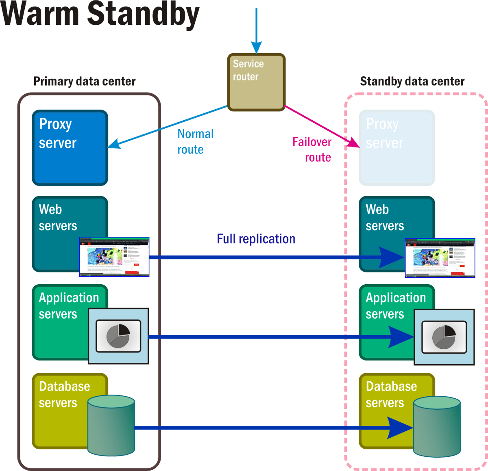
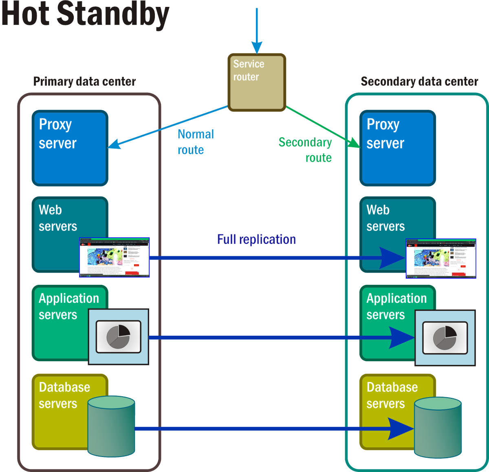
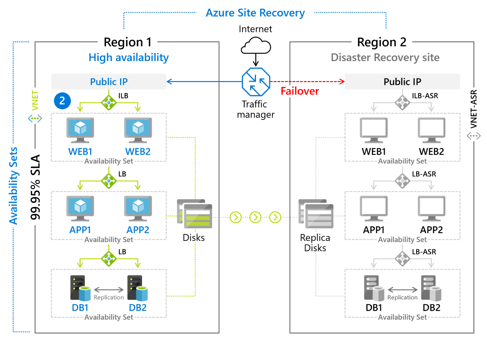

Recovery of backed-up data is, for obvious reasons, a standard feature of backup services. A disaster is not limited, however, to loss of data. An outage that prevents an organization's servers, whether real or virtual, whether on-premises or cloud-based, from being available impacts the organization in a negative - sometimes even catastrophic - way. The purpose of a disaster-recovery (DR) service is to provide a backup not just for data and individual resources, but to entire systems so that if these systems go down or offline, service may be resumed by redirecting traffic to replicas that are standing by ready to assume the load.

Disaster recovery is where the public cloud proves its true purpose. It's more than just an enormous tape drive. Since cloud resources are virtual, replicas can be spun up on a moment's notice to replace resources that suddenly disappear. Replicas can even be hosted in different parts of the world than the systems they mirror to circumvent area-wide outages. Contrast that to the expense of maintaining physical replicas of physical information systems (and trying to do so in geographically diverse locations) and the value of the cloud in maintaining the continuity of these systems starts to become apparent.

Leading cloud providers offer Disaster-Recovery-as-a-Service (DRaaS), but these services must be deliberately planned and configured in order to provide the failover support that customers desire. Hence, we begin by examining the objectives and metrics that factor into such planning.

## Objectives and metrics

During a disaster event, an organization and its customers may lose access to multiple classes of digital assets simultaneously, the most important of which are:

- **Databases and data stores**, which in addition to recording vital information about customers and goods and/or services in inventory, maintain the active state of business transactions and processes for the entire organization

- **Bulk data**, including documents, media files, and other saved records that are the products of the applications people use

- **Communications and connectivity** with people and business services, thus comprising the substance of any business activity that may be conducted

- **Applications** that represent the storefronts of the organization for customers and patrons, as well as its own stakeholders

Although DR is presented to customers as a single service, the recovery process for each of these classes is separate from the others. In the client/server era, many organizations conducted their everyday business on personal computers. If a PC went down and a backup image existed of the PC's local storage, theoretically it could be recovered to a new PC and work could continue. With the first networked PCs connected by LAN operating systems and Ethernet cable, one could restore every PC in the network from a backed-up image, and then the network itself could resume.

The cloud does not work this way. Even a virtual machine that acts as a server for an organization's applications does not encapsulate any part of the work it does in its entirety. Backup services provide safety nets for bulk data and, to a limited extent, transactional data and databases. Yet each of these entities is its own component, so restoration of business functions during a disaster requires the re-establishment of most, if not all, of the functionality of each of these components from a safe and secure location.

The disaster-recovery process, therefore, requires coordination between each of the procedures undertaken to bring an organization back to full operation. What's more, the nature of the business being conducted during this period becomes more critical because of the existence of the disaster itself. An event capable of bringing down critical infrastructure has probably damaged other functional aspects of the company - its warehousing, shipping, manufacturing, and delivery. Likely, the business being restored cannot be a seamless resumption of the business that was conducted prior to the disaster event.

What brings these procedures together collectively is the presence of common, clearly defined service-level objectives. DR services from AWS and Azure, as well as third-party services built on Google Cloud, recognize the following:

- **Recovery Point Objective (RPO)** - The minimum allowable amount of data required to be delivered back to clients for the service based around the backed-up assets to be considered recovered. Conversely, this amount may be considered the maximum acceptable data loss, expressed as a percentage subtracted from 100.

- **Recovery Time Objective (RTO)** - The maximum window of time allowable for a restoration process to take place, which may also be considered a measure of how much downtime the organization is willing to afford.

- **Retention period** - The maximum allowed period of time for a backup set to be retained before it needs to be refreshed and replaced.

RTO and RPO may be perceived as being balanced against one another, so that a customer may decide to allow for longer recovery times to attain higher recovery points. If recovery time is an issue for a customer due to available bandwidth or risk of downtime, that customer may not be able to achieve a high RPO.

A professional risk advisor or business continuity advisor is likely to insist upon the use of these three variables in formulating a disaster-recovery policy. In most business impact analysis (BIA) reports, RTO and RPO rank front-and-center. They are critical variables in advisors' assessments of potential losses arising from disaster events. Some advisors use an aggregate variable called *service-level objective* (SLO), although a single formula for attaining SLO has yet to emerge. CSPs' abilities to specify their service levels using terminology that risk advisors already recognize and appreciate makes it easier for the two parties to work together - which is often how organizations' eventual choice of DR providers ends up being made.

## Methodologies and procedures

The previous lesson covered the most basic form of information system recovery, involving backups of pertinent files, storage volumes, and virtual-machine images. Although this continues to be presented as a DR service option, in practice, it applies to fewer and fewer organizations, primarily because RTO objectives cannot be adequately maintained.

Professional DR services offer various methodologies for deployment and management, some of which involve service maintenance prior to a disaster event. These methodologies are summarized below. All three are based on varieties of the backup options discussed in the previous lesson, and they are equally applicable to all service providers. A customer wishing to enable one of these recovery modes would choose the replication, geolocation, and storage classes best suited to that mode.

### Pilot Light

With this methodology (Figure 5), space exists for a complete standby data center. Here, certain core services and applications, along with the data that supports them, are maintained in a failover cluster that can be "lit up" the moment a disaster event is triggered, often automatically. In the meantime, virtual servers are deployed with just the basic functionality needed to keep them active if they should ever be called upon. These stepped-down servers may be equipped with e-mail and Web functionality, enabling communications with customers as well as within the organization. Enabling a Pilot Light recovery mode may require continual syncing of volatile data stores such as transactional databases and e-mail volumes.

_Figure 5: The active and passive components of a Pilot Light recovery scenario._

### Warm standby

In this recovery mode, depicted in Figure 6, continuously running replicas of all system services and applications and all critical business data are maintained in at least one separate geolocation. Access to this complete replica is bypassed by the active router until the disaster event triggers a rule that replaces the active network's address with the one on the bypass route.

_Figure 6: A Warm standby recovery scenario with some components in the standby namespace fully operational._

### Hot standby

In this scenario (Figure 7), at least two complete replicas of all services and applications are running at all times, with complete and continual data synchronization between them. A master router serves as a kind of grand load balancer, distributing requests to all server locations in roughly equal proportion. The occurrence of a disaster event triggers a firewall-like process where the address of the affected system is removed from the routing table.

_Figure 7: With Hot standby, all components in the namespace of what would normally have been the reserve, standby space, are active, fully operational, and processing replicas of the primary data in real time._

### Cloud-native applications

It is theoretically possible for an organization to choose one provider's disaster-recovery service as a safety net for services hosted by another provider. In other words, given the right level of attention by IT personnel, one CSP's infrastructure (for instance, Google's) may serve as a failover destination for a warm standby procedure hosted in another CSP's infrastructure (such as Azure's). This kind of setup may be necessary for accounting reasons, or if computing resources within an enterprise are being managed by separate departments in different parts of the world.

For now, the presence of containerized infrastructure in the on-premises data center, as well as the cloud, can have a significant impact on all of these DR methodologies. A so-called *cloud-native application*, developed exclusively for use on a public cloud platform, or a platform that works just like it (for example, Microsoft Azure Stack), distributes functions in multiple replica containers, some or all of which may be functional simultaneously. The reason is not so much to enable a new class of DR scenario as to distribute workloads among processors.

One other aspect of cloud-native architectures is the ability for databases whose contents are already automatically replicated to be contacted by way of a network address whose map is exclusive to the application at hand. (In other words, although it uses the Internet Protocol, its address is not a location on the broader public Internet.) This way, during a disaster event, while some nodes attached to the database may go down, many will persist, and others will take the place of the unavailable nodes. This may not qualify as built-in disaster recovery yet, although it certainly can be described as disaster resistance.

## Disaster-Recovery-as-a-Service (DRaaS)

For a public cloud service provider, disaster recovery is a means to put its core backup and data transfer services to use. Each of the major CSPs implements a different strategy for facilitating DR on top of its backup services.

### AWS CloudEndure

*Service migration* refers to relocating virtual workloads from private, on-premises infrastructure to public cloud infrastructure. This relocation is necessary for some disaster recovery services that operate in the public cloud, to achieve their mission objectives of failover and recovery within a few minutes of a disaster event.

In January 2019, Amazon acquired the private service migration service CloudEndure, which was already using AWS as its infrastructure provider. Since that time, it has integrated CloudEndure into its main service line, offering service migration to Amazon customers at no charge. Now, AWS implements service migration as a means to quickly enable a warm or hot standby process. AWS does not charge customers for the migration process, but does charge for the redundant resources provisioned for each DR scenario. Still, the lack of an extra fee makes CloudEndure instantly competitive against a plethora of third-party DR services.

### Azure Site Recovery

Microsoft's DR service, Azure Site Recovery, is a managed deployment of a warm standby recovery method for VM-based environments and for physical (on-premises) servers running Linux or Windows. VMs are actively replicated to a secondary region (Figure 9.8), to which a failover can be initiated with a simple button click. Customers are charged a monthly fee (currently about \$25) for each server or VM that is protected by Azure Site Recovery.

_Figure 8: Failover scenario implemented using Azure Site Recovery._

### Google Cloud DR

As is the case with backup, Google does not offer a branded service specifically for disaster recovery. Instead, it makes available the necessary tools and resources for data storage and data transfer, and offers guidance to customers as to how best to use them for various DR scenarios.

Because Google offers Coldline storage options and applies a discount to it, GCP is applicable to a wide range of scenarios. Coldline is an attractive option for organizations that maintain a high quantity of bulk data. Spinning magnetic disks become impractical vessels for media files whose average sizes run into the tens of gigabytes. Network-Attached Storage (NAS) components provide an accessibility and manageability solution for media creating organizations, but only on a local level. They have internal redundancy, but they are not disaster resistant. And a DR scenario like any of the three diagrammed earlier, would not be practical (or maybe even affordable) for this class of customer. Coldline presents at least one viable means for this customer to achieve some nominal level of business continuity assurance.
