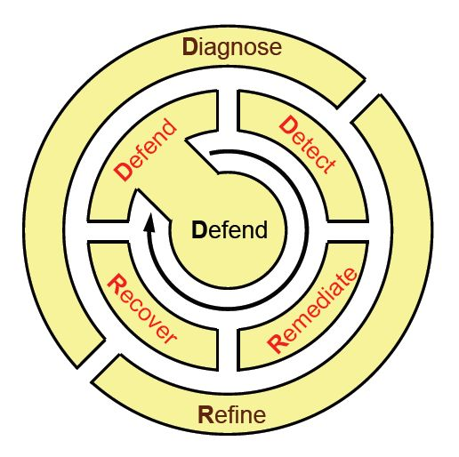
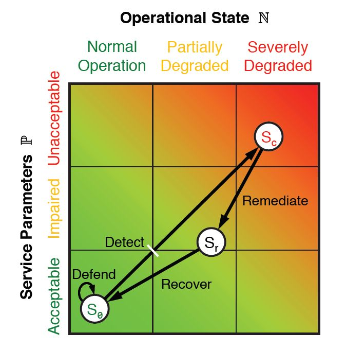
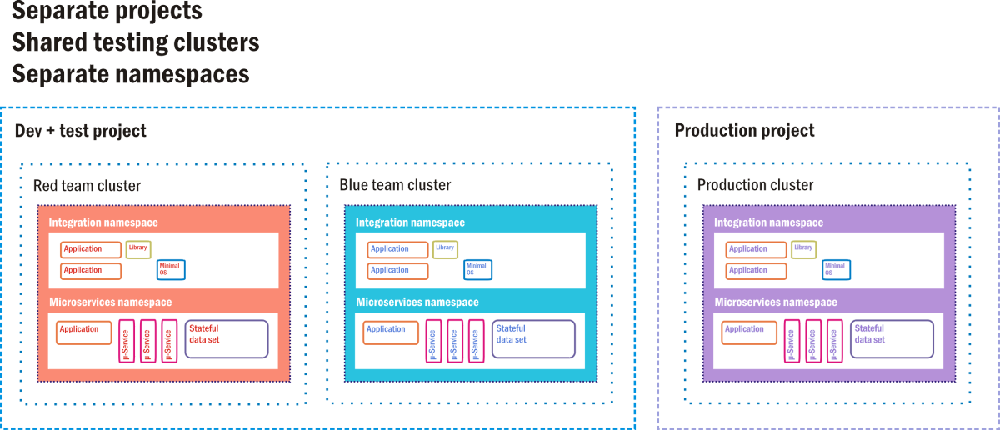

The phrase one is likely to hear most often in conjunction with "disaster recovery" is "business continuity." Continuity has a positive connotation. It speaks to the ideal of limiting the scope of a disaster event, or indeed anything smaller in scope, to within the walls of the data center.

But "continuity" is not an engineering term, despite efforts to make it into one. There is no single formula, methodology, or recipe for business continuity. For any organization, there may be a unique set of best practices that pertain to the type and manner of business it conducts. Continuity is the successful application of these practices to achieve a positive outcome.

## The meaning of resilience

Engineers understand the concept of *resilience*. When a system performs well under varying circumstances, it's said to be resilient. A risk manager considers a business to be well prepared when it has implemented fail-safes, security measures, and disaster procedures ready to respond to any adverse impact it may face. An engineer may not perceive the environment in which a system operates in such black-and-white terms, "normal" and "threatened," "safety" and "disaster." This person perceives the system that supports a business to be in proper running order when it provides continuous and predictable service levels in the face of adverse circumstances.

In 2011, just as cloud computing became a rising trend in the data center, the European Network and Information Security Agency (ENISA, a unit of the European Union) issued a report in response to an E.U. government request for insight into the resilience of the systems they used to gather and collect information. The report stated outright that there had yet to be any consensus among its ICT staff (in Europe, "ICT" is the term for "IT," which includes communications) as to what "resilience" actually means, or how it would be measured.

This led ENISA to discover a project launched by a team of researchers at the University of Kansas (KU), led by Prof. James P. G. Sterbenz, with the intention of being deployed at the U.S. Dept. of Defense. It's called Resilient and Survivable Networking Initiative (ResiliNets)[1][^1], and it is a method for visualizing the fluctuating state of resilience in information systems across a range of circumstances. ResiliNets is the prototype for a consensus model for resilience policy in organizations.

The KU model utilizes a number of familiar and easily explainable metrics, some of which have already been introduced in this chapter. They include:

- **Fault tolerance** - As explained earlier, the ability of a system to maintain expected service levels when faults are present

- **Disruption tolerance** - The ability for that same system to maintain expected service levels in the face of unpredictable and often extreme operating circumstances that are not caused by the system itself - for example, electrical outages, Internet bandwidth shortages, and traffic spikes

- **Survivability** - An estimate of a system's ability to provide reasonable, if not always nominal, service performance levels, across all possible circumstances including natural disasters

The key theory advanced by ResiliNets is that information systems are made quantifiably more resilient through a combination of system engineering and human endeavor. What people do - more to the point, what they *continue* to do as a matter of everyday practice - makes systems stronger.

Taking a cue from how soldiers, sailors, and Marines in an active theater of operations learn and remember principles of tactical deployment, the KU team proposed a back-of-the-napkin mnemonic for remembering the lifecycle of the ResiliNets practice: **D2R2 + DR**. As depicted in Figure 9, the variables here stand for the following, in this order:**

- **Defend** the system against threats to its normal operation

- **Detect** the occurrence of adverse effects, on account of possible faults as well as outside circumstances

- **Remediate** the subsequent impact those effects may have on the system, even if that impact has yet to be sustained

- **Recover** to normal service levels

- **Diagnose** the root causes of the events

- **Refine** future behaviors as necessary in order to be better prepared for their reoccurrence

_Figure 9: The lifecycle of best-practice activities in an environment that utilizes ResiliNets._

During each of these stages, certain performance and operational metrics are obtained, both for people and systems. The combination of these metrics results in points that can be plotted on a chart like the one in Figure 9.10 using a Euclidean geometric plane. Each metric can be reduced to two one-dimensional values: one that reflects service-level parameters *P*, and another that represents operational state *N*. As all six stages in the ResiliNets cycle are implemented and repeated, the service state *S* is plotted on the chart at coordinates (*N*, *P*).

_Figure 10: The ResiliNets state space and strategy inner loop._

An organization meeting its service goals will have its *S* state hovering tightly to the lower left corner of the graph, hopefully remaining at or near there for the duration of what's called the *inner loop*. When service goals are being degraded, the state will travel on an unwanted vector toward the upper right.

Although the ResiliNets model has not become a ubiquitous depiction of IT resilience in the enterprise, its adoption by some prominent organizations, particularly in the public sector, triggered some of the changes that catalyzed the cloud revolution:

- **Performance visualization.** Resilience does not have to be a philosophy for its present state to be communicated to relevant stakeholders. Indeed, it can be demonstrated using fewer than one word. Modern performance management platforms that incorporate metrics from the cloud have incorporated dashboards and similar tools that make their case as effectively.

- **Recovery measures and procedures don't need to wait for a disaster.** A thorough and well-designed information system, continually staffed by vigilant engineers and operators, will implement maintenance procedures on an everyday basis that exhibit little, if any, difference from remedial procedures during a crisis. In a hot standby disaster-recovery environment, for example, remediating the service level problem may actually become automatic - the main router simply steers traffic away from impacted components. Put another way, preparation for failure does not have to be the same as waiting for failure to happen.

- **Information systems are made up of people.** Automation may make people's work more effective and their products more efficiently produced. But it is no substitute for people in a system designed to be responsive to circumstantial and environmental changes that cannot be anticipated.

### Recovery-oriented computing

ResiliNets is one implementation of a concept Microsoft helped coin just after the turn of the century, called *Recovery-Oriented Computing* (ROC).[2][^2] Its key principle was that faults and bugs were perennial truths of the computing environment. Rather than spend inordinate amounts of time disinfecting this environment, so to speak, it may be more beneficial for organizations to apply common-sense measures that contribute to the environment's inoculation. It's the computing equivalent of the radical concept, introduced just before the turn of the 20th century, that folks should wash their hands several times a day.

## Resilience in the public cloud

Public cloud service providers all adhere to principles and frameworks for resilience, even when they choose not to call it by that name. However, a cloud platform does not add resilience to an organization's data center unless it absorbs that organization's information assets into the cloud into their entirety. A hybrid cloud implementation is only as resilient as its least diligent administrators. If we can assume that a CSP's administrators will be diligent in adhering to resilience (or else violate the terms of their SLA), then it must always be the task of the customer to maintain the resilience of the full system.

### Azure Resiliency Framework

The international standard guidance for *business continuity strategy* is ISO 22301. As with other International Standards Organization (ISO) frameworks, it specifies guidelines for best practices and operations, compliance with which enables an organization to be professionally certified.

This ISO framework does not actually define business continuity, or for that matter, resilience. Instead, it defines what continuity means in the organization's own context. "The organization shall identify and select business continuity strategies," its guiding document reads, "based on the outputs from the business impact analysis and risk assessment. The business continuity strategies shall be made up of of one or more solutions." It does not go on to list what those solutions might or should be.[3][^3]

Figure 11 is Microsoft's depiction of Azure's multi-stage implementation of ISO 22301 compliance. Note the inclusion of service-level agreement (SLA) up-time objectives. For customers choosing this level of resilience, Azure replicates virtual data centers within their local availability zones, but then provisions separate replicas whose geolocation is separated by hundreds of miles. For legal reasons, however (especially to maintain compliance with the European Union's privacy laws), this geolocation-separated redundancy is typically limited to "data residency boundaries" such as North America or Europe.

![Figure 11: Azure Resiliency Framework, which protects active components on multiple levels, in accordance with ISO 22301. \[Courtesy Microsoft\]](../media/fig9-11.jpg)

_Figure 11: Azure Resiliency Framework, which protects active components on multiple levels, in accordance with ISO 22301. \[Courtesy Microsoft\]_

Although ISO 22301 is associated with resilience, and often described as a set of resilience guidelines, the resilience levels for which Azure has been tested are applicable only to the Azure platform, not to customer assets hosted on that platform. It remains the responsibility of the customer to manage, maintain, and frequently improve its processes, including how its assets are replicated in the Azure cloud and elsewhere.

### Google Container Engine

Up until recently, software was perceived as the state of a machine that was functionally identical to hardware, yet in a digital form. Viewed in that light, software has been perceived as a relatively static component in an information system. Security protocols mandated that software is updated regularly, and "regularly" would typically mean a few times annually, as updates and bug fixes became available.

What cloud dynamics made feasible, but which many IT engineers had not anticipated, was the ability for software to incrementally, yet frequently, evolve. *Continuous Integration and Continuous Delivery* (CI/CD) is an emerging set of principles where automation enables the frequent, often daily, staging of incremental changes to software, both on the server and client sides. Smartphone users experience CI/CD regularly, by virtue of apps that are updated as often as a few times per week in the app stores. Each change brought about by CI/CD may be minor, yet the fact that minor changes may be rapidly deployed without difficulty has led to an unpredicted, though welcome, side-effect: much more resilient information systems.

With CI/CD deployment models, entirely redundant server clusters are provisioned and maintained, often on public cloud infrastructure, exclusively as means of both testing newly produced software components for bugs, and then staging those components in a simulated working environment to uncover potential faults. This way, remediation processes can take place in a safe environment that has no direct effect upon customer-facing or user-facing service levels, until the remedies have been applied, tested, and approved for deployment.

Google Container Engine (GKE, where the "K" stands for "Kubernetes") is Google Cloud Platform's environment for customers deploying container-based applications and services, instead of VM-based applications. A full containerized deployment may include microservices ("µ-services"), databases that are separate from workloads and designed to operate independently ("stateful data sets"), dependent code libraries, and small operating systems used in the event that application code needs to utilize the container's own file system. Figure 9.12 depicts one such deployment in the style that Google actually suggests for its GKE customers.

_Figure 12: A hot standby option as a CI/CD staging environment for Google Container Engine._

In GKE, a *project* is akin to a data center, in that it is perceived to have all the resources a data center would normally have, just in virtual form. There may be one or more server clusters assigned to a project. Containerized components exist in their own *namespaces*, which are like their home universes. Each is made up of of all the addressable components to which its member containers are allowed access, and anything outside the namespace must be addressed using remote IP addresses. Google's engineers suggest that old-style client/server applications (called "monoliths" by container developers) can coexist with containerized applications, so long as each class utilizes its own namespace for security, while sharing the same project.

In this suggested deployment diagram, there are three active clusters, each operating two namespaces: one for old software, one for new. Two of these clusters are delegated for testing: one for initial development testing and one for final staging. In a CI/CD *pipeline*, new code containers are injected into one of the testing clusters. There, it must pass a battery of automated tests, proving it relatively clear of bugs, before being transferred to staging. A second battery awaits the new software containers there. Only code that has passed the second-tier staging tests may be injected into the live production cluster that end customers are using.

Even there, however, there are fail-safes. In an A/B deployment scenario, new code coexists with the old code for a specified time. If the new code fails to perform to specifications, or introduces faults into the system, it can be withdrawn, leaving the old code behind. If the parole interval expires and the new code performs well, then the old code is withdrawn.

This process is a systematic and semi-automated way for information systems to avoid the introduction of faults that lead to failures. It's not a disaster-proof setup in itself, however, unless the production cluster is itself replicated in a hot standby mode. Certainly this replication scheme consumes plenty of cloud-based resources. However, the costs involved may still be far lower than an organization would incur of left unprotected from a system outage.

### References

1. _Sterbenz, James P.G., *et al.* "ResiliNets: Multilevel Resilient and Survivable Networking Initiative." <https://resilinets.org/main_page.html>._

2. _Patterson, David, *et al*. "Recovery Oriented Computing: Motivation, Definition, Principles, and Examples." Microsoft Research, March 2002. <https://www.microsoft.com/research/publication/recovery-oriented-computing-motivation-definition-principles-and-examples/>._

3. _ISO. "Security and resilience - Business continuity management systems - Requirements." <https://dri.ca/docs/ISO_DIS_22301_(E).pdf>._

[^1]:  <https://resilinets.org/main_page.html>  "Sterbenz, James P.G., *et al.* *ResiliNets: Multilevel Resilient and Survivable Networking Initiative.*"

[^2]:  <https://www.microsoft.com/research/publication/recovery-oriented-computing-motivation-definition-principles-and-examples/>  "Patterson, David, *et al*. *Recovery Oriented Computing: Motivation, Definition, Principles, and Examples.* Microsoft Research, March 2002."

[^3]:  <https://dri.ca/docs/ISO_DIS_22301_(E).pdf>  "ISO. *Security and resilience - Business continuity management systems - Requirements.*"
