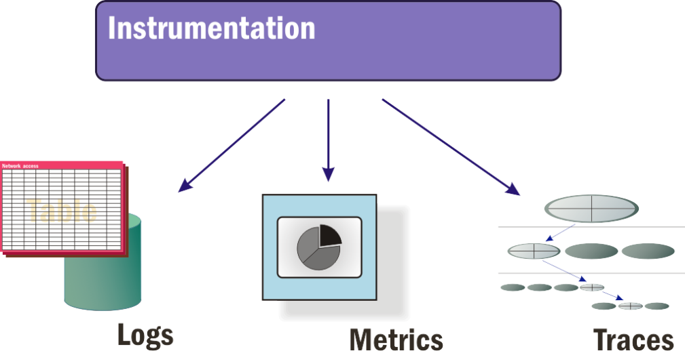

For an information system to be manageable, it must be monitored. The greater the complexity of the system, the more important it is to assess its operational status in real time (or near real time) and in a quantitative manner - with numbers, values, and percentages. Operators need to know how a system is performing, and they especially need to know if the system goes down or encounters repeated errors that pose a threat to reliability and availability.

Monitoring is as important in mission-critical solutions deployed to the cloud as the solutions themselves. In a fully monitored data-center environment, *instrumentation* is provided by software. Instrumentation generally takes on the three forms depicted in Figure 1:

- **Logs** - Permanent, immutable records of events stored in a consistent, tabular format, if not in a full database. An *event* may be indicative of one of many conditions, including:

  - A change in the status of a monitored component (for example, from "busy" to "available")
  - The completion of a task or sequence of instructions
  - A milestone in the progression of data through a network, or the availability of units in a network
  - An error, which in this context is a behavior that the system or application has not been programmed to handle or mitigate

- **Metrics** - Values that represent the relative health, stability, and availability of a service or application or the infrastructure that hosts it

- **Traces** - Records of the paths of execution for programs and services, especially in a highly distributed system, indicating the sequence of instructions that may have triggered, either directly or indirectly, an event

_Figure 1: Three types of instrumentation._

Any comprehensive monitoring strategy for a solution that incorporates public cloud resources must encompass all three forms of instrumentation, especially if its administrators' intent is to facilitate root-cause analysis for network events. Many commercial monitoring platforms claim to be "full-stack," "holistic," or "end-to-end," providing observability across a solution at all levels. In practice, however, IT operators often find they need to deploy multiple tools and platforms in order to account for all sources of valid telemetry. Let us examine each of the three types of instrumentation independently and discuss the roles that they play in monitoring.

## Logs

A log is a table of machine data relevant to the operative history of a component or an element of software over a period of time. A log-monitoring or log-management (LM) platform provides access to the messages being recorded by services, applications, and infrastructure components in an information system. In Linux-based servers, both system services and applications rely on the operating system's `syslog` service to store and maintain logs, usually in the `/var/log` directory.

An LM platform can detect when the contents of logs in this directory have been changed and can scan those contents for changes. The platform might scan the logs periodically, or it might subscribe to notifications indicating that a log has been updated. Usually the LM platform examines a database or other local storage component where these changes are filed, and determines whether any of these changes, either collectively or individually, warrants an *alert* - a message intended to be seen by a human operator. The more sophisticated LM platforms leverage streaming message queues such as Apache Kafka, which can distribute messages through a network extremely efficiently.1

An LM platform used by IT administrators and personnel for performance monitoring should be capable of performing the following tasks:

- **Correlation** - Joining relevant recorded events together into a single view so that managers are not forced to scan raw data for potentially pertinent information

- **Normalization** - Reducing the volume of recorded data in the database, as well as in administrators' views of the database, into more manageable volumes

- **Reporting** - Presenting a graphical, informational view of events that is intelligible to someone working outside the realm of day-to-day IT operations

Maintained regularly and properly, logs collectively represent all the actionable events that are relevant to the health of an information system, as well as to any diagnosis of failures or low service levels. When services or system components write pertinent data to logs, a log monitor can analyze this data in real time in order to diagnose or even predict failure conditions.

## Metrics

*Metrics* are quantitative values and performance levels pertinent to the services being provided to customers, or to the infrastructure hosting those services. The metrics an organization chooses to measure are driven by the elements of service delivery that it believes are important to its customers and users.

"Service delivery" is the final step in a long process that involves the concurrent operation of a myriad of mechanisms. The term "mechanisms" here is both accurate and fitting, because every component of a service is a complex rendering of a simple machine. It takes inputs, processes them, and produces an output. It's this realization - that systems are comprised of individual mechanisms, each of which we can understand - that makes monitoring both feasible and practical.

Typically, a log records events over time while metrics represent states of being or service levels, often at the present time. A log can conceivably record the states of various metrics over given intervals, or it can report on certain metrics based on composite values attained from other logs. However, many metrics are based on *correlations* - comparisons or ratios of one factor to others - which may best be rendered by application performance monitors (APMs) rather than through log analysis. Other metrics are observations compiled from outside the system itself, including estimates of users' ability to comprehend the system.

Common categories of low-level, IT-related metrics tracked by an APM platform include:

- **Request queue volume** - A measure of the backlog of incoming user requests, compared to the system's ability to respond to them

- **User sentiment** - Estimates based on the relative level of productive workflow compared to the activity level of a user

- **Resource availability** - The responsiveness of system resources to requests or queries

- **Error rates** - The relative volume of behavioral events that cannot be mitigated by the application, or by the server's infrastructure

- **Session length** - The intervals of time between users logging on and logging off

APM platforms frequently offer higher-level, more observational metrics that are more transactional and customer-oriented - for example, service-level scores (1-star to 5-star scores rendered by users), service abandonments (intervals of time before a user gives up before achieving the application's objective), and frequency of customer logons over extended periods.

## Traces

As the components that comprise a cloud solution become more widely and thoroughly distributed, especially across public cloud platforms, it becomes necessary for administrators to oversee the recording of performance data that is relevant for software developers seeking to improve or debug their source code. Trace-maintenance platforms represent a category of performance-management tool that collect data about the low-level service calls between highly distributed services and functions, especially in containerized environments orchestrated by Kubernetes.

Because components of modern, server-side applications are highly distributed, functions that would have conventionally inhabited a singular monolith on a single machine will be distributed across multiple machines in a network, inside and outside the public cloud. With a microservices environment, code modules and functions may be replicated individually and distributed to containers hosted on available processors, in accordance with demand. This makes the map of an application fluid and dynamic, so an instance of a function that is the cause of an event or the contributor to an incident in one particular moment may not even exist a few minutes later.

Distributed applications lead to distributed transactions - events that involve multiple software components hosted in diverse locations. A modern trace-maintenance or trace-monitoring tool is capable of identifying SQL queries, HTTP-based calls to APIs, and remote procedure calls - ideally, any transaction from one component that passes control to, or relies upon a response from, another component. A common feature of such tools is a timeline that plots the sequence of events in a compound transaction, charting which events are dependent upon one another, and which can take place in parallel. Some tools can also plot dependency graphs that depict the relationship between components of a distributed system. Even when a distributed application isn't being monitored in real time, just that graph can provide developers with their first visual snapshots of the shape and texture of their applications, depicting which components are heavily relied upon, as well as which ones can cause transactional bottlenecks and slower workflows.

## Making Complex Systems Observable

It is not the complexity of a solution that poses a challenge to observability. The simplest of systems can be the most difficult to diagnose.

An information system need not have a flat, rudimentary architecture to be relatable or observable. A cloud services platform - even one hosted entirely within an organization's premises - can be a very complex environment in which to work. A containerized services platform on top of that can be enormously complex. With the proper tools deployed at optimal locations throughout a complex system, *telemetry* - series of data measuring the status of key attributes of a system over time - can be rendered simply and comprehensibly. There can be simple ways to keep track of changing conditions in a very complex system, and these ways can remain simple even as the system evolves toward greater complexity.

Monitoring is the only way for an administrator to achieve full situational awareness. The only way to achieve an accurate picture of an entire system and the interdependencies and relationships of its parts to one another is to send probes into those parts, have each probe build a chart of what it perceives, and stitch the charts together into one map.

There are some who argue that going to all this trouble is neither necessary nor warranted. If we can think of an organization's global data center as already compartmentalized, the argument goes, then we can assign individual managers to each compartment. As long as the compartments can communicate with one another and are reasonably interoperable, some modicum of efficiency is still attainable for the system as a whole.

Yet such is not the case for any other mechanism used in any industry, anywhere in the world. The manufacturing industry has tool chains that engineers must comprehend and be aware of, for their businesses to continue to function; the retail industry has a supply chain whose inventories and transactions must be continually monitored; the healthcare industry must maintain something resembling what Sweden's national health service dubbed "chains of care"[2][^2] for each patient to whom it dispenses services. The transportation and shipping industries have led the way in the processing of real-time telemetry for all the units they control worldwide, which has given rise to a new industry unto itself: *telematics*.[3][^3]

What binds the physical and virtual components of information technology together into a single system is a concurrent chain called *workflow*. The only way to map workflow is through monitoring - otherwise, no one has any idea what the principal underpinnings of an organization's revenue source even looks like.

### References

1. _Kafka and other streaming queue systems became popular more for their roles in big data platforms, although they were originally engineered to handle the colossal volumes of machine data that systems produce._

1. _International Journal of Integrated Care. *Chain of care development in Sweden: results of a national study*. <https://www.ncbi.nlm.nih.gov/pmc/articles/PMC1483939/>._

1. _Mordor Intelligence. *Telematics Market - Growth, Trends, and Forecast (2020 - 2025)*. <https://www.mordorintelligence.com/industry-reports/telematics-market>._

[^2]: <https://www.ncbi.nlm.nih.gov/pmc/articles/PMC1483939/>  "International Journal of Integrated Care. *Chain of care development in Sweden: results of a national study*."

[^3]: <https://www.mordorintelligence.com/industry-reports/telematics-market>  "Mordor Intelligence. *Telematics Market - Growth, Trends, and Forecast (2020 - 2025)*."
