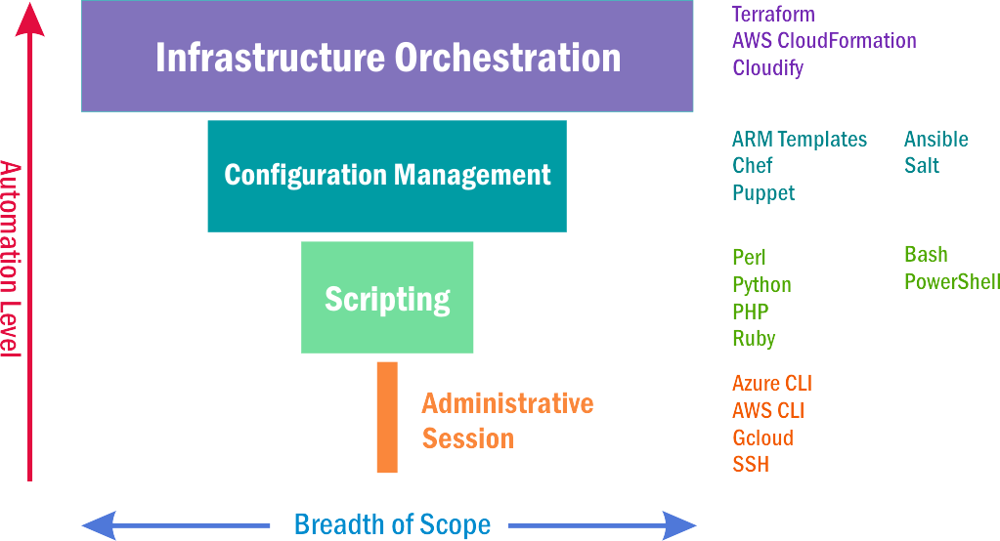

Automation takes place when a sequence of operations can be recorded, repeated, and trusted to perform the same task the same way each time, with little human intervention. 

## Types of Cloud Automation

For cloud administrators, automation comes in three forms:

- **Scripting**
- **Configuration management**
- **Infrastructure orchestration**

### Scripting

Scripting is the formalization of the steps required to perform a task so that those steps can be made repeatable and free of error. Administrators, for example, can write Bash scripts that execute sequences of CLI commands reliably and repeatably.

### Configuration Management

Configuration management (CM) involves identifying the resources that make up a solution and defining how those resources work together. In the broadest sense, a CM platform may specify the ideal state of a solution deployed to a cloud data center. Specifications might be stored in declarative form using languages such as XML or JavaScript Object Notation (JSON), or in imperative form using scripting languages. This is known as *Infrastructure-as-Code*, or IaC, and is as critical to deploying and managing groups of cloud resources effectively as cloud portals and CLIs are to deploying and managing individual resources.

### Infrastructure orchestration

Infrastructure orchestration automates the entire lifecycle of a solution and implements a strategy for delegating resources to each application and service making up the solution based on its priority and its own resource-consumption profile. This is the platform level that Infrastructure-as-Code was originally engineered to address. It has evolved beyond mere configuration management to include activities such as versioning -- for example, allowing you to roll back to a previous version of a solution if an updated solution doesn't work as intended.

## The scope of automation

_Figure 1: Levels of automation._

Figure 1 shows how these approaches to automation relate to one another. Scripting is the most basic of the three and involves using scripting languages such as Bash or programming languages such as Python to automate repetitive tasks. Configuration management provides a layer of abstraction over scripting and relies on tools such as Azure Resource Manager templates or platforms such as Chef and Puppet. With CM and with IaC in particular, you can change the definition of a solution and ask the system to update or provision the corresponding cloud resources. Orchestration implies a higher level of coordination than either scripting or CM. Here, the role each resource plays in a solution is specified in a program, a manifest, a configuration file, or in some other form that is legible to an administrator (a human being) and to an instruction interpreter (a computer program). And the platform, be it Terraform, AWS CloudFormation, or another prominent orchestration manager, takes responsibility not only for configuration management, but for versioning and other tasks as well.

This module examines the three levels of automation and introduces the tools and techniques that administrators use to implement them. We begin with a look at scripting tools such as Bash and PowerShell. Next, we examine Infrastructure-as-Code and survey key IaC tools such as Azure Resource Manager templates and third-party products such as Chef and Puppet. Then we discuss orchestration platforms that enable the declaration and provisioning of cloud resources in a manner similar to that of a computer program, effectively specifying a solution architecture and the steps required to replicate it. Finally, we examine one of these orchestration platforms up close: HashiCorp Terraform, which coordinates resources distributed across multiple cloud service providers at the highest level.
