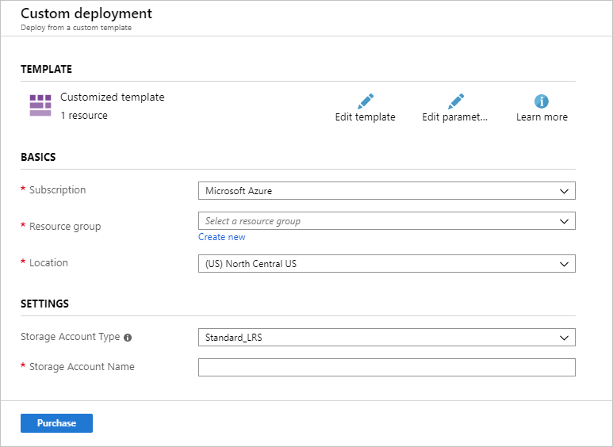
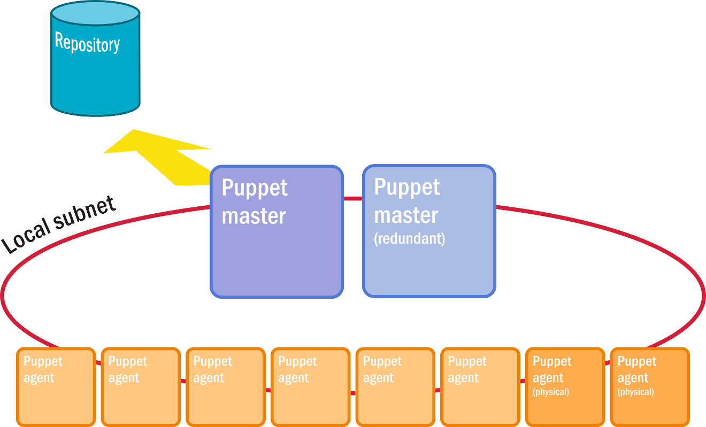
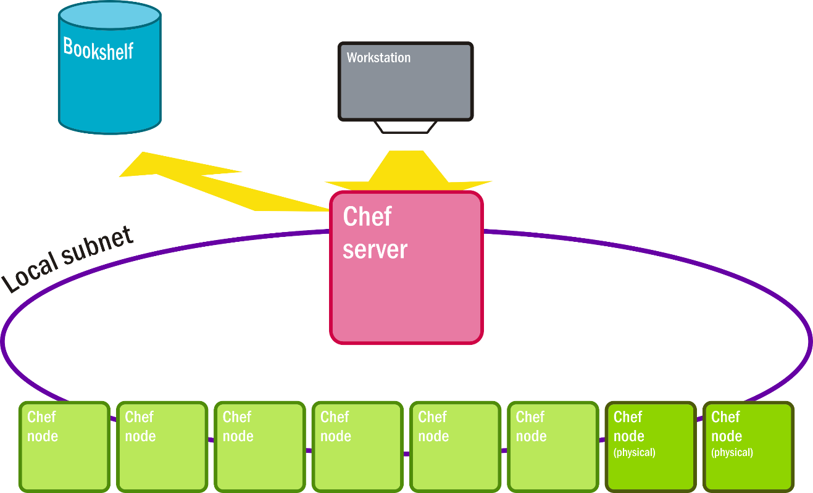

The purpose of a configuration-management (CM) system in any industry, including information technology, is to maintain and preserve the processes to build, design, and assemble an optimally built product. There are two main methods:

- **The imperative method**
- **The declarative method**

## The imperative method

The imperative method, which records the exact sequence of instructions required to provision and maintain a resource (for example, a virtual machine, an application container, a storage repository, or a user profile) according to written specifications. Here, the end state of the infrastructure is the result of executing these instructions in sequence.

## The declarative method

The declarative method, in which the end state of the infrastructure is defined outright, and the system maintaining that infrastructure must assemble a plan or itinerary of operations whose final result is the declared state.

The choice that enterprises make when choosing a CM platform, and an Infrastructure-as-Code methodology, involves what they consider most important to preserve and extend: their methods or their goals. There are pros and cons to both approaches. This lesson examines the basic stance and methodologies supported by major CM platforms and provides brief introductions to the platforms themselves.

## Azure Resource Manager templates

Microsoft's Azure Resource Manager template system is a tool for generating an explicit specification for one or more cloud resources. An Azure Resource Manager template is designed to be a complete inventory of the values and parameters needed to execute Azure instructions for provisioning new resources and updating existing ones. This inventory is expressed in JSON, a format that has become almost ubiquitous in software development. Azure Resource Manager templates are exclusive to Azure and cannot specify resources for a multi-cloud infrastructure.

Azure Resource Manager templates can be generated by hand, but more often they are generated (and edited) through the Azure portal or using tools such as Visual Studio and Visual Studio Code. Figure 4 shows a template for provisioning an Azure storage account. The template includes the following sections:

- A **parameters** section defining parameter values such as the storage-account name that the user will enter when the template is executed, as well as optional default values and allowed values

- A **resources** section defining the Azure resources that the template will create or update

An Azure Resource Manager template can include other sections as well, including a **functions** section for defining reusable functions executed by the template (for example, a function that generates a unique account name using built-in programming expressions that Azure Resource Manager supports), a **variables** section defining variables used in the template, and an **outputs** section that defines the value or values returned when the template is executed. Templates are frequently hundreds or even thousands of lines long. The template in Figure 4 is a simple one, but it demonstrates some of the most important features of Azure Resource Manager templates, including the ability to define the parameters that a user must provide as well as place constraints on the inputs, the ability to define the resources that make up a solution, and the ability to use input provided by the user to specify attributes for the resources being created or updated.

```azure resource manager template
{
    "$schema": "https://schema.management.azure.com/schemas/2015-01-01/deploymentTemplate.json#",
    "contentVersion": "1.0.0.0",
    "parameters": {
        "storageAccountType": {
            "type": "string",
            "defaultValue": "Standard_LRS",
            "allowedValues": [
                "Standard_LRS",
                "Standard_GRS"
            ],
            "metadata": {
                "description": "Storage Account type"
            }
        },
        "storageAccountName": {
            "type": "string"
        }
    },
    "resources": [
        {
            "type": "Microsoft.Storage/storageAccounts",
            "name": "[parameters('storageAccountName')]",
            "location": "[resourceGroup().location]",
            "apiVersion": "2018-07-01",
            "sku": {
                "name": "[parameters('storageAccountType')]"
            },
            "kind": "StorageV2"
        }
    ]
}
```

_Figure 4: Simple Azure Resource Manager template for provisioning an Azure storage account._

Azure Resource Manager templates can be executed with CLI or PowerShell commands, by applications written in C\# and other programming languages, or from the Azure portal. Figure 5 shows how the template in Figure 4 appears in the portal. The portal provides the user interface for creating a resource group or selecting an existing one, and it generates an interface for the inputs defined in the template's **parameters** section -- in this case, the storage-account name and type, the latter of which is selected from a drop-down list generated from the `allowedValues` enumeration in the template rather than entered free-form.



_Figure 5: Azure Resource Manager template rendered in the Azure portal._

Creating a storage account through the Azure portal normally requires many inputs. The template reduces these to only those required for a particular deployment. Imagine a more complex template that deploys dozens of related resources requiring hundreds of parameters, but that reduces the whole process to three of four parameters entered by the user and a simple button click. Moreover, an Azure Resource Manager template is idempotent, meaning it can be executed as many times as you wish and the result will be the same every time. It will provision new resources as well as update existing ones.

An Azure Resource Manager template provides a complete, unambiguous, and idempotent definition of a resource, or set of resources, that can be used to automate deployments and updates. Azure Resource Manager templates are an example of Infrastructure-as-Code that use a declarative approach to defining cloud infrastructure.

## Puppet

The concept of Infrastructure-as-Code was originally intended to apply to cloud platforms in general, including public clouds as well as hybrid cloud platforms such as VMware vCloud and OpenStack. Azure Resource Manager templates are Azure-specific, but Puppet is a full-blown CM platform that works across cloud platforms. Puppet is the modern-day form of Luke Kanies' 2006 experiments with extending an abstraction layer over multiple servers' operating environments. Its engine is a configuration manager whose main jobs are to:

- Take an input of a specification for the optimal, desired state of a system for delivering an application or service
- Determine the sequence of steps necessary to provision a system that is at or near that state
- Execute the steps necessary to achieve this state

In short, what a script in another configuration manager would seek to define and preserve in order to automate, Puppet creates as the outcome of its calculations.

Puppet manages the configuration of resources and services across a cluster of servers through a central controller node called the *master* that is backed up by replicates. As its name implies, the Puppet platform establishes a master/agent relationship between central nodes and a variable number of client nodes where Puppet *agents* are installed.

Rather than use JSON as Azure Resource Manager templates do, Puppet uses instructions inspired by the Ruby programming language in which it was originally written. A set of instructions for Puppet that represents an infrastructure-management task (for example, provisioning a server with Linux, MySQL, and other components of a LAMP stack) is represented by a *module*, which is actually a directory containing several files in a certain structure. The most important of these files is the *manifest*, which is written in a domain-specific language (DSL) unique to Puppet. This DSL is not technically a programming language because it does not state the steps an interpreter or processor must take to accomplish a task.

As Figure 6 illustrates, the architecture of a system running the Puppet platform is surprisingly unsophisticated. A node in Puppet, like a node in Kubernetes or in OpenStack, is a server --- a physical or a virtual one, but a participant in the collective platform. There are master nodes and agent nodes. Those servers that the master manages have active agents installed on them. Communication takes place through SSH channels. Typically, these channels are secured through a local subnet that is closed to the outside Internet. Modules for Puppet instructions may be stored in, and retrieved from, a repository, although that connection doesn't need be private, and Puppet itself doesn't recognize the repository as an agent or a node.



_Figure 6: Puppet's standard deployment architecture._

## Chef

Chef is powered by agents able to look into a system in real time and report its configuration and status. The basic deployment architecture is simple (Figure 7). The server is designed to be operated remotely from a workstation. All of the nodes including the server are loaded with Chef, although functionality is distributed among them. Client nodes receive scripted instructions from the server by way of the administrator's workstation.



_Figure 7: Chef's standard deployment architecture._

Many metaphors in Chef are based around cooking. A Chef script is called a *recipe*. Its instructions are written in Ruby as opposed to a DSL based on Ruby, so developers familiar with Ruby will be comfortable with them. All recipes are contained within a *cookbook*, which serves as Chef's means of delivery. To manage the configuration for a class of tasks, an operator either writes a cookbook or acquires one from a public repository. The client-side interpreter for these instructions is an agent called *Knife* that is installed on each server node. Knife receives instructions over SSH using a CLI.

Unlike Puppet, a Chef recipe is a program that is tested, refined, and then preserved. However, the way it's written is somewhat more abstract than any of the system-dependent scripts seen earlier. Its use of Ruby is more symbolic, with Knife capable of translating abstract instructions into specifics. These instructions are not declarations like in Puppet, or statements of goals, objectives, or desired states, but rather imperative commands. For example, server nodes in a data center may each have different distributions of Linux installed. A recipe may instruct Knife to figure out which Linux version is installed on a node, and in a conditional clause, state which edition of a package is most appropriate for that version. It may also make adjustments to that package's local configuration file.

The instructions from Chef to Knife are explicit. Chef is about defining, and then refining, the methods by which a working version of a solution is attained and maintained. Continual refinement is still possible; sequences of instructions don't have to be set in stone, as they often are with stand-alone scripts. But at least there is a methodology to guide the way. It can be deliberate without breaking existing processes, especially if those processes --- or to be more specific, their recipes --- are built to be resilient, and to test for whether certain conditions have changed before committing important alterations to configurations. That said, Chef has had evolutionary upgrades over the years that have necessitated structural changes to its own recipes.

## Red Hat Ansible

Ansible is a CM tool that shares some traits with Puppet, although it also subscribes to the notion of a complete inventory list, like Azure Resource Manager templates. Its goal is to produce a single script that installs, configures, and maintains a given service or application on any server infrastructure. It's based on the concept of *push configuration*. Unlike the situation with both Puppet and Chef, where client-side agents make requests for updated configurations from a master server, there are no remote agents in the Ansible system.

Configuration tasks for each node (not "clients" because there's no direct relationship between them and the server) are based around common *playbooks*. A playbook is actually a database, not an instructional script, containing the conditions that must be met for a configuration to be complete --- for example, for the components of a LAMP stack to be installed. The Ansible server adapts this playbook for each node's peculiarities and eccentricities, using its infrastructure inventory database as a guide.

Both the playbook and the inventory are written in YAML, a language originally created as an alternative to JSON for codifying data. Figure 8 shows a segment of a playbook from an open-source Ansible repository<sup>[1][^1]</sup> that sets up users for MySQL once its package has been installed. There's no instructional syntax, only keys and values. Since these values represent transitional states --- in this case, for each user in MySQL --- the Ansible server finds the best method for applying these changes to the roster of the system it's configuring. As some Ansible advocates have argued, this can be viewed as a kind of desired state configuration, so long as that state is something that can be expressed explicitly using YAML.

```ansible
- name : Ensure mysql started
  become: yes
  service: name=mysql state=started enabled=yes

- name: Update MySQL root password for all root accounts
  mysql_user: name=root 
              host={{ item }} 
              password={{ mysql_root_password }}
              login_user=root
              login_password=""
              state=present
  with_items:
    - 127.0.0.1
    - ::1
    - localhost
```

_Figure 8: Sample Ansible script written in YAML._

## Summary

Configuration management simplifies the job of managing cloud resources the way a combine harvester simplifies the job of gathering grain from the field. A CM platform elevates the role of server administration from a task to a profession. It is always aware of the big picture and finds ways to integrate new configurations into existing systems rather than just react to the impact they make.

In this lesson, we examined prominent configuration-management platforms and provided context around the term Infrastructure-as-Code. But even CM platforms don't provide all the functionality that administrators need to manage cloud solutions efficiently and effectively. The next step up is orchestration platforms, one of the most popular of which is Terraform -- which, not coincidentally, is the subject of the next lesson.

### References

1. _GitHub *Ansible lamp stack playbook*. <https://github.com/jasodeep/ansible-lamp-stack-playbook>._

[^1]: https://github.com/jasodeep/ansible-lamp-stack-playbook/blob/master/roles/mysql/tasks/main.yml
