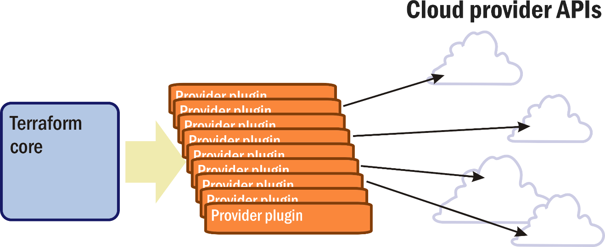

HashiCorp Terraform is an infrastructure orchestration tool created by Mitchell Hashimoto, a veteran Chef and Puppet user who realized he thought about infrastructure in a different way, and then founded a company based on that idea. Terraform's stated goal is to produce a provider-agnostic, though technically complete, view of cloud infrastructure to the services and applications that make use of it<sup>[1][^1]</sup>.

As Hashimoto evolved his platform, Terraform grew to be able to administer any service, from any source, that communicates using an API. In theory, an analytics service provider could be integrated into an infrastructure platform managed by Terraform, perhaps providing forecasts for resource performance or warnings about consumption trends. As long as a plug-in can be written that maps the APIs methodologies into states that can be represented symbolically (using variables), then Terraform can build a plan around that API. In an unusually metaphor-free environment, the method Terraform constructs to do a task is called a *plan*. A plan is what Terraform assembles after it analyzes the state of the infrastructure, and the requirements of the workloads it will orchestrate as specified by its scripts.

Terraform has been called a configuration-management (CM) system. Technically, it isn't, for the following reasons:

- **It's designed to use other CM tools**, and can be integrated with infrastructure that already uses Chef, Puppet, or Ansible. HashiCorp offers its own alternatives as well, including a networked configuration system called Consul.

- **It works with resources** in on-premises infrastructure and the public cloud. Chef recipes, Puppet modules, and Ansible playbooks may then provision those resources for their own respective purposes.

- **The patterns and best practices adapted through regular use of Terraform may be encoded**, making them plans themselves. For example:
  - deprovisioning unused resources
  - reconfiguring network address loops
  - doing periodic health checks of configured systems

- **Terraform can help bridge the gap between first-generation virtualization and containerization.** A containerized infrastructure is different from one built around virtual machines since the application is virtualized, not the operating system and services that support it. Typically, a CM installation deals with one type of environment or the other. Terraform can manage an infrastructure in which both components play active roles.

As Figure 9 shows, Terraform has no remote, client-side agents, though HashiCorp makes platform components that do, and its central component isn't considered a server. HashiCorp calls this component the *core*. Rather than communicating with something designed to communicate only with it, the core is designed to communicate with *resource providers* through REST APIs. When a resource provider builds an API around its services, borrowing an idea from the SQL database language, it typically phrases its methods using some form of the four basic commands for handling resources, which Terraform interprets as create, read, update, and delete. It's up to the intermediate plugins to map the commands the API provides to methods it can generally recognize.



_Figure 9: The Terraform core uses plugins that in turn call cloud provider APIs._

A CM system provisions resources for one set of requests at a time. Terraform knows the collective needs of all the services that its infrastructure will host, examining the requests they make for resources as a group. From those requests, it assembles a working virtual network around components that need to share connectivity with one another.

## Terraform syntax

Terraform works differently than the previously discussed CM tools. It does use a domain-specific language for declaring the desired state of infrastructure. Its DSL is declarative, not imperative, and won't appear too foreign to an administrator who uses Puppet. Because it isn't imperative and not bogged down with general-purpose programming language rules, Terraform's syntax is rather straightforward. Most instructions spell out an association, equating a value with a symbol. In that light, Terraform's intentions could have been expressed instead with JSON or YAML without losing much in translation. As it stands, however, Terraform code is clear, legible, and where appropriate, implicit.

An earlier lesson presented a Bash script that provisioned an Ubuntu VM in Azure with a LAMP stack installed. Suppose you want to prevision a similar VM in AWS and use Terraform to do it. First, since Terraform's declarative language can be used like a template, variables must be declared before they're invoked, usually in a separate file. The following example defines a variable named `ami` that contains an AWS catalog number that the script will need to locate a Bitnami LAMP image:

```terraform
variable "ami" {
    default = "ami-7679c91e"
    description = "AMI catalog number for Bitnami LAMP stack image"
}
```

Next, in a file named "main.tf," a resource block establishes the conditions for provisioning the LAMP stack instance. Notice the placeholder in curly braces for the interpreter to fill in with the value of variable `ami`:

```terraform
resource "aws_instance" "web" {
    ami = "${var.ami}"
    instance_type = "t2.micro"

    tags = {
        Name = "CMU_LampStack"
    }
}
```

The AWS plugin for Terraform will take care of mapping these inputs to a command that AWS recognizes. When the command executes, the plugin also makes the results of the command available to the core.

## Terraform operation

It might seem like there's no functional difference between Terraform and a CM system. Terraform does, after all, use a declarative language to express instructions for provisioning a LAMP stack server.

Here is where everything changes. Terraform's principal job isn't to add a configuration to a platform that's already running. It creates virtual infrastructure around *all* the components that infrastructure will host simultaneously, the example above representing just one component of many. Getting Terraform to build the plan for this large job is an interactive process, though not a graphical one. First, all the scripts for tasks belonging to the plan are assembled in their specific directories. The core now knows what to look for.

### Initialize Terraform

From this point forward, the interaction process is deceptively simple. The core is launched with this command:

```terraform
terraform init
```

It requires no parameters or qualifiers, because the inputs have already been written as files and stored in their proper directories. The launch process essentially looks for potential errors with the declarations and points them out if they exist. What the administrator is looking for here is a blank response with zero warnings.

### Identify changes required

Now the administrator moves on to the second stage:

```terraform
terraform plan
```

Again, no parameters are required, although there are a handful of optional ones. The core will take a few minutes to analyze the scripts in its directories and figure out all the infrastructure changes needed to do everything. If it's building the infrastructure from scratch, then it will determine everything it needs to build. If it's making changes, then the core will calculate the differences between the current state and the desired state of the infrastructure. If services can be supported by provisioning two VMs instead of three without impacting the overall configuration or performance, then that's the plan it will build.

For a containerized infrastructure rather than a VM-based platform, Terraform can work with Kubernetes directly to decide on cluster organization and resource capacities. As an example, containers often require persistent storage volumes for maintaining databases even after containers are deprovisioned. Terraform can track of the capacity of the persistent storage volumes that multiple containers claim to determine how much to provision.

Once Terraform has completed its analysis, before it makes any changes, it presents this plan as a detailed report to the user. The plan may also be saved to a file in JSON format by adding an `-out` argument to the command. The report not only shows what actions will be taken, but in what order, and with natural-language explanations for why certain changes are necessary. It lists the resulting state of variables or data when it knows what that state will be. For example, it may know how large a VM instance needs to be, but it may not know what IP address it will be assigned.

HashiCorp recommends that administrators share the plan report file with stakeholders throughout their organizations who may want to know about any changes. This process gives people the opportunity to ask questions and weigh in before a plan is deployed. Suggestions can be incorporated into the scripts, the system can be reset, and `terraform plan` can be reinitialized.

### Apply the plan

If all stakeholders have signed off and the plan is ready to go, then the administrator need only enter the following command:

```terraform
terraform apply
```

The core implements the plan in place and reports on progress. An exception may occur, however, if the state of the infrastructure configuration has changed since the plan was compiled. Changes could certainly happen if the recommended deliberations take a while. In that case, for safety, the core won't execute the plan, and will instead advise rerunning `terraform plan`.

As changes are made to the infrastructure configuration, it's important to note that services may still be running as they're being transitioned. This fact is especially true in a containerized environment where services may be disposed of and scaled down in a controlled fashion. But even in a system with conventional virtualization, the core has been programmed to create new resources before destroying the old ones when possible. It can be set to always create before destroying by adding this configuration block to one of the scripts<sup>[2][^2]</sup>:

```terraform
lifecycle {
    create_before_destroy = true
}
```

## Configuration management vs. infrastructure orchestration

Orchestration can be achieved in a system without making everything work seamlessly together. Coalition isn't necessary, and sometimes even cooperation is impossible. The key to a well-orchestrated infrastructure is to ensure that all applications and services have access to the resources and connectivity they need to do their tasks, without interference.

Conventional CM can't always predict configuration collisions. Organizations that are heavily dependent on computing infrastructure often end up relying on their IT department leaders, administrators, and systems analysts to understand how various systems work together and where conflicts may occur. As a result, they may not request new features their customers need or want, or ones they need to maintain a competitive edge, until IT can render a verdict as to whether side effects are acceptable. Infrastructure orchestration seeks to mitigate this kind of situation. Terraform is a prime example of that effort put into action.

### References

1. _The New Stack. *HashiCorp: New Tools to Manage Containers and VMs, So Where Does That Leave Pets and Cattle?* <http://markburgess.org/bio.html>._

1. _HashiCorp. *Zero Downtime Updates with HashiCorp Terraform*. <http://markburgess.org/bio.html>._

[^1]: https://thenewstack.io/hashicorp-containers-should-be-managed-just-like-vms-so-where-does-that-leave-pets-and-cattle/

[^2]: https://www.hashicorp.com/blog/zero-downtime-updates-with-terraform
