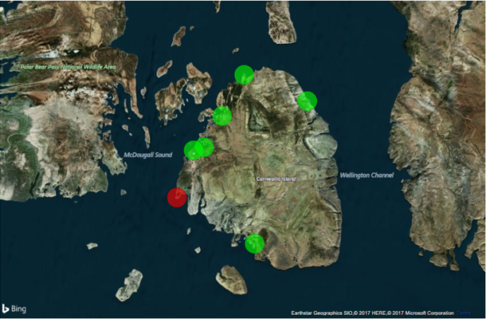

Modern cloud service providers (CSPs) provide a variety of services that can be used alone or combined in different ways to solve specific business problems or technical challenges. Some of these services can be considered "core" in that they provide an abstraction layer over physical resources in the cloud data center. Core resource types include compute, storage, and networking resources.

There was a time when these core resource types comprised the bulk of the services that CSPs offered. Today, however, major cloud platforms include hundreds of different services. These services fall into the following broad categories:

- Compute services
- Storage services
- Networking services
- Analytical services
- Identity services
- Internet-of-Things (IoT) services
- Machine-learning services
- Management and governance services
- Media-processing and presentation services
- Other services

Let us briefly survey the breadth and depth of the cloud services offered by major CSPs, starting with the core services that support compute, storage, and networking.

# Compute Services

Compute services form the backbone of contemporary cloud platforms, allowing customers to run programs on resources provided by the CSP. Common examples include virtual machines, services that run Docker containers in the cloud, high-performance computing (HPC) clusters, function runtimes that support serverless execution of code uploaded to the cloud, and web application hosting.

# Storage Services

Modern cloud platforms support a variety of ways to store and access data. These start with basic object and file storage with options for managing short and long-term retention behaviors. They also include relational and non-relational (NoSQL) database services, typically offered as PaaS services so that the CSP incurs the burden of licensing and maintenance. Today, most users can log into their CSP's Web site and deploy a MySQL or PostgreSQL database in a matter of minutes. Or, if they prefer, they can create a graph database, a key-value database, or a document database using services such as AWS Neptune and Azure Cosmos DB. In addition to supporting proprietary databases such as Microsoft SQL Server and Oracle, most major cloud providers also support PaaS versions of popular open-source databases such as Cassandra, MariaDB, and MongoDB.

Other storage services provided by CSPs include mechanisms to help move data into the cloud. These include dedicated hardware appliances that can be installed in local data centers and that interact with cloud-based storage. They also include a range of data-movement services, up to and including cargo trucks that transport vast quantities of data from a customer's location to a cloud data center.

# Networking Services

Given that cloud-based virtual machines are accessed over the Internet, virtual-machine services would be useless without virtual networks to support them. Indeed, creating a VM in the cloud typically means creating a virtual network to go with it. Some tools create a virtual machine and a network to go with it in one step; others require the network and the components that comprise it to be created separately.

CSPs support the creation of virtual networks (VNets) and network appliances such as virtual Network Interface Cards (NICs) and IP addresses to allow virtual machines to be accessed over the Internet and interconnected. Direct connections are available to link on-premises networks to network backplanes managed by the CSPs. Virtual private network (VPN) gateways provide another option for integration with on-premises networks, as well as with other cloud-hosted networks. Virtual firewalls regulate traffic entering or moving across virtual networks, while traffic managers perform the critical task of load balancing and allow customers to specify how traffic is routed to various data centers, for example, directing traffic from users in India to a web application in a South Asian data center while serving users in the United States with the same application running in a U.S. data center.

Nearly anything that can be done with a physical network can be accomplished with a virtual network, too, and can typically be done in minutes, anywhere in the world, without investing a single dollar in network switches, interface cards, or other networking hardware.

# Analytical Services

The era of big data is upon us, and organizations large and small are investing in analytics in order to make use of the data they have accumulated, grow their businesses, and better serve their customers. Big data often requires vast amounts of storage and commensurately vast amounts of compute power. That's why cloud service providers have invested heavily in making analytical services available to their customers, and why the cloud is one of the single greatest factors in the explosion of analytical workloads.

Examples of analytical services include petabyte-scale data warehouses and data lakes, real-time stream processing and extract-transform-and-load (ETL) processing, automatic cataloging of data, search as a service, and reporting solutions. Many CSPs also offer managed versions of popular big-data tools such as Apache Hadoop and Apache Spark. It can take months to plan for, procure, deploy, and configure an on-premises Spark cluster, an undertaking that is not uncommon at large universities and research institutions, but the same cluster can be provisioned in minutes in the cloud and then deleted when it is no longer needed to avoid paying for resources that aren't being used.

# Identity Services

Security is critical in applications that run on-premises, and it is no less critical for workloads that execute in the cloud. One of the cornerstones of security is *identity*, which defines users and groups of users and provides a foundation for controlling access to cloud resources via role-based access control (RBAC). Identity services give CSP customers the tools they need to manage and monitor users, groups, and roles. These services work hand in hand with *directory services* to manage authentication, authorization, and governance.

Applications can be configured to leverage these services as a platform for defining Identity Providers (IdPs) that govern both internal and external user access. With modern cloud platforms, for example, it is a relatively simple matter to create applications that authenticate users using third-party identities established on social-media platforms such as Facebook, or using Microsoft or Google accounts. This absolves application developers from the responsibility of managing and securing login credentials and reduces the potentials for data breaches. Identity services can also be used to govern relationships and interactions between the applications themselves and the resources that they use.

# Internet-of-Things (IoT) Services

One of the drivers for the explosion of data that has occurred in recent years is the Internet-of-Things (IoT), in which sensors, mobile phones, web apps, and even ordinary household appliances transmit data over the Internet to be collected in data repositories or analyzed in real time using stream processing engines such as Spark Streaming. Gartner estimates that the number of IoT devices in use will increase from 14 billion in 2019 to 25 billion by 2021[1][^1]. With this comes the necessity for cloud services that can scale to handle data from millions of devices, warehouse the data, and extract insights from the data, all while keeping the data secure both in transit and at rest.

Modern cloud providers offer a variety of services to handle IoT workloads. Services such as Azure IoT Hubs support secure connections between devices and cloud services and scale so that they're capable of handling millions of events per second. Services such as Amazon Kinesis permit data transmitted from IoT devices to be processed and analyzed in real time. And services such as Google BigQuery provide warehouse-scale repositories for data and make querying it as simple as querying a local database.

Cloud-based IoT services aren't just being used to grow businesses; they are improving the planet, too. One example comes from the Brazilian rain forest, where Microsoft Research partnered with the Sao Paulo Research Foundation and the University of Campinas to deploy hundreds of sensors throughout the forest to better understand how carbon dioxide, water, nitrogen, and other nutrients cycle through plants, animals, and microorganisms[2][^2]. Another example is a project undertaken in 2018 to fight illicit logging in the rain forest by embedding sensors in trees and tracking their movement as they are trucked to sawmills[3][^3].

# Machine-Learning Services

The cutting edge of computing today lies in machine learning (ML) and the subset of machine learning known as deep learning, which underlies most contemporary forms of artificial intelligence (AI). Many ML and AI models require an HPC cluster outfitted with specialized graphics-processing units (GPUs) to train in a reasonable amount of time. The cloud has helped advance the state of the art in ML and AI by commoditizing access to those resources, making popular tools such as Jupyter notebooks available as a service, offering prebuilt VMs containing popular ML/AI frameworks such as Scikit-learn and TensorFlow, and offering applications for building, training, and testing machine-learning models, complete with GPU support, in the form of SaaS services accessed through a browser.

Major cloud providers also make ML and AI available as a service by exposing pre-trained models through REST APIs. These APIs make it possible to analyze text for sentiment, build conversational bots, translate speech from one language to another in real time, identify objects in photos, identify faces in photographs, quantify emotion in those faces, and more. Tasks that would have once required a staff of highly trained data scientists and an investment in large-scale compute resources, whether on-premises or in the cloud, can now be incorporated into application programs by developers who have little or no formal training in machine learning and artificial intelligence.

# Management and Governance Services

Management and governance services provide CSP customers with the ability to analyze, protect, and tune their cloud deployments. These services include disaster-recovery functions such as backup and replication, deployment-regulation services that enforce rules on the types and configuration of services that can be used, configuration automation, and monitoring services that provide insights (and in some cases, real-time or near-real-time alerts) into performance and security issues.

# Media-Processing and Presentation Services

Processing and storing video often taxes on-premises compute and storage resources to their limits. Leveraging cloud resources for these tasks provide many economic and productivity benefits. To that end, modern cloud providers offer services that facilitate media encoding, storage, caching, and on-demand streaming.

# Other Services

CSPs offer many other services which do not fall into the categories above. Examples include:

- Mapping services that provide access to geospatial, routing, and traffic data.

- Mobile-support services that provide application deployment management and push-notification functionality for mobile applications.

- Mixed-reality services that provide 3-D spatial and rendering support for immersive applications.

- Blockchain services that provide platforms for building applications that leverage distributed ledger technology.

- Integration services that help distributed applications efficiently and reliably communicate with each other.

The cloud is continually evolving, and with that evolution comes new types of services and improvements to existing services. We have come a long way since the early days of cloud computing when "the cloud" was primarily a place to run workloads in virtual machines and park large volumes of data. Today, the cloud is best characterized as a diverse array of services designed to solve business problems in a manner that is both highly scalable and cost-effective to customers.

# Case Study: Save the Polar Bears!

All of the aforementioned services work independently, but cloud architects frequently combine these services to form end-to-end solutions designed to solve specific business problems. Figure 2.1 shows one such solution, one that combines several services provided by Microsoft Azure to provide a near-real-time analysis of polar-bear sightings in a region of the Arctic.

_Figure 2.1: Combining services to build end-to-end solutions._

In this solution, motion-activated cameras positioned at strategic locations throughout the Arctic snap pictures of wildlife. Each photo is deposited in Azure Blob Storage, and each time a photo is taken, an event containing information about the photo, including when it was taken, where it was taken, and its URL in Blob Storage is transmitted securely over the Internet to an Azure IoT Hub. From there, the event is forwarded to Azure Stream Analytics, which examines the event in the context of recent events and determines whether the photo *might* contain a picture of a polar bear.

If the answer is yes, an Azure Function retrieves the corresponding photo from Blob Storage and passes it to Azure's Custom Vision Service, which has been trained to determine with a high degree of certainty whether a picture contains a polar bear. The Azure Function writes the result to an Azure SQL Database. Microsoft Power BI monitors the database and updates a dashboard to show where polar bears are being spotted (Figure 2.2).

_Figure 2.2: Power BI dashboard showing polar-bear sightings._

The entire system runs in the cloud with the exception of the cameras that snap the photos. Solutions such as these are typical of the rich solutions being deployed in the cloud by organizations large and small. Architects design the solutions, but administrators assume responsibility for deploying them, getting them running, and keeping them running. This is one reason cloud administrators are in high demand in today's workforce, and why an investment in learning cloud computing can pay great dividends down the road.

### References

1. _Network World (2018). *Gartner's top 10 IoT trends for 2019 and beyond*. <https://www.networkworld.com/article/3322517/a-critical-look-at-gartners-top-10-iot-trends.html>_

1. _"Microsoft Research Blog (2014). *Cloud computing helps make sense of cloud forests*." <https://www.microsoft.com/research/blog/cloud-computing-helps-make-sense-of-cloud-forests/>._

1. _Gemalto (2018). *Gemalto and Cargo Track team up for a Successful Sting Operation*._

[^1]: <https://www.networkworld.com/article/3322517/a-critical-look-at-gartners-top-10-iot-trends.html>  "Network World (2018). *Gartner's top 10 IoT trends for 2019 and beyond*."

[^2]: <https://www.microsoft.com/research/blog/cloud-computing-helps-make-sense-of-cloud-forests/>  "Microsoft Research Blog (2014). *Cloud computing helps make sense of cloud forests*."
