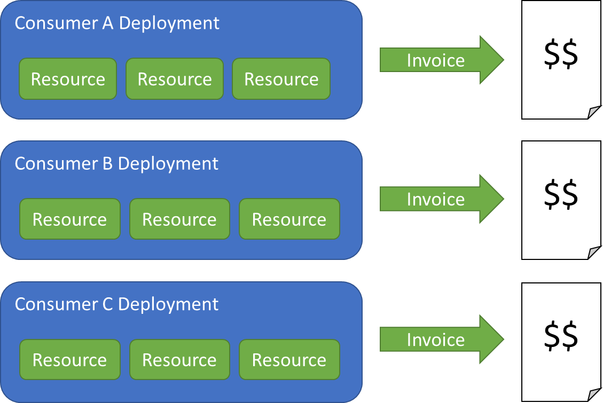
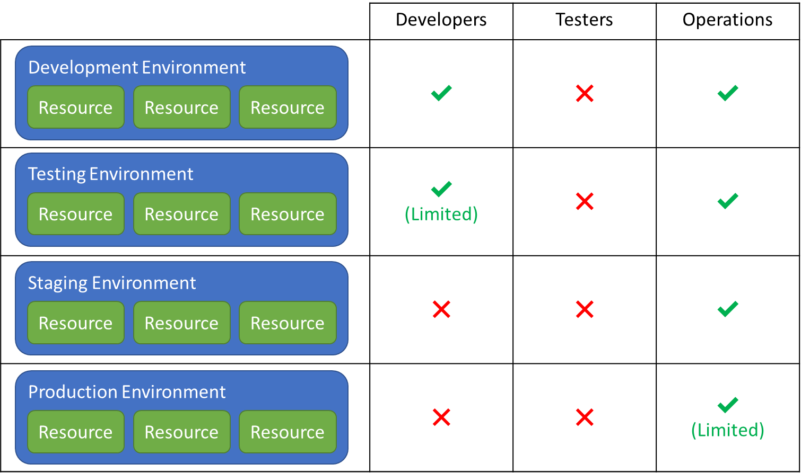
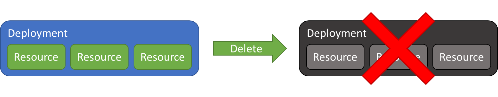
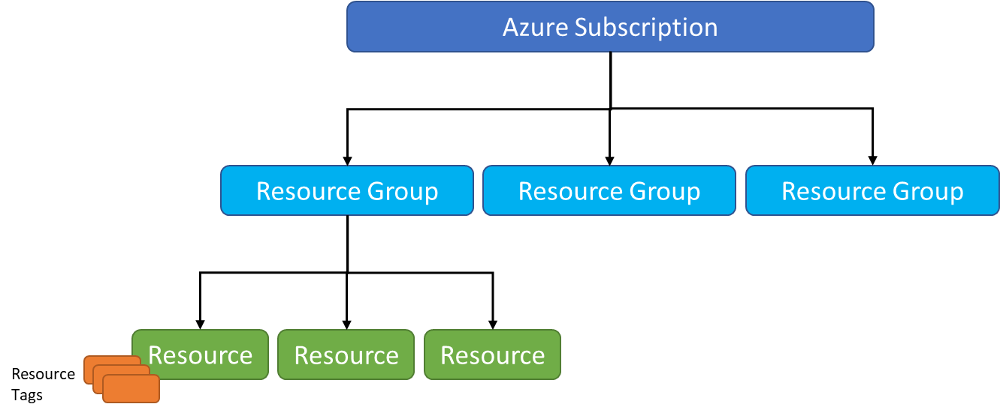

Solutions deployed to the cloud come in many shapes and sizes. Some may be simple single-resource deployments; others may involve dozens of related resources that are combined to form end-to-end solutions. In order for customers to effectively manage their resources, cloud service providers offer tools and mechanisms for organizing resources into logical groups.

There are three primary motivations for grouping cloud resources:

- **Billing**: Aggregate the costs of individual resources into a single cost for the group

- **Security**: Group resources so that access to them can be controlled as a group

- **Lifetime-management**: Group resources so that an entire solution can be deleted by deleting the group rather than deleting individual resources, or to work within limits imposed by CSPs

Let's examine each of these motivations and understand why the ability to create logical groupings of resources is a vital tool for cloud administrators.

# Organizing for Billing

CSPs provide detailed billing statements for each cloud resource that you provision. But if you provision a set of resources and connect them to form an end-to-end solution as shown in Figure 2.1, you may care less about the cost of the individual resources than the cost of all the resources combined. This is especially true if you deploy separate instances of the solution for separate customers and need to know precisely how much to charge each one (Figure 2.5). Even if you're not deploying multiple instances of the solution, it may be useful to aggregate resource billing by department or some other internal cost-center. Organizing resources into logical groups provides you with this flexibility. You still get detailed costs for individual resources, but you also receive aggregate costs for the groups you create.

_Figure 2.5: Organizing resources for billing._

In some cases, a strict separation is not necessary. It may be desirable to examine resource costs across several dimensions -- for example, by customer, by department, and by resource type. ("How much did I spend on Oracle last month, and how does it compare to my spend on MySQL databases?") Most CSPs provide tooling that cloud administrators can use to aggregate costs in various ways and include this information in billing reports.

# Organizing for Access Control

Access control is an important aspect of cloud resource management. Maintaining the security and integrity of resources that have been deployed depends on being able to give different users or groups of users varying degrees of access to those resources. To facilitate this, CSPs allow resources deployed by their customers to be grouped, and they allow security permissions to be assigned to each group.

A common example is a scenario in which a team developing a web application deploys four separate instances of the app and the services that it utilizes: one for production, one for staging, one for testing, and one for development (Figure 2.6). Members of the development team may be granted broad access to the development deployment but be restricted to read-only access to the resources in the testing deployment, which the testing team controls. Typically, only members of the operations team are given access to the production and staging deployments. They decide when a build pushed to staging is ready for public consumption, and they decide when to promote the app that is currently in staging into production.

_Figure 2.6: Organizing resources for access control._

# Organizing for Lifetime Management

Another motivation for grouping cloud resources is so that the lifetimes of the resources can be managed as a group. One of the benefits of cloud computing is short provisioning and deprovisioning times. Complex solutions consisting of tens or even hundreds of interconnected cloud services can be deployed in minutes and torn down in minutes. (Because it takes a finite amount of time to delete a cloud resource, cloud service providers typically stop billing for a resource the moment deletion is requested.) You can spin up 100 virtual machines to run a complex numerical analysis, and you can delete them when you're done to avoid paying for services that you're not using. Moreover, if you group the virtual machines into a logical unit, you can delete them all with a single action by deleting the group itself, as shown in Figure 2.7.

_Figure 2.7: Organizing resources for lifetime management._

# Organizing for Resource Limits

Most CSPs place limits on the number of resources of a given type that can be created in a geographic region or a single billing account. These limits are often referred to as "quotas." Azure, for example, limits the number of storage accounts that can be created within a region under a single subscription to 250[1][^1]. In AWS, the Amazon Simple Storage Service (Amazon S3) limits you by default to 100 buckets per account per region[2][^2]. Note that these quotas can be increased by submitting requests to the CSP.

# Case Study: Azure Subscriptions, Resource Groups, and Tags

CSPs take different approaches to allowing customers to organize the resources that they deploy. Microsoft Azure supports a hierarchy consisting of subscriptions, resource groups, and tags to support the use cases described above. The relationship between these tools is shown in in Figure 2.8.

_Figure 2.8: Resource organization hierarchy in Microsoft Azure._

In Azure, a *subscription* is required for creating cloud resources. Billing is handled on a per-subscription basis. Azure offers several different subscription types which govern service pricing as well as payment details, such as whether the subscription is billed via credit card or invoiced through purchase orders. Furthermore, subscriptions provide one level of access control. Within an Azure subscription, users and groups of users can be assigned different permissions using role-based access control (RBAC), which we will discuss in a subsequent module. Resource quotas are also applied per-region at the subscription level.

Resources created in an Azure subscription are organized into *resource groups by the customer*. A subscription can contain any number of resource groups. Each resource belongs to one and only one resource group. Billing statements specify which resource groups individual resources are members of and contain aggregate billing information for each resource group.

Resource groups also provide a plane for access control beyond what is set at the subscription level. For example, every member of the development team may be given access to a subscription, but within that subscription, developers may have different permissions for different resource groups. Resource groups can also be used to scope resource lifetimes. Deleting an Azure resource group deletes all the resources that the group contains.

Finally, Azure allows *tags* to be applied to individual resources as well as resource groups. A tag is simply a key-value pair containing user-defined metadata. This metadata can be queried to find resources that share a common tag and can also be used to group billing data. Consider a scenario where independent subscriptions are created for the development, staging, testing, and development environments for a web app, with each environment comprising multiple distinct cloud services serving functions such as cataloging, ordering, and inventory. By labeling each resource with a tag such as "Purpose: Catalog" or "Purpose: Inventory," an Azure administrator can isolate the cost of the resources by the functions that they perform. One query, for example, could return a consolidated cost for all of the cloud services devoted to cataloging, which might include PaaS database services as well as a Redis cache that speeds performance by caching query results in memory.

### References

1. _Azure subscription and service limits, quotas, and constraints; Storage limits: <https://docs.microsoft.com/azure/azure-subscription-service-limits#storage-limits>._

1. _AWS Service Limits -- Amazon Simple Storage Service (Amazon S3) Limits: <https://docs.aws.amazon.com/general/latest/gr/aws_service_limits.html#limits_s3>._

[^1]: /azure/azure-subscription-service-limits#storage-limits  "Azure subscription and service limits, quotas, and constraints; Storage limits."

[^2]: <https://docs.aws.amazon.com/general/latest/gr/aws_service_limits.html#limits_s3  "AWS Service Limits -- Amazon Simple Storage Service (Amazon S3) Limits."
