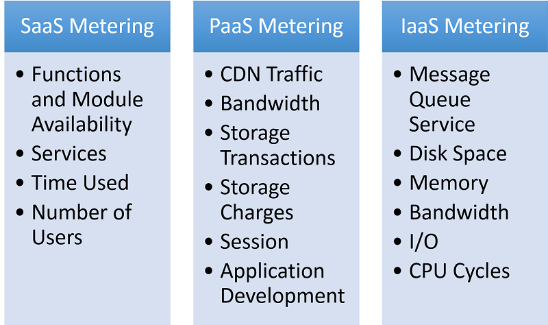
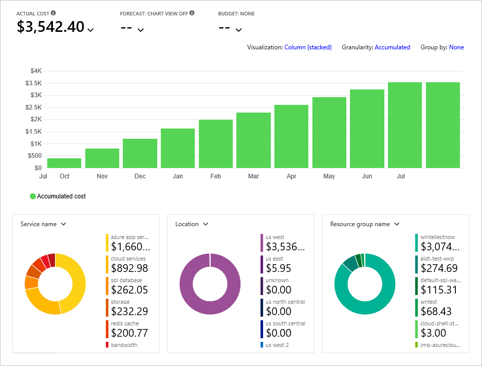

A fundamental precept of cloud computing is that cloud service providers (CSPs) charge their customers for use of their services. For accurate billing, providers must meter usage carefully and include metering facilities in their infrastructure. Metering and monitoring are mission-critical for both CSPs and their customers.

A CSP's revenue stream and the trust placed in that CSP by its customers depend on the accuracy of metering and monitoring. Considering AWS and Azure revenues in 2019, losing resource-usage data for a couple of hours could cost Amazon and Microsoft millions of dollars. Conversely, overcharging customers for even a single hour could adversely affect these providers' credibility.

From the customers' point of view, the cost of cloud resources constitutes an important part of their expenses. In order for cloud clients to make budget plans, they must receive predictable bills every month. This poses important challenges to cloud providers.

# Challenges in Monitoring and Metering

Each cloud resource that a CSP offers has an associated cost or set of costs. Calculating fixed costs such as staff, facilities, and servers is a straightforward exercise. Tracking usage costs that vary from minute to minute, however, requires constant metering and monitoring.

A key advantage of cloud computing is that customers "rent" resources from the CSP and only pay for the resources that they use. Computing these costs, however, isn't trivial. For example, provisioning a virtual machine in Azure incurs a per-hour cost for the VM, a per-GB-month cost for storage, and a per-GB-month cost for data egress. Customers also pay for the virtual network to which the VM belongs and the resources that comprise it. The challenge for the cloud service provider is to accurately capture usage metrics for all of these resources. Figure 2.9 shows a typical breakdown of the metrics that apply to individual service models. Metering and monitoring usage for millions of customers employing tens or hundreds of services every month generates gigabytes of logs each minute, and customers must be charged accordingly. The most popular model used to define such metrics is called the chargeback model.

_Figure 2.9: Metering in different types of cloud services._

# Chargeback Model

In the chargeback model, service owners measure resource usage and charge costs back to their customers. Traditionally, the chargeback model is easy to implement for on-premises solutions since an IT department can divide its budget for each business unit that it serves and track costs for software licenses, stand-alone servers, etc. Chargeback is more challenging with cloud deployments because the CSP must factor in rates (which sometimes vary from customer to customer) and time-of-consumption.

# Case Study: Azure Cost Management

Azure Cost Management is a service that helps organizations plan their spend on cloud services and monitor that spend over time. It works with both Azure and AWS. It provides several key features to organizations that use it, including cost analysis, budgeting, and recommendations (Figure 2.10).

_Figure 2.10: The Azure Cost Management portal[1][^1]._

**Cost analysis** provides tools for analyzing costs and spotting patterns, trends, and anomalies. Predefined views are provided to get users up and running quickly examining accumulated costs and cost forecasts. Customized views can also be created.

**Budgeting** permits users to establish targets or limits that can subsequently be used to drive organizational accountability. In addition to providing charts and graphs comparing spends to budget targets, Azure Cost Management can be configured to generate email alerts when budget thresholds are reached for example, when the spend on a resource or set of resources reaches 90% of a \$5,000 per-month allocation.

**Recommendations** help identify instances in which current resource allocations (and therefore costs) exceed what is needed to accomplish the task at hand. For example, if Azure determines that a lower database service tier would be adequate based on your usage patterns to date, it might recommend that you switch to a lower tier in order to reduce cost.

Cost Management is available for all Azure subscriptions. AWS costs are incorporated by integrating with the Cost and Usage reporting feature in AWS. Reports are stored in AWS S3 storage buckets and imported into Azure Cost Management for analysis.

### References

1. Source: <https://azure.microsoft.com/services/cost-management/>

[^1]: <https://azure.microsoft.com/services/cost-management/>
