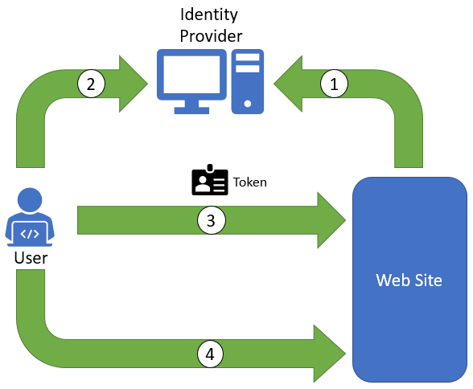

A common challenge in computing is accurately determining who is using a system at a given point in time. An end user's identity is important for several reasons, the most significant of which is to limit that user's ability to access resources they're not entitled to access and perform actions they're not entitled to perform. For example, a person using web email shouldn't see emails sent to other users. Similarly, when a database administrator accesses a cloud service, they shouldn't be able to access databases for which they have no responsibility or perform other administrative tasks that are beyond the scope of their job duties. None of this is possible if we don't know who the user is.

Examples of how identity is established and presented for verification in everyday life are numerous. Many countries/regions use ID numbers such as social-security numbers to identify individuals for tax purposes or grant them access to governmental programs. Law enforcement requires that automobile drivers present drivers' licenses and vehicle-registration receipts to identify themselves and prove they're qualified to operate a motor vehicle. International border-control agencies require travelers to carry passports to indicate their citizenship.

In the online world, identity is typically determined by challenging a user to provide credentials that uniquely identify them--for example, a user name and password, a fingerprint, or, as is becoming increasingly common on smart phones, a face. (Recent advances in artificial intelligence have elevated facial recognition from magic to science.) They might be challenged to enter credentials when they first log into the system, which is typically the case with administrative portals for cloud services. Or they might not be challenged until they access a secure resource such as a web page that's available only to authenticated users. *Authentication* is the process of determining who someone is--that is, confirming their identity beyond a reasonable doubt. It's separate from *authorization*, which determines what a user can and can't do once they're authenticated.

Examples of how online identity is determined are both varied and numerous. They're also highly scenario-dependent. Let us consider two common examples of how authentication is used to establish a user's identity. The first involves a public web site that requires a user to log in before accessing some or all of the web site's resources. The second involves authenticating users who access file shares, network devices, and other internal resources. In both cases, determining the user's identity before granting them access is paramount to implementing a secure and robust system.

## Authenticating external website users

One common use of digital identity is to sign into a web page that is only available to authenticated users -- for example, users who have purchased subscriptions to the online edition of a newspaper. The first decision that the developers of the web site have to make is whether they will write the logic that permits users to register (create accounts) and log in themselves, or use a third-party identity provider. An *identity provider* is a service that authenticates users using standard protocols such as OAuth 2.0, OpenID Connect, and SAML 2.0, each of which implements mechanisms for ensuring the authenticity of the exchanged information. For example, they use digital signatures to ensure that identity information isn't altered as it travels over the Internet.

There are many digital identity-provider services. Social-media companies such as Facebook and Twitter can act as identity providers, allowing users to use credentials established on their sites to access other sites. Microsoft and Google offer identity-provider services as well, allowing users to log into other sites using their Microsoft or Google accounts. This is precisely what happens when you use your Microsoft account to log into Outlook Mail or your Google account to log into Gmail, YouTube, or other sites that support Google accounts. Cloud service providers offer identity-provider services as well as means for integrating themselves or other identity providers into web sites. With Microsoft Entra ID, for example, it is a relatively simple matter to build a web site that accepts private logins, "public" logins using Facebook, Twitter, Microsoft, or Google accounts, or any combination of the two.

Using third-party identity providers to authenticate users offers three advantages:

**Stronger security**: Third-party identity providers such as Microsoft and Google have deep experience storing and exchanging login credentials securely. Some of the high-profile security breaches that have occurred in recent years happened because developers who weren't experts in security implemented their own sign-in systems and fell victim to common mistakes such as storing plaintext passwords in a database. Passwords should *never* be stored, even if encrypted. One-way password hashes should be stored instead, and well-known techniques such as *salting* should be used to make passwords more difficult to crack[1][^1].

In addition, many identity providers support *multi-factor authentication* (MFA) to make stolen credentials harder to use. An example of MFA at work is when you log into a web site and are prompted to enter an access code sent by SMS to your cell phone. Finally, third-party identity providers frequently implement *Conditional Access*, which erects additional security barriers on the fly if warranted by login history, geographic location, or other factors. This is why you're sometimes prompted for additional information if you log into a web site while you're traveling. The identity provider detects an IP address from which you haven't logged in before and adds an extra layer of security to the authentication process.

**Support for single sign-on (SSO)**: Using 20 user names and passwords to log into 20 different web sites is not only an inconvenience, it's a security issue. Users faced with managing dozens of user names and passwords are more likely to adopt weak security postures, selecting easy-to-guess passwords or using the same password for multiple accounts. One report indicates that the number of accounts users must keep track of doubles every five years -- a phenomenon known as *account sprawl*.

By contrast, if 20 unrelated web sites allow users to log in with their Microsoft accounts, Google accounts, or Facebook accounts, one set of credentials can be used for all 20 sites. This is known as *single-sign on*. It reduces account sprawl (and therefore enhances security) by reducing the number of credentials users are required to manage.

**Less development time**: Writing your own code to manage logins and login credentials also means writing code to create new accounts, change passwords, recover forgotten passwords, implement MFA and Conditional Access, and more. Third-party identity providers offer these services for free. Most of the coding work involves communicating with identity providers using established protocols, and there are numerous libraries available to help with that. It is not uncommon when using identity providers to implement a complete account-management and login system in less than 100 lines of code. The code that the identity provider wrote, by contrast, is several orders of magnitude lengthier and more complex.

A simplified representation of the interaction between a user and a web site that uses a third-party identity provider to authenticate users is shown in Figure 3.1:

1. The site is configured to use an identity provider that it trusts to authenticate users. When the user navigates to the site or accesses a page that requires authentication, the site contacts the identity provider and requests that it authenticate the user.

1. The identity provider challenges the user to enter her credentials. The provider uses those credentials to establish the user's identity and issues a secure token asserting that identity. The token is digitally signed to prevent tampering, and it sometimes includes information such as a user's first and last name and e-mail address.

1. The browser transmits the token to the web site. The web site verifies the authenticity of the token.

1. If validation succeeds, the user is allowed to proceed.

_Figure 3.1: Authenticating users of a web site._

Typically, once the web site has confirmed the validity of the token, it issues an encrypted HTTP cookie with information about the user's identity so the user can return to the page for some period of time without having to log in again. The cookie effectively authenticates the user in subsequent requests as the ID token did following the initial request.

An important feature of this flow is that the site never sees the user's credentials. In fact, it is not aware of how the user was authenticated. Consequently, responsibility falls to the identity provider to store the user's credentials and do so in a secure manner. Moreover, the web-site owner can change the physical mechanism used to authenticate users -- for example, switch from user names and passwords to fingerprints -- by making a configuration change to the identity provider rather than rewriting a lot of code.

## Authenticating users internal to the organization

The discussion in the previous section is relevant to a software-development team building a web site that supports authenticated users outside the organization. But suppose you're an IT administrator and the goal is to authenticate users *within* the organization in order to secure access to file shares and other on-premises resources. This requires a different approach to identity.

Most enterprises store identity information regarding users within the organization (for example, the employees of a company) on-premises in a *directory service*. The service stores user names, password hashes, and other information in a database -- typically a distributed database that supports hierarchical graphs -- and surfaces its contents through standard protocols such as the *Lightweight Directory Access Protocol*, or LDAP. (Some directory services use proprietary protocols, but these are becoming less common as organizations increasingly migrate toward open source and open standards.) As users enter and exit the organization, administrators update the directory accordingly. When a user leaves the organization and is removed from the directory, she can no longer access resources in the organization's network.

One of the most popular directory services is Microsoft's Active Directory, which is a family of services designed to store information about users and secure access to networked resources. Active Directory stores *objects*, which can represent users, computers, file shares, printers, and other resources. Objects can be organized into *domains*, domains can be organized into *trees*, and trees can be organized into *forests*, providing the flexibility needed to model organizations large and small.

It is not important to understand how directory services work, the protocols that they employ, or the flow of information that takes place using those protocols. What's important is to know that directory services provide a central repository for identity information regarding users within an organization. As you will learn, on-premises directory services can be extended so that they apply to cloud resources as well, allowing organizations to authenticate users who access cloud resources the same way they authenticate users who access on-premises resources. Among other things, this permits administrators to secure access to cloud resources using the same identities that they use to secure access to on-premises resources. Moreover, it allows users to use one set of credentials to access both.

### References

1. _Auth0 (2018). *Adding Salt to Hashing: A Better Way to Store Passwords*. <https://auth0.com/blog/adding-salt-to-hashing-a-better-way-to-store-passwords/>._

[^1]: <https://auth0.com/blog/adding-salt-to-hashing-a-better-way-to-store-passwords/>  "Auth0 (2018). *Adding Salt to Hashing: A Better Way to Store Passwords*."
