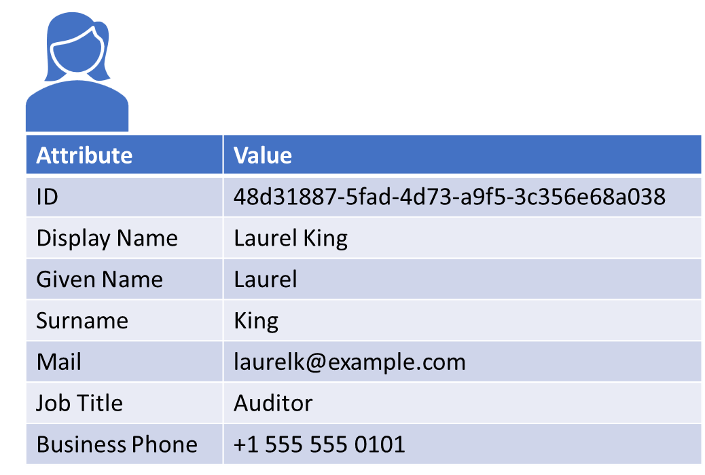
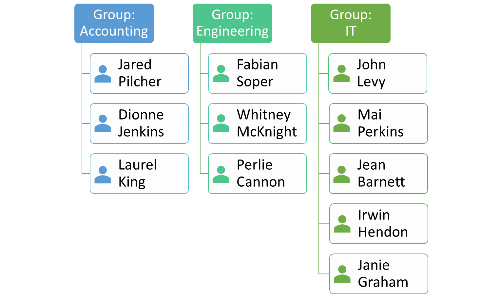

Identity plays an important role in cloud administration because permissions applied to cloud resources are useless if we don't know who is accessing those resources. If Bob lacks permission to delete a VM but attempts to delete it anyway, we can only stop him if we know that it's Bob. However, if Bob is one of thousands of employees in the organization and permissions must be defined for each individual user and each individual cloud resource, IT will be overwhelmed trying to lock everything down so that only users who *should* be able to access those resources *can* access those resources.

As we will learn later, permissions can be applied not only to individual cloud resources, but to groups of cloud resources. Similarly, users such as Bob can be placed into groups and permissions applied to cloud resources can reference user groups as well as individual users. Modern identity-management systems support the concept of user groups in order to simplify cloud administration and reduce the likelihood of error. An administrator is less likely to make a mistake if she can apply permissions at the group level rather than for each and every individual.

Identity-management systems must be able to assign identities to groups as well as individual users. But that's not all. A person might authenticate by entering a user name and password or placing a finger on a biometric reader. Software applications sometimes have to authenticate, too, because they may communicate with other services or applications that will only respond if they know the identity of the caller. As such, it is just as important to be able to assign identities to applications as it is to assign them to users and groups of users.

The consequence of all this is that enterprise directory services support three types of entities: users, groups of users, and applications. Users represent people in an organization. Groups are collections of users or other entities, and application entities enable identities to be assigned to running applications. Collectively, these are known as *security principals*. Let's examine the three types of security principals and discuss their importance to cloud administration.

## Users

A user is a registered identity that has permission to perform some function (or set of functions) within a computer system. One user might be granted permission to upload data to a storage service provisioned in the cloud but have no ability to provision or deprovision such services. Another might have more global permissions that allow them to provision and deprovision services at will.

Users are abstractions over individual persons within an organization. As such, they have attributes that might include names, phone numbers, addresses, and other features that distinguish one person from another (Figure 3.2). These attributes also help to make user information human-readable. It is easier for an administrator to refer to "Laurel King" than "48d31887-5fad-4d73-a9f5-3c356e68a038". Modern directory services enable administrators to define the attributes stored on behalf of individual users using whatever schema makes sense for the organization.

_Figure 3.2: Example of the attributes describing a user._

## Groups

Because an identity system must scale to handle large numbers of users, it is useful to create abstractions over collections of similar users. A key abstraction is the *group*. Groups are named entities in an identity-management system. They can reflect organizational structure (for example, Accounting, Engineering, or IT), job functions (Developer, Tester, or Administrator), geographic locations, or anything else that lends itself to logically organizing users. In most identity-management systems, users can be members of multiple groups, permitting a Developer to be assigned to the Accounting department in the Pittsburgh office. Figure 3.3 shows a group structure that organizes users by department.

_Figure 3.3: Users organized into departmental groups._

Groups support applying management settings in bulk, which can simplify onboarding and managing users in an organization. As users join an organization, administrators don't have to individually assign specific permissions to new users -- instead, they add users to existing groups and focus on managing group permissions. Assigning permissions at the group level reduces chances for error and makes it easier for administrators to quickly determine what permissions a user has simply by examining the user's group memberships.

## Applications

Additional considerations are required when a cloud-hosted application makes calls to a service that requires authentication. Credentials could be stored in configuration data accompanying the application, or they could be embedded in the application's code. Both, however, present a security risk. Credentials stored this way can be read by users who have access to the cloud service that hosts the application, or to the source code of the application itself.

As an alternative, cloud service providers enable the applications that they host to be supplied with an identity assigned by the system at runtime. This feature is known as Managed Identities in Azure and Service Accounts in GCP. AWS provides similar functionality by allowing you to attach roles to instances and leverage them to obtain temporary credentials for the application to use. The fact that the cloud solution "knows" about the application and can provide it with an identity for accessing secured resources removes the need to store credentials such as user names and passwords or access keys with the applications.
