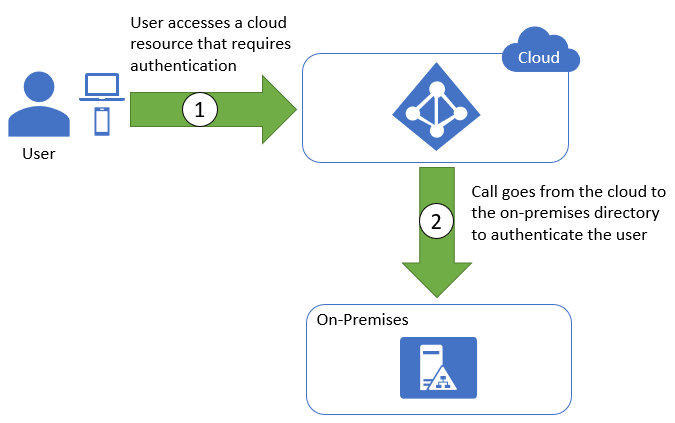

Many enterprises have deployed on-premises directory services such as Active Directory within their organization to store information regarding users and other entities. In some cases, these services have existed for decades, and the information stored in them is voluminous and crucial to the organization's operation.

When organizations such as these move to the cloud, one of the challenges they face is how to control access to cloud resources using the same user, group, and application identities that they use to control access to on-premises resources. They could use separate identities -- and separate credentials -- for on-premises resources and cloud resources, but this is less than ideal. If a user leaves the organization, they must be removed from the cloud directory as well as the on-premises directory. In addition, it requires users to juggle multiple accounts, which is both an inconvenience and a threat to security.

Technologies exist to extend on-premises directory services to the cloud, simplifying administration of cloud resources and preventing users from having to log in with one set of credentials to access an on-premises resource and another set of credentials to access a cloud resource. One of these techniques is *federation*; another is *synchronization*. A separate but related challenge is how to allow external users -- for example, contractors who aren't part of the organization but are working on the organization's behalf -- to access the organization's cloud resources without issuing them credentials for *your* system. An elegant and often-used solution is *guest accounts*. Let's explore federation, synchronization, and guest accounts, and understand what they are and what role they play in cloud administration.

## Federation

Federation predates the cloud. Its purpose is to create a trust relationship between organizations so that Organization A can access Organization B's network resources *without* requiring Organization B to issue credentials to members of Organization A. Federation relies on standards such as WS-Fed, which define protocols used to broker identity information across systems. Federation services such as Microsoft's Active Directory Federation Service (ADFS) implement WS-Fed protocols and bridge identity systems so that Organization A identities can be used as *federated identities* by Organization B. Another way to think about federation is that it allows external users to access internal resources. That is, it extends an organization's identities beyond the organization's boundaries.

Suppose two companies named Contoso and Fabrikam forge a business alliance. Contoso wants Fabrikam employees to have access to certain file shares in Contoso's network and vice versa. The two companies federate their identity systems, allowing Fabrikam employees to access Contoso resources using the same credentials they use to access Fabrikam resources. When IT administrators who work for Contoso add users to the list of users permitted to access the file shares, they see Contoso employees *and* Fabrikam employees -- even though Contoso never created accounts for Fabrikam employees. That's federation in a nutshell.

Federation isn't limited to connecting different organizations' on-premises networks; it can also be used to extend on-premises identities to the cloud. Azure, AWS, and GCP offer identity-management solutions that enable on-premises directory services such as Active Directory to provide identity information to cloud services as well. If a user attempts to access a secured cloud resource, the request is redirected to the on-premises directory solution, which then authenticates the user as if they were accessing an on-premises resource (Figure 3.4). This provides for centralized management of users, credentials, and permissions. It also prevents users from having to use a separate account to access their own organization's cloud resources.

_Figure 3.4: Federated identity flow._

Federation is widely used by organizations to secure access to cloud resources using the same identity information that secures access to on-premises resources. But it is not perfect. It requires a reliable connection between the on-premises directory service and the cloud so the on-premises directory can be consulted each time a user accesses a cloud resource that requires authentication. One solution to that -- another means for sharing credentials between on-premises directories and the cloud -- is synchronization.

## Synchronization

Synchronization is an alternative to federation. With synchronization, on-premises directory information is periodically synchronized with a directory in the cloud. The chief difference between federation and synchronization is that with the former, authentication occurs on-premises, while with synchronization, authentication occurs in the cloud.

Synchronization is implemented by installing a synchronization service within the organization's on-premises systems (Figure 3.5). The service periodically synchronizes the user information between the on-premises directory and the cloud directory. All authentication is then performed against the cloud directory, which contains the same information as the on-premises directory.

_Figure 3.5: Synchronized identity flow._

A key operational difference between federation and synchronization is that the latter is more resilient to disruptions in connectivity. Synchronization doesn't require access to the on-premises directory every time a user accesses a cloud resource; it only requires access when synchronization occurs. The primary downside to synchronization is that changes made to the on-premises directory take time to propagate to the cloud. If an administrator adds Alice to the on-premises directory but synchronization occurs just once an hour, Alice won't be able to access secured cloud resources for up to one hour after the change is made.

Tools such as Microsoft Entra Connect are available for synchronizing directories. AADC synchronizes information stored on-premises in Active Directory with information stored in the cloud in Microsoft Entra ID. Amazon provides a similar offering in the form of AD Connector, as does Google with Google Cloud Directory Sync (GCDS).

Synchronization solutions are generally preferred to federation-based approaches. They typically incur less management overhead and do not require an always-available connection between directory services. This recommendation is echoed by the UK's National Cyber Security Centre[1][^1].

## Guest accounts

Another challenge for IT is how to handle users who are external to the organization. These users often include contractors, consultants, and interns -- users who aren't a formal part of the organization but need access to internal resources as if they were.

One solution is to create internal accounts for external users. Such accounts often use a prefix or suffix in the account names to denote their external nature. At Microsoft, for example, most external accounts have names such as v-jeffpro, where "v" stands for "vendor." This approach, however, is far from perfect. For one, it exacerbates account sprawl. ("Here's another user name to keep track of and another password that has to be changed every 60 days and conform to a policy that's unique to this organization.") It also increases the workload on administrators by increasing the number of accounts for which they are responsible and forcing them to establish a mechanism or process for propagating changes in the status of external users within their own organizations to internal identity-management systems. For example, if a consultant with "extern" credentials retires or takes a job somewhere else, their credentials need to be revoked so they can no longer be used to access your systems.

A better solution is to use *guest accounts*. Guest accounts are a special case of federated accounts. External users are "invited" to join an organization's identity-management system using the credentials from their own organization. A new user record is created, but when the guest user authenticates, they do so against their home organization. This eliminates the need for the user to manage an additional set of credentials. It also eliminates the need for IT to be aware when the user's status changes in their home organization. Once they are removed from the system by their home IT staff, they can no longer authenticate to either system.

### References

1. _National Cyber Security Centre (2019). *Securing Office 365 with better configuration*. <https://www.ncsc.gov.uk/blog-post/securing-office-365-with-better-configuration>_

[^1]: <https://www.ncsc.gov.uk/blog-post/securing-office-365-with-better-configuration>  "National Cyber Security Centre (2019). *Securing Office 365 with better configuration*."
