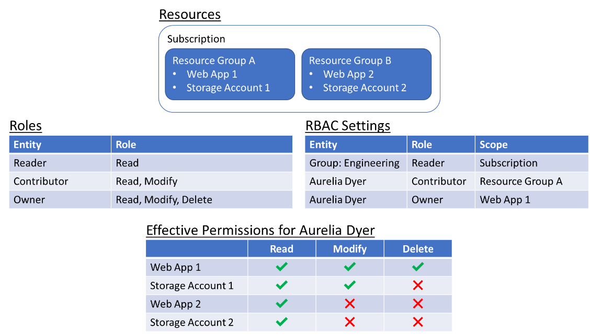

A key aspect of administering cloud services for an organization is controlling access to the cloud resources -- that is, making sure users who require access to a service or one of its components have that access, while others do not. This process is known as *identity and access management (IAM)*. In Azure, AWS, and GCP, IAM is achieved using a technique known as *role-based access control* (RBAC).

With RBAC, users or groups of users are assigned one or more *roles*. Each role has a descriptive name, and each uses permissions to define the action or actions that can be performed by its assignees on the resource or resources to which the role pertains. For example, a user assigned a role named "Reader" defined for a resource group might be able to view the resources in that resource group, but they might not be able to modify them or delete them.

A user's ability to access individual resources is governed by a combination of the roles assigned to them, the roles assigned to any groups the user belongs to, and the roles' resource scopes. A *resource scope* is a level in the resource hierarchy offered by the cloud service provider. In Azure, for example, roles can apply to individual resources, resource groups, entire subscriptions (in which case the role's permissions apply to all resources created under a given subscription), or groups of subscriptions. By applying role assignments to different scopes in the resource hierarchy, it is possible to achieve fine-grained control over who is permitted to do what within an organization.

In the example in Figure 3.6, a set of resources is provisioned within a cloud subscription and organized into two resource groups. A user group named Engineering is assigned a role named "Reader" that permits group members to view all resources created under the subscription. At the same time, a user named Aurelia Dyer is assigned a "Contributor" role that permits her to modify any of the resources in resource group A, and an "Owner" role that lets her delete the Web App resource in the same resource group. Let's assume that Aurelia is a member of the Engineering group. These permissions mean she can:

1. View all resources created under the subscription

1. Modify the two resources in resource group A -- for example, change configuration settings in Web App 1 or alter the replication settings for Storage Account 1

1. Delete the Web App 1 resource in resource group A

While Aurelia can see the resources in resource group B, she can't modify or delete them.

Figure 3.6: RBAC and effective permissions.

Given that a user can be assigned multiple roles, there may be some concern about how conflicting permissions are handled. Currently, major cloud service providers support "allow" permissions in their RBAC implementations, but provide little or no support for "deny" permissions. (Only Azure supports "deny" permissions, and only in limited contexts. If a "deny" permission conflicts with an "allow" permission, "deny" takes precedence.) Because "allow" permissions are additive, they cannot conflict with each other: a user's permissions are simply the sum of the various "allow" permissions at each applicable scope.
