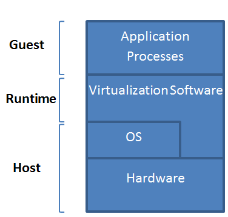
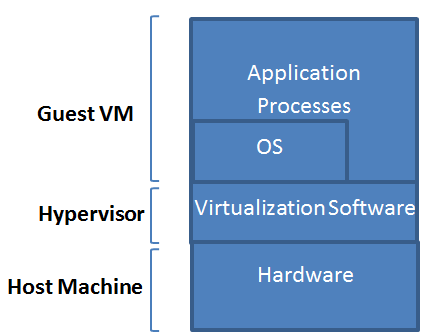
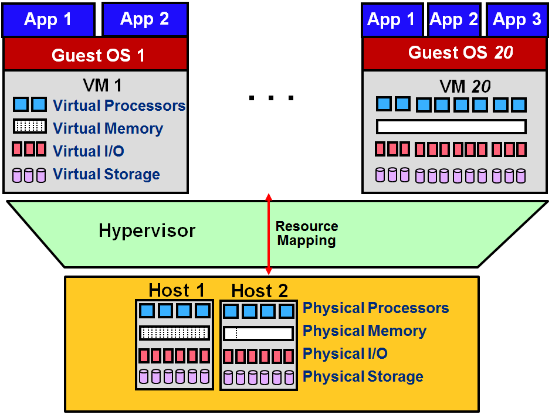

Virtual machines are the backbone of cloud computing. When you create an EC2 instance in AWS or a virtual machine in Azure, the cloud service provider doesn't dedicate a physical server to the instance or virtual machine. Instead, it creates a virtual machine on a physical server. That virtual machine may be one of many hosted on the server. But due to virtualization, the virtual machine looks and feels like a dedicated server. It is logically isolated from other virtual machines, and an errant program that crashes or otherwise compromises one virtual machine can't affect programs running in other virtual machines, even if they share a physical host. Moreover, a server hosting two VMs can run one operating system (for example, Linux) in one VM and another operating system (such as Windows) in the other.

Virtual machines find uses outside cloud computing as well. For example, a popular product named Parallels lets Mac users run Windows and macOS side by side by hosting Windows in a VM. Software developers frequently use VMs to test programs because virtual machines provide a consistent and isolated environment that is easily replicable from one computer to the next.

All of these virtual machines are instances of *system VMs*, which virtualize an entire system (physical machine). But there are also *process VMs*, which provide the basis for popular programming languages such as Java and C\#. Let's examine both types, discuss how they work, and understand why it is that of the two, it is system VMs that provide the foundation for cloud computing.

## Process virtual machines

A process VM (Figure 1) is a VM capable of supporting an individual process as long as the process is alive. A process VM terminates when the process that it hosts ends. From a process VM perspective, a machine consists of a virtual memory address space, user-level registers, and instructions for executing a program. According to this definition, a process in a general-purpose operating system can also be called a "machine." However, a regular process can only support program binaries compiled for the processor architecture or *instruction-set architecture* (ISA) of the host machine. Executing binaries compiled for an ISA different than that of the host machine -- for example, running programs compiled for ARM processors on machines equipped with Intel CPUs -- is not supported by regular processes. However, a process VM allows that to happen.

_Figure 1: Process VM._

Process VMs support ISAs that differ from host ISAs via *emulation*, which allows the interfaces and functionalities of one system (the source) to be implemented on a system with different interfaces and functionalities (the target). An example of emulation is executing a program compiled for the vintage 6502/6510 family of processors used by early Apple computers on an *x*86 processor. The abstraction of the process VM is provided by a piece of virtualizing software called the *runtime*. The runtime sits above the host operating system and the underlying hardware. It is this runtime that emulates the instructions and/or system calls when guest and host ISAs are different.

Process VMs have been around since the mid-1960s and were first used to convert intermediate languages generated by compilers into machine code for the host processor, in part to simplify the process of porting compilers to new processor architectures. They enjoy similar uses today. A Java Virtual Machine (JVM), for example, is a process virtual machine that compiles Java bytecode (the instructions emitted by a Java compiler) into native machine code and executes it on the host machine. Programs written in C\# and other languages supported by Microsoft's Common Language Runtime (CLR) also employ process VMs to compile to machine code the Common Intermediate Language (CIL) instructions emitted by compilers. Process VMs whose purpose is to execute intermediate languages produced by language compilers are sometimes referred to as *high-level language VMs*, or HLL VMs for short.

In summary, a process VM is similar to a regular process running on an OS. However, a process VM allows, via emulation, the execution of applications compiled for an ISA different than that of the host machine. In addition, HLL process VMs provide the foundation for popular managed languages such as Java and C\#. The term "managed" in this context refers to the fact that Java and C\# manage memory on behalf of their applications and provide safeguards against common programming errors such as misuse of pointers and overstepping the bounds of in-memory arrays.

## System virtual machines

Unlike process VMs, a system VM virtualizes an entire machine by virtualizing a complete set of hardware resources including processors, memory, and I/O devices. The virtualization software, or *hypervisor*, which is also known as a *virtual-machine monitor* (VMM), sits between the hardware and the operating system and creates the illusion that the operating system and the applications it hosts are running on stand-alone machines (Figure 2).

_Figure 2: System VM._

The hypervisor manages the allocation of and access to underlying hardware resources. It allows multiple VMs to run side by side and gives each VM the illusion of owning all of those resources. The physical machine is called the *host*, and an operating system running in a VM on a host is called a *guest operating system*, or guest OS (Figure 3). Every VM can be booted, shut down, and rebooted just like a regular host. A VM can only run on one host at a time, but it can be shut down, moved to another host, and started there. Thus, while a VM can only be running on one host at a given point in time, it can be migrated to different hosts over a span of time.

_Figure 3: Single system hosting multiple VMs._

The first hypervisors ran on IBM mainframes in the 1960s. Early hypervisors were either implemented entirely in software or relied on hardware to boost performance. Indeed, some mainframes shipped with special hardware just to support virtualization. Today, popular microprocessors from Intel and AMD have virtualization support built in, a feature that can be enabled or disabled on most computers through firmware settings. Native virtualization support in CPUs is the primary reason that the popularity of VMs exploded in the mid-to-late 2000s. It gave rise to a generation of inexpensive but fully featured hypervisors such as VMware, Hyper-V, and VirtualBox, as well as open-source hypervisors such as Xen1. Even before cloud computing came into vogue, organizations began using these hypervisors to virtualize workloads in their own data centers. This accelerated the transition to cloud computing by allowing organizations already using virtualized servers to "lift and shift" workloads to the cloud by uploading existing virtual-machine images and creating VMs from them.

Hypervisors also see use in desktop computers in products such as such as Parallels and Docker Desktop for Windows. The latter uses a host hypervisor (Hyper-V or VirtualBox) to run Docker containers in Linux VMs hosted on Windows. Security researchers find hypervisors invaluable because a VM compromised by malware doesn't affect other VMs, the host operating system, or the underlying hardware. A compromised VM can be quickly torn down and, if desired, recreated in its uncompromised state with no risk to the rest of the system.

Like a process VM, a system VM can support different ISAs than the host system. VMs such as these are widely used in emulators that allow games written for Xbox, PlayStation, and other hardware platforms to run on desktop computers. Emulators implemented this way -- through hypervisors that leverage virtualization support in CPUs -- typically perform better than emulators in process VMs that virtualize instruction sets entirely through software.

Unlike a process VM, a system VM can present to the operating system and applications that it hosts resources that differ in quantity and type from the physical host. For instance, a system VM can provide more processors, sometimes referred to as *virtual CPUs* or *vCPUs*, than the host system.

Data centers that offer cloud computing as a service to customers use system VMs to virtualize workloads and consolidate servers. From this point forward, when we use the term "virtual machine" or "VM," we are referring to system VMs unless otherwise specified. In the next lesson, we will discuss how system VMs benefit cloud computing and why cloud computing might not even exist -- and certainly could not be as cost-effective -- without virtualization.

### References

1. _Barham et al. (2003). \"Xen and The Art of Virtualization.\" In Proceedings of the nineteenth ACM symposium on operating systems principles (SOSP \'03). ACM, New York, NY, USA._
