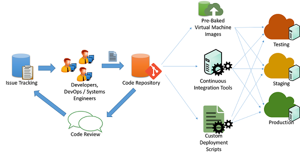

After a cloud application has been designed and developed, it can be moved to the deployment phase for release to clients. Deployment can be a multi-stage process, each involving a series of checks to ensure that the goals of the application are met. 

Before you deploy a cloud application into production, it is useful to have a checklist to assist in evaluating your application against a list of essential and recommended best practices. Examples include the deployment checklist from [AWS](https://aws.amazon.com/architecture/well-architected/) and [Azure](https://docs.microsoft.com/azure/architecture/). Many cloud providers provide a comprehensive list of tools and services that assist in deployment, such as [this document](https://docs.microsoft.com/azure/architecture/guide/) from Azure.

## Deployment process

The deployment of a cloud application is an iterative process that starts from the end of development and continues right through to the release of the application on the production resources: 

_Figure 1: Code deployment process_

It's typical for cloud developers to maintain multiple concurrently running versions of their applications to pipeline deployment of their application to into various stages: 
1. Testing 
1. Staging 
1. Production 

Each of the three stages should ideally have identical resources and configuration, which allows developers to test and deploy the application and minimize the chances of inconsistencies stemming from a change in the environment and configuration. 

## Pipeline application changes

In a typical agile application development scenario (as shown in the previous figure), applications are maintained by a set of engineers and developers who work on issues and bugs using some kind of issue tracking mechanism. The changes to the code are maintained through a code repository system (say, `svn`, `mercurial`, or `git`), where separate branches are maintained for release of code. After passing through code changes, reviews, and approvals, the code can be pipelined into the testing, staging, and production phases. This can be done in multiple ways: 

**Custom scripts**: Developers can use custom scripts to pull the latest version of the code and run specific commands to build the application and bring it into a production state. 

**Pre-baked virtual machine images**: Developers can also provision and configure a virtual machine with all the required environment and software to deploy their application. Once configured, the virtual machine can be snapshotted and exported to a virtual machine image. This image can be provided to various cloud orchestration systems to be automatically deployed and configured for a production deployment.

**Continuous integration systems**: In order to simplify the various tasks that are involved in deployment, continuous integration (CI) tools can be used to automate tasks (such as retrieval of the latest version from a repository, building application binaries, and running test cases) that need to be completed in the various machines that make up the production infrastructure. Examples of popular CI tools include Jenkins, Bamboo, and Travis. Azure Pipelines is an Azure-specific CI tool designed to work with Azure deployments.

## Manage downtime

Certain changes to the application may require partial or full termination of the application services to incorporate a change in the application's back end. Developers have to typically schedule a specific time of day to minimize interruptions to customers of the application. Applications that are designed for continuous integration may be able to perform these changes live on production systems with minimal or no interruption to the application's clients. 

## Redundancy and fault tolerance 

Best practices in application deployment typically assume that cloud infrastructure is ephemeral and may be unavailable or change at any moment. For example, virtual machines deployed in an IaaS service may be scheduled for termination at the cloud provider's discretion, depending on the type of SLA. 

Applications must refrain from hard-coding or assuming static endpoints for various components, such as databases and storage endpoints. Well-designed applications should ideally use service APIs to query and discover resources and connect to them in a dynamic fashion. 

Catastrophic failures in resources or connectivity can happen at a moment's notice. Critical applications must be designed in anticipation of such failures and must be designed for failover redundancy. 

Many cloud providers design their datacenters into **regions** and **zones**. A region is a specific geographic site that houses a complete datacenter, while zones are individual sections within a datacenter that are isolated for fault tolerance. For example, two or more zones inside a datacenter may have separate power, cooling, and connectivity infrastructure so that a fault in one zone will not affect the infrastructure in the other. Region and zone information is typically made available by cloud service providers to clients and developers to design and develop applications that can utilize this isolation property. 

Developers can therefore configure their application to use resources in multiple regions or zones in order to improve the availability of their application and tolerate failures that may happen across a zone or region. They will need to configure systems that can route and balance traffic across regions and zones. DNS servers can also be configured to reply to domain lookup requests to particular IP addresses in each zone, depending on where the request originated. This provides a method of load balancing based on the geographic proximity of clients. 

## Security and hardening in production

Running internet applications on a public cloud must be done with care. Since cloud IP ranges are well-known locations for high-value targets, it is important to ensure that all applications deployed on the cloud follow best practices when it comes to securing and hardening endpoints and interfaces. Some very basic principles that should be followed include: 

- All software should be switched to production mode. Most software supports "debug mode" for local testing and "production mode" for actual deployments. Debug-mode applications generally leak a large amount of information to attackers who send malformed inputs and hence provide an easy source of reconnaissance for hackers. No matter if you are using a web framework like Django and Rails or a database like Oracle, it is important to follow the relevant guidelines for deploying production applications.
- Access to nonpublic services should be restricted to certain internal IP addresses for admin access. Make sure that administrators cannot directly log in to a critical resource from the internet without visiting an internal launchpad. Configure firewalls with IP address and port-based rules to allow the minimal set of required accesses, especially over SSH and other remote connectivity tools.
- Follow the principle of least privilege. Run all services as the least privileged user that can perform the required role. Restrict the use of root credentials to specific manual logins by system administrators who need to debug or configure some critical problems in the system. This also applies to access to databases and administrative panels. Accesses should generally be protected using a long, random public-private key pair, and this key pair should be stored securely in a restricted and encrypted location. All passwords should have strict strength requirements.
- Use well-known defensive techniques and tools for intrusion detection and prevention systems (IDS/IPS), security information and event management (SIEM), application-layer firewalls, and anti-malware systems.
- Set up a patching schedule that coincides with patch releases by the vendor of the systems that you use. Often, vendors like Microsoft have a fixed release cycle for patches.
