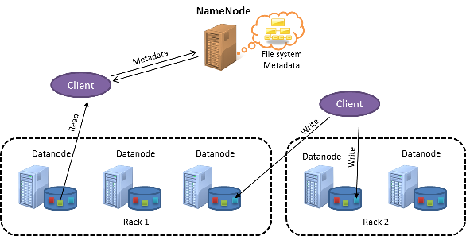
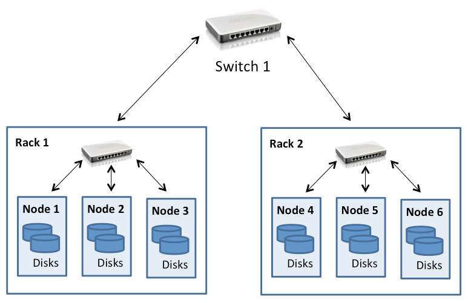
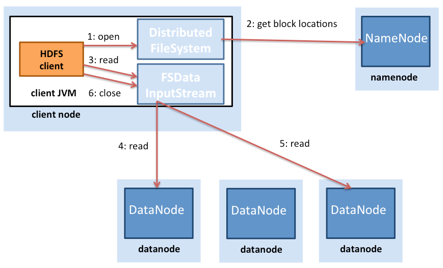
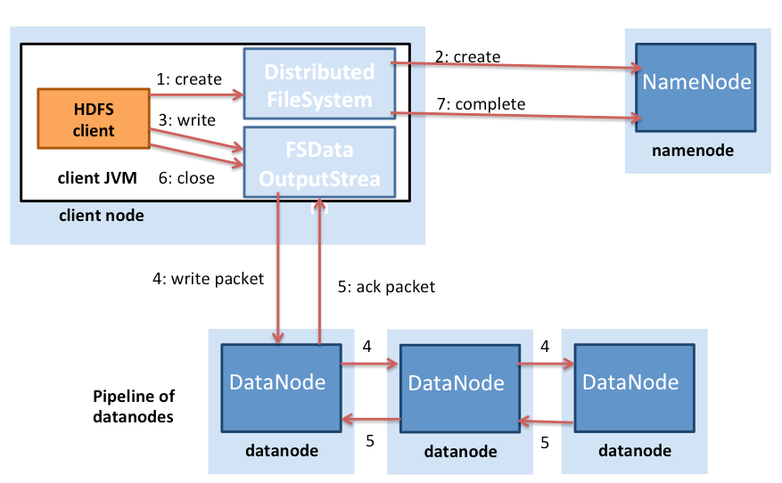

The MapReduce programming model allows computational jobs to be structured in terms of two functions: map and reduce. Input is fed into MapReduce as key-value pairs, where it is then processed through a map function and fed into a reduce function. The reduce operation then produces a result, which is also in the form of key-value pairs. MapReduce is designed to execute many instances of map and reduce operations in parallel over a large computational cluster. The MapReduce programming model is covered in detail in a later module.

The MapReduce programming model assumes the availability of a distributed storage system that is available across all the nodes of the cluster, with a single namespace, which is where a distributed file system (DFS) comes in. A DFS is collocated with the nodes of the MapReduce cluster. The DFS is designed to work in tandem with MapReduce and maintains a single namespace for the entire MapReduce cluster.
 

> [!VIDEO https://www.microsoft.com/videoplayer/embed/RE4q0qE]

An open-source version of MapReduce, called Apache Hadoop[2][^2], is very popular in big-data circles. HDFS is an open-source DFS. HDFS is designed to be a distributed, scalable, fault-tolerant file system that primarily caters to the needs of the MapReduce programming model. Video 4.12 introduces HDFS.

It is important to note that HDFS is not POSIX-compliant and is not a mountable file system on its own. HDFS is typically accessed via HDFS clients or by using application programming interface (API) calls from the Hadoop libraries. However, the development of a File system in User SpacE (FUSE) driver for ([HDFS](http://wiki.apache.org/hadoop/MountableHDFS)) allows it to be mounted as a virtual device in UNIX-like operating systems.

## HDFS architecture

As described earlier, HDFS is a DFS that is designed to run on a cluster of nodes and is architected with the following goals:

- A single, common, cluster-wide namespace
- Ability to store large files (e.g. terabytes or petabytes)
- Support for the MapReduce programming model
- Streaming data access for write-once, read-many data access patterns
- High availability using commodity hardware

An HDFS cluster is illustrated in the following figure:

_Figure 1: HDFS architecture_

HDFS follows a master-subordinate design. The master node is called the **NameNode**. The NameNode handles the metadata management for the entire cluster and maintains a single namespace for all the files stored on HDFS. The subordinate nodes are known as **DataNodes**. The DataNodes store the actual data blocks on the local file system within each node.

Files in HDFS are split into **blocks** (also called **chunks**), with a default size of 128MB each. In contrast, local file systems typically have block sizes of about 4KB. HDFS uses large block sizes because it is designed to store extremely large files in a manner that is efficient to process with MapReduce jobs.

A single map task in MapReduce is configured by default to work on a single HDFS block independently, and hence multiple map tasks can process multiple HDFS blocks in parallel. If the block size is too small, a large number of map tasks will need to be distributed across the nodes of the cluster, and the overhead of doing so might negatively impact performance. On the other hand, if the block is too large, the number of map tasks that can process the file in parallel is reduced, thereby affecting parallelism. HDFS allows block sizes to be specified on a per-file basis, so users can tune the block size to achieve the level of parallelism they desire. MapReduce's interaction with HDFS is discussed in detail in a later module.

In addition, because HDFS is designed to tolerate failures of individual nodes, data blocks are **replicated** across nodes to provide data redundancy. This process is elaborated in the following sections.

## Cluster topology in HDFS

Hadoop clusters are typically deployed in a data center that consists of multiple racks of servers connected using a fat-tree topology as discussed in an earlier module. To this end, HDFS has been designed with cluster-topology awareness, which aids in making block-placement decisions to influence performance and fault tolerance. Common Hadoop clusters have about 30 to 40 servers per rack, with a gigabit switch dedicated to the rack and an uplink to a core switch or router, which has bandwidth that is shared among many racks in the data center, as shown in the following figure: 

_Figure 2: HDFS cluster topology_

The salient point to note is that Hadoop assumes that the aggregate bandwidth within the nodes in a rack is higher than the aggregate bandwidth across nodes on different racks. This assumption is engineered into the design of Hadoop when it comes to data access and replica placement (which is discussed in the following sections).

When HDFS is deployed on a cluster, system administrators can configure it with a topology description that maps each node to a particular rack in the cluster. The network distance is measured in **hops**, where one hop corresponds to one link in the topology. Hadoop assumes a tree-style topology, and the distance between two nodes is the sum of their distances to their closest common ancestor.

In the example in Figure 2, the distance between Node 1 and itself is zero hops (the case when two processes are communicating on the same node). The distance between Node 1 and Node 2 is two hops, while the distance between Node 3 and Node 4 is four hops. 

The following video walks through file read and write operations in HDFS.
 

> [!VIDEO https://www.microsoft.com/videoplayer/embed/RE4pSF7]

_Figure 3: File reads in HDFS_

Figure 3 illustrates the process of a file read in HDFS. An HDFS client (the entity that needs to access a file) first contacts the NameNode when a file is opened for reading. The NameNode then provides the client with a list of block locations of the file. Hadoop also assumes that blocks are replicated across nodes, so the NameNode actually finds the closest block to the client when providing the location of a particular block. The locality is determined in the following order (of decreasing locality): blocks within the same node as the client, blocks in the same rack as the client, and blocks that are off rack to the client. 

Once the block locations are determined, the client opens a direct connection to each DataNode and **streams** the data from the DataNode to the client process,<!-- . This --> which is done when<!-- by --> the HDFS client <!-- by -->invokes the read operation on the data block. Hence, the block does not have to be transferred in its entirety before the client can begin computation, thereby interleaving computation and communication. Once the client has finished reading the first block, it repeats this process with the remaining blocks until the client has finished reading all of the blocks and then proceeds to close the file.

It is important to note that clients contact the DataNode directly to retrieve data. This contact allows HDFS to scale to a large number of concurrent clients for simultaneous, parallel reads of data.

File writes are different from file reads in HDFS (Figure 4). A client that needs to write data to HDFS first contacts the NameNode and then notifies it of a file creation. The NameNode checks whether the file already exists and verifies whether the client has permission to create a file. If the checks pass, the NameNode then makes a record of a new file.

_Figure 4: File writes in HDFS_

The client then proceeds to write the file to an internal data queue and requests the NameNode for block locations on DataNodes on the cluster. Blocks on the internal queue are then transferred to individual DataNodes in a pipelined fashion. The block is written on the first DataNode, which then pipelines the block to other DataNodes in order to write replicas of the block. Thus the blocks are replicated during the file write itself. It is important to note that HDFS does not acknowledge a write to the client (step 5 in Figure 4.28) until all the replicas for that file have been written by the DataNodes.

Hadoop also uses the notion of rack locality during replica placement. Data blocks are triple replicated in HDFS by default. HDFS attempts to place the first replica on the same node as the client that is writing the block. In case a client process is not running in the HDFS cluster, a node is chosen at random. The second replica is written to a node that is on a different rack from the first (off rack). The third replica of the block is then written to another random node on the same rack as the second. Further replicas are written to random nodes in the cluster, but the system tries to avoid placing too many replicas on the same rack. Figure 5 illustrates the replica placement for a triple-replicated block in HDFS. The idea behind HDFS's replica placement is to be able to tolerate node and rack failures. For example, when an entire rack goes offline due to power or networking problems, the requested block can still be located at a different rack.

_Figure 5: Replica placement for a triple-replicated block in HDFS_

## Synchronization: Semantics

HDFS's semantics have changed a bit. Early versions of HDFS followed strict **immutable semantics**. Once a file was written in the earlier versions of HDFS, it could never again be re-opened for writes. Files could still be deleted. However, current versions of HDFS support appends in a limited manner. This is still quite limited in the sense that existing binary data once written to HDFS cannot be modified in place.

This design choice in HDFS was made because some of the most common MapReduce workloads follow the **write once, read many** data-access pattern. MapReduce is a restricted computational model with predefined stages, and outputs of reducers in MapReduce write independent files to HDFS as output. HDFS focuses on simultaneous, fast read accesses for multiple clients at a time.

## Consistency model

HDFS is a strongly consistent file system. Each data block is replicated to multiple nodes, but a write is declared to be successful only after all the replicas have been written successfully. Hence all clients should see the file as soon as the file is written, and the view of the file across all the clients will be the same. The immutable semantics of HDFS make this comparatively easy to implement because a file can be opened for writing only once during its lifetime.

## Fault tolerance in HDFS

The primary fault-tolerance mechanism in HDFS is **replication**. As pointed out earlier, by default, every block written to HDFS is replicated three times, but this can be changed by the users on a per-file basis, if needed.

The NameNode keeps track of DataNodes through a **heartbeat** mechanism. Each DataNode sends periodic heartbeat messages (every few seconds) to the NameNode. If a DataNode dies, then the heartbeats to the NameNode are stopped. The NameNode detects that a DataNode has died if the number of missed heartbeat messages reaches<!-- crosses --> a certain threshold. The NameNode then marks the DataNode as dead and will no longer forward any I/O requests to that DataNode. The blocks stored on that DataNode should have additional replicas on other DataNodes. In addition, the NameNode does a status check on the file system to discover under-replicated blocks and performs a **cluster rebalance** process to initiate replication for the blocks that have less than the desired number of replicas.

The NameNode is a **single point of failure (SPOF)** in HDFS because a failure of the NameNode will bring the entire file system down. Internally, the NameNode maintains two on-disk data structures that store the state of the file system: an **image file** and an **edit log**. The image file is a checkpoint of the file system metadata at some point in time, while the edit log is a log of all of the transactions of the file system metadata since the image file was last created. All incoming changes to the file system metadata are written to the edit log. At periodic intervals, the edit logs and image file are merged to create a new image file snapshot, and the edit log is cleared out. On a NameNode failure, however, the metadata would be unavailable, and a disk failure on the NameNode would be catastrophic because the file metadata would be lost.

To back up the metadata on the NameNode, HDFS allows for the creation of a secondary NameNode, which periodically copies the image files from the NameNode. These copies will help in recovering the file system in the event of data loss on the NameNode, but the final few changes that were in the edit log of the NameNode would be lost. Ongoing work in the latest versions of Hadoop aims at creating a true over-abundant, secondary NameNode that would automatically take over when the NameNode fails. 

## HDFS in practice

Although HDFS was primarily designed to support Hadoop MapReduce jobs by providing a DFS for map and reduce operations, HDFS has found a myriad of uses with big-data tools.

HDFS is used in several Apache projects that build on top of the Hadoop framework, including Pig, Hive, HBase, and Giraph<!-- etc -->. HDFS support is also included in other projects, such as GraphLab<!-- etc -->. 

The primary advantages of HDFS include the following:

- **High bandwidth for MapReduce workloads**: Large Hadoop clusters (thousands of machines) are known to continuously write up to <!-- a -->1 terabyte per second using HDFS.
- **High reliability**: Fault tolerance is a primary design goal in HDFS. HDFS replication provides high reliability and availability, particularly in large clusters, in which<!-- where --> the probability of disk and server failures increase significantly.
- **Low costs per byte**: When compared to a dedicated, shared-disk solution, such as a SAN, HDFS costs less per gigabyte because storage is collocated with compute servers. With SAN, you have to pay additional costs for managed infrastructure, such as the disk array enclosure and higher-grade enterprise disks, to manage failures in hardware. HDFS is designed to run with commodity hardware, and redundancy is managed in software to tolerate failures.
- **Scalability**: HDFS allows DataNodes to be added to a running cluster and offers tools to manually rebalance the data blocks when cluster nodes are added, which can be done without shutting the file system down.

The primary disadvantages of HDFS include the following:

- **Small file inefficiencies**: HDFS is designed to be used with large block sizes (64MB and larger). It is meant to take large files (hundreds of megabytes, gigabytes, or terabytes) <!-- (100s or MBs or GBs or TBs) -->and chunk them into blocks, which can then be fed into MapReduce jobs for parallel processing. HDFS is inefficient when the actual file sizes are small (in the kilobyte range). Having a large number of small files places additional stress on the NameNode, which has to maintain metadata for all the files in the file system. Typically, HDFS users combine many small files into larger ones using techniques such as sequence files. 
- **POSIX non-compliance**: HDFS was not designed to be a POSIX-compliant, mountable file system; applications will have to be either written from scratch or modified to use an HDFS client. Workarounds exist that enable HDFS to be mounted using a FUSE driver, but the file system semantics do not allow writes to files once they have been closed. 
- **Write-once model**: The write-once model is a potential drawback for applications that require concurrent write accesses to the same file. However, the latest version of HDFS now supports file appends.

In short, HDFS is a good option as a storage back end for distributed applications that follow the MapReduce model or have been specifically written to use HDFS. HDFS can be used efficiently with a small number of large files rather than a large number of small files.
 
***
### References

1. _Sanjay Ghemawat, Howard Gobioff, and Shun-Tak Leung (2003). [The Google File Systems](https://static.googleusercontent.com/media/research.google.com/en//archive/gfs-sosp2003.pdf) 19th ACM Symposium on Operating Systems Principles_
2. _White, Tom (2012). [Hadoop: The Definitive Guide](https://www.oreilly.com/library/view/hadoop-the-definitive/9781491901687/) O'Reilly Media, Yahoo Press_

***

[^1]: <https://static.googleusercontent.com/media/research.google.com/en//archive/gfs-sosp2003.pdf> "Sanjay Ghemawat, Howard Gobioff, and Shun-Tak Leung (2003). *The Google File Systems* 19th ACM Symposium on Operating Systems Principles"
[^2]: <https://www.oreilly.com/library/view/hadoop-the-definitive/9781491901687/> "White, Tom (2012). *Hadoop: The Definitive Guide* O'Reilly Media, Yahoo Press"
