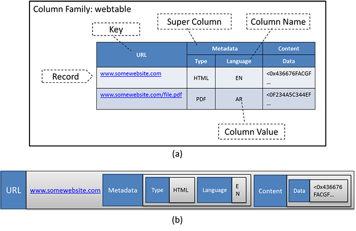
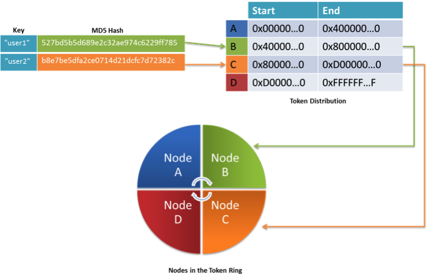

Apache Cassandra is a fully distributed, structured key-value storage system. Cassandra marries the best aspects of both HBase and Amazon's set of storage techniques, referrred to as Dynamo.[3][^3] Cassandra uses the data model of HBase and the implementation architecture of Dynamo. The following video covers Cassandra.

> [!VIDEO https://www.microsoft.com/videoplayer/embed/RE4pQ3Z]

### Cassandra data model

Cassandra implements the data model of HBase, as discussed in the previous unit), with slightly different terminology.

A table in Cassandra is referred to as a **column family** (not to be confused with an Apache HBase column family, which is a group of associated columns in a table, see Figure 7a). A **record** (or **row** ) is treated as a key-value pair, with the key being an identifying characteristic of the record. The value is also considered to be a set of key-value pairs, where each key is the name of each column, and each value is the value in the column (Figure 7b).

_Figure 7: The Cassandra data model. (a) Logical view of the webtable in Cassandra. (b) A row of the table represented as a nested sequence of key-value pairs._

Like HBase, Cassandra also allows for nested columns, which are known as **super columns**. Super columns in Cassandra are implemented as nested key-value pairs, where the super column name is the key, and the value is a sequence of key-value pairs that correspond to each column name and value.

Cassandra allows for data to be stored in the key or value parts of each key-value pair. Values can be stored in column or super column names, if required. Typical operations in Cassandra involve storing and retrieving individual rows using the key as well as updates to parts of a row. The data model in Cassandra is hence similar to HBase and is fairly flexible to allow various types of data to be stored. The big difference between HBase's and Cassandra's data models is that Cassandra does not have built-in support for versioning like HBase.

Cassandra supports data operations similar to HBase, with a few exceptions. Typical operations in Cassandra are expressed as **Gets**, **Inserts**, and **Deletes**. Operations can be performed on a single row or a set of rows (called a **range**). In addition, operations<!-- they --> can be performed on a set of columns of a database (called a **slice**): 

_Figure 8: Ranges and slices in Cassandra_

### Cassandra architecture

As a distributed data store, Cassandra is designed to run on a cluster of nodes, similar to HBase. However, unlike HBase, Cassandra follows a **decentralized architecture** (i.e., there is no master-slave architecture, and every node in Cassandra has the same role)<!-- . This way -->, which means Cassandra is designed without a single point of failure (SPOF). Although HBase is designed to be failure resilient, it relies on the Hadoop Distributed File System (HDFS) for persistent storage, where the NameNode is a SPOF. Cassandra does not require an underlying distributed file system (DFS); the nodes in a Cassandra cluster simply use the local storage on each node. Coordination between cluster nodes in Cassandra is handled in a peer-to-peer fashion. 

### Data distribution in Cassandra

Client requests to read or write data in Cassandra can be serviced by any node in the cluster. As rows are inserted in a Cassandra column family, Cassandra automatically distributes these rows among the different nodes in a cluster. However, the technique used to distribute the rows is vastly different from how they are distributed<!-- what we have seen --> in HBase. Data in Cassandra are distributed among the nodes based on the hash value of the key of a row using a strategy called **consistent hashing**. 

#### Consistent hashing

Cassandra automatically distributes rows among the various nodes in the cluster using the hash value of the key of each row. In the default case, Cassandra uses a Message Digest 5 (MD5) hashing algorithm on the key of each row, generating hashes that are 128 bits long. The hash value of a key determines where the row is stored in the cluster. In order to distribute rows across the nodes in a Cassandra cluster evenly, each node in the cluster is given a unique token. A token is a range of hash values that is assigned to each node. By default, node tokens are a range of values from 0 to 2127, which are equally divided by the number of nodes in the cluster. The collection of all of the nodes of the cluster is collectively referred to as a **token ring**, with the nodes arranged in order. Every node in the token ring is aware of the other nodes in the token ring and the range of hash values for which they are responsible. An example is illustrated in the following figure.

_Figure 9: Nodes organized as a circular ring of hash values in consistent hashing_

In the example, the key `user1` has an MD5 hash value that starts with hex value `5`. The node that fits this range in the token ring is B (it accepts hash values ranging from `0x4` to `0x8`). Thus, the row with the key `user1` is stored on node B. Similarly, `user2` is stored on node C because its hash value starts with `B`, and node C is responsible for all values from `0x8` to `0xD`. 
It is important to note that the Cassandra administrator can manually partition the token space among the nodes, assigning specific ranges of the hash space to any node. Thus, consistent hashing provides a natural load-balancing mechanism for a Cassandra cluster. We now explore<!-- see --> how the consistent hashing scheme provides replication and fault tolerance to a Cassandra cluster. 

### Replication

Although the data distribution policy in Cassandra evenly distributes the data among the nodes in the cluster, if one of them fails, the rows that are stored on that node can be potentially lost. To provide redundancy against node failures, Cassandra replicates rows across multiple nodes, as defined by the **replication factor** (which is 1 by default). Cassandra offers both a rack-aware and a rack-oblivious strategy for replica placements. The first replica is always placed based on the consistent hashing technique described above. 

Assume that the replication factor specified is $N$. The first replica is always placed using the consistent hashing technique described above. In the rack-aware strategy, the second replica is always placed at another data center (if the Cassandra cluster spans data centers) or to another rack from the first replica. The remaining replicas are placed on nodes that are on the same rack as the first, in the order of the nodes in the token ring. In the rack-unaware strategy, replicas are simply placed in order along the next $N - 1$ nodes in the token ring<!-- , in order -->. 

Nodes can be added to a Cassandra cluster at any time, which is handled in two ways. Either the administrator manually reassigns tokens for the new incoming node, or Cassandra automatically finds the node with the most data and divides its token in half, giving one half of the hash space to the new incoming node. The new node will not immediately accept requests <!-- so that it has time to -->because it must first learn the topology of the ring and accept data that it may also be responsible for. After it<!-- does this --> has done so, it can join the ring as a full member and begin accepting requests. Cassandra then reshuffles the data among the nodes in the cluster. 

The process of keeping replicas up to date in Cassandra is called **antientropy**. Antientropy in Cassandra is achieved using Merkle trees. A Merkle tree[1][^1] (Figure 10) is a hash tree in which the leaves are hashes of the values of individual keys. Parent nodes higher in the tree are hashes of their respective children. The principal advantage of Merkle trees is that each branch of the tree can be checked independently without having to scan the entire branch. Cassandra periodically computes the Merkle trees for each column family and exchanges it among replica members to quickly compute differences in the tables so that they can be synchronized. Compared to other techniques in Cassandra, antientropy is an expensive operation that is not performed often. Cassandra also has techniques to perform instantaneous repairs to replicas during reads (called a **read repair**, which is described later). 

_Figure 10: Merkle trees_

### Data operations in Cassandra

#### Write operations

When a write operation is sent to a Cassandra node, it is first written to the **commit log** (on the local file system) for that node. The commit log is a type of journal that ensures that the write operation can be recovered in case of any crashes. The write is then forwarded to the **memtable**, which is a memory-resident data structure (a form of cache). The memtable allows the data to be memory resident, allowing future operations to read the values directly from memory to improve performance. When the memtable size reaches a certain threshold, Cassandra flushes it to the disk in a file called the **SSTable**, and then a new memtable is created. The flush operation is nonblocking, and hence other operations on that Cassandra node do not have to wait for the flush to complete before proceeding. 

#### Delete operations

Delete operations are treated as update operations that place a **tombstone** (a delete marker) on the value to be removed, meaning that data is not purged from Cassandra immediately but is marked for deletion (this is also called a **soft delete**). Values are not deleted until a **garbage collection grace seconds** value is reached, and by default, this value is 864,000 seconds (approximately 10 days). After the expiry of the garbage collection threshold, the tombstones are marked as expired. 

#### Compaction operations

As the Cassandra instance is running, it may have collected multiple SSTables (through many flushes). An operation called **compaction** is performed periodically to merge the data from multiple SSTables. In the compaction operation, the keys are merged, the columns are merged, expired Tombstones are deleted, and a new index is created.

#### Read operations

To read data from a Cassandra cluster, a client connects to any node in the cluster and, based on the consistency level specified by the client, the read request is forwarded to a number of nodes in the client. This read operation is blocked until the required consistency level is met. If some of the nodes respond with an out-of-date value, then the most recent value is returned to the client. Cassandra then performs a **read-repair operation**. This operation is in addition to the periodic antientropy operation discussed previously. The read-repair operation brings the replicas up to date. The read repair is performed according to the consistency level specified during the read, which is explained next. 

#### Tunable consistency

Unlike other NoSQL database systems, Cassandra has a tunable consistency model. Applications that make requests to Cassandra for read and write operations can specify a consistency level required from Cassandra for that operation. Thus, the application can specify the consistency level required for each operation. Cassandra supports up to five consistency levels, as outlined in the following table. 

| Consistency level | Implication for reads | Implication for writes |
| --- | --- | --- |
| **ZERO** | Unsupported for reads. | The write operation returns immediately, without confirmation. |
| **ANY** | Unsupported for reads, use **ONE** instead. | A minimum of one node will commit the write operation, allowing hints (explained later) to count as a write. |
| **ONE** | Immediately return the record held by the first node that responds to the query. After the read request is performed, if the replicas are inconsistent, perform a read repair. | Ensure that the value is written to the commit log and memtable of at least one node before returning to the client. |
| **QUORUM** | Query all nodes. After a majority of replicas $(\frac{replication\ factor}{2} + 1)$ respond, return to the client the value with the most recent timestamp. Then, if necessary, perform a read repair in the background on all remaining replicas. The response is sent only after the read repair is finished. | Ensure that the write was received by at least a majority of replicas $(\frac{replication\ factor}{2} + 1)$. |
| **ALL** | Query all nodes. Wait for all nodes to respond, and return to the client the record with the most recent timestamp. Then, if necessary, perform a read repair in the background. The response is sent only after the read repair is finished. If any nodes fail to respond, the read operation fails. | Ensure that the number of nodes specified by the replication factor received the write before returning to the client. If even one replica is unresponsive to the write operation, the operation fails. |

### Failure detection in Cassandra

#### Accrual failure detection

With no centralized master to keep track of the nodes in the cluster, Cassandra uses a special **gossip protocol** to communicate in all nodes in the token ring. In Cassandra, failures are expressed as a probability using an **accrual failure detection (AFD)**[2][^2] algorithm, which can be summarized as follows.

Every second or so, each node in the Cassandra token ring contacts another random member in the ring to inquire about its status. This communication happens using a handshake protocol similar to a TCP handshake. In case the node cannot be contacted, a failure **suspicion** is raised. Therefore, the failure monitoring system outputs a continuous level of suspicion regarding how confident it is that a node has failed, which is desirable because it can <!-- take into -->account for fluctuations in the network environment. For example, just because one connection gets caught up, it does not necessarily mean that the whole node is dead. So a suspicion offers a more fluid and proactive indication of the weaker or stronger possibility of failure based on interpretation, as opposed to a simple binary assessment, such as dead or alive in heartbeat mechanisms. 

#### Hinted handoff

When data needs to be written to a location that is no longer reachable (due to some kind of failure), Cassandra implements a strategy called **hinted handoff**. The node that originally received the write request detects that the target node (where the write is to be performed) is down. The node then creates a hint, which is a reminder of that write operation. Informally, the hint is the equivalent of a person taking a message for someone who is not present. The hint would be that "I have this write information that is intended for node _X_. I am going to hold on to this write, and when I notice node _X_ has come back online, I will send the write request to node _X_." This strategy allows Cassandra to be available for writes. Under the **ANY** write consistency model, a hinted handoff counts as a successful write. 

### ACID properties of Cassandra

Unlike other database systems, Cassandra's ACID properties are entirely configurable on a per-operation basis. Cassandra's ACID properties are as follows:

- **Atomicity**: Cassandra guarantees atomicity in a column family for all the columns of a row, if the write has persisted on at least one commit log.
- **Consistency**: By using the **ALL** or **QUORUM** consistency model for reads and writes, Cassandra is considered to be strongly consistent, but at the expense of availability (as reads and writes can fail). Using the weaker consistency models (e.g., **ZERO**, **ANY**, **ONE**, and so on) can improve performance (by reducing response time for clients), but at the expense of consistency.
   
   More formally, the consistency of Cassandra can be expressed in the following formula:
   - $W$ is the write replica count.
   - $R$ is the read replica count.
   - $N$ is the replication factor.
   - If $W + R > N$, the system is strongly consistent.

   This formula means that a combination of the read and write operations must access all of the replicas of a particular row for the operation to be strongly consistent. As an example, consider the state when $W = 1$ (for the **ONE** consistency level) and $R = N$ (for the **ALL** consistency level). In this scenario, the system is considered to be strongly consistent. Similarly, if $W = N$ and $R = 1$, then the system is strongly consistent. If we consider a **QUORUM** state with Q defined as $\frac{N}{2} + 1$, and if $W = R = Q$ (that is, both reads and writes are done in **QUORUM** mode), then the system is considered to be consistent.

- **Isolation**: Since version 1.1, Cassandra can guarantee isolation of a write operation only for a particular row.
- **Durability**: Under the **ALL**, **ONE**, and **QUORUM** models, writes are guaranteed to be durable (they are written to the commit log). Under the ZERO and ANY models, the writes may not be durable because there is no guarantee that the writes were written to the commit log of any node.

### Cassandra use cases

Cassandra is a unique data storage system with useful features, such as tunable consistency, high availability, and scalability. Cassandra is best deployed with a large number of servers, which allow users to take full advantage of these features. 

Cassandra is also among the most powerful for its write performance, which is in part due to its architecture and tunable consistency model. Cassandra was primarily developed for applications in the social network space, where writes are frequent and read operations are less predictable. 

Another feature that is useful in Cassandra is that it has out-of-the-box support for replicating across multiple data centers. The fault-tolerance mechanism is more dynamic in nature (compared to HBase or Hadoop) and will not mistake long latencies as failures. The schema-free data model is also good for evolving applications, where application changes may occur frequently.

***

### References

1. _Merkle, R. (1988). [A digital signature based on a conventional encryption function](https://people.eecs.berkeley.edu/~raluca/cs261-f15/readings/merkle.pdf) Proceedings of CRYPTO (pp. 369–378). Springer-Verlag_
2. _Hayashibara, Naohiro, et al. (2004). [The φ accrual failure detector](http://citeseerx.ist.psu.edu/viewdoc/download?doi=10.1.1.80.7427&rep=rep1&type=pdf) Reliable Distributed Systems, Proceedings of the 23rd IEEE International Symposium on Reliable Distributed Systems_
3. _DeCandia, Giuseppe, et al. (2007). [Dynamo: Amazon's highly available key-value store](https://www.allthingsdistributed.com/files/amazon-dynamo-sosp2007.pdf) ACM SIGOPS Operating Systems Review. Vol. 41. No. 6 ACM_

***

[^1]: <https://people.eecs.berkeley.edu/~raluca/cs261-f15/readings/merkle.pdf> "Merkle, R. (1988). *A digital signature based on a conventional encryption function* Proceedings of CRYPTO (pp. 369–378). Springer-Verlag"
[^2]: <http://citeseerx.ist.psu.edu/viewdoc/download?doi=10.1.1.80.7427&rep=rep1&type=pdf> "Hayashibara, Naohiro, et al. (2004). *The φ accrual failure detector* Reliable Distributed Systems, 2004. Proceedings of the 23rd IEEE International Symposium on Reliable Distributed Systems"
[^3]: <https://www.allthingsdistributed.com/files/amazon-dynamo-sosp2007.pdf> "DeCandia, Giuseppe, et al. (2007). *Dynamo: Amazon's highly available key-value store* ACM SIGOPS Operating Systems Review. Vol. 41. No. 6 ACM"
