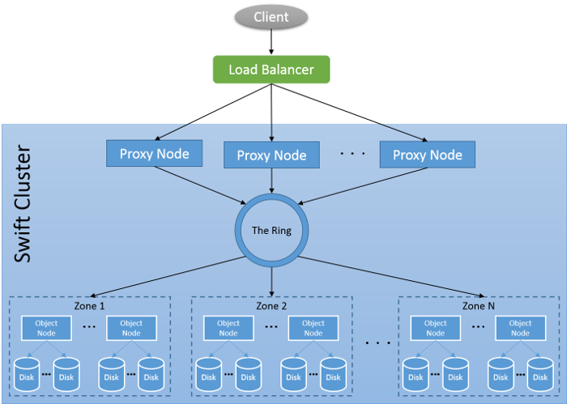

OpenStack Swift is an object storage service that is part of the OpenStack cloud platform. Swift offers clients a REST-based HTTP interface to interact with binary objects, much like Azure Blob Storage. Swift is free and open source, and is available for anyone to install and configure on any machine, effectively providing object storage on both public and private clouds.

### Swift data model and APIs


_Figure 11: Swift data model_

In Swift, users have access to an **account**, which can be used to define **containers**, which can be used to store **objects**. As an example, assume a user with an account `123456` on the swift service running on `swift.mycloud.com`, stores the object named `picture.jpg` in the container `images`. The full path to access an object in this example would thus be:

```text
https://swift.mycloud.com/v1/123456/images/picture.jpg
```

As Swift uses a RESTful interface, it uses the standard HTTP access verbs like **GET**, **PUT** and **POST**. Since the SWIFT API is modeled on the S3 API, the mechanism of the API and the supported operations are similar. Commands are stateless and sensitive to the context in which they are applied. A GET command on a container lists all the objects stored in that container, while a GET command on an object will retrieve that object. A complete list of Swift operations is available in the API reference ([Swift API](http://docs.openstack.org/developer/swift/index.html#object-storage-v1-rest-api-documentation)). It must be noted that S3 and SWIFT are not 100% API compatible. For example, S3 API requests that are related to billing and AWS regions are not replicated in swift.

It must be noted that Swift also supports authenticated access of users trying to access the service (as unauthenticated, public access of a Swift service). Swift integrates into OpenStack's own authentication service, called Keystone.

### Swift architecture

Swift uses a multi-tiered architecture in the interest of performance, fault-tolerance, reliability and durability. Like other distributed data stores, Swift uses replication for fault tolerance. As indicated in the discussion of Swift's API, Swift has to maintain information regarding accounts, containers and objects. Thus Swift runs independent processes to keep track of the information regarding each of these layers in the cluster. 

The different components of the Swift architecture are as follows:



_Figure 12: Swift cluster architecture_

**Proxy nodes**: These are the front-end servers which process incoming API requests. A Swift cluster can have multiple proxy servers to handle bigger loads of incoming requests. The proxy server determines the downstream server to send the request to. Proxy servers also coordinate responses and handle failures.

**Object nodes**: These are the actual object storage devices which can store or retrieve objects.

**Zones**: Swift allows availability zones to be configured to isolate failure boundaries. Each replica of the data resides in a separate zone, if possible. At the smallest level, a zone could be a single object server or a grouping of a few object servers. Zones are used to organize server and partitions such that the system can tolerate at least one failure per zone without any loss of data or service availability.

### Data placement in Swift

**Rings**: A ring represents a mapping between the names of account/container/objects and their physical location. There are separate rings for accounts, containers, and one object ring per **storage policy** (explained below). When other components need to perform any operation on an object, container, or account, they need to interact with the appropriate ring to determine its location in the cluster. The Ring maintains this mapping using **zones**, **object servers**, **partitions**, and **replicas**. Each partition in the ring is replicated, by default, 3 times across the cluster, and the locations for a partition are stored in the mapping maintained by the ring. The ring is also responsible for determining which devices are used for handoff in failure scenarios.

**Partition**: Swift uses consistent hashing to determine which object nodes in a zone have to store which objects. Each part of the consistent hashing ring is known as a partition.

**Storage policy**: Storage Policies provide a way for object storage providers to differentiate service levels, features and behaviors of a Swift deployment. Each Storage Policy configured in Swift is exposed to the client via an abstract name. Each device in the system is assigned to one or more Storage Policies. This is accomplished through the use of multiple object rings, where each Storage Policy has an independent object ring, which may include a subset of hardware implementing a particular differentiation. Using storage policies, a cloud provider can provide a fast SSD-based access to objects for one client with a higher SLA, while providing traditional disk-based storage for another client with a different SLA.

Let us now look at an example of how object operations are performed in Swift. Let's assume a client request consists of an object PUT request to a particular container. The request is first received by a proxy node, which will first authenticate the request to ensure appropriate access. The proxy server will then take the hash of the object name and look up all three partition locations, the drives, of where the data should be stored using the object ring. The process then uses the object ring to look up the IP and other information for those three devices.

Having determined the location of all three partitions, the proxy server process sends the object to each storage node where it is placed in the appropriate partition. When a quorum is reached, in this case at least two of the three writes are returned as successful, then the proxy server process will notify the client that the upload was successful. Thus Swift uses **Quorum writes** as a consistency mechanism. Finally, the container layer is updated asynchronously to reflect the new object in it.

### Consistency model in Swift

Swift is designed to be an eventually consistent system. All data in swift is replicated across Zones, and objects are versioned as well. Swift runs special purpose processes called **replicators**, which monitor the state of accounts, containers and objects. If it finds a new entity or an updated version of an entity, it ensures that the data is replicated to other servers according to the replication policy of the cluster.

Swift also employs special processes called **auditors**, which scan through the data stored in a swift cluster to ensure that they have not been compromised. The auditor recomputes a checksum for each object to ensure they match. If there's any discrepancy, the object is moved to a quarantine area and the storage administrator is notified to investigate.

## Ceph Object Gateway

To end our discussion on cloud object stores, we should talk about the Ceph Object Gateway, also known as RADOSGW. RADOSGW is an additional layer over the Ceph Storage Cluster (RADOS) that provides a RESTful HTTP interface to interact with objects stored on RADOS. The Ceph object gateway is unique in its ability to support both the Amazon S3 and SWIFT APIs to allow applications to be migrated to that platform. RADOSGW replicates the data models used in Amazon S3 and Swift and provides similar functionality as both of those services.
