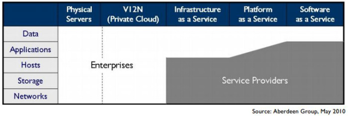
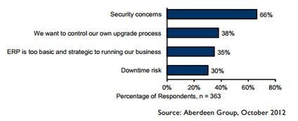

Now that we understand how the agreement between client and provider is met, let's take a look at a major concern for cloud service providers and users alike: security.

As cloud service providers compete for market dominance, their security features have become a key service differentiator. 

At one level, cloud service providers can leverage the economies of scale. By implementing security measures at a large scale, they are able to provide more affordable defensive mechanisms at a lower cost. Typically, this includes network monitoring and filters, patch management, hardening, incident response & forensics, and various types of threat management. 

They also generally provide an accessible interface to modify security settings, allowing secure key rotation, timely updates, and patches. Additionally, since all actions are virtualized, these can be regularly snapshotted and analyzed forensically for exploitation using vulnerabilities that are yet unknown (also known as zero-day vulnerabilities). 

Let us look at the cloud from the point of view of a traditional enterprise that uses in-house IT infrastructure. Enterprises find that they lose control as a function of asset ownership as they move away from traditional servers toward private clouds and then up the stack from IaaS to SaaS (Figure 11). In all three service models, the cloud vendor has full ownership of the underlying infrastructure (networks, storage, and hosts). In PaaS, the service provider may additionally claim partial ownership of the application infrastructure. Finally, in the SaaS model, the application infrastructure is fully owned by the service provider. 

_Figure 11: Enterprises lose control as you move up the public cloud stack_

In all three models, however, the enterprise has full ownership of all its data. Unfortunately, it does not have full control over this data, as it is stored outside the network perimeter. This lack of control over sensitive data storage and transfer is one of the leading inhibitors to large-scale cloud adoption. Two-thirds of potential adopters have placed "data security and privacy" as the biggest risk in cloud computing. 

_Figure 12: Security concerns are biggest barrier to large-scale cloud adoption_

## Threats

The biggest threats at a high level are those caused by vendor lock-in (applications are not very portable between platforms), compliance risks (meeting most compliance standards is more complex on public clouds), and a loss of governance (most cloud service providers don't provide SLAs related to data security assurances). 

At a lower level, the threats are due to shared infrastructure, lack of a hard perimeter, and limited control over physical data storage and deletion. It must be noted that attacks against hypervisors and shared hosting are significantly rarer and more difficult than attacks against operating systems and networks that plague traditionally deployed applications.

The Cloud Security Alliance provides a taxonomy of threats, which are summarized here:

### Threat 1: Abuse and nefarious use of cloud computing

Affected services: IaaS, PaaS

Criminals can leverage the anonymity provided by public clouds to launch malicious attacks at low cost. Public clouds have been used for command-and-control botnets, CAPTCHA cracking, rainbow table computation, and dynamic attacks. Each of these is a malicious action that relies on brute force, which is provided by the datacenter.

Vendors have attempted to counter this threat by adding strict registration checks and comprehensively monitoring all network traffic. For instance, a cloud service provider may monitor metadata about all emails originating from it to find out if a customer is misusing it to send spam.

### Threat 2: Insecure interfaces and APIs

Affected services: IaaS, PaaS, SaaS

As mentioned earlier, cloud vendors provide easy-to-use consoles, dashboards, interfaces, and web services to interact with the cloud. However, this brings an additional threat to the entire network if any vulnerability exists in these interfaces. Thus, even if the entire cloud infrastructure is designed securely, a single vulnerability in the provider's website may allow an attacker to take over a customer's account.

Most vendors now use strong, multi-factor authentication, detailed logging, anomaly detection, and secure defaults to counter this threat. Web interfaces are released to the public only after extremely strict checking for vulnerabilities in the code (white-box testing) as well as in the implementation (black-box testing).

### Threat 3: Malicious insiders

Affected services: IaaS, PaaS, SaaS

The threat of malicious insiders is expanded when an organization is using public clouds. Unlike an in-house IT deployment, enterprise employees are not the only ones with access to the datacenter. Since the service runs on an external machine and stores data on the provider's resources, it is always possible that a disgruntled or motivated employee of the cloud service provider could do something that adversely impacts the provider's service.

To counter this threat, cloud service providers enforce strict standards for employees and conduct detailed audits and monitoring. They also contractually define HR and breach notification policies as a part of the service contract.

### Threat 4: Shared technology issues

Affected services: IaaS

This is one of the fundamental "new" threats due to the cloud paradigm. The cloud works by providing multiple tenants (for example, you and your classmates) with virtualized access to shared infrastructure. Isolation between co-tenants is provided by a sandbox known as a "hypervisor," which mediates access between virtual machines and the underlying infrastructure.

Although co-tenants should be unable to access their neighbors' details, several exploits over the years have allowed tenants to break out of their sandboxes and steal data from another tenant's memory, network, etc. An example of this could be that as you write code on a cloud-hosted VM to solve class projects, a classmate manages to log in to a VM on the same physical machine as you, and then uses some properties of the shared physical machine to steal your code. Isolating all users completely is a very hard problem, even with the hypervisors of today.

To mitigate this, cloud service providers add strong monitoring capabilities, using SLAs to ensure timely vulnerability and patch management, and conducting regular audits. Apart from that, hypervisors must be periodically hardened against any potential new attacks.

For example, [the Xen security advisory page](http://xenbits.xen.org/xsa/) shows security advisories against the Xen hypervisor. Each time an attack becomes known, the cloud provider must patch all its servers so that an attacker cannot use these exploits.

### Threat 5: Data loss or leakage

Affected services: IaaS, PaaS, SaaS

This is another drawback of externally hosted clouds. Often, regulations mandate that an enterprise bear legal responsibility for any sensitive data that is used or stored by its applications. Even if this data is encrypted and stored on the cloud, the key must also be on the cloud to decrypt this data.

New research in encryption technologies has led to the rise of homomorphic and split-key management. Homomorphic keys allow data processing to be carried out on encrypted data. Thus, the key itself does not need to be transferred to the cloud. Split-key solutions work by having a master key (stored securely off the cloud) and several per-application/module subordinate keys. As the master is never on the cloud, the threat of data breach is reduced.

Unfortunately, these techniques are still limited and costly to implement. At a contractual level, it is important to define backup, data retention, data wiping, and secure key management and storage processes, along with sufficient auditing privileges. This implies that a certain set of well-designed standards must be followed, such as the [NIST Guidelines on Security and Privacy in Public Cloud Computing](http://csrc.nist.gov/publications/nistpubs/800-144/SP800-144.pdf).

It's important to also deal with all jurisdictional issues in the contract. Even though data is stored with the cloud service provider, contracts are framed so that any liability in case of a breach is due to the application owner. Hence, most cloud service providers are required to complete ISO 27001, SAS-70, and other region-relevant audits, which indicate the process maturity and the presence of security controls.

<!-- References listed in the original course not cited in this unit. Remove from visibility.

 
***
### References

1. _Anthes, Gary  (2010). [Security in the Cloud, pages 16-18](https://dl.acm.org/citation.cfm?id=1839683) In Communications of the ACM Volume 53 Issue 11_
2. _Nanavati, Mihir  (2014). [Cloud Security: A Gathering Storm, pages 70-79](https://cacm.acm.org/magazines/2014/5/174349-cloud-security/abstract) In Communications of the ACM Volume 57 Issue 5_
3. _Top Threats Working Group  (2013). [The Notorious Nine: Cloud Computing Top Threats in 2013](https://downloads.cloudsecurityalliance.org/initiatives/top_threats/The_Notorious_Nine_Cloud_Computing_Top_Threats_in_2013.pdf). Cloud Security Alliance_

***

[^1]: <https://dl.acm.org/citation.cfm?id=1839683> "Anthes, Gary (2010). *Security in the Cloud*, pages 16-18, Communications of the ACM Volume 53 Issue 11"
[^2]: <https://cacm.acm.org/magazines/2014/5/174349-cloud-security/abstract> "Nanavati, Mihir (2014). *Cloud Security: A Gathering Storm*, pages 70-79, Communications of the ACM Volume 57 Issue 5"
[^3]: <https://downloads.cloudsecurityalliance.org/initiatives/top_threats/The_Notorious_Nine_Cloud_Computing_Top_Threats_in_2013.pdf> "Top Threats Working Group (2013). *The Notorious Nine: Cloud Computing Top Threats in 2013* Cloud Security Alliance"

-->
