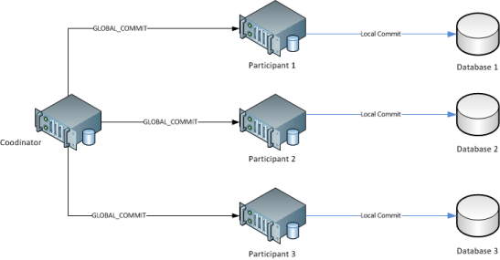

In the 1970s, Edgar F. Codd pioneered the relational database model, which shifted the focus away from the navigational approach to a data-centric approach. In the relational model, data is stored as fixed-length fields in normalized tables (Figure 17). In normalization, large tables can be divided into smaller and less redundant tables, and relationships can be defined between them. Codd went on to define various degrees of normalization for data stored in the relational model. In addition, the Structured Query Language (SQL) was developed at IBM to provide a reasonably intuitive language to create and manage databases. 

_Figure 17: Relational database tables_

The concepts of relational databases were combined with SQL and used by IBM, which designed the System R and the DB2 **relational database management systems** (RDBMSs), which were the precursors to all modern RDBMSs. 

The typical features of modern RDBMSs include the following:

- Data is modeled as records in tables, and related records across tables are expressed as relations.
- Tables are defined by schemas, which impose rules on the types and valid inputs for each column (also known as a field) in a table.
- Tables are defined, accessed, and modified through a query language (typically SQL).

Modern RDBMSs provide application developers a complete data management solution that abstracts the notion of data management away from the application developer. Once a schema is designed, applications can store, retrieve, and modify records based on the rules specified in the schema. By specifying constraints on information in a database, applications can handle data in a more robust fashion, which is crucial to avoiding data inconsistencies in application programs. For example, a user database can validate the age of each user to be a non-negative integer between, say, 1 and 130. The database can then refuse to add a user whose age does not meet this constraint and can provide an automatic validation mechanism as the data is being stored. 

## Scaling in traditional databases

Traditional RDBMSs have been designed to run on a single machine, but as the amount of data or the number of concurrent users increases, the database must be scaled. Recall that databases can be scaled either **vertically** or **horizontally**.

Guaranteeing ACID properties across a distributed database where no single node is responsible for all data affecting a transaction presents additional complications. Network connections might fail, or one node might successfully complete its part of the transaction and then be required to roll back its changes because of a failure on another node. The need for distributed concurrency control mechanisms thus emerged.

An early example of distributed concurrency control was the **two-phase commit (2PC) protocol**. 2PC provides atomicity and consistency for distributed transactions to ensure that each participant in the transaction agrees on whether or not the transaction should be committed. In the first phase, one node (the coordinator) interrogates the other nodes (the participants) and sends a VOTE_REQUEST message to all participants (Figure 18). The participants then submit their vote on the transaction to be completed, either a VOTE_COMMIT or a VOTE_ABORT. In the second phase, the coordinator tallies the votes from every participant and issues a GLOBAL_COMMIT message if every participant voted in favor of the transaction, or a GLOBAL_ABORT message if even one of the participants voted against the transactions (Figure 19). Finally, the participants commit the transaction or rollback based on the message received from the coordinator. The 2PC protocol thus guarantees strict consistency, as every transaction requires the global consensus among all nodes. Variants of 2PC include the three-phase commit (3PC) and the 2-phase locking protocol. However, these concurrency control protocols are expensive and affect performance at scale. 

_Figure 18: 2PC - Phase one_

_Figure 19: 2PC - Phase two_
