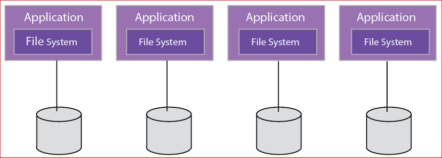
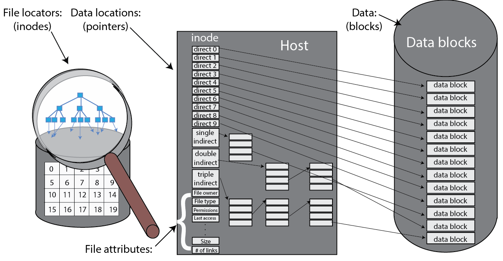

In a local file system, the file system is collocated with the server that runs the application. Owing to the nature of the file system, local file systems have limited scalability and do not allow for data sharing across different clients over a network on their own:

_Figure 8: Local file systems_[1][^1]

Data stored on a disk is typically represented as **blocks**, or a contiguous, unstructured collection of bytes. Local file systems provide an abstraction of files, which are simply a collection of blocks that represent a file.

Applications using local file systems are not concerned with how files are physically represented on storage media, the amount of data transferred to or from the application per file request (called **record size**), the unit by which data is transferred to or from storage mediums (called **block size**), and so on. All such low-level details are managed by local file systems and are effectively abstracted from user applications. In principle, local file systems are the basic building substrate of every file system type on the cloud. For instance, distributed file systems (e.g., [Hadoop Distributed File System](http://hadoop.apache.org/docs/r1.0.4/hdfs_design.html), which mimics the Google File System)[2][^2] and parallel file systems (e.g., [PVFS](https://azure.microsoft.com/resources/parallel-virtual-file-systems-on-microsoft-azure/)) are built and executed on multiple cooperative local file systems. Moreover, how well a virtual machine or a physical machine can survive software and hardware crashes on the cloud and on other systems depends partly on how well the local file systems are designed to handle such crashes. In short, practically every file system, whether shared or networked, relies on local file systems.

_Figure 9: The layout of a file system_

The UNIX file system is a classic local file system that was designed in the 1970s and has since been in widespread use in many forms (FFS, EXT-2, etc.). Although the data within a file is distributed as a series of blocks on a storage device, the file system maintains the abstraction of the file along with its associated data. As shown in the previous figure, a basic local file system includes a **boot block**, a **superblock**, an **I-list**, and a **data region**. The boot block holds the boot program that reads the operating system's (OS's) binary image into the memory when the OS is booted. In essence, the boot block has nothing to do with any of the file system management processes and functionalities. The superblock describes the layout and the characteristics of the local file system, including its size, the block size, the blocks' count, the I-list size and location, and so on.

In the I-list, the state of each file is encapsulated as a UNIX **inode** (index node, as shown in the following figure). The inode acts as the primary data structure of a file and stores the metadata about a file, including pointers to the individual file blocks in storage, ownership and access control lists, timestamp of the last access of the file, and so on.

_Figure 10: Files, inodes, and blocks_[1][^1]

Examples of local file systems include NTFS, FAT, and EXT. The scalability, performance, and sharing limitations of local file systems can be overcome by using shared/networked file systems. 

## POSIX I/O standards

The Portable Operating System Interface (POSIX) is a family of standards that defines operating system (OS) interfaces for many UNIX and UNIX-like OSs. The POSIX file system standards are often used to describe the capabilities expected from a file system that can be used in UNIX and UNIX-like OSs.

POSIX defines the following standard operations on files: `open`, `read`, `write`, and `close`. In addition, the POSIX standards allow such file systems to be directly mounted in a UNIX or UNIX-like OS without having a special-purpose driver/client process to manage the file system.

## Kernel-level vs. user-level file systems

Kernel-level file systems are file systems that contain a kernel-level API, which also means that the code that interacts with the file system resides in the kernel. In UNIX and UNIX-like operating systems, these APIs are loaded in as modules. Kernel-level file systems in UNIX-like operating systems are typically POSIX compliant and are usually limited to local file systems.

User-level file systems operate in user space as opposed to the kernel space. Such file system interfaces allow for a file system API to be portable and allow for installation in a much broader set of clients. Many distributed and networked file systems are designed to work in user level, with one exception being AFS, which uses a kernel-level driver in Linux.

## Design considerations in local file systems

To understand how local file systems are designed, it is important to understand the underlying storage medium. In this discussion, we assume a spinning disk as storage medium.

Local file systems are designed to minimize seek and rotational times upon allocating disk capacity for files to improve system performance. Local file systems can also maximize the amount of useful data transferred after incurring the seek and rotational times. Performance is a main criterion for designing an effective local file system. Storage mediums such as disks and magnetic tapes do not provide uniform access times as primary storages (e.g., memory or caches). Consequently, a local file system should leverage the underlying storage medium to its fullest in order to achieve acceptable system performance and avoid undue waste of space. Avoiding undue waste of space is crucial, especially on the cloud where system resource utilization is of great significance.

### Performance

To improve performance, local file systems can employ various strategies. First, local file systems can keep a number of block addresses in a file's inode (specifically, in its diskmap). Local file systems can cache inodes in memory to reduce the number of disk accesses needed to read/write block locations. Second, to maximize the amount of useful data transferred, local file systems can make block sizes larger. Third, to minimize seek time, locality can be exploited. Specifically, blocks that are likely to be accessed in the near future can be kept in close proximity to one another on the disk, which means the blocks of each file must be stored as close together as possible. Furthermore, because inodes are accessed in conjunction with their data blocks, they must be stored close to each other. And because the inodes of a directory are often examined all at once (e.g., `ls –la`), the inodes of files at a single directory should be kept close to each other. Fourth, to reduce rotational latency, the blocks of a file in a cylinder (if any) should be arranged in a way that, after the seek time, they can all be read without further rotational delays. This arrangement enhances performance, especially if blocks are requested sequentially. If, however, the blocks are requested randomly, it becomes difficult to leverage such a block arrangement at a cylinder to minimize rotational latency. Finally, when a local file system is fetching a requested block, it can simultaneously **prefetch** blocks that are likely to be accessed in the near future. In fact, many local file systems (e.g., Ext2 and later versions) use a multiple-blocks-at-a-time strategy known as **block clustering** whereby eight contiguous blocks at a time are allocated. Blocks can also be buffered or cached for future references by the OS.

Although file systems were traditionally built to optimize performance on magnetic hard disks, many current file systems have operating modes for SSDs, which do away with some of the optimizations targeted at disks, and introduce new features for improved performance and wear management on SSDs.

### Dependability

Another major criterion for designing effective local file systems is dependability. Dependability is also a main concern for cloud storage. Local file systems should be dependable; that is, stored data must be accessible whenever it is needed. Hence, data should effectively tolerate software and hardware crashes. In addition, local file systems must ensure that the stored data is always consistent. Writing, creating, deleting, and renaming a file might require a number of disk operations that affect both data and metadata. To make sure that the underlying local file system is crash-tolerant means to ensure that any of these operations take the system from one consistent state to another. For instance, moving a file from one directory to another, which involves create and delete operations, might result in an inconsistent file system state. In particular, a crash might occur while the file is being moved, leading to the disappearance of the file in the two directories, the original and the projected one. To avoid this risk, the local file system can first create the file at the projected directory and subsequently remove it from the old one (after the file is committed at the new directory). 

### Multi-step file system operations

Some file operations might require multiple read or write steps, known as **multi-step file system operations**. For instance, writing a large amount of data to a file might result in a number of separate disk operations (which is common on clouds). If a crash occurs before all of the required data is written, the local file system will end up in a state with only part of the write operation completed. A popular approach to deal with multi-step operations is to use **atomic transactions**. With atomic transactions, if the system crashes during any step of a given multi-step operation, the effect (probably after some recovery operations) is as if the whole operation either took place completely or did not occur at all. Transactions are a standard fare in database systems and are discussed in detail in the database section. 

One basic scheme to implement atomic transactions in local file systems is called **journaling**. In journaling, the steps of a transaction are first written onto disk in a special journal file. Once the steps are safely recorded and the operation is committed (i.e., totally completed), they can be applied to the actual file system. If a crash occurs while the steps are being applied to the file system, the steps can be easily recovered from the journal file (assuming it is constantly protected from failures). This technique is known as the **redo** or **new-value journaling**. Even if the system crashes while the steps are being applied to the journal file, the already recorded steps in the journal file can be discarded and the actual file system will remain intact. The journaling approach guarantees that the whole operation will take place either completely or not at all.

## Expand a single file system over multiple disks

To enhance dependability and/or performance, a local file system can be used with multiple disk drives. This video covers the various techniques used to expand a file system over multiple disks:
 

> [!VIDEO https://www.microsoft.com/videoplayer/embed/RE4pSuy]

The three main reasons for expanding disk drives are:

- To attain more disk storage.
- To store data redundantly.
- To spread blocks across multiple drives so they can be accessed in parallel, thereby improving performance.

Multiple disks can be transparently exposed to the local file system as a single disk using what is known as a **logical volume manager (LVM)**. If we assume two disks, an LVM can present a large address space to the local file system and internally map half of the addresses to one disk and the other half to the second disk. To provide redundancy, an LVM can store identical copies of each block on each of the two disks. Doing so necessitates passing read and write operations through the LVM. For each write, the LVM updates the two desired identical copies on the two disks. For each read, the LVM forwards the request to the disk that is less busy. Finally, parallel accesses with multiple disks can be carried out using a technique called **file striping**. With file striping, a file is split into multiple units, which are subsequently spread across disks to enable parallel accesses to the file.

Data can be striped in different ways depending on the **stripe unit** (the level at which data is striped across multiple disks). In **block-level striping**, the stripe unit is a block of data. The size of a data block, which is known as the **stripe width**, varies with the implementation but is always at least as large as a disk's sector size. When it comes time to read back this sequential data, all disks can be read in parallel. In a multitasking operating system, there is a high probability that even non-sequential disk accesses will keep all of the disks working in parallel. In **byte-level striping**, the stripe unit is exactly one byte. With **bit-level striping**, the stripe unit is exactly one bit.

### RAID

As discussed in the datacenter module, multiple disks can be combined into a single logical drive using a RAID organization. RAID 0 stripes data at the block level over multiple disks with no redundancy. RAID 1 mirrors data of one disk to another and typically halves the capacity of an array. RAID 2 provides bit-level striping with hamming codes stored on parity drives. RAID 3 provides byte-level striping with parity information stored on dedicated parity drives. RAID 4 provides block-level striping with dedicated parity drives. RAID 5 provides the same block-level striping as RAID 4 and 1, but the parity information is distributed among all drives in the set. Finally, RAID 6 is the same as RAID 5 but with parity blocks written twice, so RAID 6 can tolerate up to two disk failures within a set. Combination RAID configurations, such as RAID 1+0 and RAID 0+1, are also possible for a mixture of performance and reliability guarantees.

### Storage area networks

In an enterprise IT environment, storage is typically consolidated so that it can be pooled and shared across multiple servers. Storage devices can be shared among multiple servers using a storage area network (SAN). A SAN is a dedicated network that provides access to consolidated, block-level data storage (see the following figure). The consolidated, block-level storage is typically in the form of a disk array. The disk array can be configured with some form of RAID, depending on the performance and reliability required. Servers typically access the SAN using a protocol such as iSCSI or Fibre Channel. The servers that use a SAN see a logical block device, which can be formatted with a file system and mounted in the server. The application server can then use the externally stored logical blocks in the same way it would use locally stored blocks. Thus, the logical placement of the data is different from its physical placement.

_Figure 11: Storage area networks_

Although the servers share the disk array, they cannot physically share data residing on the disks. Instead, portions of the SAN (identified as logical unit numbers, or LUNs) are carved out and provided for the exclusive use of each server.
 
***
### References

1. _Thomas Rivera (2012). [The Evolution of File Systems SNIA Tutorial](https://www.snia.org/sites/default/education/tutorials/2012/spring/file/ThomasRivera_The_Evolution_of_File_Systems-v3.pdf)_
2. _Sanjay Ghemawat, Howard Gobioff, and Shun-Tak Leung (2003). [The Google File Systems 19th ACM Symposium on Operating Systems Principles](https://static.googleusercontent.com/media/research.google.com/en//archive/gfs-sosp2003.pdf)_

***

[^1]: <https://static.googleusercontent.com/media/research.google.com/en//archive/papers/detecting-influenza-epidemics.pdf> "Ginsberg, Jeremy and Mohebbi, Matthew H and Patel, Rajan S and Brammer, Lynnette and Smolinski, Mark S and Brilliant, Larry (2009). *Detecting influenza epidemics using search engine query data* Nature"
[^2]: <https://static.googleusercontent.com/media/research.google.com/en//archive/gfs-sosp2003.pdf> "Sanjay Ghemawat, Howard Gobioff, and Shun-Tak Leung (2003). *The Google File Systems 19th ACM Symposium on Operating Systems Principles*"
