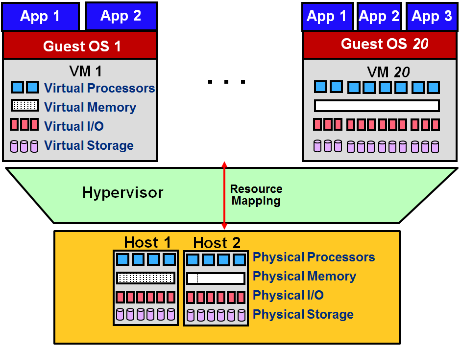

Formally, virtualization involves the construction of an isomorphism that maps a virtual guest system to a real host system[1][^1]. The following video and figure illustrate the virtualization process.
 

> [!VIDEO https://www.microsoft.com/videoplayer/embed/RE4pNd6]

The function *V* in the figure maps guest state to host state. For a sequence of operations (*e*) that modifies a guest state, there is a corresponding sequence of operations (*e'*) in the host that performs equivalent modifications. Informally, virtualization creates virtual resources and maps them to physical resources. Virtual resources are created from physical resources and essentially act as proxies to them.

_Figure 1: Virtualization isomorphism_

The concept of virtualization can be applied to either a system component or an entire machine. <!-- SCG: I think a process virtualizes both the memory (in space and time) and the CPU (in time). Not sure I understand how you are using the term virtualization. --> Traditionally, virtualization has been applied to only the memory component in general-purpose operating systems (OSs). This form of virtualization is what enables virtual memory. Revisiting the hard disk example in Figure 1, some applications might desire multiple hard drives. To satisfy such a requirement, the physical hard drive can be partitioned into multiple virtual disks, as shown in Figure 2. Each virtual disk is offered logical cylinders, sectors, and tracks. This keeps the level of detail analogous to what is offered by general-purpose OSs, yet at a different interface and without being abstracted. The hypervisor can map a virtual disk (the function *V* in the isomorphism) to a single, large file on the physical disk. Afterward, to carry out a read/write operation on a virtual disk (the function *e* in the isomorphism), the hypervisor reflects the operation as a file read/write followed by an actual disk read/write (the function *e'* in the isomorphism). 

_Figure 2: Constructing a virtual disk by mapping its content to large files_

On the other hand, when virtualization is applied to an entire machine, it provides what is called a virtual machine (VM). Specifically, a full set of hardware resources, including processors, memory, and I/O devices, is virtualized to provide the VM. As shown in Figure 3, an underlying hardware machine usually is called a host, and an OS running on a VM is called a guest OS. A VM can run on only a single host at a time. As compared to a host, a VM can have resources different in quantity and in type. For instance, a VM can obtain more processors than what a host offers and can run an ISA that is different from that of the host. Last, every VM can be booted, shut down, and rebooted just like a regular host. Further details on VMs and their different types are provided on the next page.

_Figure 3: Virtualization as applied to an entire physical system. An OS running on a VM is called a guest OS, and every physical machine is called a host. Compared to a host, a VM can have virtual resources different in quantity and type._
 
***
### References

1. _Popek, J., and Goldberg, R. (1974). [Formal Requirements for Virtualizable Third Generation Architectures](http://citeseerx.ist.psu.edu/viewdoc/download?doi=10.1.1.141.4815&rep=rep1&type=pdf) Commun. ACM, Vol. 17, No. 7._

***

[^1]: <http://citeseerx.ist.psu.edu/viewdoc/download?doi=10.1.1.141.4815&rep=rep1&type=pdf>  "Popek, J., and Goldberg, R. (1974). *Formal Requirements for Virtualizable Third Generation Architectures*"
