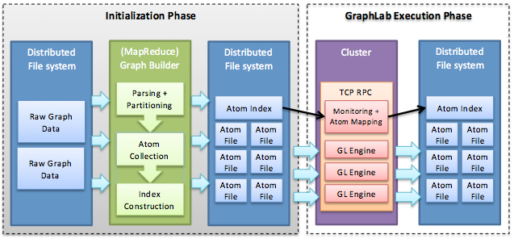
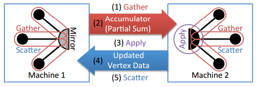

GraphLab was developed by Carnegie Mellon University and provides an example of graph-parallel distributed analytics engines for the cloud. As with any graph-parallel engine, GraphLab assumes input problems modeled as graphs, in which vertices represent computations and edges encode data dependencies or communication. 

> [!div class="alert is-tip"]
> **GraphLab evolution and versions**
>
> **GraphLab** was initially developed as a graph processing framework that targets shared memory systems (multi-core machines)[1][^1]. GraphLab then included a distributed execution engine to allow for computation of extremely large graphs across a cluster of machines.[2][^2] **PowerGraph**[3][^3] (also known as GraphLab 2.0) emerged using techniques that allowed for faster distributed processing of graphs that followed the power-law distribution (such as social graphs). GraphLab has been since spun off into a commercial startup called Dato Inc., which provides the GraphLab Create software package. Our discussion of GraphLab in this module will cover the latest open-source version, PowerGraph (GraphLab 2.0).
> 

In GraphLab, graphs are initially stored as files in an underlying distributed storage layer, such as HDFS, as shown in Figure 5. GraphLab is composed of two phases: **initialization** and **execution**. During initialization, the GraphLab engine reads input graph files from the underlying storage and divides them into multiple partitions that can be distributed among multiple machines in the cluster. During the execution phase, each machine runs the user-defined computation on the graph vertices, transmitting updates and iterating until some convergence condition is met.

### Initialization phase

_Figure 5: The GraphLab system. In the initialization phase, the atoms are constructed using MapReduce (for example). In the GraphLab execution phase, the atoms are assigned to cluster machines and loaded by machines from a distributed file system (e.g., HDFS)._

In the first phase, the input graph is divided into _k_ partitions, called **atoms**, where _k_ is much larger than the number of cluster machines. As demonstrated in Figure 5, atoms can be constructed either sequentially or using parallel loading techniques, including MapReduce. GraphLab does not store the actual vertices and edges in atoms but rather the commands to generate them, in the form of a journal. This allows GraphLab to reconstruct portions of the graph in case of node failures. In addition, GraphLab maintains in each atom information about its neighboring vertices and edges. This information, denoted in GraphLab as **ghost** vertices, provides a caching capability for efficient adjacency data accessibility.

_Figure 6: Graph partitioning strategies. (a) Illustrates the edge-cut partitioning technique, while (b) illustrates the vertex-cut technique._

The graph can be partitioned across the cluster machines in a number of ways (Figure 6). A simple technique is **edge-cut**, where a graph is partitioned along each vertex (Figure 6(a)). Each vertex is randomly assigned to a machine along with all its associated edges. As a result, **ghost** vertices are generated so that edges can be associated with a vertex that is not in a particular machine. However, for graphs with power-law distribution of edges, this means that the edge-cut partitioning will be unbalanced and some machines will be more loaded than others (due to the star-like motifs of a small number of vertices). To deal with such graphs, GraphLab uses a novel technique (known as **greedy vertex cuts**) to partition high-degree vertices across machines in order to distribute the computation more effectively. Vertices of high degree are replicated across machines, with each machine receiving a subset of the edges for that vertex (Figure 6(b)). The machine that holds a given edge for a vertex is decided using the following algorithm: 

> [!div class="alert is-tip"]
> **Algorithm 1**
>
> Greedy edge cuts for placement of edge $e = \lbrace v_{i}, v_{j} \rbrace$ for vertex $v_{i}$:
>
> - **If** there exists a machine that has been assigned both $v_{i}$ and $v_{j}$, **then**
>    - Assign $v_{j}$ to this machine
> - **else if** $v_{i}$ and $v_{j}$ are assigned to different machines, **then**
>    - Assign $e$ to the machine that has the least number of edges assigned to it
> - **else**
>    - Assign $e$ to the least loaded machine
>
> - Mark edge $e$ as assigned
>

Loading of these partitions can be done in a distributed and coordinated manner, which ensures that the assignment of vertices and edges across the cluster is optimal, but the time taken to load is much higher than a random placement. On the other hand, random placement will lead to unbalanced load and loss of locality. A compromise between these two approaches, wherein each machine estimates the assignments of the edges and vertices in the cluster, is a tradeoff suggested in "PowerGraph: Distributed Graph-Parallel Computation on Natural Graphs."[3][^3] 

Users, however, do need to store graphs in formats that can be consumed and parsed by GraphLab during its initialization phase. Clearly, this depends on the underlying storage layer and the parsing engine that GraphLab employs. For instance, if MapReduce is used to read and parse input graph files from HDFS, the input graph files have to be formatted using MapReduce's key-value data structure. 

Generating atoms for a given input graph completes the first phase of GraphLab's partitioning strategy. Subsequently, the engine stores the connectivity structure and atom locations in an index file denoted also as a **meta-graph** (Figure 5). The atom index file encompasses _k_ vertices, each corresponding to an atom, and edges encoding connectivity among them. In the second phase, the atom index file is split evenly across cluster machines. Atoms are then loaded by cluster machines, and each machine constructs its partition(s) of the given graph by executing the journal in each of its assigned atoms. By generating partitions from atom journals (and not directly mapping partitions to cluster machines), GraphLab allows future graph changes to be simply appended as journal commands, without needing to repartition the entire graphs. Furthermore, the same graph atoms can be reused for different cluster sizes by simply re-dividing the corresponding atom index file and re-executing atom journals, thus repeating only the second partitioning phase. 

Construction of graph partitions at cluster machines concludes GraphLab's initialization phase, and the execution phase begins. 

### Execution phase

As shown in Figure 5, each cluster machine runs an instance of the GraphLab engine, which incorporates two main parts: the data graph, and the user-defined functions that operate on the data graph. The data graph represents the user program state at a cluster machine and includes a directed graph $G = (V, E, D)$, where $V$ is the set of vertices, $E$ is the set of edges, and $D$ is the user-defined data (e.g., parameters, user input data, and even statistical data). In GraphLab, data is associated with both vertices and edges. 

Computation is then represented as a stateless program that is executed on each vertex of the graph in parallel. This program consists of three distinct phases: **Gather**, **Apply**, and **Scatter** (**GAS**). 

**Gather phase**: In the gather phase, each vertex (henceforth referred to as the central vertex) gathers information from adjacent vertices and edges. GraphLab can then apply a user-defined aggregation or sum operation: 

<!-- Equation also saved as image ../media/gather-phase-equation.png -->
$$\Sigma \leftarrow \bigoplus_{\substack{v \in Nbr[u]}} g(D_{u}, D_{u, v}, D_{v})$$

In the equation above, $D_{u}$, $D_{v}$, and $D_{u, v}$ denote values and metadata for vertices $u$, $v$, and edge $(u, v)$, respectively. The user-defined sum ($\bigoplus$) operation must be commutative and associative, and it can range from a numerical sum to the union of the data on all neighboring vertices and edges. 

**Apply phase**: In the apply phase, the resulting value $\Sigma$ is used to update the value of the central vertex:

<!-- Equation also saved as image ../media/apply-phase-equation.png -->
$$D_u^{new} \leftarrow a(D_{u}, \Sigma)$$

**Scatter phase**: Finally, in the scatter phase, the new value of the central vertex is sent to all adjacent vertices: 

<!-- Equation also saved as image ../media/scatter-phase-equation.png -->
$$\forall v \in Nbr[u]:(D_{(u, v)}) \leftarrow s(D_u^{new}, D_{u, v}, D_{v})$$

With the end of the scatter operation, one iteration of the computation for the vertex is complete. 

The GAS functions are executed on a set of active vertices on every iteration. During the initial iteration, all vertices are placed in the set of active vertices. Based on the logic of the GAS functions, a vertex can mark one of its neighbors as active, so that it can be computed upon in the next iteration. 

_Figure 7: Execution of the Gather, Apply, Scatter functions on two machines that are a subset of edges of the same vertex._

The figure illustrates the resulting communication pattern of employing the GAS functions on a graph partitioned using the greedy edge-cuts algorithm described earlier. Gather functions run locally on each machine that contains the ghost of a vertex. During the accumulation, these gathered values are sent to the machine that has the master copy of the vertex, where it can compute the function defined in the apply stage. Finally, the updated vertex data is copied to all machines that have ghost copies of the vertex, and the scatter function is executed to propagate values to the adjacent vertices. 

**Delta caching**: There are situations where a vertex program will be triggered (made active) because of a change in only a few of its neighbors. When the vertex is triggered, it will execute a gather operation from all neighbors, many of which have not executed and hence will return values that are unchanged since the last time this particular vertex ran. GraphLab introduces a subtle optimization called delta caching, where the result of gather operations from all of the neighbors of a vertex are cached at that vertex. During the scatter operation that is run at the neighboring vertices, an optional parameter, $\Delta a$, can be sent, summarizing the change in the value of variable $a$ between iterations. This value can be used to bypass the gather phase and added to the cached value of $a$ to speed up execution. 
 

***
### References

1. _Y. Low, J. Gonzalez, A. Kyrola, D. Bickson, C. Guestrin, and J. M. Hellerstein (2010). [GraphLab: A New Parallel Framework for Machine Learning](https://arxiv.org/abs/1006.4990) Conference on Uncertainty in Artificial Intelligence (UAI)_
2. _Y. Low, J. Gonzalez, A. Kyrola, D. Bickson, C. Guestrin, and J. M. Hellerstein (2012). [Distributed GraphLab: A Framework for Machine Learning and Data Mining in the Cloud](http://vldb.org/pvldb/vol5/p716_yuchenglow_vldb2012.pdf) PVLDB_
3. _J. Gonzalez, Y. Low, H. Gu, D. Bickson, and C. Guestrin (October, 2012). [PowerGraph: Distributed Graph-Parallel Computation on Natural Graphs](https://www.usenix.org/node/170825) In Proceedings of the 10th USENIX Conference on Operating Systems Design and Implementation_

***

[^1]: <https://arxiv.org/abs/1006.4990> "Y. Low, J. Gonzalez, A. Kyrola, D. Bickson, C. Guestrin, and J. M. Hellerstein (2010). *GraphLab: A New Parallel Framework for Machine Learning* Conference on Uncertainty in Artificial Intelligence (UAI)"
[^2]: <http://vldb.org/pvldb/vol5/p716_yuchenglow_vldb2012.pdf> "Y. Low, J. Gonzalez, A. Kyrola, D. Bickson, C. Guestrin, and J. M. Hellerstein (2012). *Distributed GraphLab: A Framework for Machine Learning and Data Mining in the Cloud* PVLDB"
[^3]: <https://www.usenix.org/node/170825> "J. Gonzalez, Y. Low, H. Gu, D. Bickson, and C. Guestrin (October, 2012). *PowerGraph: Distributed Graph-Parallel Computation on Natural Graphs* In Proceedings of the 10th USENIX Conference on Operating Systems Design and Implementation"
