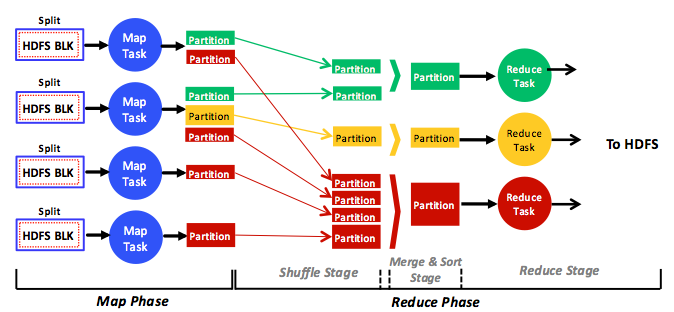

Hadoop presents MapReduce as an analytics engine and, "under the hood," employs the Hadoop Distributed File System (HDFS).[1][^1] HDFS mimics the Google File System (GFS)[2][^2] and partitions input datasets into fixed-size chunks (**blocks**), distributing them on participating cluster nodes. By default 64 MB, each HDFS block can be configured differently by users. Jobs can subsequently process HDFS blocks in parallel at distributed machines, thus exploiting the parallelism enabled by partitioning datasets. MapReduce breaks jobs into multiple tasks denoted as map and reduce tasks. All map tasks are encapsulated in what is known as the map phase, and reduce tasks are encompassed in what is called the reduce phase. The map phase can have one or many map tasks, and the reduce phase can have zero or many reduce tasks. When a MapReduce job includes no reduce tasks, it is referred to as "reduce-less."[3][^3]

_Figure 1: A full, simplified view of the phases, stages, tasks, data input, data output, and data flow in the MapReduce analytics engine_

This figure demonstrates a full, although simplified, view of the MapReduce analytics engine. Map tasks operate on distributed HDFS blocks, and reduce tasks operate on map tasks' output, denoted as intermediate output, or partitions. Each map task processes one or many distinct HDFS blocks (more on this shortly), and each reduce task processes one or many partitions. In a typical MapReduce program, the map task that is run across all the input HDFS blocks is the same, and the reduce task that is run across all the partitions is also the same. Therefore, within a specific map or reduce phase, MapReduce jobs can be considered to be in the single program, multiple data (SPMD) category. 

Map and reduce tasks consume different data, operating independently and in parallel only in their respective phases. That is, tasks in the same phase never communicate (send or receive messages), and the only communication in MapReduce occurs explicitly (through the help of the MapReduce framework) between different tasks in different phases. Specifically, map tasks generate new partitions in the map phase, and the Hadoop engine itself transfers partitions (over the network) to the reduce tasks in the reduce phase in a process called **shuffling**. The rationale behind such a strategy is that Hadoop would not scale to large clusters (hundreds or thousands of nodes) if tasks were allowed to communicate arbitrarily. Instead, all communication occurs only between the map and reduce phases and under the full control of the engine itself (not the tasks). Therefore a typical program running in the MapReduce variant can be considered to be a special case of the Message Passing model. Tasks do not have access to a common shared memory but rely on messages being passed by the framework between the map and reduce synchronization barriers. 
 

***
### References

1. _[HDFS Architecture Guide](http://hadoop.apache.org/docs/r1.0.4/hdfs_design.html) Hadoop_
2. _S. Ghemawat, H. Gobioff, and S. T. Leung (Oct. 2003). [The Google File System](https://static.googleusercontent.com/media/research.google.com/en//archive/gfs-sosp2003.pdf) SOSP_
3. _S. Chen and S. W. Schlosser (2008). [MapReduce Meets Wider Varieties of Applications](https://pdfs.semanticscholar.org/b702/96efb830d11ea047484998a8b52c20cf836b.pdf) IRP-TR-08-05, Intel Research_

[^1]: <http://hadoop.apache.org/docs/r1.0.4/hdfs_design.html> "*HDFS Architecture Guide* Hadoop"
[^2]: <https://static.googleusercontent.com/media/research.google.com/en//archive/gfs-sosp2003.pdf> "S. Ghemawat, H. Gobioff, and S. T. Leung (Oct. 2003). *The Google File System* SOSP"
[^3]: <https://pdfs.semanticscholar.org/b702/96efb830d11ea047484998a8b52c20cf836b.pdf> "S. Chen and S. W. Schlosser (2008). *MapReduce Meets Wider Varieties of Applications* IRP-TR-08-05, Intel Research"
