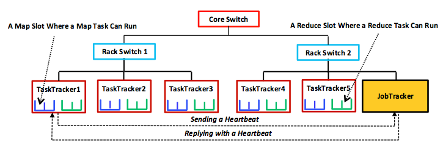

In this unit, we look at the computation model and architectural model for MapReduce.

## Computation model

MapReduce jobs, like all distributed programs, can embody either a synchronous or an asynchronous computation model. During each phase and stage, MapReduce tasks execute numerous computations that depend on results from the previous phase or stage and can proceed only after that data arrives. For example, a reduce task cannot begin before all required partitions arrive from the shuffle and the merge and sort stages. Furthermore, in a phase, tasks do not communicate with each other, and interactions occur only at the end of a stage or phase. Any synchronous system must guarantee this interaction property,[2][^2] and MapReduce presents a good example of that computation model. 

_Figure 4: A simplified example of the master-subordinate, tree-style architecture employed by Hadoop MapReduce._

## Architectural model

As the figure shows, MapReduce uses a master-subordinate (also called a master-slave) architecture. The master node is called **JobTracker** (JT), and each subordinate is called **TaskTracker** (TT). The JT and TTs communicate over the cluster network via a periodic heartbeat mechanism. By default, TTs send messages (heartbeats) to the JT every three seconds, and the JT replies**6** with a new map or reduce task or with a different message. The JT uses these heartbeats to detect task failures. Each TT has, by default, two map slots and two reduce slots at which corresponding tasks can execute. This slot allocation determines the maximum number of map and reduce tasks (degree of task parallelism) that can run simultaneously in the TT. 

Hadoop assumes a hierarchical, tree-style network topology with rack and core switches, as shown in the figure. TTs are spread over different racks and may reside in one or several datacenters. Between any two TTs, communication bandwidth depends on their relative locations in the network topology. For instance, TTs on the same rack can interact with each other much faster than with off-rack counterparts. Measuring bandwidth between any two TTs is difficult in practice,[1][^1] so Hadoop employs a simple, distance-based approach. This approach represents TT network positions as strings (that is, the location of `TaskTracker5` in the figure is `/CoreSwitch/RackSwitch1/TaskTracker5`). Hadoop assumes a unit distance between any TT and its parent switch, so the total distance between any two TTs can be calculated by simply adding up the distances to their closest common ancestor. In our example, 
`Total-Distance(/CoreSwitch/RackSwitch2/TaskTracker1, /CoreSwitch/RackSwitch2/JobTracker) = 4`.
 

***
<!-- FOOTNOTES -->
**6** The JT does not reply to every heartbeat sent by a TT. TTs can send heartbeats just to indicate that they are still alive. If a TT includes in its heartbeat a request (such as a request for a map or reduce task), the JT replies with a heartbeat that satisfies the TT's request (for example, a map or reduce task).
 

***
### References

1. _T. White (2011). [Hadoop: The Definitive Guide](http://shop.oreilly.com/product/0636920010388.do) 2nd Edition O'Reilly_
2. _D. P. Bertsekas and J. N. Tsitsiklis (January 1, 1997). [Parallel and Distributed Computation: Numerical Methods](http://athenasc.com/pdcbook.html) Athena Scientific, First Edition_

***

[^1]: <http://shop.oreilly.com/product/0636920010388.do> "T. White (2011). *Hadoop: The Definitive Guide* 2nd Edition O'Reilly"
[^2]: <http://athenasc.com/pdcbook.html> "D. P. Bertsekas and J. N. Tsitsiklis (January 1, 1997). *Parallel and Distributed Computation: Numerical Methods* Athena Scientific, First Edition"
