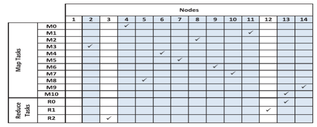
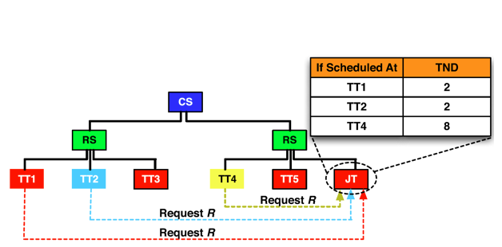

MapReduce schedules work at both the job and task levels. Clients submit jobs, and the JobTracker (JT) partitions them into map and reduce tasks. Job scheduling determines which job should go next, and task scheduling orders tasks in a job. In Hadoop MapReduce, the JT schedules both jobs and tasks, although job schedulers are pluggable, that is, not part of the JT code. Task schedulers, on the other hand, are integrated in the JT code. The introduction of the pluggable job schedulers to the Hadoop framework is considered an evolution in cluster computing.[4][^4] Pluggable schedulers enable tailoring Hadoop for specific workloads and applications. This capability creates the opportunity for job schedulers optimized for the ever-increasing list of MapReduce applications. Furthermore, pluggable schedulers increase code readability and facilitate the experimentation and testing that are essential to research. 

Hadoop MapReduce uses several alternate job schedulers, including a default first-in, first-out (FIFO) design and the Fair and Capacity schedulers.[4][^4], [5][^5], [6][^6], [7][^7], [13][^13] FIFO suggests pulling jobs from a work queue in receipt order, oldest first, and launching them one after the other. Although such a strategy appears simple and easy to use, it has drawbacks: 

- FIFO scheduling does not support job preemption. Running jobs cannot be interrupted to allow waiting jobs to proceed and meet their performance objectives, such as avoiding job starvations and/or sharing resources effectively. As a result, simultaneous sharing of cluster resources is infeasible. As long as one job absorbs all of a cluster's resources (slots), no other can proceed. So the next queued job must wait until task slots become free and the current job has no more tasks to execute. This limitation can easily lead to a fairness conflict, in which a long-running job blocks the whole cluster, starving all small jobs.
- The FIFO scheduler does not consider job priority or size, and a job's submission time alone completely determines its importance. Thus, jobs may wait in the queue for extended periods, no matter how critical or time sensitive they are. This limitation poses additional fairness and responsiveness issues.

To address the FIFO scheduler's shortcomings, Facebook developed a more sophisticated scheduler, called the Fair Scheduler,[5][^5] which is now part of the Apache Hadoop distribution. The Fair Scheduler represents cluster resources in terms of map and reduce slots and suggests a way to share clusters such that all jobs get, on average, an equal share of slots over time. The scheduler assumes a set of pools into which jobs are placed. Each pool is assigned a set of shares reflecting the map and reduce slots that its constituent jobs can occupy. The greater the number of shares a pool is assigned, the greater the number of map and reduce slots its jobs can use. Jobs in a pool can be scheduled using the FIFO scheduler or the Fair Scheduler itself. Jobs across pools are always scheduled using the Fair Scheduler. 

When only a single job is submitted, the Fair Scheduler grants it all the cluster's available map and reduce slots. When new jobs are submitted, the scheduler assigns to them slots that become free. Assuming a uniform distribution of slots, each job thus gets roughly the same amount of CPU time. This strategy can obviously allow several jobs to run simultaneously on the same Hadoop cluster, "sharing in space" the cluster slots. This phrase implies that each job has exclusive access to a specific number of slots on the Hadoop cluster. This arrangement is similar to sharing memory in operating systems (OSs), whereby the system allocates to each process an independent portion of the main memory. The result is that multiple processes can coexist. Sharing in space, as offered by the Fair Scheduler, allows short jobs to finish in reasonable times while not starving long jobs. Jobs that require less time are able to run and finish, while the jobs that require more time continue running. To minimize congestion due to sharing and finish work in a timely manner, the Fair Scheduler permits constraining the number of jobs that can be active at one time. 

The Fair Scheduler can also accommodate job priorities by assigning to jobs weights that affect the fraction of total CPU time each can obtain. In addition, the scheduler can guarantee minimum shares to pools, thus ensuring that all jobs in a pool get sufficient map and reduce slots. Although a pool contains jobs, it gets at least its minimum share of resources. When the pool becomes empty (no further jobs to schedule), the Fair Scheduler distributes its assigned slots uniformly across active pools. If a pool does not use all its guaranteed share, Fair can also spread excess map and reduce slots equally across other pools. 

To meet every pool's guaranteed minimum share, the Fair Scheduler optionally supports preempting jobs in other pools. This procedure entails preempting some or all of the foreign map and reduce tasks in a rather brutal manner. Because Hadoop MapReduce does not yet support suspending running tasks, the Fair Scheduler simply kills tasks in other pools that exceed their guaranteed minimum shares. Hadoop can tolerate losing tasks, so this strategy does not cause the preempted jobs to fail. But it can affect efficiency because killed tasks must be reexecuted, thus wasting work. To minimize such redundant computation, the Fair Scheduler picks the most recently launched tasks from overallocated jobs as kill candidates. 

A third design, developed by Yahoo!, the Capacity Scheduler, shares some principles with the Fair Scheduler. As with Fair, the Capacity Scheduler shares resources (slots) in space. However, it creates several queues, instead of pools. Each queue has a configurable number (capacity) of map and reduce slots, and each queue can hold multiple jobs. All jobs in a queue can access the queue's allocated capacity. In a queue, scheduling occurs on a priority basis, with specific, configurable soft and hard limits, and the scheduler further adjusts priorities based on job submission times. When a slot becomes free, Capacity assigns it to the least-loaded queue and there chooses the oldest submitted job. Excess capacities among queues (unused slots) are temporarily assigned to other needy queues, even if the latter exceed their initially allocated capacities. If the original queue later experiences a demand for these reassigned slots, Capacity allows any tasks then running there to finish. Only when such tasks finish does the scheduler return the underlying slots back to their original queues/jobs (i.e., tasks are not killed). Although their reassigned slots perform "detached duty," the originating queues are delayed, but avoiding job preemption simplifies Capacity's design and eliminates wasted computation. Finally, like the Fair Scheduler, the Capacity Scheduler provides a minimum capacity guarantee to each queue. Specifically, each queue is assigned a guaranteed capacity so that the total cluster capacity is the sum of all queue capacities (no overcommitted capacity). 

Scheduling a job under either FIFO, Fair, or Capacity implies scheduling all its constituent tasks. For the latter procedure, Hadoop MapReduce uses a pull strategy. That is, after scheduling a job, J, the JobTracker does not immediately push J's map and reduce tasks to TaskTrackers, but rather waits for TTs to make appropriate requests via the heartbeat mechanism. On receiving requests for map tasks, the JT follows a basic scheduling principle that says, "moving computation toward data is cheaper than moving data toward computation." As a consequence, seeking to reduce network traffic, the JT attempts to schedule map tasks in the vicinity of relevant HDFS input blocks. This goal is easy to accomplish because a map task's input is typically hosted at a single TT. 

When scheduling reduce tasks, however, the JT ignores that principle, mainly because a reduce task's input (partition(s)) usually comprises the output of many map tasks generated at multiple TTs. When a TT asks, the JT assigns a reduce task, $R$, irrespective of TT's network distance locality from $R$'s feeding TTs.**7** This strategy makes Hadoop's reduce task scheduler locality unaware. 

_Figure 5: The nodes at which native Hadoop scheduled each map task and reduce task of the WordCount benchmark_

To illustrate this locality unawareness and its implications, we define a total network distance of a reduce task, $R$, $(TNDR)$, as $\Sigma_{i=0}^n ND_{iR}$, where _n_ is the number of partitions that are fed to $R$ from _n_ nodes, and $ND$ is the network distance required to shuffle a partition $i$ to $R$. Clearly, as TNDR increases, more time is taken to shuffle $R$'s partitions, and additional network bandwidth is dissipated. Figure 5 lists the nodes at which each map task, $M_{i}$, and reduce task, $R_{i}$, of the WordCount benchmark were scheduled by native Hadoop. In this case, every map task is feeding every reduce task, and every map task is scheduled at a distinct node. Nodes 1 through 7 are housed in one rack and the rest in another. Hadoop schedules reduce tasks $R_{0}$, $R_{1}$, and $R_{2}$ at nodes 13, 12, and 3, respectively. This results in $TND_{R_{0}}$ = 30, $TND_{R_{1}}$ = 32, and $TND_{R}$ = 34. If, however, $R_{1}$ and $R_{2}$ are scheduled at nodes 11 and 8, respectively, this would result in $TND_{R_{1}}$ = 30 and $TND_{R_{2}}$ = 30. Hadoop, in its present design, cannot make such controlled scheduling decisions. 

Hadoop's current reduce task scheduler is not only locality unaware but also partitioning-skew unaware. Partitioning skew refers to a significant variance in intermediate key frequencies and their distribution across different data nodes.[1][^1], [3][^3] Figure 6 demonstrates the partitioning-skew phenomenon. It shows partition sizes that each feeding map task delivers to each reduce task in two variants of the Sort benchmark, Sort1 and Sort2 (each with a different dataset), in WordCount and in K-means.**8** Partitioning skew causes shuffle skew, in which some reduce tasks receive more data than others. The shuffle-skew problem can degrade performance because a job can get delayed while a reduce task fetches large input data, but the node at which a reduce task is scheduled can mitigate shuffle-skew effects. In general, the reduce task scheduler's impact can extend to determining the network communication pattern, affecting the quantity of shuffled data, and influencing MapReduce job runtimes. 

_Figure 6: The sizes of partitions produced by each feeding map task to each reduce task in Sort1, Sort2, WordCount, and K-means_

To make Hadoop MapReduce's reduce task scheduler more effective, it should address data locality and partitioning skew jointly. As a specific example, Figure 7 demonstrates a Hadoop cluster with two racks, each including three nodes. We assume a reduce task, $R$, with two feeding nodes, TT1 and TT2. The goal is to schedule $R$ at a requesting TT, assuming TTs 1, 2, and, 4 poll the JT for a reduce task. With the native Hadoop scheduler, the JT can assign $R$ to any of the requesting TTs. If $R$ is assigned to TT4, $TNDR$ will evaluate to 8. On the other hand, if $R$ is assigned to TT1 or TT2, $TNDR$ will be 2. As discussed earlier, a smaller TND should produce less network traffic and, accordingly, provide better performance. 

Numerous research papers have addressed the need for a task scheduler aware of both data locality and partitioning skew.[1][^1], [2][^2], [3][^3], [10][^10], [11][^11], [12][^12] The center-of-gravity reduce scheduler (CoGRS),[3][^3] for example, represents a locality- and skew-aware reduce task scheduler. To minimize network traffic, it attempts to schedule every reduce task, $R$, at its center-of-gravity node, determined by the network locations of $R$'s feeding nodes and the skew in $R$'s partition sizes. Specifically, CoGRS introduces a new metric called weighted total network distance ($WTND$) and defines it for each $R$* as $WTND_{R}$ = $\Sigma_{i=0}^n ND_{iR} \times w_{i}$, where $n$ is the number of partitions needed by $R$, $ND$ is the network distance required to shuffle a partition, $i$, to $R$, and $w_{i}$ is the weight of a partition, $i$. In principle, the center of gravity of $R$ is always one of $R$'s feeding nodes because it is less expensive to access data locally than to shuffle data over the network. Therefore, CoGRS designates the center of gravity of $R$ to be the feeding node of $R$ that provides the minimum $WTND$. 

_Figure 7: Options for scheduling a reduce task, $R$, with feeding nodes TT1 and TT2 in a cluster with two racks (CS = core switch, RS = rack switch, TT = TaskTracker, and JT = JobTracker)_
 

***
<!-- FOOTNOTES -->
**7** A feeding TT of a reduce task, $R$, is a TT that hosts at least one of $R$'s feeding map tasks.

**8** This is the Apache Mahout K-means clustering program.[8][^8] K-means is a well-known clustering algorithm for knowledge discovery and data mining.[9][^9]
 

<!-- Changed URLs for reference 4 and reference 13 -->
<!-- Updated URL for reference 5 for version 1.2.1 -->
***
### References

1. _S. Ibrahim, H. Jin, L. Lu, S. Wu, B. He, and L. Qi (Dec. 2010). [LEEN: Locality/Fairness-Aware Key Partitioning for MapReduce in the Cloud](https://www.researchgate.net/publication/221276678_LEEN_LocalityFairness-Aware_Key_Partitioning_for_MapReduce_in_the_Cloud) CloudCom_
2. _M. Hammoud and M. F. Sakr (2011). [Locality-Aware Reduce Task Scheduling for MapReduce](https://web2.qatar.cmu.edu/~mhhammou/mhh_msakr_LARTS_CloudCom2011_paper.pdf) CloudCom_
3. _M. Hammoud, M. S. Rehman, and M. F. Sakr (2012). [Center-of-Gravity Reduce Task Scheduling to Lower MapReduce Network Traffic](https://dl.acm.org/doi/10.1109/CLOUD.2012.92) CLOUD_
4. _[Hadoop scheduling](https://developer.ibm.com/articles/os-hadoop-scheduling/) IBM_
5. _[Hadoop fair scheduler](https://hadoop.apache.org/docs/r1.2.1/fair_scheduler.html) Hadoop_
6. _B. Thirumala Rao and L. S. S. Reddy (November 2011). [Survey on Improved Scheduling in Hadoop MapReduce in Cloud Environments](https://arxiv.org/ftp/arxiv/papers/1207/1207.0780.pdf) International Journal of Computer Applications_
7. _M. Zaharia, D. Borthakur, J. S. Sarma, K. Elmeleegy, S. Shenker, and I. Stoica (April 2010). [Delay Scheduling: A Simple Technique for Achieving Locality and Fairness in Cluster Scheduling](https://dl.acm.org/doi/10.1145/1755913.1755940) EuroSys, pp. 265-278_
8. _[Mahout Homepage](https://mahout.apache.org/) Apache Mahout_
9. _S. Huang, J. Huang, J. Dai, T. Xie, and B. Huang (2010). [The HiBench Benchmark Suite: Characterization of the MapReduce-Based Data Analysis](https://ieeexplore.ieee.org/document/5452747) ICDEW_
10. _P. C. Chen, Y. L. Su, J. B. Chang, and C. K. Shieh (2010). [Variable-Sized Map and Locality-Aware Reduce on Public-Resource Grids](https://dl.acm.org/doi/10.1007/978-3-642-13067-0_27) GPC_
11. _S. Seo, I. Jang, K. Woo, I. Kim, J. Kim, and S. Maeng (2009). [HPMR: Prefetching and Pre-Shuffling in Shared MapReduce Computation Environment](https://ieeexplore.ieee.org/document/5289171) CLUSTER_
12. _M. Isard, V. Prabhakaran, J. Currey, U. Wieder, K. Talwar, and A. Goldberg (2009). [Quincy: Fair Scheduling for Distributed Computing Clusters](https://dl.acm.org/doi/10.1145/1629575.1629601) SOSP_
13. _A. C. Murthy, C. Douglas, M. Konar, O. O'Malley, S. Radia, S. Agarwal, and K. V. Vinod (2011). [Architecture of Next Generation Apache Hadoop MapReduce Framework](https://issues.apache.org/jira/secure/attachment/12486023/MapReduce_NextGen_Architecture.pdf) Apache Jira_

***

[^1]: <https://www.researchgate.net/publication/221276678_LEEN_LocalityFairness-Aware_Key_Partitioning_for_MapReduce_in_the_Cloud> "S. Ibrahim, H. Jin, L. Lu, S. Wu, B. He, and L. Qi (Dec. 2010). *LEEN: Locality/Fairness-Aware Key Partitioning for MapReduce in the Cloud* CloudCom"
[^2]: <https://web2.qatar.cmu.edu/~mhhammou/mhh_msakr_LARTS_CloudCom2011_paper.pdf> "M. Hammoud and M. F. Sakr (2011). *Locality-Aware Reduce Task Scheduling for MapReduce* CloudCom"
[^3]: <https://dl.acm.org/doi/10.1109/CLOUD.2012.92> "M. Hammoud, M. S. Rehman, and M. F. Sakr (2012). *Center-of-Gravity Reduce Task Scheduling to Lower MapReduce Network Traffic* CLOUD"
[^4]: <https://developer.ibm.com/articles/os-hadoop-scheduling/> "*Hadoop scheduling* IBM"
[^5]: <https://hadoop.apache.org/docs/r1.2.1/fair_scheduler.html> "*Hadoop fair scheduler* Apache Hadoop"
[^6]: <https://arxiv.org/ftp/arxiv/papers/1207/1207.0780.pdf> "B. Thirumala Rao and L. S. S. Reddy (November 2011). *Survey on Improved Scheduling in Hadoop MapReduce in Cloud Environments* International Journal of Computer Applications"
[^7]: <https://dl.acm.org/doi/10.1145/1755913.1755940> "M. Zaharia, D. Borthakur, J. S. Sarma, K. Elmeleegy, S. Shenker, and I. Stoica (April 2010). *Delay Scheduling: A Simple Technique for Achieving Locality and Fairness in Cluster Scheduling* EuroSys, pp. 265-278"
[^8]: <https://mahout.apache.org/> "*Mahout Homepage* Apache Mahout"
[^9]: <https://ieeexplore.ieee.org/document/5452747> "S. Huang, J. Huang, J. Dai, T. Xie, and B. Huang (2010). *The HiBench Benchmark Suite: Characterization of the MapReduce-Based Data Analysis* ICDEW"
[^10]: <https://dl.acm.org/doi/10.1007/978-3-642-13067-0_27> "P. C. Chen, Y. L. Su, J. B. Chang, and C. K. Shieh (2010). *Variable-Sized Map and Locality-Aware Reduce on Public-Resource Grids* GPC"
[^11]: <https://ieeexplore.ieee.org/document/5289171> "S. Seo, I. Jang, K. Woo, I. Kim, J. Kim, and S. Maeng (2009). *HPMR: Prefetching and Pre-Shuffling in Shared MapReduce Computation Environment* CLUSTER"
[^12]: <https://dl.acm.org/doi/10.1145/1629575.1629601> "M. Isard, V. Prabhakaran, J. Currey, U. Wieder, K. Talwar, and A. Goldberg (2009). *Quincy: Fair Scheduling for Distributed Computing Clusters* SOSP"
[^13]: <https://issues.apache.org/jira/secure/attachment/12486023/MapReduce_NextGen_Architecture.pdf> "A. C. Murthy, C. Douglas, M. Konar, O. O'Malley, S. Radia, S. Agarwal, and K. V. Vinod (2011). *Architecture of Next Generation Apache Hadoop MapReduce Framework* Apache Jira"
