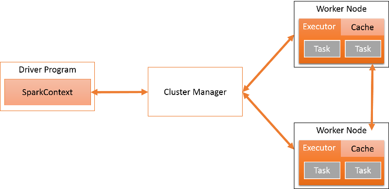

MapReduce and similar data-parallel frameworks fail to express many types of distributed applications efficiently. Spark[1][^1] targets a specific subset of these applications: those that reuse a working set of data across multiple rounds of computation. These applications fall in one of three categories: 

- Iterative jobs: Many algorithms (for example, most machine learning) fall in this category. Although MapReduce can express such computation, each job requires that the data be reloaded from disk, leading to a significant performance penalty. 
- Interactive jobs: Hadoop allows ad hoc queries to be performed on data using tools like Pig and Hive, which allow users to run MapReduce jobs using simple SQL interfaces. Unfortunately, these incur a very high latency because each job requires loading the entire dataset from disk. A faster querying platform is desirable. 
- Streaming jobs: These models require periodic updates. For example, incremental processing systems periodically renew stored parameters based on new inputs. 

Generally speaking, MapReduce lacks a data-sharing abstraction for leveraging distributed memory. Such an abstraction would allow many applications to have concurrent data access to memory across the cluster. It also suffers from many performance problems due to its inefficient use of resources (e.g., poor memory utilization by spilling to disk after each job). 

One of the frameworks attempting to address these issues is Spark. Spark relies on a special abstraction called **resilient distributed datasets** (RDDs)[2][^2] to support iterative, interactive, and streaming applications. Before discussing RDDs, we first present a high-level overview of the Spark framework. 

## An overview of Spark

The goal of any distributed programming framework is to support the execution of a parallel computation across multiple nodes in a performant manner. Consider an iterative application that runs a machine learning algorithm on a large graph. Spark would store this graph as an RDD, as shown in the following figure. The Spark client would store the details of the program to be executed and map it to Spark-specific operations for a cluster, which comprises many workers. There is a cluster manager that converts these operations into tasks and executes them on the worker nodes. Any cluster requires applications to be scheduled well to maximize the utilization and improve performance. Spark allows different policies to be used to schedule tasks on the cluster, depending upon factors such as the priority, duration, and resources required by each task. 

_Figure 1: The most important parts of the Spark framework_

Spark is implemented in about 14,000 lines of Scala, a statically typed high-level programming language for the Java VM. 

Spark relies on RDDs, a distributed memory abstraction to support fault-tolerant, in-memory computations on large datasets. Programmers invoke operations on RDDs by passing closures (functions) to workers. Closures are copied to and executed at these workers. We will explore each part of this system in detail. 

Spark application developers write a driver program to connect to a cluster of workers. The driver defines one or more RDDs and invokes actions on them. The driver also tracks each RDD's lineage, which records the history of how the RDD is generated as a directed acyclic graph (DAG). The workers are long-lived processes (running for the entire lifetime of an application) that can store RDD partitions in RAM across operations. 

The `SparkContext` object can connect to several types of cluster managers that handle the scheduling of applications and tasks, as shown in the following figure. The cluster manager isolates multiple Spark programs from each other. Each application has its own driver and runs on isolated executors coordinated by the cluster manager. Currently, Spark supports applications written in Scala, Java, and Python. 

_Figure 2: Spark architecture_

Each Spark application runs as an independent set of processes on a distributed cluster. The driver is the process that runs the `main()` function of the application and creates a `SparkContext` object. Spark applications are coordinated by the `SparkContext` object. The `SparkContext` object in turn connects to a cluster manager, which allocates resources across all applications on the cluster. The `SparkContext` object also contains a number of implicit conversions and parameters for use with various Spark features. 

The system currently supports three cluster managers: 

- **Standalone**: Spark includes a simple cluster manager that makes it easy to set up a cluster. A group of applications submitted in standalone mode will run in first-in, first-out (FIFO) order, and each application will try to use all available nodes. 
- **Apache Mesos**[3][^3]: This is a general cluster manager that can also run Hadoop MapReduce and other distributed applications. Mesos allows static and dynamic sharing of CPU cores between applications. 
- **Hadoop YARN**[4][^4]: We looked at Hadoop YARN in an earlier module. Spark supports two deployment modes in YARN. In yarn-cluster mode, the Spark driver runs inside an application master process, which is managed by YARN. Thus the client's only role is to initiate the application. In yarn-client mode, the driver runs in the client process and the Application Master (AM) is only used to request resources from YARN. When run on YARN, Spark supports Dynamic Resource Allocation, which returns the idle resources allocated to an application back to the global pool. 

Once `SparkContext` connects to `ClusterManager`, Spark acquires executors on the worker nodes. Executors are the actual processes that run computation and store data. After an executor is acquired, the Java/Python/Scala code is sent to the executor and run as tasks. Notice that each application has its own executor processes, which run tasks in multiple threads. The executor exists for the entire application lifecycle. 

An advantage of this approach is that applications are isolated from each other. Scheduling decisions are made by individual drivers independent of other applications. Also, executors for different applications are isolated as each one runs in a separate JVM. The disadvantage is that it is more difficult to share data between applications. 

The driver is the process where the `main()` method of the program runs. It has two main roles: 

- **Convert the user program into tasks**: At a high level, a Spark program implicitly creates a logical DAG of operations. The driver converts this into a physical execution plan. Several optimizations are performed at this point, converting the execution graph into a set of stages, where each stage encompasses multiple tasks. 
- **Schedule tasks on executors**: Once a physical execution plan is created, the driver schedules the running of individual tasks on executors. The driver maintains a global view of all executors. 

Executors are worker processes that are created when the Spark application starts and that run until the application ends. Executors run the tasks scheduled by the driver and return the results. Each executor consists of a `BlockManager`, which provides in-memory storage for caching RDDs. 

The core of Spark is the execution and storage of RDDs, which is explained in the next unit. 

> [!div class="alert is-tip"]
> **A note on the Spark shell**
>
> Apart from writing programs, Spark provides an interactive shell. It provides an easy way to explore Spark's APIs and allows a tool for interactive analysis of large datasets. The shell supports both Python and Scala (but not Java).
>
 

***
### References

1. _Zaharia, Matei and Chowdhury, Mosharaf and Franklin, Michael J and Shenker, Scott and Stoica, Ion (2010). [Spark: cluster computing with working sets](https://www.usenix.org/legacy/event/hotcloud10/tech/full_papers/Zaharia.pdf) Proceedings of the 2nd USENIX conference on Hot topics in cloud computing_
2. _Zaharia, Matei and Chowdhury, Mosharaf and Das, Tathagata and Dave, Ankur and Ma, Justin and McCauley, Murphy and Franklin, Michael J and Shenker, Scott and Stoica, Ion (2012). [Resilient distributed datasets: A fault-tolerant abstraction for in-memory cluster computing](https://www.usenix.org/system/files/conference/nsdi12/nsdi12-final138.pdf) Proceedings of the 9th USENIX conference on Networked Systems Design and Implementation_
3. _Hindman, Benjamin and Konwinski, Andy and Zaharia, Matei and Ghodsi, Ali and Joseph, Anthony D and Katz, Randy H and Shenker, Scott and Stoica, Ion (2012). [Mesos: A Platform for Fine-Grained Resource Sharing in the Data Center](https://people.eecs.berkeley.edu/~alig/papers/mesos.pdf). NSDI_
4. _Vavilapalli, Vinod Kumar and Murthy, Arun C and Douglas, Chris and Agarwal, Sharad and Konar, Mahadev and Evans, Robert and Graves, Thomas and Lowe, Jason and Shah, Hitesh and Seth, Siddharth and others (2013). [Apache Hadoop YARN: Yet another resource negotiator](https://www.cse.ust.hk/~weiwa/teaching/Fall15-COMP6611B/reading_list/YARN.pdf) Proceedings of the 4th annual Symposium on Cloud Computing_

***

[^1]: <https://www.usenix.org/legacy/event/hotcloud10/tech/full_papers/Zaharia.pdf> "Zaharia, Matei and Chowdhury, Mosharaf and Franklin, Michael J and Shenker, Scott and Stoica, Ion (2010). *Spark: cluster computing with working sets * Proceedings of the 2nd USENIX conference on Hot topics in cloud computing"
[^2]: <https://www.usenix.org/system/files/conference/nsdi12/nsdi12-final138.pdf> "Zaharia, Matei and Chowdhury, Mosharaf and Das, Tathagata and Dave, Ankur and Ma, Justin and McCauley, Murphy and Franklin, Michael J and Shenker, Scott and Stoica, Ion (2012). *Resilient distributed datasets: A fault-tolerant abstraction for in-memory cluster computing* Proceedings of the 9th USENIX conference on Networked Systems Design and Implementation"
[^3]: <https://people.eecs.berkeley.edu/~alig/papers/mesos.pdf> "Hindman, Benjamin and Konwinski, Andy and Zaharia, Matei and Ghodsi, Ali and Joseph, Anthony D and Katz, Randy H and Shenker, Scott and Stoica, Ion (2012). *Mesos: A Platform for Fine-Grained Resource Sharing in the Data Center* NSDI"
[^4]: <https://www.cse.ust.hk/~weiwa/teaching/Fall15-COMP6611B/reading_list/YARN.pdf> "Vavilapalli, Vinod Kumar and Murthy, Arun C and Douglas, Chris and Agarwal, Sharad and Konar, Mahadev and Evans, Robert and Graves, Thomas and Lowe, Jason and Shah, Hitesh and Seth, Siddharth and others (2013). *Apache Hadoop YARN: Yet another resource negotiator* Proceedings of the 4th annual Symposium on Cloud Computing"
