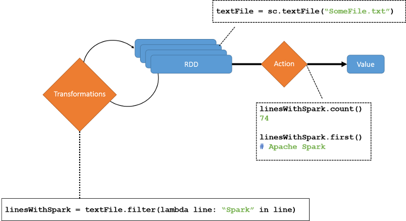

Spark relies on a special abstraction called resilient distributed datasets (RDDs).<sup>[1][^1]</sup> RDDs are in-memory read-only objects partitioned across the cluster. They let users control persistence and partitioning settings to optimize data placement and manipulate this data using a rich set of operators. An RDD is partitioned across machines based on either a range (partitioning of consecutive records) or the hash of a key in each record. Each partitioning method is optimal for a particular use case. (Hash partitioning speeds up joins by providing locality to records from different datasets that share keys. Range partitions speed up access to a small filtered subset of the data.) 

Despite not needing to exist on physical storage, RDDs can be fault tolerant. However, they do not need to be replicated. Rather, they have a notion of lineage by which they "remember" the set of operations that were executed to construct them, allowing them to be rebuilt if they lose data. A handle to an RDD contains enough information to recompute it from a version of the data stored on disk. 

All work in Spark is expressed either as creating new RDDs, transforming existing RDDs, or running operations on RDDs. One important thing to realize about RDDs is that they are **lazily computed** and **ephemeral**. Lazy computation is an optimization whereby many transformations are pipelined, and the RDD is computed only when it is first used with an "action". Ephemeral means that RDDs may be materialized (computed and loaded in memory) when used in a parallel application, but they are subsequently discarded from memory. 

| Aspect | RDDs | Distributed shared memory |
|---|---|---|
| Reads  | Coarse or fine-grained  | Fine-grained  |
| Writes  | Coarse-grained  | Fine-grained  |
| Consistency  | Trivial (immutable)  | Up to the application or runtime  |
| Fault recovery  | Fine-grained and low-overhead by using lineage  |  Requires checkpoints and program rollback  |
| Straggler mitigation  | Possible by using backup tasks  |  Difficult  |
| Work placement  | Automatic based on data locality  |  Up to the application (runtimes aim for transparency)  |
| Behavior if not enough RAM  | Similar to existing data-flow systems  |  Poor performance (swapping)  |

The RDD abstraction is a type of distributed shared collection system, similar to traditional distributed shared memory (DSM) systems.<sup>[2][^2]</sup> It may be interesting to compare the two abstractions. 

Unlike DSMs, which allow read/writes to individual memory locations, Spark only allows coarse-grained transformations of RDDs. Also, RDDs enable a low-overhead recovery mechanism using lineage, unlike the coordinated checkpointing needed by DSM systems.<sup>[3][^3]</sup> Similar to MapReduce, stragglers can be mitigated using speculative execution of slow tasks. 

Next, let's discuss the lifecycle of an RDD. 

## Creating RDDs

By default, in the Spark programming model, an RDD is represented as a Scala object (though it could also be a Python or Java object). It can be constructed in several ways: 

- From a file on a distributed file system like HDFS 
- By parallelizing a collection/array and distributing it to many nodes 
- By transforming an existing RDD (we will discuss transform operations below) 
- By changing the persistence level of an existing RDD by using one of two actions: 
   - **cache**: Hints to the framework to keep the RDD in memory after the first computation to ensure reuse
   - **save**: Writes the data to a distributed file system like HDFS

The following examples show how to create new RDDs. You can use these commands in the Spark Scala shell. 

### Load text file

Use the Python `textFile()` method to load a text file `server.logs` into a string RDD:

   ``` python
   log_lines_RDD = sc.textFile("server.logs")
   ```

### Parallelize an existing RDD

Use the Python `parallelize()` method to parallelize an existing RDD:

   ``` python
   greeting_lines_RDD = sc.parallelize(["hello", "world"]) 
   ```

## Operations on RDDs

Once created, an RDD supports two types of operations, as shown in the following figure. 

- **Transformations**: Operations that create new RDDs from existing ones 
- **Actions**: Computations on an RDD that return a single object to the driver 

As mentioned earlier, Spark transformations are lazy by default. That is, they are not computed immediately; rather, they are batched and executed only when an action is executed. The execution of an action causes all RDDs in the lineage to be materialized. However, once the computation is completed, an RDD will persist only if explicitly required to by the program. 



_Figure 3: Operations on resilient distributed datasets (RDDs)_

Here are some examples of transformations and actions: 

| Transformation | Description | Action | Meaning |
|---|---|---|---|
| `map(func)` | Returns a new RDD formed by passing each element of the source through function `func`. | `reduce(func)` | Aggregates the elements of the dataset by using function `func`, which takes two arguments and returns one. The function should be associative so it can be computed correctly in parallel. |
| `filter(func)` | Returns a new RDD by selecting those elements of the source on which `func` returns `true`. | `collect()` | Returns all the elements of the RDD as an array at the driver program. This transformation is useful after a filter or other operation that returns a sufficiently small subset of the data. |
| `join(otherDataset, [numTasks])` | When called on two RDDs of type `(K, V)` and `(K, W)` respectively, the transformation returns an RDD of `(K, (V, W))` pairs with all pairs of elements for each key. | `count()` | Returns the number of elements in the RDD. |

We'll explore these in more detail in a later unit, where we look at some sample programs. For now, let us look at a few simple examples to understand the basic operations allowed by an RDD. 

### Transformations

The following Python code filters `log_lines_RDD` to find attacks against a web server by searching for lines matching a particular signature string. 

``` python
log_lines_RDD = sc.textFile("server.logs")
xss_RDD =  log_lines_RDD.filter(lambda x: "%3C%73%63%72%69%70%74%3E" in x)
sqli_RDD =  log_lines_RDD.filter(lambda x: "bobby_tables" in x)
owasp_attacks_RDD = xss_RDD.union(sqli_RDD)
```

The `filter()` method does not modify the original RDD. Rather, we now have two new RDDs. The `log_lines_RDD` can still be used in the future. The `union()` method is a transformation that acts on two RDDs to form a combined `owasp_attacks_RDD`. 

### Actions

The following Python code counts the number of attacks in our combined `owasp_attacks_RDD`. An action forces materialization. In many cases, `examplesRDD.count()` is used to force materialization during local testing of Spark code. 

``` python
log_lines_RDD = sc.textFile("server.logs")
xss_RDD =  log_lines_RDD.filter(lambda x: "%3C%73%63%72%69%70%74%3E" in x)
sqli_RDD =  log_lines_RDD.filter(lambda x: "bobby_tables" in x)
owasp_attacks_RDD = xss_RDD.union(sqli_RDD)
print("Number of attacks:" + owasp_lines_RDD.count())
```

Clearly, RDDs are best suited for batch operations where the same operations are applied to all elements of the dataset. Applications requiring asynchronous, fine-grained updates would need more specialized systems. Since they are immutable, the overhead of computing new RDDs for each additional input item is very high. Hence, even when dealing with real-time data inputs, Spark often batches the changes over short periods of time. 

### Persisting RDDs

RDDs can be persisted in four ways:<sup>[4][^4]</sup>

- **In-memory as deserialized objects**: A deserialized object expresses a data structure as a set of bytes. Storing the raw deserialized RDD objects in memory has the highest performance, since the framework can access the elements natively in code. However, there is some overhead, since apart from the data, the metadata of the object is also stored. For example, Java objects are fast to access, but they consume two to five times more space than the raw data that they encapsulate. 
- **In-memory as serialized data**: By serializing the RDD, the associated data is stored in a well-defined format. This method is slower than storing deserialized objects, but is more memory-efficient than storing object graphs.
- **On-disk storage**: This method helps store really large RDDs that don't fit in memory, but that shouldn't be continuously recomputed. 
- **Off-heap storage**: Off-heap storage is provided by a special memory-centric storage system called Tachyon,<sup>[4][^4]</sup> which enables cluster-wide reliable data sharing at memory speed.

In all four cases, the RDD is stored in partitions across the workers. Each partition is an atomic piece of the dataset. When memory is running out because of a high rate of incoming data, in-memory RDD partitions are generally dealt with using an LRU eviction policy. However, if the partition used least recently belongs to the same RDD as the arriving partition, it is not evicted to prevent thrashing. 

RDDs are recomputed by default for every action executed on them. In order to reuse an RDD in multiple actions, the RDD `persist()` method can be called. RDDs can be persisted in several places as outlined in the following table: 

| Level | Space used | CPU time | In memory | On disk | Comments |
|---|---|---|---|---|---|
| `MEMORY_ONLY`         | High | Low    | Y    | N    |  |
| `MEMORY_ONLY_SER`     | Low  | High   | Y    | N    |  |
| `MEMORY_AND_DISK`     | High | Medium | Some | Some | Spills to disk if there is too much data to fit in memory. |
| `MEMORY_AND_DISK_SER` | Low  | High   | Some | Some | Spills to disk if there is too much data to fit in memory. Stores serialized representation in memory. |
| `DISK_ONLY`           | Low  | High   | N    | Y    |  |

Spark also allows data to be persisted into a cluster-wide in-memory cache. When data is accessed frequently (e.g., in using a small "hot" dataset or in running an iterative algorithm), this technique can be extremely useful to improve performance. RDDs also have an `unpersist()` method to remove it from the persistent store. 

Of course, to achieve all these properties using RDDs, we also must choose a suitable representation to store them. Any representation must be able to track lineage across a wide range of transformations, which users can combine in arbitrary ways. Spark uses a simple graph-based representation for RDDs. Each RDD is accessed through a common interface that exposes five features: a set of partitions (atomic pieces of the dataset), a set of dependencies (on parent RDDs), a function for computing the dataset based on its parent(s), metadata about the partitioner, and a list of preferred nodes where each partition can be accessed faster due to locality. 

| Operation | Meaning |
|---|---|
| `partitions()`             | Returns a list of partition objects. |
| `preferredLocations(p)`    | Lists nodes where partition `p` can be accessed faster due to data locality. |
| `dependencies()`           | Returns a list of dependencies. |
| `iterator(p, parentIters)` | Computes the elements of partition `p`, given iterators for its parent partitions. |
| `partitioner()`            | Returns metadata that specifies whether the RDD is hash or range partitioned. |

Consider that our input dataset consists of files on HDFS. By default, `partitions()` returns a list for each HDFS block encompassed by the file. Each partition object in this list is represented by the block's offset. Since this is an HDFS system, `preferredLocations(p)` returns the list of nodes storing a local copy of the block. The `iterator(p, parentIters)` simply reads the block. 

At this stage, we have looked at RDDs and some of the basic operations on them. In the next pages, we will cover more detailed examples to understand how RDDs help Spark achieve very high performance for many types of applications, and also how they enable fault tolerance and recovery. 
<br>
***

### References

1. _Zaharia, Matei and Chowdhury, Mosharaf and Das, Tathagata and Dave, Ankur and Ma, Justin and McCauley, Murphy and Franklin, Michael J and Shenker, Scott and Stoica, Ion (2012). [Resilient distributed datasets: A fault-tolerant abstraction for in-memory cluster computing](https://www.usenix.org/system/files/conference/nsdi12/nsdi12-final138.pdf) Proceedings of the 9th USENIX conference on Networked Systems Design and Implementation_
2. _Janakiraman, G and Tamir, Yuval (1994). [Coordinated checkpointing-rollback error recovery for distributed shared memory multicomputers](https://ieeexplore.ieee.org/document/336910) Proceedings of IEEE 13th Symposium on Reliable Distributed Systems_
3. _Zaharia, Matei and Holden Karau, Konwinski Andy and Wendell, Patrick (2015). [Learning Spark: Lightning-Fast Big Data Analytics](http://shop.oreilly.com/product/0636920028512.do) O'Reilly Media_
4. _Li, Haoyuan and Ghodsi, Ali and Zaharia, Matei and Shenker, Scott and Stoica, Ion (2014). [Tachyon: Reliable, memory speed storage for cluster computing frameworks](https://dl.acm.org/doi/10.1145/2670979.2670985) Proceedings of the ACM Symposium on Cloud Computing_

***

[^1]: <https://www.usenix.org/system/files/conference/nsdi12/nsdi12-final138.pdf> "Zaharia, Matei and Chowdhury, Mosharaf and Das, Tathagata and Dave, Ankur and Ma, Justin and McCauley, Murphy and Franklin, Michael J and Shenker, Scott and Stoica, Ion (2012). *Resilient distributed datasets: A fault-tolerant abstraction for in-memory cluster computing* Proceedings of the 9th USENIX conference on Networked Systems Design and Implementation"
[^2]: <https://ieeexplore.ieee.org/document/336910> "Janakiraman, G and Tamir, Yuval (1994). *Coordinated checkpointing-rollback error recovery for distributed shared memory multicomputers* Proceedings of IEEE 13th Symposium on Reliable Distributed Systems"
[^3]: <http://shop.oreilly.com/product/0636920028512.do> "Zaharia, Matei and Holden Karau, Konwinski Andy and Wendell, Patrick (2015). *Learning Spark: Lightning-Fast Big Data Analytics* O'Reilly Media"
[^4]: <https://dl.acm.org/doi/10.1145/2670979.2670985> "Li, Haoyuan and Ghodsi, Ali and Zaharia, Matei and Shenker, Scott and Stoica, Ion (2014). *Tachyon: Reliable, memory speed storage for cluster computing frameworks* Proceedings of the ACM Symposium on Cloud Computing"
