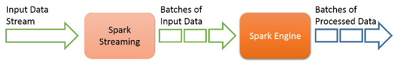
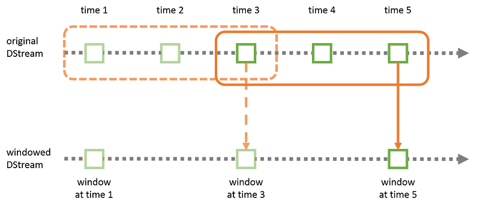
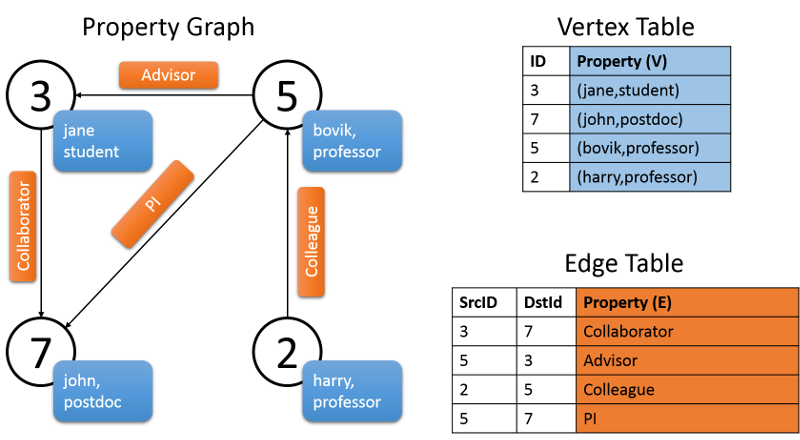

Spark has built-in libraries or modules that include [Spark SQL](https://spark.apache.org/sql/) for SQL and structured data processing, [Spark Streaming](https://spark.apache.org/streaming/), [MLlib](https://spark.apache.org/mllib/) for machine learning, and [GraphX ](https://spark.apache.org/graphx/)for graph processing. This basically presents a unified platform to perform ETL, MapReduce, and complex analytics. 

## Spark SQL

Apache Spark provides a module for structured data processing, Spark SQL. With Spark SQL, users have the ability to run SQL-style queries against Spark RDDs.<sup>[1][^1]</sup> There are two main advantages to using Spark SQL:

- A wide user base of SQL programmers and developers can use Spark to run analytics jobs.
- The wide user base allows application developers to use Spark RDDs as a database backend, similar to MySQL or Hive. 

Spark SQL provides a programming abstraction for its users in the form of `DataFrames`, which is a distributed collection of data organized into columns. `DataFrames` also allows the integration of SQL commands into applications that use the MLlib library. This is explained a bit more in the MLlib section later in this unit. The [API](https://spark.apache.org/docs/latest/sql-programming-guide.html) for `DataFrames` is available in Java, Scala, and Python. `DataFrames` may be constructed from tables in Hive, external databases, structured data files, or RDDs. 

Applications may run SQL queries programmatically (similar to MySQL) via the SQL function in `sqlContext`. The result is returned as a `DataFrame`. Similarly, the schema for a table can also be specified programmatically. There are various options for specifying data sources through the `DataFrame` interface, and Spark SQL offers support for a variety of data sources (for example, JSON and Parquet). Like other operations on a table, data may also be loaded programmatically. 

## Spark Streaming

An extension of the core Spark API, Spark Streaming enables scalable, high-throughput, fault-tolerant stream processing of live data streams. 



_Figure 7: Spark Streaming_

Spark Streaming allows for a streaming data source to be connected to a Spark cluster, as shown in the figure. The Spark Streaming system will divide the streaming input into batches, which can then be fed into the Spark engine to run the required analytics operations. One example is that a Spark cluster can be connected to a Twitter stream to filter out tweets that are relevant to a particular company or product, and a sentiment analysis can be run on the filtered tweets to provide real-time reports on product or brand sentiment. 

The high-level abstraction provided by Spark Streaming is the discretized stream<sup>[2][^2]</sup> or `Dstream`, which can be created from an input stream. `Dstreams` are represented internally in Spark as a sequence of RDDs. The APIs in Spark Streaming allow for the creation of a stream processing pipeline in Java, Python, or Scala. 

To build a streaming pipeline in Spark Streaming, first a `Dstream` should be constructed from an input data source. The source can be as simple as a network socket or file stream, or can be a more complex system such as [Kafka](http://kafka.apache.org/),<sup>[3][^3]</sup> [Flume](https://flume.apache.org/),<sup>[4][^4]</sup> [Kinesis](http://aws.amazon.com/kinesis/), or a [Twitter feed](https://dev.twitter.com/streaming/overview). After a `Dstream` is constructed, it can be sent to any number of streaming functions to be transformed. Some of the functions include `map()`, `reduce()`, `join()`, and `count()`. Refer to the [API](https://spark.apache.org/docs/latest/streaming-programming-guide.html) for more details. 



_Figure 8: Sliding window computation in Spark Streaming_

In addition to simple transformations, Spark Streaming provides the capability to perform windowed computations, i.e., transformations applied over a sliding window of data (Figure 8). In this case, the user can specify both the **window size** (the number of source RDDs to include in the transformation window) and the **sliding interval** (the number of source RDDs to slide across at the end of each transformation). 

Once the source RDDs in a `Dstream` have been computed, Spark Streaming provides various output options, including writing to binary or text or Hadoop-compatible files, or saving the RDDs for future processing. 

## Machine learning library: MLlib

Spark provides a scalable machine learning library called [MLlib](https://spark.apache.org/mllib/).<sup>[5][^5]</sup> This fits into the APIs for Apache Spark and is available to use in Java, Scala, and Python. Using MLlib with Python requires the [NumPy](http://www.numpy.org/) module. The Hadoop File System (HDFS) and other Hadoop-based data sources (such as HBase) may be used with this, hence making it easier for the modules in the libraries of MLlib to be easily plugged into Hadoop workflows. MLlib consists of common machine learning algorithms, including those for classification, regression, clustering, dimensionality reduction, transformation and extraction of features, and collaborative filtering. There are also libraries for basic statistics. Additionally, there are a few optimization libraries such as stochastic gradient descent and BFGS. 

The libraries in MLlib leverage iterative computations and hence are highly performant, since Spark is adept at iterative computations. This is superior to MapReduce algorithms that sometimes use one-pass approximations. Furthermore, the newer versions of MLlib in Apache Spark include a new package, `spark.ml`, which lets users combine multiple algorithms into a single learning pipeline that may be specified as a sequence of stages using a set of high-level APIs. 

The Spark ML API has different components that are important to understand. One of the most important considerations of any machine learning library is how to handle data, especially a variety of data types. Spark ML uses `DataFrame` from Spark SQL to support a variety of datatypes under a unified dataset concept. 

Another feature that simplifies handling data that is included in the Spark ML API is the concept of `Transformers`, by implementing a method - `transform()` - which helps in data transformation (for example, converting a feature vector to another via regularization). In other words, a `Transformer` is essentially a model that converts one `DataFrame` to another. Supplementing this, of course, is a machine learning algorithm that fits and trains data. This is the concept of an `Estimator` that implements a method, `fit()`. 

For example, `NaiveBayes` implements a multinomial naive Bayes classifier. The output is a `NaiveBayesModel`, which can be used for prediction on test data. `NaiveBayes`, in this case, is the `Estimator`. The model learned, `NaiveBayesModel`, may be used as a `Transformer`. 

The workflow of an entire machine learning process - from taking in data, converting it to the required format, and fitting it to a model - is represented in the form of a pipeline in Spark ML. The pipeline consists of a series of `PipelineStages`. One can specify the sequence of operations in Spark ML for their ML job via a pipeline. 

## GraphX

GraphX<sup>[6][^6]</sup> is used for graphs and graph-parallel computation. GraphX is an extension of RDDs and although both have similar basic operations, GraphX extends Spark RDD by adding a new graph abstraction. The idea behind GraphX is to support some of the operations and techniques used by graph-specific frameworks such as Pregel and GraphLab (covered in the next unit). As a result, GraphX allows Spark to efficiently run graph-parallel computation such as PageRank and connected components at performance comparable to these graph-specific frameworks. 

GraphX includes abstractions to efficiently represent attributed, multi-relational graphs using Spark RDDs. One example is the property graph. In this kind of graph, the edges are labeled, and both vertices and edges can have any number of key-value pairs associated with them (see Figure 9). This type of graph is also directed. This type of graph basically helps support multiple parallel edges which, for example, can be used to signify multiple relationships between two vertices. (For example, a relationship between co-workers can also be that of friends, and the vertices of the graph would be two people.) In GraphX, a vertex is represented as a unique 64-bit-long identifier, `vertexID`. There are no constraints on ordering of these identifiers. Edges of the graph also have corresponding source and vertex identifiers. The `Graph` class has members to access the vertices and edges of the graph. 

``` cpp
class Graph[VD, ED] {
  val vertices: VertexRDD[VD]
  val edges: EdgeRDD[ED]
}
```

The following figure shows a property graph consisting of various collaborators of project Archon. As shown in the graph, the vertex property is the username of the individual and the occupation. The edges of the graph describe the relationship between the individuals. The graph shown below would have the following signature: 

``` cpp
val userGraph: Graph[(String, String), String]
```



_Figure 9: A property graph in GraphX_

A property graph in GraphX is parameterized over vertex (VD) and edge (ED) types. GraphX provides several ways of constructing this graph, given a collection of vertices and edges in an RDD or a disk. Graphs can be generated from raw files, RDDs, or synthetic generators. 

GraphX supports fundamental graph operations (for example, `subgraph`, `joinVertices`, and `aggregrateMessages`), as well as an optimized version of the Pregel API. Additionally, to simplify graph analytics for users, Spark GraphX includes a variety of algorithms and graph builders. The algorithms can be accessed directly as methods and are included in a package called `org.apache.spark.graphx.lib`. 

Spark GraphX also allows users to create functions and transform graphs based on new properties. GraphX is designed as an extensible framework. There are 2 classes that help do this. The `Graph` class consists of the core operators with certain optimizations needed to generate the graph. `GraphOps` is an extension of the `Graph` class that has more convenient operators using the core operators in `Graph`. Apache Spark separated the operators this way to provide for convenient future extensions. Future graph representations would have to provide the core operators listed in `Graph` and have the option to reuse the implementation in GraphOps. A list of operations in each of these is provided in the [API documentation](https://spark.apache.org/docs/latest/graphx-programming-guide.html). 
<br>

***
### References

1. _Xin, Reynold S and Rosen, Josh and Zaharia, Matei and Franklin, Michael J and Shenker, Scott and Stoica, Ion (2013). [Shark: SQL and rich analytics at scale](https://dl.acm.org/doi/10.1145/2463676.2465288) Proceedings of the 2013 ACM SIGMOD International Conference on Management of data_
2. _Zaharia, Matei and Das, Tathagata and Li, Haoyuan and Shenker, Scott and Stoica, Ion (2012). [Discretized streams: an efficient and fault-tolerant model for stream processing on large clusters](https://www.usenix.org/system/files/conference/hotcloud12/hotcloud12-final28.pdf) Proceedings of the 4th USENIX conference on Hot Topics in Cloud Computing_
3. _Kreps, Jay and Narkhede, Neha and Rao, Jun and others (2011). [Kafka: A distributed messaging system for log processing](https://pdfs.semanticscholar.org/ea97/f112c165e4da1062c30812a41afca4dab628.pdf) Proceedings of 6th International Workshop on Networking Meets Databases (NetDB), Athens, Greece_
4. _Hoffman, Steve (2013). [Apache Flume: Distributed Log Collection for Hadoop](https://www.packtpub.com/big-data-and-business-intelligence/apache-flume-distributed-log-collection-hadoop) Packt Publishing Ltd_
5. _Sparks, Evan R and Talwalkar, Ameet and Smith, Virginia and Kottalam, Jey and Pan, Xinghao and Gonzalez, Joseph and Franklin, Michael J and Jordan, Michael I and Kraska, Tim (2013). [MLI: An API for distributed machine learning data mining](https://ieeexplore.ieee.org/abstract/document/6729619) (ICDM), 2013 IEEE 13th International Conference on Data Mining Workshops_
6. _Xin, Reynold S and Gonzalez, Joseph E and Franklin, Michael J and Stoica, Ion (2013). [GraphX: A resilient distributed graph system on Spark](http://www.istc-cc.cmu.edu/publications/papers/2013/grades-graphx_with_fonts.pdf) First International Workshop on Graph Data Management Experiences and Systems_

***

[^1]: <https://dl.acm.org/doi/10.1145/2463676.2465288> "Xin, Reynold S and Rosen, Josh and Zaharia, Matei and Franklin, Michael J and Shenker, Scott and Stoica, Ion (2013). [*Shark: SQL and rich analytics at scale* Proceedings of the 2013 ACM SIGMOD International Conference on Management of data"
[^2]: <https://www.usenix.org/system/files/conference/hotcloud12/hotcloud12-final28.pdf> "Zaharia, Matei and Das, Tathagata and Li, Haoyuan and Shenker, Scott and Stoica, Ion (2012). *Discretized streams: an efficient and fault-tolerant model for stream processing on large clusters* Proceedings of the 4th USENIX conference on Hot Topics in Cloud Computing"
[^3]: <https://pdfs.semanticscholar.org/ea97/f112c165e4da1062c30812a41afca4dab628.pdf> "Kreps, Jay and Narkhede, Neha and Rao, Jun and others (2011). *Kafka: A distributed messaging system for log processing* Proceedings of 6th International Workshop on Networking Meets Databases (NetDB), Athens, Greece"
[^4]: <https://www.packtpub.com/big-data-and-business-intelligence/apache-flume-distributed-log-collection-hadoop> "Hoffman, Steve (2013). *Apache Flume: Distributed Log Collection for Hadoop* Packt Publishing Ltd"
[^5]: <https://ieeexplore.ieee.org/abstract/document/6729619> "Sparks, Evan R and Talwalkar, Ameet and Smith, Virginia and Kottalam, Jey and Pan, Xinghao and Gonzalez, Joseph and Franklin, Michael J and Jordan, Michael I and Kraska, Tim (2013). *MLI: An API for distributed machine learning data mining* (ICDM), 2013 IEEE 13th International Conference on Data Mining Workshops"
[^6]: <http://www.istc-cc.cmu.edu/publications/papers/2013/grades-graphx_with_fonts.pdf> "Xin, Reynold S and Gonzalez, Joseph E and Franklin, Michael J and Stoica, Ion (2013). *GraphX: A resilient distributed graph system on Spark* First International Workshop on Graph Data Management Experiences and Systems"
