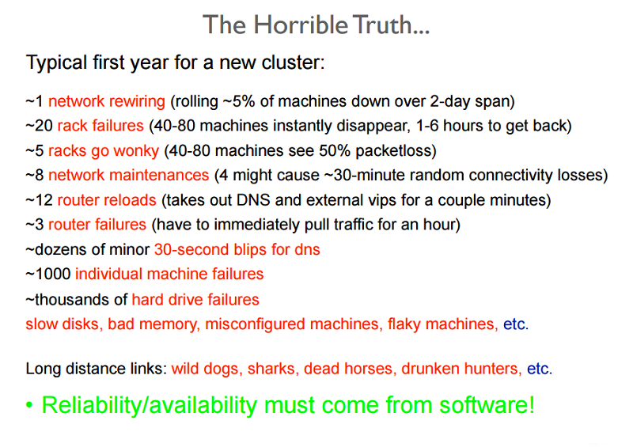

A large part of datacenter and cloud service management involves designing and maintaining a reliable service based on unreliable parts. The following figure shows part of a training for new hires, and should provide an idea of the large number (and types) of failures that are experienced regularly at a large datacenter. 

_Figure 2: Reliability issues as shown in a training presentation_

A failure in a system occurs as a result of an invalid state introduced within the system due to a fault. Systems typically develop faults of one of the following types:
- **Transient faults**: Temporary faults in the system that correct themselves with time. 
- **Permanent faults**: Faults that cannot be recovered from and generally require replacement of resources. 
- **Intermittent faults**: Faults that occur periodically in a system.

Faults may affect the availability of the system by bringing down the services or performance of the system functionalities. A fault-tolerant system has the ability to perform its function even in the presence of failures in the system. On the cloud, a fault-tolerant system is often thought of as one that provides services in a consistent manner with lower downtime than the service level agreements (SLAs) allow. 

## Why is fault tolerance important?

Failures in large mission-critical systems can result in significant monetary losses to all parties concerned. The very nature of cloud computing systems is that they have a layered architecture. Thus, a fault in one layer of the cloud resources can trigger a failure in other layers above, or hide access to the layers below. 

For example, a fault in any hardware component of the system can affect normal execution of an SaaS (software as a service) application running on a virtual machine using the faulty resources. Faults in a system at any layer have a direct relationship to the SLAs between the providers at each level. 

## Proactive measures

Service providers take several measures in order to design the system in a specific way to avoid known issues, or predictable failures. 

### Profiling and testing 

Load and stress testing cloud resources in order to understand possible causes of failure is essential to ensure the availability of services. Profiling these metrics helps in designing a system that can successfully bear the expected load without any unpredictable behavior. 

### Over-provisioning

Over-provisioning is the practice of deploying resources in volumes that are larger than the general projected utilization of the resources at a given time. In situations where the exact needs of the system cannot necessarily be predicted, over-provisioning resources can be an acceptable strategy in order to handle unexpected spikes in loads. 

Consider as an example an e-commerce platform that has an average consistent load on its servers year round, but during the holiday season the expectation is that the load pattern will rapidly spike. At these peak times, it is advisable to provision extra resources based on the historical data for peak usage. A rapid rise in traffic is typically difficult to accommodate in a short period of time. As discussed in later sections, there is a time cost associated with scaling dynamically, which involves the time-consuming steps of detecting a change in the load pattern and provisioning extra resources to accommodate the new load. Both of those steps will require time. This time delay in adjustment can be enough to overwhelm, and at worst crash, the system or at best degrade the quality of service. 

Over-provisioning is also a tactic used to defend against DoS (denial of service) or DDoS (distributed DoS) attacks, which is when attackers generate requests designed to overwhelm a system by throwing large volumes of traffic at it as an attempt to make the system fail. In any attack, it always takes some time for the system detect and take corrective measures. While such analysis of request patterns is being made, the system is already under attack and needs to be able to accommodate the increased traffic until a mitigation strategy can be implemented. 

### Replication

Critical system components can be duplicated by using additional hardware and software components to silently handle failures in parts of the system without the entire system failing. Replication has two basic strategies: 

- Active replication, where all replicated resources are alive concurrently and respond to and process all requests. This means that for any client request, all resources receive the same request, all resources respond to the same request, and the order of the requests maintains state across all resources. 
- Passive replication, where only the primary unit processes requests, and secondary units merely maintain state and take over once the primary unit fails. The client is only in contact with the primary resource, which relays the state change to all secondary resources. The disadvantage of passive replication is that there may be either dropped requests or degraded QoS in switching from the primary to the secondary instance. 

There is also a hybrid strategy, called **semi-active**, which is very similar to the active strategy. The difference is that only the output of the primary resource is exposed to the client. The outputs of the secondary resources are suppressed and logged, and are ready to switch over as soon as a failure of the primary resource occurs. The following figure shows the differences between the replication strategies.

_Figure 3: Replication strategies_

An important factor to consider in replication is the number of secondary resources to use. Although this differs from application to application based on the criticality of the system, there are 3 formal levels of replication: 

- **N+1**: This basically means that for an application that needs N nodes to function properly, one extra resource is provisioned as a fail-safe.
- **2N**: At this level, one extra node for each node required for normal function is provisioned as a fail-safe. 
- **2N+1**: At this level, one extra node for each node required for normal function, and one additional node overall, is provisioned as a fail-safe. 

## Reactive measures

In addition to predictive measures, systems can take reactive measures and deal with failures as and when they happen: 

### Checks and monitoring

All resources are constantly monitored in order to check for unpredictable behavior or loss of resources. Based on the monitoring information, recovery or reconfiguration strategies are designed in order to restart resources or bring up new resources. Monitoring can help in the identification of faults in the systems. Faults that cause a service to be unavailable are called crash faults, and those that induce an irregular/incorrect behavior in the system are called Byzantine faults. 

There are several monitoring tactics that are used to check crash faults within a system. Two of these tactics are: 
- **Ping-echo**: The monitoring service asks each resource for its state and is given a time window to respond.
- **Heartbeat**: Each instance sends status to the monitoring service at regular intervals, without any trigger.

Monitoring Byzantine faults usually depends on the properties of the service being provided. Monitoring systems can check basic metrics like latency, CPU utilization, and memory utilization, and check against the expected values to see if the quality of service is being degraded. In addition, application-specific supervision logs are usually kept at each important service execution point and analyzed periodically to see that the service is functioning properly at all times (or whether there are injected failures in the system). 

### Checkpoint and restart

Several programming models in the cloud implement checkpoint strategies, whereby state is saved at several stages of execution in order to enable recovery to a last-saved checkpoint. In data analytics applications, there are often long-running parallel distributed tasks that run on terabytes of data sets to extract information. Since these tasks are executed in several small execution chunks, each step in the execution of the program can save the overall state of execution as a checkpoint. At points of failure where individual nodes are unable to complete their work, the execution can be restarted from a previous checkpoint. The biggest challenge while identifying valid checkpoints to roll back to is when parallel processes are sharing information. A failure in one of the processes may cause a cascading rollback in another process, as the checkpoints made in that process can be a result of a fault in the data shared by the failing process. You will learn more about fault tolerance for programming models in later modules. 

## Case studies in resiliency testing

Cloud services need to be built with redundancy and fault tolerance in mind, as no single component of a large distributed system can guarantee 100% availability or uptime. 

All failures (including failures of dependencies in the same node, rack, datacenter, or regionally redundant deployments) need to be handled gracefully without affecting the entirety of the system. Testing the ability of the system to handle catastrophic failures is important, as sometimes even a few seconds of downtime or service degradation can cause hundreds of thousands, if not millions, of dollars in revenue loss. 

Testing for failures with real traffic needs to be done regularly so that the system is hardened and can cope when an unplanned outage occurs. There are various systems built to test resiliency. One such testing suite is **Simian Army** built by Netflix. 

Simian Army consists of services (referred to as **monkeys**) in the cloud for generating various kinds of failures, detecting abnormal conditions, and testing the system's ability to survive them. The goal is to keep the cloud safe, secure, and highly available. Some of the monkeys found in Simian Army are: 

- **Chaos monkey**: A tool that randomly picks a production instance and disables it to make sure the cloud survives common types of failure without any customer impact. Netflix describes Chaos Monkey as "The idea of unleashing a wild monkey with a weapon in your datacenter (or cloud region) to randomly shoot down instances and chew through cables -- all the while we continue serving our customers without interruption." This kind of testing with detailed monitoring can expose various forms of weaknesses in the system, and automatic recovery strategies can be built based on the results. 
- **Latency monkey**: A service that induces delays in between RESTful communication of different clients and servers, simulating service degradation and downtime.
- **Doctor monkey**: A service that finds instances that are exhibiting unhealthy behaviors (for example, CPU load) and removes them from service. It allows the service owners some time to figure out the reason for the problem and eventually terminates the instance.
- **Chaos gorilla**: A service that can simulate the loss of an entire AWS availability zone. This is used to test that the services automatically rebalance the functionality among the remaining zones without user-visible impact or manual intervention. 

