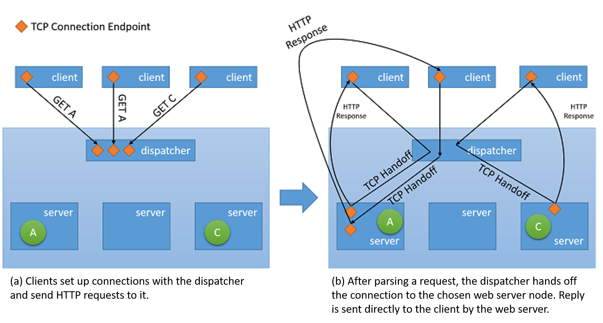

The need for load balancing in computing stems from two basic requirements: First, high availability can be improved by replication. Second, performance can be improved through parallel processing. High availability is the property of a service that is available for nearly 100% of the time when any client tries to access the service. The quality of service (QoS) for a particular service generally includes several considerations such as throughput and latency requirements. 

## What is load balancing?

The most well-known form of load balancing is "round robin DNS," employed by many large web services to load balance requests among a number of servers. Specifically, multiple front-end web servers, each with a unique IP address, share a DNS name. To balance the number of requests on each of these web servers, large companies like Google maintain and curate a pool of IP addresses associated with a single DNS entry. When a client makes a request (for example, to the domain www.google.com), Google's DNS selects one of the available addresses from the pool and sends it to the client. The simplest strategy employed to dispatch IP addresses is to use a simple round-robin queue, where after each DNS response, the list of addresses is permuted. 

Before the advent of the cloud, DNS load balancing was a simple way to tackle the latency of long-distance connections. The dispatcher at the DNS server was programmed to respond with the IP address of the server that was geographically nearest to the client. The simplest schemes to do this tried to respond with the IP address from the pool that was numerically the closest to the IP address of the client. This method, of course, was unreliable, as IP addresses are not distributed in a global hierarchy. Current techniques are more sophisticated and rely on a software mapping of IP addresses to locations based on physical maps of internet service providers (ISPs). Since this is implemented as a costly software lookup, this method yields more accurate results, but is expensive to compute. However, the cost of a slow lookup is amortized since the DNS lookup occurs only when the first connection to a server is made by the client. All subsequent communications happen directly between the client and the server that owns the dispatched IP address. An example of a DNS load-balancing scheme is shown in the following figure. 

_Figure 4: Load balancing in a cloud hosting environment_

The downside of this method is that in the case of a server failure, the switchover to a different IP address is dependent on the configuration of the time-to-live (TTL) of the DNS cache. DNS entries are known to be long living, and updates are known to take over a week to propagate over the internet. Hence, it is difficult to quickly "hide" a server failure from the client. This can be improved by reducing the validity (TTL) of an IP address in the cache, but this occurs at the cost of performance and increasing the number of lookups. 

Modern load balancing often refers to the use of a dedicated instance (or a pair of instances) that directs incoming traffic to the back-end servers. For each incoming request on a specified port, the load balancer redirects the traffic to one of the back-end servers based on a distribution strategy. In doing so, the load balancer maintains the request metadata, including information like application protocol headers (such as HTTP headers). In this situation, there is no problem of stale information as every request passes through the load balancer. 

Though all types of network load balancers will simply forward the user's information along with any context to the back-end servers, when it comes to serving the response back to the client, they may employ one of two basic strategies:[1][^1] 
- **Proxying**: In this approach, the load balancer receives the response from the back end and relays it back to the client. The load balancer behaves as a standard web proxy and is involved in both halves of a network transaction, namely forwarding the request to the client and sending back the response. 
- **TCP handoff** In this approach, the TCP connection with the client is handed off to the back-end server. Therefore the server sends the response directly to the client, without going through the load balancer. 

_Figure 5: TCP handoff mechanism from the dispatcher to the back-end server_

## Impact on availability and performance

Load balancing is an important strategy to mask failures in a system. As long as the client of the system is exposed to a single endpoint that is balancing load across several resources, failures in individual resources can be masked from the client by simply servicing the request at a different resource. However, it is important to note that the load balancer is now a single point of failure for the service. If it fails for any reason, even if all back-end servers are still functioning, no client request will be able to be served. Hence, in order to achieve high availability, load balancers are often implemented in pairs. 

Load balancing allows a service to distribute workloads across several compute resources in the cloud. Having a single compute instance in the cloud has several limitations. We discussed earlier the physical limitation on performance, where more resources are required for increasing workloads. By using load balancing, larger volumes of workloads can be distributed across multiple resources such that each resource can fulfill its requests independently and in parallel, thereby improving the throughput of the application. This also improves average service times since there are more servers to serve the workload. 

Checking and monitoring services are key in enabling the success of load-balancing strategies. A load balancer needs to ensure that every request is fulfilled by ensuring each resource node is available. If not, then traffic is not directed to that specific node. Ping-echo monitoring is one of the most popular tactics for checking the health of a specific resource node. In addition to health of a node, some load-balancing strategies require additional information such as throughput, latency, and CPU utilization in order to evaluate the most appropriate resource to direct traffic. 

Load balancers must often guarantee high availability. The simplest way to do this is to create multiple load-balancing instances (each with a unique IP address) and link each instance to a single DNS address. Whenever a load-balancer instance fails for any reason, it is replaced with a new one, and all traffic is passed on to the failover instance with a small performance impact. Simultaneously, a new load-balancer instance can be configured to replace the failed one, and the DNS records should be immediately updated. 

## Strategies for load balancing

There are several load-balancing strategies in the cloud.

### Equitable dispatching

This is a static approach to load balancing where a simple round-robin algorithm is used to divide the traffic between all nodes evenly and does not take into consideration the utilization of any individual resource node in the system or the execution time of any request. This approach tries to keep every node in the system busy and is one of the simplest approaches to implement. An important drawback to this approach is that heavy client requests may aggregate and hit the same datacenters, causing a few nodes to get overwhelmed while others remain underutilized. However, this requires a very specific load pattern and has low probability of occurring in practice on a large number of clients and servers with fairly uniform connection distribution and capacity. This strategy, however, makes it difficult to implement caching strategies on the datacenter that take into account considerations like spatial locality (where you prefetch and cache data near the data that was currently fetched), since the next request made by the same client may end up on a different server. 

AWS uses this approach in its ELB (Elastic Load Balancer) offering. AWS ELB provisions load balancers that balance the traffic across the attached EC2 instances. Load balancers are essentially EC2 instances themselves with a service to specifically route traffic. As the resources behind the load balancer are scaled out, the IP addresses of the new resources are updated on the DNS record of the load balancer. This process takes several minutes to complete as it requires both monitoring and provisioning time. This period of scaling (the time until the load balancer can handle the higher load) is referred to as "warming up" the load balancer.

The ELB load balancers from AWS also monitor each resource attached for workload distribution in order to maintain a health check. A ping-echo mechanism is used to ensure all resources are healthy. ELB users can configure the parameters of the health check by specifying the delays and the number of retries.

### Hash-based distribution

This approach tries to ensure that at any point, the requests made by a client through the same connection always end up on the same server. In addition, in order to balance the traffic distribution of requests, it is done in a random order. This has several advantages over the round-robin approach as it helps in session-aware applications where state persistence and caching strategies can be much simpler. It is also less susceptible to traffic patterns that would result in clogging on a single server since the distribution is random, but the risk still exists. However, since every request needs to be evaluated for connection metadata in order to route it to a relevant server, it introduces a small amount of latency to every request.

Azure Load Balancer uses such a hash-based distribution mechanism in order to distribute load. This mechanism creates a hash for every request based on source IP, source port, destination IP, destination port, and protocol type, in order to ensure that every packet from the same connection always ends up on the same server. The hash function is chosen such that the distribution of connections to servers is fairly random.

Azure provides health checks via three types of probes: Guest Agent probes (on PaaS VMs), HTTP custom probes, and TCP custom probes. All three probes provide a health check for the resource nodes via a ping-echo mechanism.

### Other popular strategies

There are other strategies used to balance load across multiple resources. Each of them uses different metrics to gauge the most appropriate resource node for a particular request:
- **Strategies based on request execution time**: These strategies use a priority scheduling algorithm, whereby request execution times are used in order to judge the most appropriate order of load distribution. The main challenge in using this approach is to accurately predict the execution time of a particular request.
- **Strategies based on resource utilization**: These strategies use the CPU utilization on each resource node to balance the utilization across each node. The load balancers maintain an ordered list of resources based on their utilization and then direct requests to the least loaded node. 

## Other benefits

Having a centralized load balancer lends itself to several strategies that can increase the performance of the service. However, it is important to note that these strategies work only as long as the load balancer is not under insurmountable load. Otherwise, the load balancer itself becomes the bottleneck. Some of these strategies are listed below: 

- SSL offload: Network transactions via SSL have an extra cost associated with them since they need to have processing for encryption and authentication. Instead of serving all requests via SSL, the client connection to the load balancer can be made via SSL, while redirect requests to each individual server can be made via HTTP. This reduces the load on the servers considerably. Additionally, security is maintained as long as the redirect requests are not made over an open network. 
- TCP buffering: This is a strategy to offload clients with slow connections on to the load balancer in order to relieve servers that are serving responses to these clients. 
- Caching: In certain scenarios, the load balancer can maintain a cache for the most popular requests (or requests that can be handled without going to the servers, like static content) so that it reduces the load on the servers. 
- Traffic shaping: For some applications, a load balancer can be used to delay/reprioritize the flow of packets such that traffic can be molded to suit the server configuration. This does affect the QoS for some requests, but makes sure that the incoming load can be served.
 
***
### References

1. _Aron, Mohit and Sanders, Darren and Druschel, Peter and Zwaenepoel, Willy (2000). [Scalable content-aware request distribution in cluster-based network servers](https://www.researchgate.net/publication/2643853_Scalable_Content-aware_Request_Distribution_in_Cluster-based_Network_Servers) from Proceedings of the 2000 Annual USENIX technical Conference_

***

[^1]: <https://www.researchgate.net/publication/2643853_Scalable_Content-aware_Request_Distribution_in_Cluster-based_Network_Servers> "Aron, Mohit and Sanders, Darren and Druschel, Peter and Zwaenepoel, Willy (2000). *Scalable content-aware request distribution in cluster-based network servers* from Proceedings of the 2000 Annual USENIX technical Conference"
