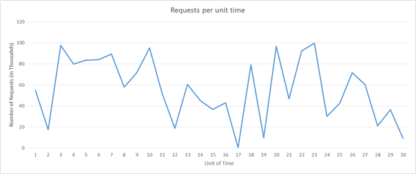

One of the important advantages of the cloud is the ability scale resources into a system on demand. Scaling up (provisioning larger resources) or scaling out (provisioning extra resources) can help in reducing the load on a single resources by decreasing utilization as a result of increased capacity or broader distribution of the workload. 

Scaling can help in improving performance by increasing the throughput, since a larger number of requests can now be served. This can also help in decreasing latency during peak loads since a reduced number of requests are queued during peak loads on a single resource. In addition, this can help in improving the reliability of the system by reducing the resource utilization so as to be farther away from the breaking point of the resource. 

It is important to note that although the cloud enables us to easily provision newer or better resources, cost is always an opposing factor that needs to be considered. Therefore, even though it is beneficial to scale up/out, it is also important to recognize when to scale down/in in order to save costs. In an n-tier application, it is also essential to pinpoint where the bottlenecks are and which tier to scale, whether it is the data tier or server tier. 

Scaling resources is facilitated by load balancing (we discussed this earlier), which helps in masking the scaling aspect of a system by hiding it behind a consistent endpoint. 

## Scaling strategies

### Horizontal scaling (scale out and in)

Horizontal scaling is a strategy where additional resources can be added to the system or extraneous resources can be removed from the system. This type of scaling is beneficial for the server tier, when the load on the system is unpredictable and fluctuates inconsistently. The nature of the fluctuating load makes it essential to efficiently provision the correct amount of resources to handle the load at all times. 

A few considerations that make this a challenging task are the spin-up time of an instance, the pricing model of the cloud service provider, and the potential loss in revenue from degrading quality of service (QoS) by not scaling out in time. As an example, let's consider the following load pattern: 

_Figure 6: Sample request load pattern_

Let us imagine we are using Amazon Web Services. Let us also imagine that each unit of time is equivalent to 3 hours of actual time and that we require one server to serve 5k requests. If you consider the load during the time units 16 to 22, there is an enormous fluctuation in the load. We can detect a fall in demand at right around time unit 16 and start to reduce the number of allocated resources. Since we are going from roughly 50k requests to almost 0 requests in the space of 3 hours, academically we can save the cost of 10 instances that would have been up at time 16. 

Now let us imagine instead that each time unit is equal to 20 mins of actual time. In that case, spinning down the all the resources at time unit 16 only to spin up new resources after 20 mins will actually increase the cost instead of saving, since AWS bills each compute instance on an hourly basis. 

In addition to the above two considerations, a service provider will also need to evaluate the losses it will incur by providing degraded QoS during time unit 20, if it has capacity for only 90k requests instead of 100k requests. 

The scaling depends on the characteristics of the traffic and its ensuing load generated at a web service. If the traffic follows a predictable pattern (for example, based on human behavior such as streaming movies from a web service in the evening), then the scaling can be **predictive** in order to maintain the QoS. However, in many instances, the traffic cannot be predicted and the scaling systems need to be **reactive** based on different criteria, as the examples above showed. 

### Vertical scaling (scale up and down)

There are certain kinds of loads for service providers that are more predictable than others. For example, if you know from historical patterns that the number of requests will always be 10k-15k, then you can comfortably assume that one server that can serve 20k requests will be good enough for the service provider's purposes. These loads may increase in the future, but as long they increase in a consistent manner, the service can be moved to a larger instance that can serve more requests. This is suitable for small applications that experience a low amount of traffic. 

The challenge in vertical scaling is that there is always some switch-over time that can be considered as downtime. This is because in order to move all operations from the smaller instance to a larger instance, even if the switch-over time is mere minutes, the QoS does degrade during that interval. 

In addition, most cloud providers offer compute resources in increasing compute power by doubling the compute power of a resource. Therefore the granularity in scaling up is not as fine as it is in horizontal scaling. So even if the load is predictable and steadily increasing as the popularity of the service increases, many service providers choose to do horizontal scaling instead of vertical scaling. 

## Considerations for scaling

### Monitoring

Monitoring is one of the most crucial element for effectively scaling resources, as it enables you to have metrics that can be used to interpret which parts of the system need to scale and when they need to scale. Monitoring enables the analysis of traffic patterns or resource utilization in order to make an educated assessment about when and how much to scale resources in order to maximize QoS along with profit. 

There are several aspects of resources that are monitored in order to trigger scaling of resources. The most common metric is resource utilization. For example, a monitoring service can track the CPU utilization of each resource node and scale resources if the usage is excessive or too low. If, for instance, the usage for each resource is higher than 95%, then it is probably a good idea to add more resources since the system is under a heavy load. Service providers usually decide these trigger points by analyzing the breaking point of resource nodes, determining when they will start to fail, and mapping out their behavior under various levels of load. Though, for cost reasons, it is important to maximally utilize each resource, it is advisable to leave some room for the operating system to allow for overhead activities. Similarly if the utilization is significantly below say 50%, then it is possible that not all the resource nodes are required and some can be deprovisioned. 

In practice, service providers usually monitor a combination of several different metrics of a resource node to evaluate when to scale resources. Some of these include CPU utilization, memory consumptions, throughput, and latency. Azure provides Azure Monitor as an additional service that can monitor any Azure resource and provide such metrics.

### Statelessness

A stateless service design lends itself to a scalable architecture. A stateless service essentially means that the client request contains all the information necessary to serve a request by the server. The server does not store any client-related information on the instance and does store any session-related information on the server instance. 

Having a stateless service helps in switching resources at will, without any configuration required to maintain the context (state) of the client connection for subsequent requests. If the service is stateful, then resource scaling requires a strategy to transfer the context from the existing node configuration to the new node configuration. Note that there are techniques to implement stateful services; for example, maintaining a network cache with Memcached so the context can be shared across the servers.

### Decide what to scale

Depending on the nature of the service, different resources need to be scaled depending on the requirement. For the server tier, as the workloads increase, depending on the type of application, it may increase the resource contention for either CPU, memory, network bandwidth, or all of the above. Monitoring the traffic allows us to identify which resource is getting constrained and appropriately scale that specific resource. Cloud service providers do not necessarily provide scalability granularity to only scale compute or memory, but they do provide different types of compute instances that specifically cater to compute-heavy or memory-heavy loads. So, for example, for an application that has memory-intensive workloads, it would be more advisable to scale up the resources to memory-optimized instances. For applications that need to serve a large number of requests that are not necessarily compute heavy or memory heavy, scaling out multiple standard compute instances might be a better strategy. 

Increasing hardware resources may not always be the best solution for increasing the performance of a service. Increasing the efficiency of the algorithms used within the service can also help in reducing resource contention and improve utilization, removing the need to scale physical resources. 

### Scale the data tier

In data-oriented applications, where there is a high number of reads and writes (or both) to a database or storage system, the round-trip time for each request is often limited by the hard disk's I/O read and write times. Larger instances allow for higher I/O performance for reads and writes, which can improve seek times on the hard disk, which in turn can result in a large improvement in the latency of the service. Having multiple data instances in the data tier can improve the reliability and availability of the application by providing failover redundancies. Replicating data across multiple instances has additional advantages in reducing network latency if the client is served by a datacenter physically closer to it. Sharding or partitioning of the data across multiple resources is another horizontal data-scaling strategy where instead of simply replicating the data across multiple instances, data is partitioned into several partitions and stored across multiple data servers. 

The additional challenge when it comes to scaling the data tier is that of maintaining **consistency** (a read operation on all replicas is the same), **availability** (reads and writes always succeed), and **partition tolerance** (guaranteed properties in the system are maintained when failures prevent communication across nodes). This is often referred to as the CAP theorem, which states that within a distributed database system it is very difficult to obtain all three properties completely, and thus the system may at most exhibit a combination of two of the properties. You will learn more about database scaling strategies and the CAP theorem in later modules. 

