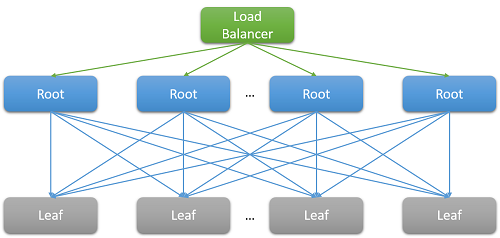

We have already discussed several optimization techniques used on the cloud to reduce latency. Some of the measures we studied include scaling resources horizontally or vertically and using a load balancer to route requests to the nearest available resources. This page delves more deeply into why, in a large datacenter or cloud application, it is important to minimize latency for all requests, and not just optimize for the general case. We will study how even a few high-latency outliers can significantly degrade the observed performance of a large system. This page also covers various techniques to create services that provide predictable low-latency responses, even if the individual components do not guarantee this. This is a problem that is especially significant for interactive applications where the desired latency for an interaction is below 100 ms. 

## What is tail latency?

Most cloud applications are large, distributed systems that often rely on parallelization to reduce latency. A common technique is to fan out a request received at a root node (for example, a front-end web server) to many leaf nodes (back-end compute servers). The performance improvement is driven by the parallelism of the distributed computation, and also by the fact that extremely expensive data-moving costs are avoided. We simply move the computation to the place where the data is stored. Of course, each leaf node concurrently operates on hundreds or even thousands of parallel requests. 

_Figure 7: Latency due to scale-out_

Consider the example of searching for a movie on Netflix. As a user begins to type in the search box, this will generate several parallel events from the root web server. At a minimum, these events include the following requests: 
- To the autocomplete engine, to actually predict the search being made based on past trends and the user's profile.
- To the correction engine, which finds errors in the typed query based on a constantly adapting language model.
- Individual search results for each of the component words of a multi-word query, which must be combined based on the rank and relevance of the movies.
- Additional post-processing and filtering of results to meet the user's "safe-search" preferences.

Such examples are extremely common. A single Facebook request is known to contact thousands of memcached servers, whereas a single Bing search often contacts over ten thousand index servers. 

Clearly, the need for scale has led to a large fan-out at the back end for each individual request serviced by the front end. For services that are expected to be "responsive" to retain their user base, heuristics show that responses are expected within 100 ms. As the number of servers required to resolve a query increases, the overall time often depends on the worst-performing response from a leaf node to a root node. Assuming that all leaf nodes must finish executing before a result can be returned, the overall latency must always be greater than the latency of the single slowest component.

Like most stochastic processes, the response time of a single leaf node can be expressed as a distribution. Decades of experience have shown that in the general case, most (>99%) requests of a well-configured cloud system will execute extremely quickly. But often, there are very few outliers on a system that execute extremely slowly. 

_Figure 8: Tail latency example_[5][^5]

Consider a system where all leaf nodes have an average response time of 1 ms, but there is probability of 1% that the response time is greater than 1,000 ms (one second). If each query is handled by only a single leaf node, the probability of the query taking longer than one second is also 1%. However, as we increase the number of nodes to 100, the probability that the query will finish within one second drops to 36.6%, which means that there is a 63.4% chance that the query duration will be determined by the tail (lowest 1%) of the latency distribution. 

$(.99^{100})$

If we simulate this for a variety of cases, we see that as the number of servers increases, the impact of a single slow query is more pronounced (notice that the graph below is monotonically increasing). Also, as the probability of these outliers decreases from 1% to 0.01%, the system is substantially lower. 

_Figure 9: Recent study of response time probability that shows the 50th, 95th, and 99th percentiles for latency of requests_[4][^4]

Just like we designed our applications to be fault tolerant to deal with resource reliability problems, it should be clear now why it is important for applications to be "tail tolerant." To be able to do this, we must understand the sources of these long performance variabilities and identify mitigations where possible and workarounds where not. 

## Variability in the cloud: Sources and mitigations 

To resolve the response time variability that leads to this tail latency problem, we must understand the sources of performance variability.[1][^1]
- **Use of shared resources**: Many different VMs (and applications within those VMs) contend for a shared pool of compute resources. In rare cases, it is possible that this contention leads to low latency for some requests. For critical tasks, it may make sense to use dedicated instances and periodically run benchmarks when idle, to ensure that it behaves correctly.
- **Background daemons and maintenance**: We have already spoken about the need for background processes to create checkpoints, create backups, update logs, collect garbage, and handle resource cleanup. However, these can degrade the performance of the system while executing. To mitigate this, it is important to synchronize disruptions due to maintenance threads to minimize the impact on the flow of traffic. This will cause all variation to occur in a short, well-known window rather than randomly over the lifetime of the application.
- **Queueing**: Another common source of variability is the burstiness of traffic arrival patterns.[1][^1] This variability is exacerbated if the OS uses a scheduling algorithm other than FIFO. Linux systems often schedule threads out of order to optimize the overall throughput and maximize utilization of the server. Studies have found that using FIFO scheduling in the OS reduces tail latency at the cost of lowering overall throughput of the system. 
- **All-to-all incast**: The pattern shown in Figure 8 above is known as all-to-all communication. Since most network communication is over TCP, this leads to thousands of simultaneous requests and responses between the front-end web server and all the back-end processing nodes. This is an extremely bursty pattern of communication and often leads to a special kind of congestion failure known TCP incast collapse.[1][^1], [2][^2] The intense sudden response from thousands of servers leads to many dropped and retransmitted packets, eventually causing a network avalanche of traffic for packets of data that are very small. Large datacenters and cloud applications often need to use custom network drivers to dynamically adjust the TCP receiving window and the retransmission timer. Routers may also be configured to drop traffic that exceeds a specific rate and reduce the size of the sending.
- **Power and temperature management**: Finally, variability is a byproduct of other cost reduction techniques like using idle states or CPU frequency downscaling. A processor may often spend a non-trivial amount of time scaling up from an idle state. Turning off such cost optimizations leads to higher energy usage and costs, but lower variability. This is less of a problem in the public cloud, as pricing models rarely consider internal utilization metrics of the customer's resources. 

Some experiments have found that the variability of such systems is much worse on the public cloud,[3][^3]  typically due to imperfect performance isolation of virtual resources and the shared processor. This is exacerbated if many latency-sensitive jobs are executed on the same physical node as CPU-intensive jobs.

## Living with variability: Engineering solutions

Many of the sources of variability above have no foolproof solution. Hence, instead of trying to resolve all of the sources that inflate the latency tail, cloud applications must be designed to be tail tolerant. This, of course, is similar to the way that we design applications to be fault tolerant since we cannot possibly hope to fix all possible faults. Some of the common techniques to deal with this variability are: 
- **"Good enough" results**: Often, when the system is waiting to receive results from thousands of nodes, the importance of any single result may be assumed to be quite low. Hence, many applications may choose to simply respond to the users with results that arrive within a particular, short latency window and discard the rest.
- **Canaries**: Another alternative that is often used for rare code paths is to test a request on a small subset of leaf nodes in order to test if it causes a crash or failure that can impact the entire system. The full fan-out query is generated only if the canary does not cause a failure. This is akin to sending a canary (bird) into a coal mine to test if it is safe for humans.
- **Latency-induced probation and health checks**: Of course, a bulk of the requests to a system are too common to test using a canary. Such requests are more likely to have a long tail if one of the leaf nodes is performing poorly. To counter this, the system must periodically monitor the health and latency of each leaf node and not route requests to nodes that demonstrate low performance (due to maintenance or failures).
- **Differential QoS**: Separate service classes can be created for interactive requests, allowing them to take priority in any queue. Latency-insensitive applications can tolerate longer waiting times for their operations. 
- **Request hedging**: This is a simple solution to reduce the impact of variability by forwarding the same request to multiple replicas and using the response that arrives first. Of course, this can double or triple the amount of resources required. To reduce the number of hedged requests, the second request may be sent only if the first response has been pending for greater than the 95th percentile of the expected latency for that request. This causes the extra load to be only about 5%, but reduces the latency tail significantly (in the typical case shown in Figure 9, where the 95th-percentile latency is much lower than the 99th-percentile latency).
- **Speculative execution and selective replication**: Tasks on nodes that are particularly busy can be speculatively launched on other underutilized leaf nodes. This is especially effective if a failure in a particular node causes it to be overloaded.
- **UX-based solutions**: Finally, the delay can be intelligently hidden from the user through a well-designed user interface that reduces the sensation of delay experienced by a human user. Techniques to do this may include the use of animations, showing early results, or engaging the user by sending relevant messages.

Using these techniques, it's possible to significantly improve the experience of the end users of a cloud application to solve the peculiar problem of a long tail. 
 
***
### References

1. _Li, J., Sharma, N. K., Ports, D. R., & Gribble, S. D. (2014). [Tales of the Tail: Hardware, OS, and Application-Level Sources of Tail Latency](https://courses.cs.washington.edu/courses/cse452/23wi/papers/li-et-al-tales-of-the-tail.pdf) from the Proceedings of the ACM Symposium on Cloud Computing, ACM_
2. _Wu, Haitao and Feng, Zhenqian and Guo, Chuanxiong and Zhang, Yongguang (2013). [ICTCP: Incast Congestion Control for TCP in Data-Center Networks](https://conferences.sigcomm.org/co-next/2010/CoNEXT_papers/13-Wu.pdf), IEEE/ACM Transactions on Networking (TON), IEEE Press_
3. _Xu, Yunjing and Musgrave, Zachary and Noble, Brian and Bailey, Michael (2013). [Bobtail: Avoiding Long Tails in the Cloud](https://www.usenix.org/system/files/conference/nsdi13/nsdi13-final77.pdf), 10th USENIX Conference on Networked Systems Design and Implementation, USENIX Association_
4. _Dean, Jeffrey and Barroso, Luiz André (2013). [The tail at scale](https://cacm.acm.org/magazines/2013/2/160173-the-tail-at-scale/fulltext), Communications of the ACM, ACM_
5. _Tene, Gil (2014). [Understanding Latency - Some Key Lessons and Tools](https://www.infoq.com/presentations/latency-lessons-tools/, QCon London_

***

[^1]: <https://courses.cs.washington.edu/courses/cse452/23wi/papers/li-et-al-tales-of-the-tail.pdf> "Li, J., Sharma, N. K., Ports, D. R., & Gribble, S. D. (2014). *Tales of the Tail: Hardware, OS, and Application-Level Sources of Tail Latency* from the Proceedings of the ACM Symposium on Cloud Computing, ACM"
[^2]: <https://conferences.sigcomm.org/co-next/2010/CoNEXT_papers/13-Wu.pdf> "Wu, Haitao and Feng, Zhenqian and Guo, Chuanxiong and Zhang, Yongguang (2013). *ICTCP: Incast Congestion Control for TCP in Data-Center Networks*, IEEE/ACM Transactions on Networking (TON), IEEE Press"
[^3]: <https://www.usenix.org/system/files/conference/nsdi13/nsdi13-final77.pdf> "Xu, Yunjing and Musgrave, Zachary and Noble, Brian and Bailey, Michael (2013). *Bobtail: Avoiding Long Tails in the Cloud*, 10th USENIX Conference on Networked Systems Design and Implementation, USENIX Association"
[^4]: <https://cacm.acm.org/magazines/2013/2/160173-the-tail-at-scale/fulltext> "Dean, Jeffrey and Barroso, Luiz André (2013). *The tail at scale*, Communications of the ACM, ACM"
[^5]: <https://www.infoq.com/presentations/latency-lessons-tools/> "Tene, Gil (2014). *Understanding Latency - Some Key Lessons and Tools*, QCon London"
