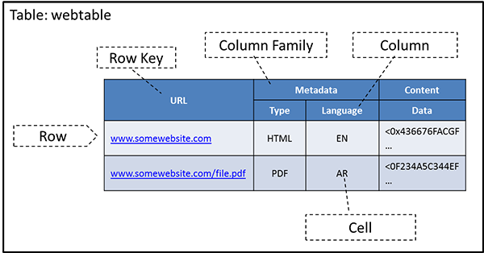

Apache HBase is an open-source non-relational database modeled after of Google's BigTable distributed storage system and is supported by the Apache Software Foundation. HBase is a distributed, scalable, high-performance, versioned database. HBase's infrastructure is designed to store billions of rows an columns of data in loosely defined tables, such as the webtable described earlier. The following video contains an overview of HBase. 
 

> [!VIDEO https://www.microsoft.com/videoplayer/embed/RE4pSFl]

Just as traditional RDBMSs are designed to run on top of a local file system, HBase is designed to work on top of the Hadoop Distributed File System (HDFS). As described earlier, HDFS is a distributed file system that stores files as replicated blocks across multiple servers. HDFS lends a scalable and reliable file system back end to HBase.

### HBase data model

Applications store data organized as rows and columns in a table, which loosely resemble tables in an RDBMS. To illustrate, we organize the webtable example as an HBase table:

_Figure 2: A table in HBase_

A row in HBase is referenced using a row key, which can be considered to be the primary key of the table in an RDBMS. The primary key of the table has to be unique and hence reference one and only one row. Unlike in RDBMSs (which require primary keys to be of certain types), row keys are raw byte arrays, so theoretically, anything from strings to binary representations of long integers, floats, or even entire data structures that have been serialized (converted to a byte array form) can serve as a row key<!-- from strings to binary representations of long integers, floats, or even entire data structures that have been serialized (converted to a byte array form) -->. HBase automatically sorts table rows by row key when it stores them. By default, this sort is byte ordered. 

Columns in HBase have a column name, which can be used to refer to a column. Columns can be further grouped into column families. All column family members have a common prefix, so, in the webtable example, the columns `Metadata:Type` and `Metadata:Language` are both members of the `Metadata` column family, whereas `Content:Data` belongs to the `Content` family. By default, the colon character (:)<!-- ':' --> delimits the column prefix from the family member. The column family prefix must be composed of printable characters. The qualifying tail can be made of any arbitrary bytes. 

HBase differs from an RDBMS because the columns do not need to be typed; they are simply interpreted as raw byte strings. This interpretation enables<!-- lends the flexibility for --> HBase to store any kind of data in the table but also prevents it from being able to automatically validate data values when they are loaded into the table. 

Although a table's column families must be defined up front when creating the table, the family members can be added on demand. HBase stores all of the column's family members together on the underlying file system. Thus, HBase is a **columnar database**. 

Table cells, the intersection of row and column coordinates, are versioned (i.e., HBase stores multiple versions [default being 3] of the values stored in its tables). The version of a table cell value is <!-- a -->timestamped and automatically assigned by HBase at the time of cell insertion or update. Thus, the tuple {row,column,version} fully describes a unique value stored in an HBase table. 

### HBase operations

HBase has four primary operations on the data model: **Get**, **Put**, **Scan**, and **Delete**.

A Get operation returns all of the cells for a specified row, which are pointed to by a row key. A Put operation can either add new rows to the table when used with a new key or update a row if the key already exists. Scan is an operation that iterates over multiple rows based on some condition, such as a row key value or a column attribute. A Delete operation removes a row from a table. Get and Scan operations always return data in sorted order. Data are first sorted by row key, then by column family, then by family members, and finally by timestamp (so the latest values appear first). 

By default, Get, Scan, and Delete operations on an HBase table are performed on data that have the latest version. A Put operation always creates a new version of the data that are put into HBase. By default, Delete operations delete an entire row but can also be used to delete specific versions of data in a row. Each operation can be targeted to an explicit version number as well. 

### HBase architecture

HBase is organized as a cluster of HBase nodes. These nodes are of two types: a master node and one or more slave nodes (called **RegionServers**; see Figure 3). HBase uses Apache ZooKeeper as a distribution coordination service for the entire HBase cluster. For example, it handles master selection (choosing one of the nodes to be the master node), the lookup for the `-ROOT-` catalog table (explained shortly), and node registration (when new regionservers are added)<!-- , and so on -->. The master node that is chosen by ZooKeeper handles such functions as region allocation, failover, and load balancing<!-- , among others -->. 

_Figure 3: HBase architecture_

As with most databases, HBase is able to persist data using an underlying file system. HBase is designed to use HDFS in the back end but also supports various kinds of file systems, including a local file system and cloud filesystems including Azure Blob Storage. Typically, every regionserver in HBase is also an HDFS DataNode (an HDFS fileserver), but this is not mandatory in HBase.

#### Data partitioning

HBase is designed to scale tables to a large number of rows and columns (in the millions), with the size of each table running into terabytes or petabytes. At this scale, it is impossible to host the data on a single node. To distribute data stored in HBase across the nodes in a cluster, HBase automatically partitions (shards) tables into **regions**, which are groups of consecutive rows in a table:

_Figure 4: Splitting a table into multiple regions in HBase_

Each region is defined by the base row (inclusive) and the last row (exclusive) as well as a region identifier (a randomly generated number). Tables are initially stored in a single region, but as the size of the table reaches<!-- grows after --> a certain threshold, HBase automatically generates a new region by splitting the data into two nearly equal regions. This process continues as the tables continue to get larger<!-- and larger -->.

#### Client access

HBase clients can connect to HBase to perform the operations on HBase tables, as described in the data model. However, the clients<!-- they --> must locate the appropriate node in the HBase cluster that stores<!-- has --> the region of the table that needs to be accessed. To keep track of all of the regions and their location in the HBase cluster, HBase has two **catalog tables**, called `-ROOT-` and `.META.` in HBase parlance. These tables are also treated as HBase tables and can be stored anywhere in the HBase cluster for fault-tolerance purposes. The `-ROOT-` table is always self-contained in a single region, while the `.META.` table may be split into multiple regions. A client first connects to the cluster to learn the location of the `-ROOT-` table (via ZooKeeper) and then queries the `-ROOT-` table to elicit the location of the `.META.` table. The `.META.` table then returns the location of the actual row requested by the client. Once the regionserver is resolved by the client, the client directly interacts with that regionserver and performs the required row operations. 

The client also caches the `-ROOT-` and `.META.` tables after the first access so that consecutive client operations do not require additional lookups to these tables. The client will continue to use its cached copy of the catalog tables until it encounters a fault, which typically means that the catalog tables have been updated after the location of a table region has moved. The client updates its cached copy of the catalog tables and continues with the operation.

#### Write operations

A regionserver handles write operations in the following manner: the write operation is appended to a commit log on HDFS (which is triple replicated by default), after which the write operation is added to an in-memory cache. When this in-memory cache of the regionserver becomes full, its content is flushed to the file system. 

Because the commit log is stored on HDFS, it remains available through a regionserver crash. When the master notices that a regionserver is no longer reachable, it retrieves the commit log and splits the changes across regions. Each regionserver gets a portion of the commit log and replays the edits to bring the file system to its prefailure, consistent state. 

#### Read operations

For read operations, HBase always consults the in-memory cache of a region. If sufficient versions of the data are found to satisfy the query, the data are returned. Otherwise, the flushed files are consulted in order from newest to oldest to find the required data or until there are no more flush files to consult. A background process periodically compacts the flush files once their number<!-- has --> reaches a certain threshold by combining many flush files into one. During compaction, any versions of cells beyond a user-configured threshold (default value is 3) of deleted rows are cleared out.

### ACID properties in HBase

HBase, like many NoSQL databases, is not fully ACID compliant by design. HBase does guarantee ACID compliancy for a row but not on operations that span rows. ACID properties in HBase are as follows:<!-- To elaborate: -->

- **Atomicity**: HBase offers atomicity for operations that update individual rows. Any Put operation will either succeed in its entirety or fail. Operations that update multiple rows can either succeed or fail on individual rows, and HBase will return the status per row.
- **Consistency**: HBase offers a consistent view of a database for Get operations on a single row. The data returned will be data that existed at some point in the table's history. In addition, any edits done to the table will be seen in the order they were completed. However, the HBase Scan operation is not strictly consistent. For example, if a Scan operation runs simultaneously with an operation that updates one or more rows that are part of the scan, the Scan operation may return rows that have been updated or that have not been updated. It is important to note that a row is always updated in its entirety and never partially updated.
- **Isolation**: Operations on a row are performed in order and hence are strictly isolated from each other. However, as explained in the previous bullet, scans are not isolated from other operations on individual rows.
- **Durability**: HBase guarantees durability on all data that are visible. Any data returned from a read will always be on a disk in some form. 

### HBase use cases

HBase offers multiple interfaces with which to work. The Java interface to HBase can be used in a MapReduce job. In addition, HBase has a REST interface, which can be used to retrieve data stored in HBase through HTTP service calls.

HBase shares the same use cases as Google's Big Table. HBase<!-- It --> is a distributed data store that can store billions of rows and columns. 

HBase is best suited for big-data storage, which requires fast access to multiple rows at a time for aggregations, such as summing or averaging. The model also allows for flexibility of adding columns to the database at any time. The versioning property of HBase is also useful to store information that changes over time, but previous versions of the data are also useful. In the webtable example, multiple versions of a Web page can be stored for comparison. 

HBase does not support the join operation, where data from two or more tables are combined on a common column to create another table. If your application is dependent on joins, then HBase may not be the right choice. In addition, HBase's relaxed consistency model places additional burdens on the application developer, for example, to verify the results of scans.<!-- , for example -->

<!-- Reference not cited in this unit. Reference removed. -->
