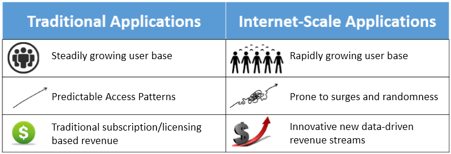
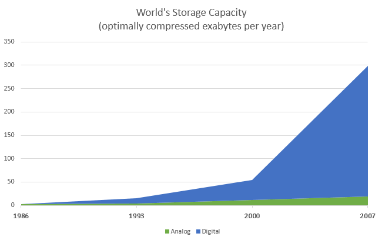

Now that we've defined what cloud computing is, let's look at examples of how computing was utilized in different domains such as business computing, scientific computing, and personal computing before the emergence of cloud computing.

## Domains and application examples

**Business computing**: Examples of traditional management information systems include logistics and operations, enterprise resource planning (ERP), customer relation management (CRM), office productivity, and business intelligence (BI). Such tools enabled more streamlined processes that led to improved productivity and reduced cost across a variety of enterprises.

As an example, CRM software allows companies to collect, store, manage, and interpret a variety of data about past, current, and potential future customers. CRM software offers an integrated view (in real time or near real time) of all organizational interactions with customers. For example, for a manufacturing company, CRM software could be used by a sales team to schedule meetings, tasks, and follow-ups with clients. A marketing team could target clients with campaigns based on specific patterns. Billing teams can track quotes and invoices. As such, it is a centralized repository for storing this information. To enable this functionality, a variety of hardware and software technologies are utilized by the organization and sales teams in order to collect the data that needs to be stored and analyzed using various database and analytics systems.

**Scientific computing**: Scientific computing uses mathematical models and analysis techniques implemented on computers to attempt to solve scientific problems. A popular example is computer simulation of physical phenomena. This field has disrupted the traditional theoretical and laboratory experimental methods by enabling scientists and engineers to reconstruct known events or to predict future situations through developing programs to simulate and study different systems under different circumstances. Such simulations typically require a very large number of calculations that are often run on expensive supercomputers or distributed computing platforms.

**Personal computing**: In personal computing, a user runs various applications on a general-purpose computer. Such applications might be for office productivity, such as word processing and spreadsheets; communication, such as email clients; or entertainment, such as video games or multimedia files. A personal computing user typically owns, installs, and maintains the software and hardware utilized to carry out such tasks.

## Addressing scale

Increasing scale in computing has been an ongoing process, whether in increasing the number of customers and events to capture, monitor, and analyze in CRM, or increasing the precision of numerical simulations in scientific computing or the realism in video-gaming applications. Furthermore, the need for larger scale has been driven by the increase in the adoption of technology by various domains or the expansion of businesses and markets, as well as the ongoing increase in the number of users and their needs. Organizations have to account for the increase in scale as they plan and budget for the deployment of their solutions.

Organizations typically plan their IT infrastructure in a process called **capacity planning**. During the capacity planning process, the growth in usage of various IT services is gauged and used as a benchmark for future expansion. Organizations have to plan in advance to procure, set up, and maintain newer and better servers, storage, and networking equipment. Sometimes organizations are limited by software, because they may have procured only a limited set of licenses and may require more to expand the infrastructure to cover a bigger set of users.

The most basic form of scaling is known as **vertical scaling**, whereby old systems are replaced with newer, better-performing systems that can provide the necessary upgrades to the service level. In many cases, vertical scaling consists of upgrading or replacing servers and storage systems with newer, faster servers or storage arrays with increased capacity. This process could take months to plan and execute, along with a window where the service might experience some downtime.

In certain types of systems, scaling is also done **horizontally**, by increasing the amount of resources dedicated to the system. An example of this is in high-performance computing, where additional servers and storage can be added to improve the performance of the system, thereby leading to a higher number of calculations that can be performed per second or an increase in the storage capacity of the system. Just like vertical scaling, this process can take months to plan and execute, with downtimes also a possibility.

Since companies owned and maintained their IT equipment, as the cost of addressing scale continued to rise, companies identified other methods to reduce cost. Large companies consolidated the computing needs of different departments into a single large datacenter whereby they consolidated real estate, power, cooling, and networking in order to reduce cost. On the other hand, small and medium-sized companies could lease real-estate, network, power, cooling, and physical security by placing their IT equipment in a shared datacenter. This is typically referred to as a **co-location service**, which was adopted by small to medium-sized companies that did not want to build their own datacenters in house. Co-location services continue to be adopted in various domains as a cost-effective approach to reduce operational expenses.

Scale has impacted all aspects of business computing. For example, scale has impacted CRM systems through the increase of clients or through the amount of information that that's stored and analyzed about clients. Business computing has addressed scale through vertical and horizontal scaling, as well as consolidation of IT resources to datacenters and co-location. In scientific computing, parallel and distributed systems have been adopted in order to scale up the size of the problems and the precision of their numerical simulations. One definition of **parallel processing** is the use of multiple homogenous computers that share state and function as a single large computer in order to run large-scale or high-precision calculations. **Distributed computing** is the use of multiple autonomous computing systems connected by a network in order to partition a large problem into subtasks that are run concurrently and communicate via messages over the network. The scientific community continued to innovate in these domains in order to address scale. In personal computing, scale has impacted it through increased user demands brought on by richer content and diverse applications. Users therefore scale up their owned personal computing devices to keep up with these demands.

## Rise of internet services

The late 90s marked a steady increase in the adoption of these computing applications and platforms across domains. Soon, software was expected to be not only functional, but also capable of producing value and insight for business and personal requirements. The use of these applications became collaborative; applications were mixed and matched to feed information to each other. IT was no longer just a cost center for a company, but a source of innovation and efficiency.

_Figure 2: Compare traditional and internet-scale computing_

The 21st century has been marked by an explosion in the volume and capacity of wireless communications, the World Wide Web, and the internet. These changes have led to a network-driven and data-driven society, where producing, disseminating, and accessing digitized information is simplified. The internet is estimated to have created a global marketplace of billions of users, up from 25 million in 1994.[1][^1] This rise in data and connections is valuable to businesses. Data creates value in several ways, including by enabling experimentation, segmenting populations, and supporting decision-making with automation.[2][^2] By embracing digital technologies, the world's top 10 economies are expected to increase their output by over a trillion dollars by 2020.

The increasing number of connections enabled by the internet has also driven its value. Researchers have hypothesized that the value of a network varies superlinearly as a function of the number of users. Thus, at internet scale, gaining and retaining customers is a priority. This is done by building reliable and responsive services, and making changes based on observed data patterns.

_Figure 3: Increasing number of internet users per year_

_Figure 4: Increasing amount of data stored per year_[5][^5]

Some examples of internet-scale systems include:

- **Search engines** that crawl, store, index, and search large (up to petabyte-sized) data sets. For instance, Google started as a giant web index that crawled and analyzed web traffic once every few days and matched these indices to keywords. Now, it updates its indices in near real time and is one of the most popular ways to access information on the internet. Its index has trillions of pages with a size of thousands of terabytes.[4][^4]
- **Social networks** like Facebook and LinkedIn that allow users to create personal and professional relationships and build communities based on similar interests. Facebook, for instance, now supports over a billion active users per month.
- **Online retail services** like Amazon that maintain a global inventory of millions of products, which are sold to over 200 million customers, with net sales volumes of almost $90 billion annually.
- **Rich, streaming multimedia applications** that allow people to watch and share videos and other forms of rich content. One such example, YouTube, handles uploads of 300 minutes of video per second.
- **Real-time communications systems** for audio, video, and text chatting like Skype, which clock more than 50 billion minutes of calls per month.
- **Productivity and collaboration suites** that serve millions of documents to many concurrent users, allowing real-time, persistent updates. For example, Microsoft 365 claims to support 50 million monthly active collaborators.
- **CRM applications** by providers like Salesforce that are deployed at over a hundred thousand organizations. Large CRMs now provide intuitive dashboards to track status, analytics to find the customers that generate the most business, and revenue forecasting to predict future growth.
- **Data mining and business intelligence** applications that analyze the usage of other services (like those above) to find inefficiencies and opportunities for monetization.

Clearly, these systems are expected to deal with a high volume of concurrent users. This requires an infrastructure with the capacity to handle large amounts of network traffic, generate data, and securely store data, all without any noticeable delays. These services derive their value by providing a constant and reliable standard of quality. They also provide rich user interfaces for mobile devices and web browsers, making them easy to use but harder to build and maintain.

Here's a summary of the requirements of internet-scale systems:

- **Ubiquity**: Accessible from anywhere at any time, from a multitude of devices. For instance, a salesperson will expect their CRM service to provide timely updates on a mobile device to make visits to clients shorter, faster, and more effective. The service should function smoothly under a variety of network connections.
- **High availability**: The service must be "always up." Uptimes are measured in terms of number of nines. Three nines, or 99.9%, implies that a service will be unavailable for 9 hours a year. Five nines (about 6 minutes a year) is a typical threshold for a high-availability service. Even a few minutes of downtime in online retail applications can impact millions of dollars of sales.
- **Low latency**: Fast and responsive access times. Even slightly slower page load times have been shown to significantly reduce the usage of that webpage. For instance, increasing search latency from 100 ms to 400 ms decreases the number of searches per user from 0.8% to 0.6%, and the change persists even after the latency is reduced to original levels.
- **Scalability**: The ability to deal with a variable load typically due to seasonality and virality, which cause peaks and troughs in the traffic over long and short periods of time. On days like "Black Friday" and "Cyber Monday," retailers like Amazon must handle several times the network traffic than on average.
- **Cost-effectiveness**: An internet-scale service requires much more infrastructure than a traditional application, as well as better management. One way to streamline costs is by making services easier to manage, and reducing the number of administrators handling a service. Smaller services can afford to have a low service-to-admin ratio (for example, 2:1, meaning a single administrator must maintain two services). To maintain profitability, services like Microsoft Bing must have a high service-to-admin ratio (for example, 2500:1, meaning a single administrator maintains 2,500 services).[6][^6]
- **Interoperability**: Many of these services are often used together and hence must provide an easy interface for reuse and must support standardized mechanisms for importing and exporting data. For example, many other services (like Uber) may integrate Google Maps within their products to provide simplified location and navigation information to users.

We will now explore some of the early solutions to the various problems above.[7][^7] The first challenge to be tackled was the large round-trip time for early web services that were mostly located in the United States. The earliest mechanisms to deal with the problems of low latency (due to distant servers) and server failure simply relied on redundancy. One technique for achieving this was by "mirroring" content, whereby copies of popular webpages would be stored at different locations around the world. This minimized the amount of load on the central server, reduced the latency perceived by end users, and allowed traffic to be switched over to another server in case of failures. The downside of this was an increase in complexity to deal with inconsistencies if even one copy of the data were to be modified. Thus, this technique is more useful for static, read-heavy workloads, such as serving images, videos, or music. Due to the effectiveness of this technique, most internet-scale services use **content delivery networks (CDNs)** to store distributed global caches of popular content. For example, Cable News Network (CNN) now maintains replicas of its videos on multiple "edge" servers at different locations worldwide, with personalized advertising per location.

Of course, it did not always make sense for individual companies to buy dozens of servers across the world. Cost efficiencies were often gained by using **shared hosting services**. Here, shares of a single web server would be leased out to multiple tenants, amortizing the cost of server maintenance. Shared hosting services could be highly resource-efficient, as the resources could be overprovisioned under the assumption that not all services would be operating at peak capacity at the same time. (An overprovisioned physical server is one where the aggregate capacity of all the tenants is greater than the actual capacity of the server.) The downside was that it was nearly impossible to isolate the tenants' services from those of their neighbors. Thus, a single overloaded or error-prone service could adversely impact all its neighbors. Another problem arose because tenants could often be malicious and try to leverage their co-location advantage to steal data or deny service to other users.

To counter this, **virtual private servers** were developed as variants of the shared hosting model. A tenant would be provided with a virtual machine (VM) on a shared physical server. (We talk more about virtual machines and their properties later.) These VMs were often statically allocated and linked to a single physical machine, so they were difficult to scale and often needed manual recovery from any failures. Though they could no longer be overprovisioned, they had better performance and security isolation between co-located services than simple resource sharing.

Another problem of sharing public resources was that it required storing private data on third-party infrastructure. Some of the internet-scale services we described above could not afford to lose control over data storage, since any disclosure of their customers' private data would have disastrous consequences. Hence, these companies needed to build their own global infrastructure. Before the advent of the public cloud, such services could only be deployed by large corporations like Google and Amazon. Each of these companies would build large, homogeneous datacenters across the globe using commodity off-the-shelf components, where a datacenter could be thought of as a single, massive **warehouse-scale computer (WSC)**. A WSC provided an easy abstraction to globally distribute applications and data, while still maintaining ownership.

Due to the economies of scale, the utilization of a datacenter could be optimized to reduce costs. Even though this was still not as efficient as publicly sharing resources (the cloud), these warehouse-scale computers had many desirable properties that served as foundations for building internet-scale services. The scale of computing applications progressed from serving a fixed user base to serving a dynamic global population. Standardized WSCs allowed large companies to serve such large audiences. An ideal infrastructure would combine the performance and reliability of a WSC with the shared hosting model. This would enable even a small corporation to develop and launch a globally competitive application, without the high overhead of building large datacenters.

Another approach to share resources was **grid computing**, which enabled the sharing of autonomous computing systems across institutions and geographical locations. Several academic and scientific institutions would collaborate and pool their resources towards a common goal. Each institution would then join a "virtual organization" by dedicating a specific set of resources via well-defined sharing rules. Resources would often be heterogeneous and loosely coupled, requiring complex programming constructs to stitch together. Grids were geared towards supporting non-commercial research and academic projects, and they relied on existing open-source technologies.

The cloud was a logical successor that combined many of the features of the solutions above. For example, instead of universities contributing and sharing access to a pool of resources using a grid, the cloud allows them to lease computing infrastructure that was centrally administered by a cloud service provider (CSP). As the central provider maintained a large resource pool to satisfy all clients, the cloud made it easier to dynamically scale up and down demand within a short period of time. Instead of open standards like the grid, however, cloud computing relies on proprietary protocols and needs the user to place a certain level of trust in the CSP.

Later in this module, we cover how the cloud evolved to make computing a public utility that can be metered and used.
 
***
### References

1. _Real Time Statistics Project (2015). [Internet Live Stats](https://www.internetlivestats.com/)_
2. _IBM (2017). [What is Big Data?](https://developer.ibm.com/dwblog/2017/what-is-big-data-insight/)_
4. _Google Inc. (2015). [How Search Works](https://www.google.com/insidesearch/howsearchworks/thestory/)_
5. _Hilbert, Martin and Lopez, Priscila (2011). [The world's technological capacity to store, communicate, and compute information](https://science.sciencemag.org/content/332/6025/60)_
6. _Hamilton, James R and others (2007). [On Designing and Deploying Internet-Scale Services](https://highscalability.com/paper-on-designing-and-deploying-internet-scale-services/)_
7. _Brewer, Eric and others (2001). [Lessons from giant-scale services](https://people.eecs.berkeley.edu/~brewer/Giant.pdf)_

***

[^1]: <https://www.internetlivestats.com/> "*Real Time Statistics Project* (2015)"
[^2]: <https://developer.ibm.com/dwblog/2017/what-is-big-data-insight/> "IBM (2017). *What is Big Data?*"
[^4]: <https://www.google.com/insidesearch/howsearchworks/thestory/> "Google Inc. (2015). *How Search Works*"
[^5]: <https://science.sciencemag.org/content/332/6025/60> "Hilbert, Martin and Lopez, Priscila (2011). *The world's technological capacity to store, communicate, and compute information*" 
[^6]: <https://highscalability.com/paper-on-designing-and-deploying-internet-scale-services/> "Hamilton, James R and others (2007). *On Designing and Deploying Internet-Scale Services*" 
[^7]: <https://people.eecs.berkeley.edu/~brewer/Giant.pdf> "Brewer, Eric and others (2001). *Lessons from giant-scale services*" 
