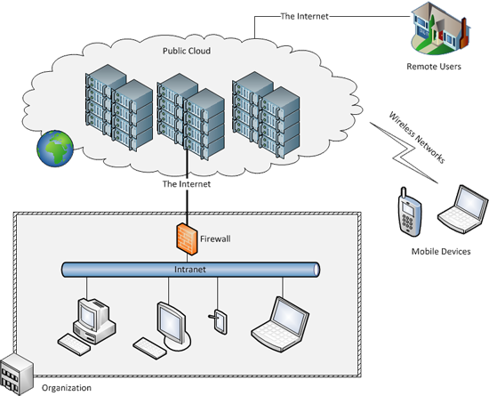
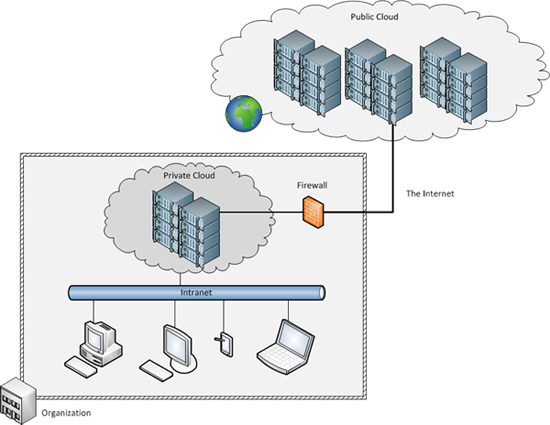

There are three well-known deployment models for cloud computing: public, private, and hybrid clouds. A public cloud is owned by a cloud provider but is made available to the public. A private cloud is typically owned by an organization, which also controls the access to the cloud. A hybrid cloud is a combination of public and private clouds. We discuss the different types in terms of ownership, infrastructure, end-user availability, cost, security, and data location.

## Public cloud

In a public cloud, the cloud infrastructure is owned by a cloud provider and is accessible to the public over the internet. The cloud provider hosts the cloud infrastructure, and end users can access it remotely without the need to buy and set up a working environment (such as buying hardware and software). Public cloud resources are shared among different end users. Public cloud users are typically charged for the duration for which these services are used. However, public cloud charge models vary across providers. The security and terms of use are defined by the provider, and hence, end users must work within the constraints of the provider when using its services.

_Figure 8: Public cloud_

## Private cloud

In this second type of cloud, the cloud infrastructure is owned by an organization. The infrastructure is accessible to specific users via the organization's intranet. The cloud environment needs to be procured, set up, operated, and maintained by the organization itself. The private cloud resources are typically shared among an organization's end users. Unlike the public cloud, security and terms of use for a private cloud are defined by the organization. The entire infrastructure is located in the organization, and hence, security can be compliant with the organization's policies.

_Figure 9: Private cloud_

## Hybrid cloud

In a hybrid cloud, the infrastructure includes an owned private cloud and a leased public cloud. Hybrid clouds enable the idea of "cloud bursting," in which an organization uses its private cloud for most of its needs and dynamically provisions resources in the public cloud when utilization exceeds the capacity of its private cloud.

_Figure 10: Hybrid cloud_

Other types of clouds continue to emerge. For example, community clouds share infrastructure among different organizations that have common security or other concerns. Various non-profit organizations that work closely with government might build and share a community cloud. Another type is distributed cloud, which provides cloud computing using a set of distributed machines located at different geographical locations.

<!-- No References in this unit -->
