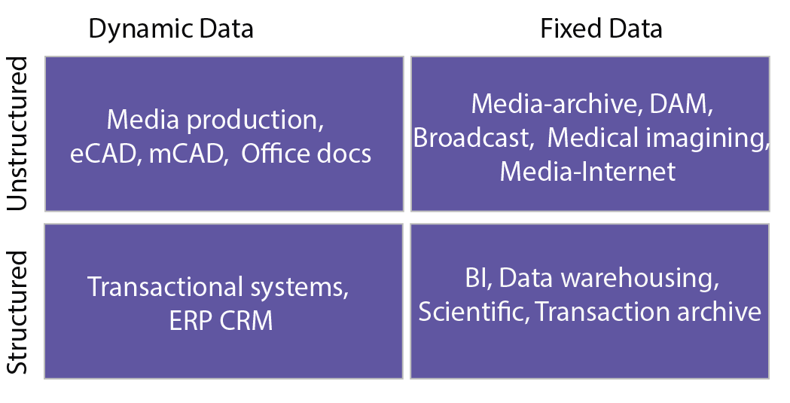
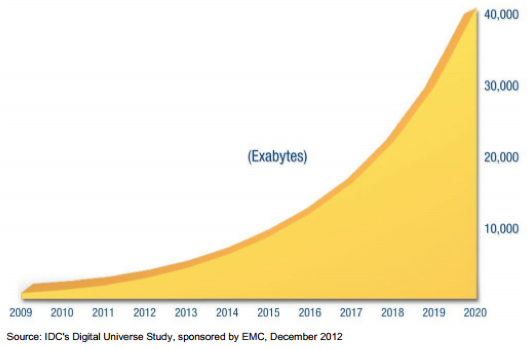

Data is simply a collection of raw facts and figures. Applications are responsible for generating, storing, analyzing, and consuming data, or some combination thereof. 

The nature and properties of data typically influence the design and implementation of storage systems. Some of the properties include volume, content, and the frequency of access of data. As an example, Facebook[2][^2] recently studied the access patterns of image and video content posted by its users to find that the access rate exponentially decreases as time passes. Facebook used these findings to design and implement a storage system specific to its needs. In the following video, we look at the various properties of data that influence the design of storage systems.
 

> [!VIDEO https://www.microsoft.com/videoplayer/embed/RE4pFkn]

## Structure of data

Data can be categorized using its dynamicity and structure. Specifically, data can be broadly segmented into one of the four quadrants shown in the following figure. One categorization represents the structure of the data, which is considered either **structured** or **unstructured**.

_Figure 1: Segment data into various types_[3][^3]

**Structured data** has a predefined data model that organizes the data in a form that is relatively easy to process, store, retrieve, and manage. Structured data is usually small data that naturally fits in tabular form and hence can easily be stored in traditional databases (e.g., **relational** databases). An example of structured data is customers' contact information that is stored in tables in a customer relationship management (CRM) database. This data fits in a fairly rigid model (called a **schema** in relational databases), which can be quickly stored, accessed, and manipulated.

**Unstructured data**, on the other hand, may not necessarily have a predefined, rigid organizational model. Unstructured data may be larger and may not fit naturally in tabular form, making the data unsuitable for storage in a relational database. Thus, unstructured data may be relatively difficult to organize in a form that is simple to process, store, retrieve, and manage. Examples of unstructured data are flat binary files containing text, video, or audio information. It is important to note that unstructured data is not necessarily devoid of structure; a document, video, or audio file may have a file encoding structure or metadata with which it is associated. Hence, data with some form of structure may still be characterized as unstructured if its structure is not helpful to the processing task for which the data is needed. To illustrate, a large cache of text documents (which are unstructured) is difficult to index and search when compared to a relational database containing customer information (which is structured). For the purposes of this course, unstructured data can be defined as data that does not fit naturally in a relational database. In addition, some data may be treated as unstructured (not stored in a database) because it will be accessed using unpredictable access patterns; traditional database optimizations are pointless for such data.

There is a type of data that lies between structured and unstructured, referred to as **semi-structured data**. Semi-structured data does not conform with the formal structure of data models associated with relational databases or other forms of data tables, but nonetheless contains tags or other markers to separate semantic elements and enforce hierarchies of records and fields within the data. Data that is described using markup languages—for example, webpages, clickstream data, and web objects—is an example of semi-structured data. XML and JSON are classic examples of representations of semi-structured data, as they use inline tags that describe the data as well.

## Dynamicity of data

Another characterization is the **dynamicity** of the data, which is an indication of how often the data changes. Dynamic data, such as Microsoft Office documents and transactional entries in a financial database, change relatively frequently, whereas fixed data, once created, may not be altered. Examples of fixed data include medical imaging data from MRI and CT scans, and broadcast video footage that is archived in a video library.

Segmenting data into one of these quadrants helps in designing and developing a storage solution for the data. Structured data is typically processed using relational databases in which the data can be accessed, managed, and manipulated using precise commands (typically issued in a query language such as SQL). Unstructured data may be stored in flat files in a file system or may be further organized using a NoSQL database (more on NoSQL later in the module).

The structure and dynamicity of data provide guidance on how a storage system can be architected. Large amounts of data that are relatively static can be stored on disk arrays if they are read frequently. Storage systems designed with multi-tiered caching architecture improve the performance of read operations on such data. 

Certain types of file systems, such as earlier versions of the Hadoop Distributed File System (HDFS), are designed for relatively static data. They allow a file to be written only once, and the file cannot be modified after it is written. Static data, such as drive images and snapshots for backups, can be archived on relatively inexpensive offline storage systems if they do not need to be accessed frequently.

In summary, the nature of data used by an application must be considered before its appropriate storage architecture is chosen.

## Granularity and volume of data

In addition to the type of data, the volume of data that needs to be stored and processed for a particular application must be considered. The volume of data is characterized along two dimensions, the overall size of data (total volume) versus the size of a useful segment of the data (the granularity of data). As an example, consider the case of a photo-sharing website that has millions of users posting tens to hundreds of photos to it. The total size of the data may be tens or hundreds of terabytes or even petabytes, but the average photo may be a few megabytes. Contrast this to a website like YouTube, where the total size of all the videos on the site is many petabytes, and the size of a video can range from a few hundred megabytes to even gigabytes in size.

In this regard, we touch on an often-used term to describe large volumes of data: **big data**. There are many definitions of big data, but one popular description summarizes it as data that is too big to be handled using conventional techniques.

The rapidly expanding information and communications technology (ICT) that is permeating all aspects of modern life has led to a massive explosion of data over the last few decades. Major advances in the connectivity and digitization of information has led to increasing amounts of data being created on a daily basis. This data is diverse, ranging from images and videos from mobile phones being uploaded to websites such as Facebook and YouTube, to 24/7 digital TV broadcasts, to surveillance footage from hundreds of thousands of security cameras, to large scientific experiments such as the Large Hadron Collider—all of which produce many terabytes of data every day. International Data Corporation's (IDC's) latest Digital Universe Study predicts a 300-fold increase in the amount of data created globally, from 130 exabytes (1028) in 2012 to 30,000 exabytes in 2020.

_Figure 2: Predicted growth of data from 2009 to 2020_[1][^1]

Organizations are trying to leverage or cope with the massive amounts of data that is growing at ever-increasing rates. Microsoft, Google, Yahoo, and Facebook have gone from processing gigabytes and terabytes to the petabyte range, which puts immense pressure on their computing infrastructures that need to be available 24/7 and must scale seamlessly as the amount of data produced rises exponentially. These are the challenges to which present and future storage technologies must respond.
 
***
### References

1. _John Gantz and David Reinsel (2012). [The Digital Universe in 2020 IDC White paper](https://it4sec.org/article/digital-universe-2020-big-data-bigger-digital-shadows-and-biggest-growth-far-east)_
2. _Subramanian Muralidhar, Wyatt Lloyd, Sabyasachi Roy, Cory Hill, Ernest Lin, Weiwen Liu, Satadru Pan, Shiva Shankar, Viswanath Sivakumar, Linpeng Tang and Sanjeev Kumar (2014). [f4: Facebook's Warm BLOB Storage System](https://www.usenix.org/conference/osdi14/technical-sessions/presentation/muralidhar) 11th USENIX Symposium on Operating Systems Design and Implementation (OSDI 14) 383-398 USENIX Association_
3. _Thomas Rivera (2012). [The Evolution of File Systems SNIA Tutorial](https://www.snia.org/sites/default/education/tutorials/2012/spring/file/ThomasRivera_The_Evolution_of_File_Systems-v3.pdf)_

[^1]: <https://it4sec.org/article/digital-universe-2020-big-data-bigger-digital-shadows-and-biggest-growth-far-east> "John Gantz and David Reinsel (2012). *The Digital Universe in 2020 IDC White paper*"
[^2]: <https://www.usenix.org/conference/osdi14/technical-sessions/presentation/muralidhar> "Subramanian Muralidhar, Wyatt Lloyd, Sabyasachi Roy, Cory Hill, Ernest Lin, Weiwen Liu, Satadru Pan, Shiva Shankar, Viswanath Sivakumar, Linpeng Tang and Sanjeev Kumar (2014). *f4: Facebook's Warm BLOB Storage System* 11th USENIX Symposium on Operating Systems Design and Implementation (OSDI 14) 383-398 USENIX Association"
[^3]: <https://www.snia.org/sites/default/education/tutorials/2012/spring/file/ThomasRivera_The_Evolution_of_File_Systems-v3.pdf> "Thomas Rivera (2012). *The Evolution of File Systems SNIA Tutorial*"
